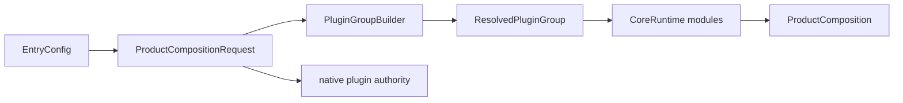

---
related_code:
  - zircon_app/src/plugins/builder.rs
  - zircon_app/src/plugins/groups.rs
  - zircon_app/src/plugins/groups/resolution.rs
  - zircon_app/src/entry/product_composition/request.rs
  - zircon_app/src/entry/product_composition/composition.rs
  - zircon_app/src/entry/engine_entry.rs
implementation_files:
  - zircon_app/src/plugins
  - zircon_app/src/entry/product_composition
plan_sources:
  - user: 2026-09-09 扩展 zircon_app 公开接口、机制案例、教程和最佳实践
tests:
  - zircon_app/src/plugins/tests.rs
  - zircon_app/tests/plugin_group_error_contract.rs
  - zircon_app/src/entry/tests/product_composition.rs
doc_type: module-detail
---

# 插件组、模块组合与 ProductComposition

组合 API 将已解析的产品配置转换为 Runtime 可启动的模块图。它同时处理内置插件组、项目插件报告、原生插件授权和模块排序。组合成功返回 `ProductComposition`；该值是产品生命周期 owner set，必须保留到退出。

## 组合总览



## 内置插件组

| 类型 | Runtime profile | 额外 feature | 典型用途 |
| --- | --- | --- | --- |
| `MinimalPlugins` | `Minimal` | 无 | 轻量测试、基础服务 |
| `DefaultPlugins` | `Client3d` | UI | 桌面三维客户端 |
| `DevPlugins` | `Dev` | UI、日志诊断 | 本地开发与调试 |
| `HeadlessPlugins` | `Server` | 无 | Server/CI |

每个类型实现 `PluginGroup::build() -> Result<PluginGroupBuilder, PluginGroupError>`。组名参与诊断和错误文本，不应随意复用。

## PluginGroupBuilder API

```rust
use zircon_app::plugins::{DefaultPlugins, PluginGroup, PluginGroupBuilder};
use std::sync::Arc;

let builder = DefaultPlugins.build()?;
assert!(builder.contains("platform"));
let group = builder
    .disable("ui")?
    .add_after("platform", my_module)?
    .try_finish()?;
```

| API | 行为 |
| --- | --- |
| `start(name)` | 创建空组 |
| `from_modules(name, modules)` | 顺序加入一组 Runtime modules |
| `add_module(module)` | 追加模块，重复 key 失败 |
| `add_group(group)` | 展开另一个组的 resolved entries |
| `contains(key)` | 查询 key 是否存在 |
| `module_keys()` | 返回启用模块 key，保持组顺序 |
| `set(module)` | 替换同名模块，不改变位置 |
| `disable(key)` / `enable(key)` | 切换模块启用状态 |
| `add_before(anchor, module)` | 在启用 anchor 前插入 |
| `add_after(anchor, module)` | 在启用 anchor 后插入 |
| `try_finish()` | 排序、校验并返回 `ResolvedPluginGroup` |

排序并非简单的插入顺序。`ModuleDescriptor` 的依赖关系会在 `try_finish()` 阶段再次排序；因此“插在前面”只表达局部意图，不能绕过依赖。

## PluginGroupError

| 变体 | 触发 | 修复 |
| --- | --- | --- |
| `DuplicateKey` | 添加同名模块 | 使用 `set` 替换或改唯一 module name |
| `MissingKey` | `set/enable/disable` 查找不到 | 先检查 `module_keys()` |
| `MissingAnchor` | `add_before/after` anchor 不存在 | 使用组实际 key |
| `DisabledAnchor` | anchor 已被禁用 | 先 enable 或改用其他 anchor |
| `ModuleOrder` | 描述符依赖图有环或顺序非法 | 修正依赖声明 |

错误是 `Display + Error`，产品层通常将其映射为 `CoreError::Initialization("zircon_app plugin group", ...)`。

## ProductCompositionRequest

```rust
let composition = ProductCompositionRequest::new(config)
    .with_runtime_plugin_registrations(registrations)
    .with_runtime_plugin_feature_registrations(features)
    .with_native_plugins_from_export_root(export_root)
    .with_native_plugin_artifact_authority(authority)
    .compose()?;
```

公开 builder 的重要语义：

- `new(config)` 默认使用 first-party catalog，native authority 为 `deny_all()`。
- `with_runtime_plugin_registrations` 会切换到 explicit report 来源；不会再自动补 catalog。
- `with_runtime_plugin_feature_registrations` 同样切换 explicit 来源。
- `with_runtime_plugin_and_feature_registrations` 一次替换两类报告。
- `with_native_plugins_from_export_root(path)` 只设置发现根，不授予加载权限。
- `with_native_plugin_artifact_authority(authority)` 才定义允许哪些 artifact。
- `module_selection_report()` 和 `module_selection_diagnostics()` 是无副作用的预检。
- `compose()` 才注册模块、激活 Runtime 并返回 owner set。

预检示例：

```rust
let report = ProductCompositionRequest::new(config.clone())
    .module_selection_report()?;
println!("plugin group = {}", report.plugin_group);
for module in report.modules { println!("{}", module.name); }
```

## ProductComposition 生命周期

`ProductComposition` 暴露以下只读或受控操作：

| API | 用途 |
| --- | --- |
| `resolved_config()` | 查看最终宿主配置 |
| `module_selection_report()` | 查看模块/插件选择 |
| `runtime_module_composition_identity()` | 获取组合 hash 与 generation |
| `compiled_project_plugin_plan()` | 查看项目插件编译计划 |
| `runtime_plugin_bridge_lifecycle_state()` | 查看桥接生命周期状态 |
| `native_plugin_host()` | 获取 native host（若启用） |
| `diagnostics()` | 获取组合阶段诊断行 |
| `runtime_behavior_descriptor(id)` | 查询插件行为描述 |
| `runtime_behavior_descriptors()` | 枚举行为描述 |
| `invoke_runtime_plugin_command(...)` | 调用已注册命令 |
| `dispatch_runtime_plugin_command(...)` | 调度命令并返回结果 |
| `save_runtime_plugin_state(...)` / `save_runtime_plugin_states()` | 保存插件状态 |
| `restore_runtime_plugin_state(...)` / `restore_runtime_plugin_states(...)` | 恢复状态 |
| `enter_runtime_play_mode()` / `exit_runtime_play_mode(...)` | 切换 Play 生命周期 |

`ProductComposition` 没有“重新组合”方法。需要更改 profile 或插件时，应关闭旧组合后创建新请求。

## 机制案例：替换渲染模块

1. 从 `DefaultPlugins.build()` 得到 builder。
2. 使用 `set(custom_render_module)` 替换同名模块。
3. 调用 `try_finish()`，让描述符依赖重新排序。
4. 通过 `ProductCompositionRequest` 注入显式报告。
5. 读取 selection report，确认模块 key 和 composition hash。
6. 只有报告符合预期时才 `compose()`。

## 原生插件授权边界

默认 `NativePluginArtifactAuthority::deny_all()` 是安全默认值。导出产品必须根据清单显式授予 artifact；仅设置 export root 不会自动加载任意 DLL。授权失败属于组合错误，不能在 Runtime session 创建后补救。

## 与其他引擎的比较

虚幻的 `FSubsystemCollection` 主要按模块启动顺序组织服务；Zircon 的 plugin group 同时携带模块描述符和插件注册报告，因而可以在启动前生成可审计的组合 identity。Fyrox 的插件通常由 `Engine` 持有；Zircon 由 `ProductComposition` 持有 owner set，便于导出和嵌入。Piccolo 的 host extension 偏向运行时注册；Zircon 将注册报告与 capability/ABI 校验前置。

## 最佳实践

- 在生产 profile 中只依赖显式、可审计的 plugin report。
- 禁用模块后不要把它当作 ordering anchor。
- 将 selection report 保存到启动诊断，出现 ABI 或模块缺失时先看组合 hash。
- native artifact 授权采用最小集合，避免把整个 export 目录设为可信。
- 将 `ProductComposition` 放在顶层 owner，确保 plugin state 保存和 teardown 顺序可控。
- 不要在插件命令回调中销毁自身的 `ProductComposition`。

## 源码与测试

- builder：`zircon_app/src/plugins/builder.rs`。
- 内置组：`zircon_app/src/plugins/groups.rs`。
- 请求和组合：`zircon_app/src/entry/product_composition`。
- 组合测试：`zircon_app/src/entry/tests/product_composition.rs`。
- 错误契约：`zircon_app/tests/plugin_group_error_contract.rs`。

## 10. 模块替换的完整流程

1. 读取 `EntryConfig` 并解析角色能力。
2. 取得内置 group builder。
3. 用唯一 module name 创建替换模块。
4. 调用 `set` 或 `add_before/after`。
5. 执行 `try_finish`，让依赖图重新排序。
6. 对 `ResolvedPluginGroup::module_keys()` 做快照断言。
7. 通过 `ProductCompositionRequest` 生成预检报告。
8. 校验 composition identity 与插件 availability。
9. 最后调用 `compose`。

任何一步失败都应保留原 builder/config，修复后重新构造；不要在半成品 group 上继续追加未知模块。

## 11. 报告来源策略

first-party catalog 适合仓库内置产品；explicit reports 适合导出、测试和外部 provider。调用 `with_runtime_plugin_registrations` 后，调用者负责完整性，系统不会悄悄补上 catalog。建议在报告中记录 `registration_source`，并在 CI 对两种来源分别测试。

## 12. 组合 identity 与缓存

`runtime_module_composition_identity()` 包含 composition hash 和 catalog generation。可将 identity 作为 shader/plugin cache key，但不能只按 group name 缓存，因为项目插件和 feature report 会改变实际模块图。

## 13. 插件命令与状态

`runtime_behavior_descriptor` 用于能力发现，`invoke_runtime_plugin_command` 用于同步调用，`dispatch_runtime_plugin_command` 用于调度。命令参数和返回值必须遵循插件 ABI；未知行为 id、命令名或权限应返回错误，不应 panic。

保存状态前先调用 `save_runtime_plugin_states()`，退出 Play 或切换项目时调用 restore/exit API。状态快照不应跨不兼容 composition identity 直接恢复。

## 14. 组合监控

启动日志至少记录：group name、module keys、plugin selection outcomes、warnings、catalog generation、composition hash、native host 是否存在。出现运行时行为缺失时，先比对这些字段，再进入 Runtime session。

## 15. 维护检查表

- [ ] 每个 module name 唯一且稳定。
- [ ] ordering anchor 始终启用。
- [ ] 依赖图无环并通过 try_finish。
- [ ] required/optional 报告分类明确。
- [ ] native authority 最小化。
- [ ] composition report 在 compose 前可独立生成。
- [ ] state snapshot 绑定 composition identity。
- [ ] ProductComposition 生命周期覆盖所有命令和 teardown。

## 16. 组合案例：测试替身

测试可以用 `PluginGroupBuilder::from_modules("test", modules)` 建立最小图，再用 `set` 注入 fake platform 或 fake diagnostics module。测试不需要加载动态 Runtime library，但仍应调用 `try_finish`，这样依赖排序和重复 key 错误与生产一致。

## 17. 组合案例：optional feature

当 UI feature report 缺失时，保留 `DefaultPlugins` 的其他模块，读取 `runtime_plugin_availability()` 确认降级。不要捕获所有错误后静默移除 required 模块；required/optional 的差异是产品契约。

## 18. 组合失败恢复

组合失败后可以修正 `EntryConfig`、报告或 authority 并重新构造 request。旧 request 不会被部分消费，因为 builder 和报告都按值移动到 `compose`。如果失败发生在 Runtime bootstrap 后，则转入产品 shutdown，而不是直接丢弃 `ProductComposition`。

## 19. 性能边界

模块排序、报告合并和诊断主要发生在启动冷路径；不要在每帧重新生成 group。将 resolved group 和 composition identity 缓存到产品 owner，Runtime tick 只消费已激活模块。

## 20. 发布前清单

- [ ] 组合请求的 config 与 export receipt 使用同一 target。
- [ ] explicit reports 的来源和 generation 已记录。
- [ ] 所有 module key 可在 diagnostics 中追踪。
- [ ] try_finish 通过依赖排序和重复 key 检查。
- [ ] native authority 只允许已审核 artifact。
- [ ] composition owner 覆盖命令、状态和 teardown 全生命周期。

组合验收应在无插件、仅内置插件、带 optional 插件和带 native 插件四种配置下分别运行。
