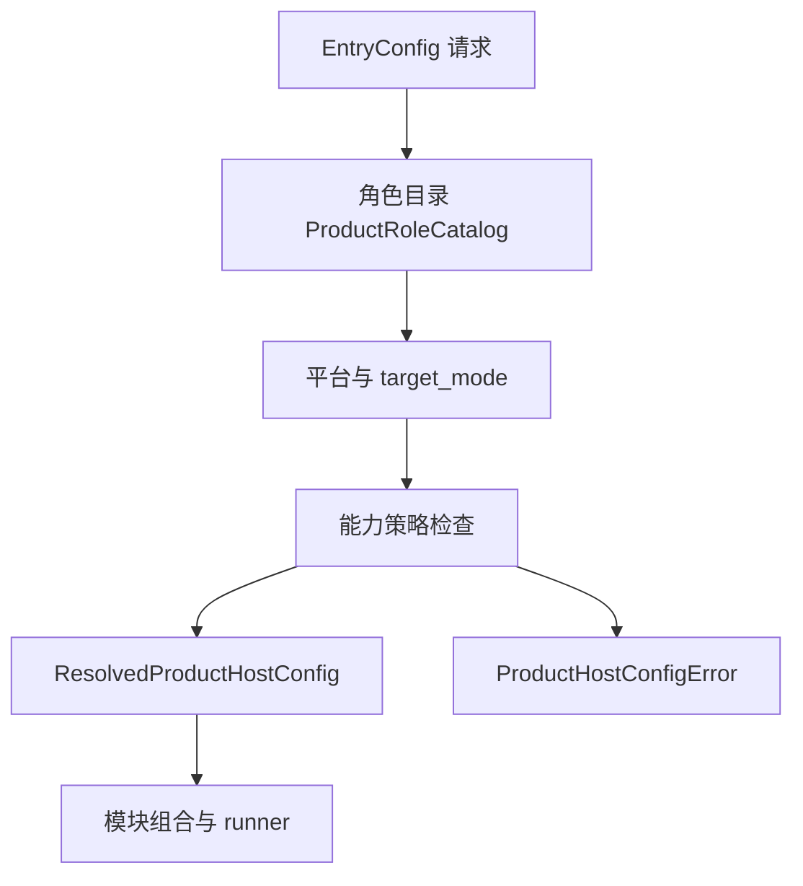

---
related_code:
  - zircon_app/src/entry/product_host_config/request.rs
  - zircon_app/src/entry/product_host_config/resolution.rs
  - zircon_app/src/entry/product_host_config/resolved_product_host_config.rs
  - zircon_app/src/entry/product_host_config/product_role_catalog.rs
  - zircon_app/src/entry/product_host_config/product_role_descriptor.rs
  - zircon_app/src/entry/product_host_config/product_host_capability_policy.rs
  - zircon_app/src/entry/product_host_config/product_host_config_error.rs
implementation_files:
  - zircon_app/src/entry/product_host_config
plan_sources:
  - user: 2026-09-09 扩展 zircon_app 公开接口、机制案例、教程和最佳实践
tests:
  - zircon_app/src/entry/tests/product_host_config.rs
  - zircon_app/src/entry/tests/entry_config_storage.rs
doc_type: module-detail
---

# ProductHostConfig 解析与能力准入

`ProductHostConfig` 是产品入口和 Runtime 之间的“准入层”。它把调用者提供的 `EntryConfig` 转换为不可变的 `ResolvedProductHostConfig`，并在模块组合前确定产品角色、运行模式、平台、窗口/输入/渲染要求、导出身份及关闭策略。

## 为什么要有解析层

直接把 CLI、环境变量和项目 manifest 传给各个模块会产生多个事实来源：窗口模块可能认为产品是桌面客户端，插件模块却认为是 Server。解析层把这些选择收敛成一份快照，后续模块只能读取快照。



## EntryConfig 字段

`EntryConfig` 的字段是 crate 内部存储，但所有构造器和解析行为属于公开 API。每个字段的来源会被记录为 `ProductConfigSource` 或 `ProductConfigSourceSet`。

| 字段 | 默认来源 | 影响 |
| --- | --- | --- |
| role | `EntryProfile` 或显式 `ProductRoleRequest` | 角色目录和 runner |
| runtime_profile | 角色默认值 | 模块数量、平台模块开关 |
| target_mode | 角色默认值 | Editor/Client/Server 能力 |
| project_plugins | 项目 manifest | 插件选择和桥接生命周期 |
| export_profile | 导出清单 | 目标平台、artifact、角色映射 |
| render_profile | 编译默认 | render framework 能力 |
| window_descriptor | 平台默认 | 首个窗口和 surface |
| editor_enabled_subsystems | 编辑器默认 | editor module 子系统 |
| editor_runtime_sandbox_enabled | `false` 或 profile 默认 | Play 隔离和权限 |
| required_runtime_plugins | 空 | 缺失即失败 |
| optional_runtime_plugins | 空 | 缺失只产生 availability 结果 |

## ProductRoleRequest

当前包含八个稳定角色：

| 角色 | 入口身份 | 目标模式 | 常见用途 |
| --- | --- | --- | --- |
| `EditorHost` | NativeProcess | EditorHost | 编辑器主进程 |
| `DesktopClient` | NativeProcess | ClientRuntime | 桌面运行时 |
| `Server` | NativeProcess | ServerRuntime | Dedicated server |
| `WebClient` | BrowserModule | ClientRuntime | Web/Wasm |
| `AndroidClient` | MobileActivity | ClientRuntime | Android activity |
| `EditorPlayChild` | ChildProcess | ClientRuntime | 编辑器 Play 子进程 |
| `Commandlet` | NativeProcess | ServerRuntime | 一次性工具 |
| `Embedded` | EmbeddedLibrary | HostProvided | Swift/外部宿主嵌入 |

`ProductRoleRequest::ALL` 可用于生成帮助、矩阵测试和 UI 下拉列表。角色不是字符串；解析时应使用枚举而不是自行拼接名称。

## ProductRoleDescriptor

解析后可通过 `ResolvedProductHostConfig::role_descriptor()` 读取副本。描述符包含：

- `entry_profile()`：映射回 `EntryProfile`。
- `target_mode()`：Runtime 的执行模式。
- `entry_kind()`：原生进程、子进程、浏览器模块等边界。
- `runner_kind()`：retained editor、desktop event loop、headless schedule 等。
- `runtime_linkage()`：`NativeDynamic`、`Static`、`HostProvided`。
- `capabilities()`：宿主能力准入要求。
- `shutdown_policy()`：进程、平台、父进程或外部宿主谁拥有关闭权。
- `artifact_manifest()`：目标产物、构建 feature、交付状态。

```rust
let resolved = EntryConfig::for_product_role(ProductRoleRequest::DesktopClient)
    .resolve()?;
let descriptor = resolved.role_descriptor();
println!("role={:?}", descriptor.role());
println!("runner={}", descriptor.runner_kind().as_str());
println!("linkage={}", descriptor.runtime_linkage().as_str());
```

## 能力策略

`ProductHostCapabilityPolicy` 由平台类别和四个 capability requirement 组成：`window`、`input`、`render`。每个要求可以是 `Required`、`Optional`、`Forbidden` 或 `HostProvided`。

`ProductPlatformClass::accepts(target)` 只做平台家族判断：`Desktop` 接受桌面 target，`DesktopOrHeadless` 额外接受 Headless，`Browser` 和 `Mobile` 分别匹配浏览器与移动平台，`HostProvided` 接受任意 target。它不替代 Runtime 后端能力矩阵。

| requirement | 含义 | 失败策略 |
| --- | --- | --- |
| Required | 产品必须得到该能力 | 解析或组合失败 |
| Optional | 有则启用，无则降级 | 记录 availability |
| Forbidden | 产品明确禁止 | 出现时失败 |
| HostProvided | 外部宿主负责兑现 | App 不创建该能力 |

## 来源优先级

解析过程将显式调用者值、导出 profile、项目配置、运行时 profile 和编译平台默认值合并。优先级遵循“显式请求 > 导出清单 > 项目配置 > profile 默认 > 编译默认”。解析完成后 provenance 可回答每一个值从哪里来：

```rust
let p = resolved.provenance();
println!("profile source = {:?}", p.profile());
println!("target source = {:?}", p.platform_target());
println!("plugin sources = {:?}", p.project_plugins());
```

不要在解析后修改配置；`ResolvedProductHostConfig` 的设计目的就是让模块看到稳定快照。

## 错误类型与恢复

`ProductHostConfigError` 应在产品边界直接展示。典型类别包括角色冲突、目标模式不允许、平台不匹配、导出 profile 不完整、必需插件缺失和窗口/渲染能力矛盾。`zircon_app` 会把它包装成 `CoreError::Initialization`，但不会丢弃原始文本。

排错顺序：

1. 打印 `EntryConfig::role_request()`。
2. 打印 `ResolvedProductHostConfig::provenance()`。
3. 对照 `role_descriptor().capabilities()`。
4. 检查 `artifact_manifest().delivery_status()`。
5. 再进入插件组合和 Runtime library 阶段。

## 配置示例：桌面客户端

```rust
let config = EntryConfig::new(EntryProfile::Runtime)
    .with_runtime_profile(RuntimeProfileId::Client3d)
    .with_required_runtime_plugins([RuntimePluginId::Render])
    .with_optional_runtime_plugins([RuntimePluginId::Ui]);
let resolved = config.resolve()?;
assert_eq!(resolved.target_mode(), RuntimeTargetMode::ClientRuntime);
```

## 配置示例：无头命令行

```rust
let config = EntryConfig::new(EntryProfile::Headless)
    .with_runtime_profile(RuntimeProfileId::Server)
    .with_target_mode(RuntimeTargetMode::ServerRuntime);
let resolved = config.resolve()?;
assert_eq!(resolved.role(), ProductRoleRequest::Server);
```

## 配置示例：导出产品

导出产品不要手工重新推导平台。使用 `ExportRuntimeBootstrapConfig::entry_config()` 将 export profile 投影为入口配置，再交给 bootstrap。

## 与其他引擎的比较

虚幻把平台和目标规则分散在 TargetRules、Launch 和 ModuleRules 中；Zircon 用角色描述符和 provenance 在运行前形成一份可打印快照。Fyrox 常在 `Engine::new` 中隐式创建窗口；Zircon 把窗口能力作为宿主准入，便于 Headless 和 Web 共用 Runtime。Piccolo 依赖宿主注入上下文；Zircon 的 `HostProvided` requirement 表达相同边界，但仍保留静态能力审计。

## 最佳实践

- 产品 bin 只构造 `EntryConfig`，不要复制解析规则。
- 对必须插件使用 required，对可选 UI/诊断使用 optional。
- 记录 provenance 到启动诊断，支持用户解释“为什么加载了这个模块”。
- 将 `ResolvedProductHostConfig` 传给组合层，不要再次从环境变量读取 profile。
- 在 CI 中覆盖八个 `ProductRoleRequest::ALL` 角色的拒绝/接受矩阵。
- 对 `HostProvided` 能力写清楚外部宿主的责任，不要假设 App 会创建窗口。

## 验证入口

- 解析实现：`zircon_app/src/entry/product_host_config/resolution.rs`。
- 角色目录：`zircon_app/src/entry/product_host_config/product_role_catalog.rs`。
- 错误契约：`zircon_app/src/entry/product_host_config/product_host_config_error.rs`。
- 测试：`zircon_app/src/entry/tests/product_host_config.rs`、`entry_config_storage.rs`。

## 10. 完整解析示例

```rust
fn resolve_client() -> Result<ResolvedProductHostConfig, ProductHostConfigError> {
    EntryConfig::new(EntryProfile::Runtime)
        .with_runtime_profile(RuntimeProfileId::Client3d)
        .with_target_mode(RuntimeTargetMode::ClientRuntime)
        .resolve()
}
```

解析失败时不要 `unwrap()`。产品 CLI 可以把 `ProductHostConfigError` 打印为用户错误，library/embedded host 则应将其映射到自己的诊断对象。

## 11. 角色能力矩阵

| 角色 | 平台类 | window | input | render | shutdown |
| --- | --- | --- | --- | --- | --- |
| EditorHost | Desktop | Required | Required | Required | ProcessCoordinated |
| DesktopClient | Desktop | Required | Required | Required | ProcessCoordinated |
| Server | DesktopOrHeadless | Forbidden/HostProvided | Optional | Optional | ProcessCoordinated |
| WebClient | Browser | HostProvided | HostProvided | Required | PlatformLifecycle |
| AndroidClient | Mobile | HostProvided | HostProvided | Required | PlatformLifecycle |
| EditorPlayChild | Desktop | HostProvided | HostProvided | Required | ParentCoordinated |
| Commandlet | DesktopOrHeadless | Forbidden | Optional | Optional | ProcessCoordinated |
| Embedded | HostProvided | HostProvided | HostProvided | HostProvided | ExternalHost |

上表是角色目录的解释性视图；实际接受与否必须以 `ProductRoleDescriptor` 和编译 target 为准。

## 12. Provenance 审计

`ProductHostConfigProvenance` 的 getter 都是 `const fn`：`profile()`、`runtime_profile()`、`target_mode()`、`platform_target()`、`project_plugins()`、`export_profile()`、`render_profile()`、`window_descriptor()`、`editor_enabled_subsystems()`、`editor_runtime_sandbox()`。`ProductConfigSourceSet` 可用 `empty/single/with/contains/is_empty` 构造和查询。

建议将 provenance 序列化为诊断行：

```text
entry.config_source.profile=EntryProfile
entry.config_source.runtime_profile=RuntimeProfile
entry.config_source.platform_target=CompiledTarget
entry.config_source.project_plugins=ProjectManifest
```

这比记录最终值更有用，因为用户通常需要知道“哪个输入覆盖了我的设置”。

## 13. 冲突案例

### Server 请求窗口

`EntryProfile::Headless` 后调用 `with_window_descriptor` 不会把 Server 变成桌面产品。解析阶段按角色 capability 处理：窗口若为 Forbidden，则报错或被角色策略拒绝。

### Web 请求桌面平台

`ProductRoleRequest::WebClient` 只能接受 `ProductPlatformClass::Browser`。即使当前编译机是 Windows，也不应让 Web role 通过桌面 platform target。

### 导出 profile 覆盖 runtime profile

导出清单拥有更高优先级时，应以 export profile 的 target/mode 重新映射 role；不要保留手写 Runtime profile 造成“导出为 Server、运行成 Client”的矛盾。

## 14. 与模块组合的接口契约

`ResolvedProductHostConfig` 的 getter 返回引用或 Copy 值，不暴露可变字段。组合层应该只读取：

```rust
let cfg = config.resolve()?;
let plugins = cfg.project_plugin_manifest();
let render = cfg.render_profile();
let window = cfg.window_descriptor();
```

如果模块需要一个未提供的值，应在解析层增加默认/错误，而不是在模块内部读取环境变量。

## 15. 调试清单

- 打印 role、entry kind、runner kind、linkage。
- 打印 platform class 和四项 requirement。
- 打印 artifact kind/delivery status。
- 打印 provenance，每项只保留一个来源。
- 确认 target mode 与 runtime profile 一致。
- 确认 required plugin 列表不会被 optional 列表覆盖。
- 确认导出 profile 与当前 product target 相容。

## 16. 维护约束

新增角色必须同时更新 `ProductRoleRequest::ALL`、role catalog、artifact manifest、能力矩阵和测试。新增 capability requirement 必须说明 Runtime backend 如何兑现；App 不能只增加 enum 而没有实际准入检查。
