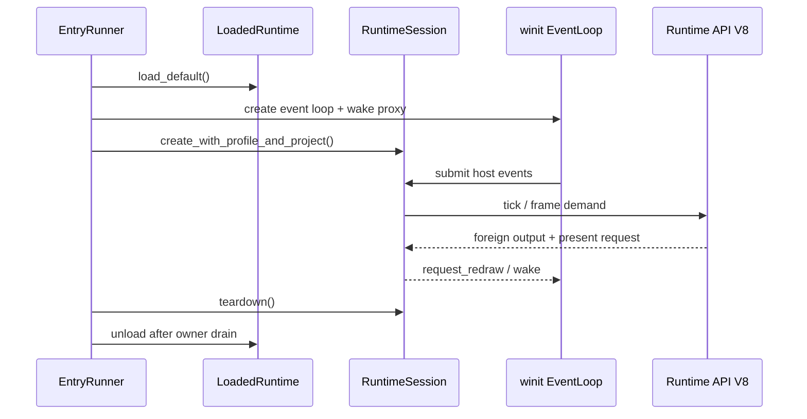

---
related_code:
  - zircon_app/src/entry/entry_runner/runtime.rs
  - zircon_app/src/entry/runtime_entry_app/mod.rs
  - zircon_app/src/entry/runtime_entry_app/frame_loop.rs
  - zircon_app/src/entry/runtime_entry_app/event_dispatch.rs
  - zircon_app/src/entry/runtime_library/runtime_session.rs
  - zircon_app/src/entry/runtime_library/runtime_session/frame_demand.rs
implementation_files:
  - zircon_app/src/entry/runtime_entry_app
  - zircon_app/src/entry/runtime_library/runtime_session.rs
plan_sources:
  - user: 2026-09-09 扩展 zircon_app 公开接口、机制案例、教程和最佳实践
tests:
  - zircon_app/src/entry/tests/runtime_entry_source_guards/frame_loop.rs
  - zircon_app/src/entry/runtime_library/runtime_session/tests.rs
  - zircon_app/src/entry/runtime_library/runtime_session/frame_demand.rs
doc_type: workflow-detail
---

# RuntimeSession 与宿主帧循环

`RuntimeSession` 是 App 对动态 Runtime 会话的拥有者；`RuntimeEntryApp` 是桌面事件循环适配器。两者共同完成“事件提交 -> Runtime tick -> frame extract -> surface present -> wake/继续”的闭环。

## 生命周期图



## 创建会话

```rust
let runtime = LoadedRuntime::load_default()?;
let wake = RuntimeWakeRegistration::register(event_loop.create_proxy());
let session = RuntimeSession::create_with_profile_and_project(
    runtime,
    b"client3d",
    Some(project_root),
    play_scene.as_ref(),
    play_report_pipe.as_deref(),
    Some(wake),
)?;
```

此构造调用是 `zircon_app` 内部 runner API；外部产品通常通过 `EntryRunner` 或 `ProductComposition` 进入。它要求 runtime API 表已经通过 BuildSet 预检，并把项目物理身份传给 Runtime，避免符号链接造成资源重复。

## 帧阶段

| 阶段 | 宿主职责 | Runtime 职责 |
| --- | --- | --- |
| Poll | 收集 winit 事件 | 无 |
| Dispatch | 转换为 ABI event | 入队并保持顺序 |
| Tick | 提供单调时间与 frame demand | 更新世界、脚本、任务 |
| Extract | 请求 frame extract | 生成渲染与 UI 输出 |
| Present | 绑定 viewport/surface 并 present | 返回状态/统计 |
| Wake | 根据 demand 唤醒 event loop | 标记继续运行 |

`frame_demand` 决定事件循环是继续 Poll、Wait，还是在 present 后立即唤醒。宿主不要通过固定 `sleep(16ms)` 代替 demand，否则会破坏 headless 和高刷新率行为。

## RuntimeEntryApp 边界

`RuntimeEntryApp` 是 crate 内部类型，负责 `ApplicationHandler`、窗口创建、输入转换、surface 状态、host request 路由和失败状态。它不是公开扩展点；要改变行为，应通过 `EntryConfig`、运行时 ABI 或项目插件实现。

## 事件与时间顺序

同一宿主 tick 中，窗口/输入事件先提交，再调用 Runtime tick。提交失败会记录运行时故障并阻止继续 present。时间来自 `CoreRuntime`/Runtime session 的 clock，不应从每个 winit callback 单独取系统时间。

## 唤醒与重绘

Runtime 可通过 wake sink 请求 event loop 唤醒；surface resize、窗口 expose 和 frame demand 也会触发 redraw。宿主必须允许“无输入但有动画”的唤醒路径。相反，关闭状态下的 wake 应被忽略，避免 teardown 后使用已释放 proxy。

## 退出条件

测试和诊断可设置：

- `ZIRCON_RUNTIME_EXIT_AFTER_FIRST_FRAME`：首个 presented frame 后结束。
- `ZIRCON_RUNTIME_EXIT_AFTER_PRESENTED_FRAMES`：达到正整数帧数后结束。
- `ZIRCON_RUNTIME_CAPTURE_FRAME_PNG`：首帧写 PNG。

这些限制在创建 session 前解析，非法值会阻止启动，不会运行半个 session 后才失败。

## 失败恢复

`RuntimeSessionCreateFailure` 可能包含 cleanup recovery context。错误文本会建议在创建线程调用 `retry_runtime_startup_cleanup`，再重试 Runtime。不要把 cleanup 失败吞掉后立即加载第二个动态库；旧 owner 仍可能持有 ABI 指针。

## 嵌入宿主的调用形状

```rust
// 示意：真实宿主应使用 zircon_app 的公开 bootstrap/组合 API。
let composition = ProductCompositionRequest::new(config).compose()?;
let report = composition.module_selection_report();
log::info!("composition={:?}", report);
// 由宿主事件循环驱动 session；不要在任意线程调用窗口 present。
```

## 与其他引擎比较

虚幻的 `FEngineLoop` 通常在一个主线程中串联 Slate、World Tick 和 RHI；Zircon 将“宿主事件”和“Runtime 会话”以 ABI session 隔开，允许同一 Runtime 被桌面、headless 或编辑器 Play 使用。Fyrox 的 `Engine::update` 由应用循环直接调用；Zircon 还增加 frame demand/wake，避免无条件轮询。Piccolo 的 VM step 由宿主显式推进，Zircon 的 tick 同样显式，但输出 ownership 和 present 阶段更加严格。

## 最佳实践

- 保证一个 session 只在创建线程 teardown。
- 每一帧记录事件数、tick 时长、present 状态和 demand 原因。
- 在 CI 使用 first-frame exit 和 PNG capture 验证启动，不依赖人工窗口观察。
- 将 Runtime 输出交给 `zircon_runtime_host` 校验和释放。
- 动画、网络或脚本请求 wake 时，确认窗口未进入 closing 状态。
- session 创建失败时先完成 retained cleanup，再重试。

## 测试与源码

- runner：`zircon_app/src/entry/entry_runner/runtime.rs`。
- 宿主 app：`zircon_app/src/entry/runtime_entry_app`。
- session：`zircon_app/src/entry/runtime_library/runtime_session.rs`。
- frame loop guard：`zircon_app/src/entry/tests/runtime_entry_source_guards/frame_loop.rs`。

## 10. 帧循环验收案例

### 无输入动画

1. Runtime 在 tick 后声明下一帧 demand。
2. session 通过 wake registration 唤醒 event loop。
3. app 收到 redraw，即使本轮没有 OS input 也必须 extract。
4. present 成功后清除本轮 demand，等待下一次 wake。

如果动画只在用户移动鼠标时更新，通常是宿主只在 input callback 中请求 redraw，遗漏了 Runtime demand。

### 关闭中的帧

关闭请求到达后，app 进入 Quiescing，拒绝新的 host input；已经提交的 tick/present 可以完成一次。下一轮不应创建新的 viewport 或发送 wake。这个边界能避免“窗口已关但 Runtime 仍提交 GPU work”的竞态。

### 时间跳变

宿主使用 monotonic clock。系统休眠、调试器暂停或时间源跳变时，Runtime 可以通过 clock discontinuity 机制修正；App 不应把 wall-clock UTC 直接作为 delta time。

## 11. RuntimeSession owner 规则

| 对象 | owner | 释放时机 |
| --- | --- | --- |
| `LoadedRuntime` | runner/session | session teardown 后 |
| `RuntimeWakeRegistration` | event loop/session | stop accepting wake 后 |
| session handle | `RuntimeSession` | drain 完成后 |
| frame output | host/runtime host | present 或 release 后 |
| window/surface | App | unbind 后 |

`ProductComposition`、`LoadedRuntime` 和 `RuntimeSession` 的 Drop 顺序不能靠局部变量偶然决定；顶层 runner 应显式安排 teardown。

## 12. 性能指标

推荐每帧记录：`events_submitted`、`tick_duration`、`extract_duration`、`present_duration`、`wake_reason`、`viewport_size`。出现卡顿时先区分 Runtime tick、GPU present 和 host request，不要只报告总帧时间。

## 13. 与 headless 共用

Headless runner 不创建 winit window，但仍可复用 session 的 tick、任务和 shutdown 语义。代码应把 frame demand 作为策略输入：桌面把 demand 转成 redraw，headless 把 demand 转成 schedule step，而不是在 Runtime 内部判断平台。

## 14. 生产检查表

- [ ] session 创建前已验证 runtime ABI/BuildSet。
- [ ] 项目路径使用 physical identity。
- [ ] wake proxy 与 event loop 同生命周期。
- [ ] 输入先提交，tick 后 extract，present 最后执行。
- [ ] no-input animation 能被 demand 唤醒。
- [ ] resize/close 不会重复创建或释放 viewport。
- [ ] session teardown 完成后才卸载 library。

## 15. 运行模式差异

| 模式 | event source | frame policy | 退出触发 |
| --- | --- | --- | --- |
| Desktop client | winit + gilrs | redraw + wake | window close/limit |
| Editor Play | editor child output + winit | parent-controlled | editor stop/child report |
| Headless | schedule/controller | demand-driven step | cancel/deadline |
| Embedded | external host callbacks | host-provided | parent lifecycle |

模式差异由 App host 实现，Runtime session 的 ABI 事件和输出格式保持一致。

## 16. 一个完整帧的伪代码

```rust
loop {
    let events = host.poll_events();
    for event in events {
        session.submit_event(event)?;
    }
    let demand = session.tick(clock.sample())?;
    if demand.needs_extract() {
        let output = session.extract_frame()?;
        host.present(output)?;
    }
    if demand.needs_wake() { host.wake(); }
    if session.is_terminal() { break; }
}
```

该代码是调用形状而非可直接编译的统一 API；具体公开接口由 runtime ABI V8 和 `RuntimeSession` 封装提供。关键约束是顺序和所有权，而不是循环的具体语法。

## 17. Tick 错误处理

事件提交错误通常表示 ABI/viewport/容量问题，必须记录并停止当前帧；tick 错误进入 RuntimeFailure；present 错误可以触发 surface recovery。不要在一个错误后继续提交同一帧的后续事件，因为 Runtime 可能已经丢失顺序保证。

## 18. Wake 去重

多个插件可能在同一 tick 请求 wake。wake registry 应合并重复请求，避免 event loop 被同一帧反复唤醒。关闭阶段清空 registry；新 wake 到达时只记录 debug/warn，不重新打开 session。

## 19. 背压与预算

宿主应对事件、host request、foreign output 和 child stdout 设置有界预算。预算耗尽时保留顺序并延迟到下一轮，同时在诊断中记录 dropped/deferred count。无界 drain 会让输入洪峰挤占 tick 和 present 时间。

## 20. 调试诊断模板

```text
frame=42 events=8 tick_ms=1.4 extract_ms=2.1 present_ms=0.8
demand=animation wake=true viewport=1 size=1280x720
session_state=running output_allocations=3 released=3
```

生产日志可采样输出，CI smoke test 则应完整保留首帧和 terminal 记录。

## 21. 关闭前检查

- [ ] 停止新 input 和 host request。
- [ ] drain 当前 foreign output。
- [ ] 等待 in-flight frame 完成或标记 terminal。
- [ ] 清除 wake registry。
- [ ] unbind surface、销毁 viewport。
- [ ] teardown session，检查 cleanup recovery context。
- [ ] 关闭 Runtime library 前确认无 ABI owner。

## 22. 性能与可观测性检查表

- [ ] 记录 tick、extract、present 的独立耗时。
- [ ] 记录每帧事件和 host request 数量。
- [ ] frame demand 有来源字段，能够区分动画、resize、输入和外部 wake。
- [ ] event/output 背压计数有界且可见。
- [ ] no-input 动画在桌面和 headless 都能推进。
- [ ] smoke test 能在确定帧数后退出。
