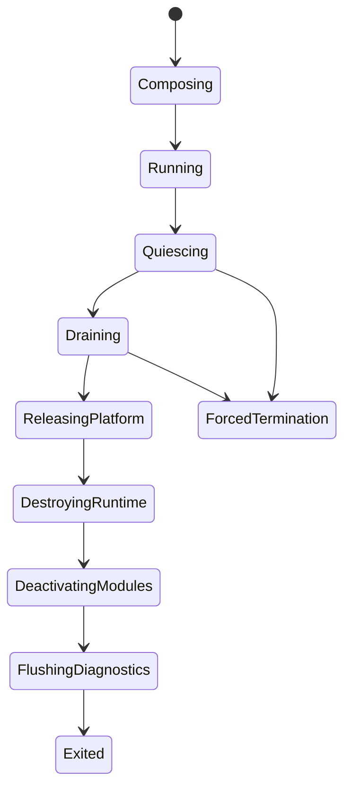

---
related_code:
  - zircon_app/src/entry/product_shutdown/mod.rs
  - zircon_app/src/entry/product_shutdown/phase.rs
  - zircon_app/src/entry/product_shutdown/terminal.rs
  - zircon_app/src/entry/product_shutdown/failure.rs
  - zircon_app/src/entry/product_shutdown/failure_ledger.rs
  - zircon_app/src/entry/entry_runner/headless/controller.rs
implementation_files:
  - zircon_app/src/entry/product_shutdown
  - zircon_app/src/entry/entry_runner/headless
plan_sources:
  - user: 2026-09-09 扩展 zircon_app 公开接口、机制案例、教程和最佳实践
tests:
  - zircon_app/src/entry/product_shutdown/tests.rs
  - zircon_app/tests/diagnostic_log_process_lifecycle.rs
doc_type: module-detail
---

# 关闭协调、故障账本与退出码

产品关闭不是简单的 `drop`。`zircon_app` 按单调阶段协调窗口、Runtime session、模块、插件 owner 和诊断输出；所有失败进入有界 failure ledger，最后映射为稳定的 `ProductExitClass` 与 `ProductProcessExitCode`。

## 阶段状态机



内部 `ProductHostPhase` 顺序为 `Composing`、`Running`、`Quiescing`、`Draining`、`ReleasingPlatform`、`DestroyingRuntime`、`DeactivatingModules`、`FlushingDiagnostics`、`Exited`。阶段只能前进；重复或倒退转换属于协调错误。

## 关闭职责

| 阶段 | 责任 |
| --- | --- |
| Quiescing | 停止新事件、新 frame、新插件命令 |
| Draining | 等待 in-flight request、child output、任务完成 |
| ReleasingPlatform | 释放窗口、surface、输入设备、wake proxy |
| DestroyingRuntime | 销毁 Runtime session 和动态 API owner |
| DeactivatingModules | 反向停用 Core modules 和插件 |
| FlushingDiagnostics | 写完日志、Play report、failure report |
| Exited | 选择退出码，禁止继续使用产品对象 |

## ProductExitClass

`ProductExitClass` 是稳定语义分类：`Success`、`StartupFailure`、`RuntimeFailure`、`ShutdownFailure`、`ForcedTermination`。它不携带平台数字码，适合日志、遥测和跨平台测试。

## ProductProcessExitCode

```rust
use zircon_app::{ProductExitClass, ProductProcessExitCode};

let code = ProductProcessExitCode::from_class(ProductExitClass::RuntimeFailure);
assert!(code.is_failure());
assert_eq!(code.code(), 1);
let explicit = ProductProcessExitCode::from_code(7);
assert_eq!(explicit.code(), 7);
```

公开方法：

| API | 语义 |
| --- | --- |
| `failure()` | 返回最小非零失败码 |
| `from_code(u8)` | 0 映射 Success，非零保留显式码 |
| `from_class(ProductExitClass)` | 除 Success 外均为默认失败 |
| `code()` | 得到 `u8` |
| `is_failure()` | 判断是否非零 |
| `From<ProductProcessExitCode> for std::process::ExitCode` | 进程边界转换 |

不要直接把内部错误字符串转换成退出码；先归类，再决定是否需要产品特定的显式码。

## Failure ledger

failure ledger 是冷路径、线程安全、可 clone 的记录 sink，容量为 16 条，每条消息最多 512 字节。记录会按 `sequence` 保序；超出容量的记录计入 `suppressed_count`，不会无限增长。

字段包括 phase、severity、owner、message。消息中的 `|`、`=`、换行、制表符和控制字符会转义，保证诊断行可解析。

### 严重级别

| 级别 | 处理 |
| --- | --- |
| Recoverable | 记录并继续当前阶段 |
| Terminal | 产品不能宣称成功，继续收尾 |
| Emergency | 可能触发强制终止或短 deadline |

`ProductFailureReport::primary()` 返回最早记录，`secondary()` 返回其余记录，`suppressed_count()` 告知是否有丢弃。最早记录通常是根因，后续是级联失败。

## HeadlessController

Headless host 暴露 `cancel()`、`is_cancelled()`、`begin_shutdown()`、`finish_runtime_until(deadline)`、`runtime_destroy_receipt()`、`mark_shutdown_complete()`、`wait_shutdown_until(deadline)` 和 `shutdown_deadline_expired()`。它适合服务进程或 CI 需要外部停止信号的场景。

```rust
controller.cancel();
let deadline = controller.begin_shutdown() + Duration::from_secs(5);
if !controller.finish_runtime_until(deadline) {
    eprintln!("runtime drain deadline exceeded");
}
```

控制器不会替调用者强制 kill 进程；deadline 到期后宿主根据 `ForcedTermination` 策略决定下一步。

## 典型关闭案例

1. 用户关闭窗口，记录 `WindowClosed`。
2. 进入 Quiescing，停止 redraw 和 input。
3. Drain runtime output 和 plugin child process。
4. Unbind surface，释放平台对象。
5. Teardown session；若失败记录 Terminal。
6. Deactivate modules，flush diagnostics。
7. 无 Terminal failure 时返回 Success，否则 ShutdownFailure。

## 启动失败与 cleanup

启动阶段 failure 也必须走产品收尾。动态库加载失败、session 创建失败、窗口创建失败都可能留下部分 owner。`RuntimeSessionCreateFailure::cleanup_recovery_context()` 提供恢复提示；调用 `retry_runtime_startup_cleanup` 前不要创建第二个 Runtime。

## 常见故障

| 症状 | 解释 | 建议 |
| --- | --- | --- |
| 退出码 0 但有 warning | warning 是 Recoverable，未改变成功语义 | 检查是否真的应升级为 Terminal |
| 日志缺最后一条错误 | flushing 阶段被强制终止 | 延长 shutdown deadline |
| ledger 只有 16 条 | 超出容量被抑制 | 关注 primary 和 suppressed_count |
| 关闭卡住 | drain 等待未完成 owner | 检查 child output、wake 和插件任务 |
| 重试启动崩溃 | 上一次 cleanup 未完成 | 在创建线程调用 retry cleanup |

## 与其他引擎比较

虚幻常在 `FEngineLoop::AppExit` 中集中释放，但插件/模块失败可能只写日志。Zircon 以单调阶段和 failure ledger 明确“即使失败也要完成收尾”。Fyrox 通常依赖 RAII drop；Zircon 仍使用 RAII，但对跨动态库 owner 增加显式 drain receipt。Piccolo 的宿主可以立即销毁 VM；Zircon 对 Runtime ABI 指针要求先停止请求再卸载。

## 最佳实践

- 将第一个 Terminal failure 视为根因，次要记录用于解释级联。
- 为动态库、窗口、插件和 headless shutdown 分别设置 deadline。
- 所有异常路径都调用统一 teardown，不在 `?` 处提前跳过释放。
- 把 `ProductExitClass` 用于跨平台测试，把 `ProductProcessExitCode` 留给进程边界。
- 在 CI 断言 phase 单调、ledger 有界、forced termination 可观测。
- 将用户可见错误与诊断 owner/phase 一起输出，避免只显示“退出失败”。

## 源码与测试

- 阶段：`zircon_app/src/entry/product_shutdown/phase.rs`。
- 退出分类：`terminal.rs`。
- 账本：`failure.rs`、`failure_ledger.rs`。
- Headless：`entry_runner/headless/controller.rs`。
- 测试：`product_shutdown/tests.rs`、`diagnostic_log_process_lifecycle.rs`。

## 10. 终止原因映射

内部 `ProductTerminalReason` 会映射到 exit class：`Completed`、`WindowClosed`、`CommandCompleted`、`ParentRequested` 和 `PlatformTerminated` 都是 Success；`StartupFailed`、`RuntimeFailed`、`ShutdownFailed` 和 `ForcedTermination` 分别对应失败类别。调用方不应把窗口关闭误判为 runtime failure。

## 11. 超时预算设计

关闭 deadline 应按 owner 分配：

| owner | 建议预算 | 超时处理 |
| --- | --- | --- |
| child output | 短 | 停止读取并记录 terminal |
| Runtime drain | 中 | 尝试 `finish_runtime_until` |
| platform release | 短 | 继续释放可用对象 |
| module deactivation | 中 | 记录失败但完成诊断 |
| diagnostics flush | 短 | 保留已写入记录和 suppressed count |

不要为整个产品设置一个无限等待；这样会让 CI 进程永久挂起。

## 12. 失败消息契约

ledger 会转义结构分隔符并限制消息长度。owner 应使用稳定字符串，例如 `runtime_session`、`runtime_play_report`、`window_surface`，不要包含临时地址或用户路径。长路径应在 resolver 边界进行诊断脱敏。

## 13. 故障树

```text
startup failure
  -> config resolve
  -> runtime library load
  -> event loop create
  -> session create
runtime failure
  -> event dispatch
  -> tick/extract
  -> present/host request
shutdown failure
  -> drain
  -> platform release
  -> runtime destroy
  -> module deactivate
```

先看最早 phase/sequence，再看后续级联；后面的 cleanup failure 通常不是首因。

## 14. 进程边界示例

```rust
fn run_product() -> ProductProcessExitCode {
    match EntryRunner::run_runtime() {
        Ok(()) => ProductProcessExitCode::from_class(ProductExitClass::Success),
        Err(error) => {
            eprintln!("{error}");
            ProductProcessExitCode::from_class(ProductExitClass::RuntimeFailure)
        }
    }
}
```

示例只说明语义映射。真实 runner 可能已经根据 terminal reason 选择更准确的 class，应避免外层把所有错误都改写成 startup failure。

## 15. 验收断言

- 阶段只前进不倒退。
- 关闭后不再产生新 host request。
- ledger 容量固定为 16。
- 单条消息不超过 512 字节。
- suppressed count 可见。
- primary record 是最早记录。
- Success 映射码 0，失败映射非零。
- cleanup 失败不会跳过 diagnostics flush。

## 16. 产品边界实现模板

```rust
fn finish_product(result: Result<(), Box<dyn std::error::Error>>) -> ProductProcessExitCode {
    match result {
        Ok(()) => ProductProcessExitCode::from_class(ProductExitClass::Success),
        Err(error) => {
            eprintln!("product failure: {error}");
            ProductProcessExitCode::failure()
        }
    }
}
```

模板只处理最终边界；内部 owner 仍必须先执行完整协调器。不要在 `Err` 分支直接调用 `std::process::exit`，否则 ledger 和 diagnostics 可能尚未 flush。

## 17. 诊断与遥测

建议把 exit class、process code、primary owner、primary phase、suppressed count 和 shutdown duration 作为结构化字段。用户界面显示简短原因，开发日志保留完整 failure report。路径、插件参数和剪贴板内容按隐私策略脱敏。

## 18. 失败注入测试

在测试中分别注入 config resolve、library load、session create、surface release、module deactivate 和 diagnostics flush 失败，断言：

- 首个失败被记录为 primary；
- 后续清理仍按单调 phase 执行；
- 最终 class 与失败阶段匹配；
- process code 非零；
- ledger 不超过容量。

## 19. 线程约束

failure ledger 可跨线程 clone；窗口/surface/session destroy 仍必须回到其 owner thread。Headless controller 的 cancel 可由控制线程调用，但 finish/wait 的时序由宿主协调。不要在任意 panic hook 中销毁 Runtime 指针。
