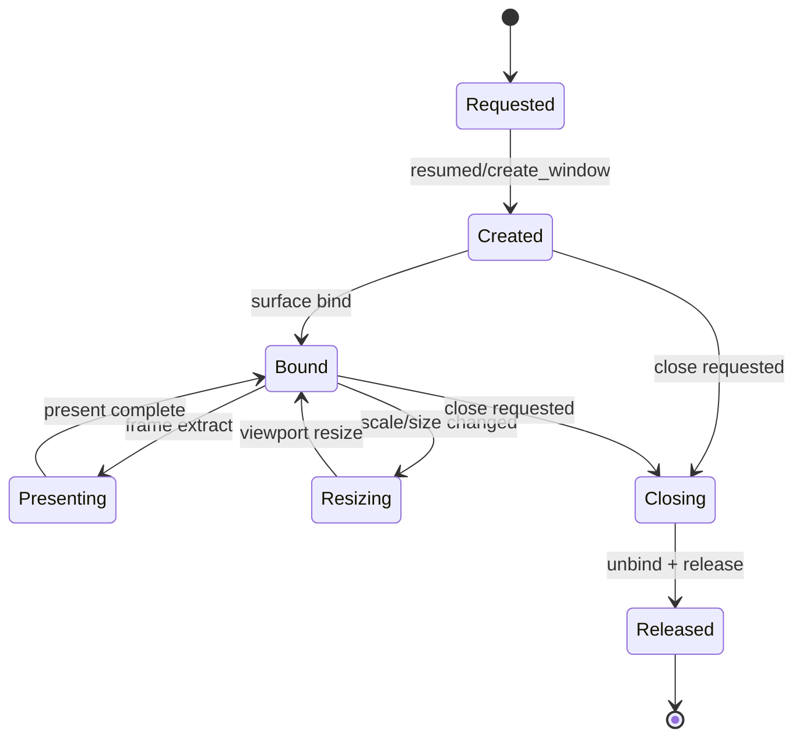

---
related_code:
  - zircon_app/src/entry/runtime_entry_app/window_creation.rs
  - zircon_app/src/entry/runtime_entry_app/window_attributes
  - zircon_app/src/entry/runtime_entry_app/window_lifecycle
  - zircon_app/src/entry/runtime_entry_app/window_surface
  - zircon_app/src/entry/runtime_entry_app/surface_present
  - zircon_app/src/entry/tests/runtime_entry_window_lifecycle_guards
  - zircon_app/src/entry/tests/runtime_entry_surface_present_guards
implementation_files:
  - zircon_app/src/entry/runtime_entry_app/window_creation.rs
  - zircon_app/src/entry/runtime_entry_app/window_surface
  - zircon_app/src/entry/runtime_entry_app/surface_present
plan_sources:
  - user: 2026-09-09 扩展 zircon_app 公开接口、机制案例、教程和最佳实践
tests:
  - zircon_app/src/entry/tests/runtime_entry_window_lifecycle_guards
  - zircon_app/src/entry/tests/runtime_entry_surface_present_guards
doc_type: workflow-detail
---

# 窗口、Viewport 与 Surface 生命周期

桌面窗口由 `zircon_app` 创建和监听，渲染 surface/viewport 由 Runtime/RenderFramework 持有。两者通过明确的绑定、resize、redraw、present、release 阶段连接，避免把 OS window 指针泄露到 Runtime 业务层。

## 生命周期



## WindowDescriptor

`EntryConfig::with_window_descriptor(WindowDescriptor)` 是窗口属性的公共注入点。属性 builder 位于 `runtime_entry_app/window_attributes`，包含 title、size、position、monitor、fullscreen、video mode、theme 等选择。窗口 descriptor 会存入 Core config，后续 host 创建窗口时读取同一份值。

不要在窗口已创建后修改 `EntryConfig` 期待热更新；运行时属性变化应通过 host request 或平台事件完成。

## 创建顺序

1. event loop `resumed` 到达。
2. 根据 `WindowDescriptor` 选择 monitor/video mode。
3. 创建 winit window。
4. 创建或发现 native surface target。
5. 将 surface 绑定到 Runtime viewport。
6. 允许 redraw/present。

任何一步失败都要进入 failure state，并释放已创建的 window/surface；不能让 Runtime 认为 viewport 已绑定而宿主对象已失效。

## Resize 与 scale factor

窗口物理尺寸变化、DPI scale factor 变化和 monitor 切换都可能要求 viewport resize。宿主应把最新物理像素尺寸转换为 Runtime 需要的 viewport 尺寸，并保持逻辑坐标与物理 surface 的映射一致。

| 事件 | 必须动作 |
| --- | --- |
| `Resized` | 更新 surface extent，通知 viewport |
| `ScaleFactorChanged` | 更新 scale factor，重新计算逻辑尺寸 |
| `RedrawRequested` | 请求 frame extract/present |
| `Focused(false)` | 可暂停 IME/光标捕获，但不自动销毁 surface |
| `CloseRequested` | 进入 Closing，停止新 frame |

## RenderFramework 连接

公开 RenderFramework 方法由 `zircon_runtime` 定义：`create_viewport`、`destroy_viewport`、`submit_frame_extract`、`submit_frame_extract_with_ui`、`bind_viewport_surface`、`unbind_viewport_surface`、`present_frame_extract`、`present_frame_extract_with_ui`、`query_stats`。App 层负责窗口事件和目标句柄；RenderFramework 负责图形 backend 的资源状态。

伪代码：

```rust
let viewport = render.create_viewport(viewport_desc)?;
render.bind_viewport_surface(viewport, native_surface)?;
let frame = render.submit_frame_extract(viewport, extract)?;
render.present_frame_extract(viewport, frame)?;
render.unbind_viewport_surface(viewport)?;
render.destroy_viewport(viewport)?;
```

真实调用必须遵循当前 RenderFramework trait 的参数和 ownership；不要复制这里的句柄类型到 App 自定义结构。

## CPU presenter fallback

若 native surface present 不可用，运行时可以走 CPU frame capture/presenter 路径。该路径用于测试、无 GPU 环境和证据采集，不应被误认为生产 GPU swapchain。`ZIRCON_RUNTIME_CAPTURE_FRAME_PNG` 只控制 capture 文件，不改变窗口能力准入。

## 关闭与释放

关闭请求到达后：

1. 停止新的 redraw demand。
2. 让 Runtime 完成当前 frame/present。
3. unbind viewport surface。
4. 销毁 viewport。
5. 销毁 native window。
6. 最后 teardown session/runtime library。

反向顺序会产生 use-after-release 风险。测试 guard 专门检查 close、status、focus、scale factor 和 surface fallback 的顺序。

## 常见故障

| 症状 | 可能原因 | 检查 |
| --- | --- | --- |
| 首帧黑屏但无错误 | viewport 未绑定或 extract 未提交 | 看 bind/present 诊断行 |
| resize 后拉伸 | 逻辑尺寸更新但物理 extent 未更新 | 比较 scale factor 和 surface extent |
| 关闭时崩溃 | surface 已释放仍收到 redraw | 检查 Closing 状态是否拒绝 redraw |
| 多显示器切换失败 | monitor/video mode 选择过期 | 重新解析 monitor context |
| CPU fallback 未触发 | 未判空 optional present 能力 | 先查询 capability，再选择 presenter |

## 与其他引擎比较

虚幻把 Slate Window、Viewport 和 RHI SwapChain 分层，但生命周期通常由 GameViewportClient 统一调度。Zircon 把 window lifecycle 与 RenderFramework binding 明确分开，便于 Web/Headless 没有 native window 时继续运行。Fyrox 的 window resize 事件直接驱动 renderer；Zircon 要先经过 ABI viewport 边界。Piccolo 通常不拥有窗口，Zircon 的 HostProvided 角色可以复现该模式。

## 最佳实践

- 将 `WindowDescriptor` 作为启动输入，运行期变化走请求或事件。
- 始终使用物理像素更新 surface extent，逻辑坐标留给 UI/input 层。
- present 前确认 viewport、surface 和 session 都未进入 Closing。
- 为 resize、scale、focus、close 建立自动化 guard 测试。
- CPU fallback 只用于证据/测试，生产发布明确声明是否需要 GPU surface。
- teardown 时保留失败 ledger，不要因窗口销毁失败跳过 Runtime cleanup。

## 源码与测试

- 窗口创建：`zircon_app/src/entry/runtime_entry_app/window_creation.rs`。
- 生命周期：`window_lifecycle`、`surface_present`。
- 测试：`runtime_entry_window_lifecycle_guards`、`runtime_entry_surface_present_guards`。

## 10. WindowDescriptor 字段语义

窗口描述符的 builder 由 `window_attributes/builder.rs` 组合：

| 类别 | 典型字段 | 约束 |
| --- | --- | --- |
| 标识 | title、theme | 在创建前固定 |
| 尺寸 | inner/outer size | 逻辑尺寸，最终映射物理像素 |
| 位置 | position、monitor | monitor 不存在时按策略回退 |
| 显示模式 | fullscreen、video mode | 需要目标平台支持 |
| 状态 | resizable、decorations | 由宿主能力决定 |

窗口创建失败应报告 descriptor 摘要和平台原因，不要打印未经脱敏的完整用户路径。

## 11. Present 前置条件

present 前必须满足：

- session 处于 Running/Draining 允许的 frame 阶段；
- viewport 已创建且未销毁；
- surface 已绑定且 extent 非零；
- extract output 的 viewport identity 与目标相同；
- 当前窗口没有进入 Closing；
- Runtime output 已通过 host 校验。

若 surface 尺寸为零，宿主可以等待下一次 resize/redraw，不应提交空尺寸 GPU work。

## 12. 多窗口边界

当前默认 App host 以一个 primary viewport/window 为主。未来多窗口扩展必须让每个 window 显式绑定 viewport handle，不能复用 default handle。IME、UI request 和 surface present 均应按 handle 路由。

## 13. Lost surface 与重建

GPU device reset 或原生 surface lost 时，宿主进入释放/重建路径：暂停 present，unbind 旧 surface，重新取得 native target，再 bind 到同一 viewport。不要销毁 Runtime world 仅为重建 surface。若 backend 不支持重建，应转 CPU fallback 或返回可诊断失败。

## 14. 诊断字段

建议记录：`window_id`、`viewport_handle`、`logical_size`、`physical_size`、`scale_factor`、`surface_state`、`present_path`、`close_state`。这些字段可以直接对应 window lifecycle guards 的断言。

## 15. 验收案例：DPI 切换

1. 收到 `ScaleFactorChanged`。
2. 使用新的 scale factor 重算逻辑输入坐标。
3. 更新物理 surface extent。
4. 通知 viewport resize。
5. 请求 redraw 并在下一帧 present。

中间不能用旧 scale factor 解释新的 pointer event，否则 UI 命中会出现一帧偏移。

## 16. 验收案例：窗口关闭

`CloseRequested` 只触发一次关闭意图。重复 close event 应幂等；进入 Closing 后忽略新的 redraw、IME、cursor 和 clipboard request。关闭路径的最终结果由 `ProductExitClass` 统一映射。

## 17. 维护清单

- [ ] WindowDescriptor 只在创建前读取。
- [ ] viewport/surface/window 三者 identity 可追踪。
- [ ] resize 和 scale factor 都覆盖高 DPI 测试。
- [ ] zero-size surface 不提交 present。
- [ ] present path 明确标记 GPU 或 CPU fallback。
- [ ] lost surface 可重建或明确失败。
- [ ] Closing 状态拒绝新增 host request。
- [ ] unbind 完成后才销毁 viewport/window。

## 18. 宿主事件到生命周期动作

| winit 类事件 | 生命周期动作 | 是否调用 Runtime |
| --- | --- | --- |
| `Resumed` | 创建窗口和 surface | bind viewport |
| `Suspended` | 暂停可见 present | 保留或释放由平台策略决定 |
| `RedrawRequested` | 运行一帧 | extract/present |
| `Resized` | 更新 extent | resize viewport |
| `ScaleFactorChanged` | 更新 scale 和 extent | resize viewport |
| `CloseRequested` | 进入 Closing | stop input/new frame |
| `Destroyed` | 释放剩余平台状态 | 禁止再调用 present |

## 19. Native target 的限制

`window_surface/native_target.rs` 负责从当前窗口获得 Runtime 可消费的 native surface target。该转换受 operating system、window backend 和编译 feature 限制。转换失败不是普通 resize：它表示本次 host 不能提供原生 surface，应选择 CPU fallback 或终止图形产品。

## 20. Surface 状态的可观测性

surface 状态推荐区分 `Unbound`、`Bound`、`Resizing`、`Lost`、`Releasing`、`Released`。不要只使用 bool；bool 不能区分“尚未创建”与“已损坏待重建”。

## 21. UI 与 surface 的时序

带 UI 的帧应使用 RenderFramework 的 `submit_frame_extract_with_ui` / `present_frame_extract_with_ui` 配对调用。不要先 present 3D extract 再独立 present UI，这会产生闪烁或两个 swapchain submit。无 UI 场景使用对应无 UI 方法。

## 22. 测试覆盖建议

| 场景 | 断言 |
| --- | --- |
| 初次创建 | create 后 bind，首次 redraw 可 present |
| resize | 新尺寸进入 viewport，旧 extent 不再 present |
| high DPI | 逻辑/物理坐标一致 |
| close | 一次 close 只触发一次 release |
| fallback | 无 native surface 时走 CPU 路径 |
| stale redraw | Released 后不调用 Runtime present |

## 23. 平台差异

桌面平台由 winit 管理窗口和 monitor；Browser/Mobile/Embedded 角色则可能以 `HostProvided` 兑现 surface。共享代码不得假设存在 raw window handle；先查询角色 descriptor 和 capability policy。

## 24. 运行手册

出现黑屏时依次检查：窗口是否创建、viewport 是否绑定、尺寸是否非零、extract 是否有输出、present 是否走 GPU/CPU 路径、错误是否在 failure ledger。这样能在不接入图形调试器时定位绝大多数宿主问题。
