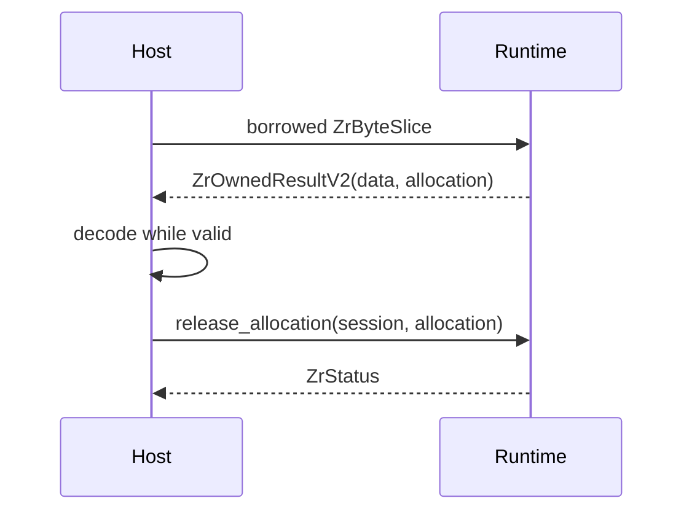

---
related_code:
  - zircon_runtime_interface/src/buffer.rs
  - zircon_runtime_interface/src/handles.rs
  - zircon_runtime_interface/src/status.rs
implementation_files:
  - zircon_runtime_interface/src/buffer.rs
  - zircon_runtime_interface/src/handles.rs
plan_sources:
  - user: 2026-09-09 为 ZirconEngine 构建引擎说明书级 Wiki
tests:
  - zircon_runtime_interface/src/tests/abi_safety_contracts.rs
doc_type: api-reference
---

# 字节载体、所有权与预算

## 载体分类

`ZrByteSlice` 是 borrowed 输入；`ZrByteBufferRef` 是 caller-owned 输出缓冲；`ZrOwnedByteBuffer` 是可由 provider 自定义释放的 host fetch 输出；`ZrOwnedResultV2` 是 runtime-owned 不可变输出，必须用 allocation id 释放。四者不可互换。

| 类型 | 所有者 | 释放方式 | 典型用途 |
| --- | --- | --- | --- |
| `ZrByteSlice { data, len }` | caller | 不释放 | JSON 请求、诊断文本 |
| `ZrByteBufferRef { data, capacity, written }` | caller | caller | host fetch 写入 |
| `ZrOwnedByteBuffer` | provider | `free` callback | 反向资源读取 |
| `ZrOwnedResultV2 { data, len, allocation }` | runtime | `release_allocation(session,id)` | query、事件、profile |

## 输入校验

```rust
pub unsafe fn checked_slice<'a>(self, limit: usize) -> Result<&'a [u8], ZrByteSliceError>
```

`len == 0` 时允许 `data == null`；非零长度要求非空指针、`len <= isize::MAX` 且不超过 limit。违反条件分别产生 `NullWithNonZeroLength`、`LengthExceedsAddressSpace`、`LengthExceedsLimit`。通过校验不等于内存已经初始化，caller 仍需保证生命周期。

## 输出与释放

```rust
let mut output = ZrOwnedResultV2::empty();
let status = unsafe { (api.query_world)(session, request_slice, &mut output) };
if status.is_ok() {
    let bytes = unsafe { std::slice::from_raw_parts(output.data, output.len as usize) };
    let value = serde_json::from_slice(bytes)?;
    unsafe { (api.release_allocation)(session, output.allocation) };
}
```

读取必须发生在 release 之前；release 成功后指针立即失效。错误状态下也要检查 provider 是否返回了非空 carrier，并在契约允许时释放，避免泄漏。

## 预算常量

| 常量 | 值 | 适用 |
| --- | ---: | --- |
| `ZR_RUNTIME_STATUS_DIAGNOSTICS_MAX_ENCODED_BYTES_V1` | 4 KiB | `ZrStatus.diagnostics` |
| `ZR_RUNTIME_EVENT_PAYLOAD_MAX_ENCODED_BYTES_V1` | 256 KiB | 事件 payload |
| `ZR_RUNTIME_NATIVE_STRING_MAX_ENCODED_BYTES_V1` | 256 KiB | native 字符串 |
| `ZR_RUNTIME_CLIPBOARD_TEXT_MAX_ENCODED_BYTES_V1` | 32 KiB | clipboard |
| `ZR_RUNTIME_FRAME_MAX_RGBA_BYTES_V1` | 256 MiB | RGBA frame |
| `ZR_RUNTIME_FRAME_MAX_DIMENSION_V1` | 16,384 | 单轴尺寸 |
| `ZR_RUNTIME_JSON_MAX_NESTING_DEPTH_V1` | 128 | JSON 深度 |

请求预算还包括 item 数量、处理微秒上限和 `allow_empty`。超过预算返回 `LimitExceeded`，应分页或缩小请求，不要当作 JSON malformed 重试。

## C 侧 free callback

```c
typedef ZrStatus (*ZrFreeBytesFn)(ZrOwnedByteBuffer buffer);
if (out.free) {
    ZrStatus free_status = out.free(out);
    /* free_status 只记录，不再次调用 free */
}
```

`owner_token` 只能回传给原 provider。不能用宿主 allocator、`free()` 或 `Vec::from_raw_parts` 猜测释放策略。

## 失效图



## 常见错误

* `written` 指针为空或写入量大于 capacity：返回 `InvalidArgument`，不得读取输出。
* `allocation == invalid` 但 data 非空：视为 provider 契约损坏，停止会话并记录诊断。
* 跨 session 释放 allocation：`NotFound`；allocation id 不提供跨会话所有权。
* 在异步 callback 后继续使用 borrowed slice：未定义行为；复制数据或延长 caller 存活期。

## 测试清单

测试 null+nonzero、超过 `isize::MAX`、超过每类 limit、重复 release、跨 session release，以及错误状态 carrier 清理。

## `ZrRuntimePayloadLimitV1` 字段

| 字段 | 语义 | 建议值来源 |
| --- | --- | --- |
| `max_encoded_bytes` | JSON/bytes 最大编码长度 | 模块常量 |
| `max_items` | 数组、行或 delivery 数量 | 模块常量 |
| `max_nesting_depth` | JSON 嵌套深度 | 默认 128 |
| `max_processing_time_micros` | 单请求处理预算 | 模块常量 |
| `allow_empty` | 是否允许空输出 | 仅 drain/optional 输出 |

`ZrRuntimePayloadLimitV1::new(bytes, items, micros)` 会将 nesting depth 设为 128、`allow_empty=false`；调用 `.allow_empty()` 只应用于语义上“没有事件也是成功”的输出。

## Caller-owned buffer

```rust
let mut storage = vec![0u8; 4096];
let mut written = 0usize;
let mut dst = ZrByteBufferRef { data: storage.as_mut_ptr(),
    capacity: storage.len(), written: &mut written };
// host callback 写入 dst；返回后检查 written <= capacity
```

宿主不能让 runtime 保存 `data` 或 `written` 指针。callback 返回后 caller 可立即释放 storage。若 capacity 为 0，data 可以为空；非零写入量必须拒绝。

## Ownership checklist

* 借用输入在同步调用结束前保持不变。
* owned output 解码后立即 release，避免批量积压。
* release 失败要记录 allocation id，并在 destroy 前再次尝试。
* 不跨线程移动 provider allocator 的 `ZrOwnedByteBuffer`，除非 free callback 明确支持。
* 长期缓存只保存解码后的自有数据，不保存 output.data 指针。

## 边界测试表

| 场景 | 预期 |
| --- | --- |
| `data=null,len=0` | 返回空 slice |
| `data=null,len>0` | `NullWithNonZeroLength` |
| `len>isize::MAX` | `LengthExceedsAddressSpace` |
| `len=limit+1` | `LengthExceedsLimit` |
| 输出 `written>capacity` | `InvalidArgument` |
| 重复 allocation release | `NotFound` 或明确错误 |
| 成功但 allocation invalid | provider 契约错误，终止会话 |

## 代码审查规则

审查 FFI 代码时逐项确认：

1. 所有 `unsafe` 块都紧邻 pointer 验证。
2. `len` 在转为 `usize` 前检查 `u64` 溢出。
3. borrowed slice 未存入结构体、队列或线程闭包。
4. owned allocation 在所有 return path（包括 decode error）释放。
5. free callback 只调用一次，且 owner_token 不被改写。
6. 错误 status 不会让调用方读取未初始化输出。
7. 每个 payload limit 来自接口常量，而不是 magic number。

## Fuzz 边界

对 `checked_slice`、JSON decode 和 allocation carrier 进行 fuzz：随机 null/alignment、极端 len、重复 release、截断 UTF-8、深嵌套 JSON、超过 item/byte/time budget。fuzz 目标是“返回 typed error 或安全空值”，不是保持 panic。

## 与 C++ 的互操作

C++ wrapper 应使用 `std::span<const std::byte>` 构造 `ZrByteSlice`，使用 RAII guard 包装 allocation。不要把 `std::string` 的 data 指针跨异步线程传给 runtime；`std::vector` 扩容也会使已提交指针失效。

## 释放失败处置

release 返回 `NotFound` 可能表示重复释放或 session 已销毁；返回 `Error` 时记录 allocation id、session id 和调用点。不能为了“清理”直接调用系统 allocator，因为 runtime 可能使用 arena 或共享内存。

## 安全预算审计

每个入口记录请求/响应预算版本；升级 limit 必须同步更新 host、runtime、文档和测试 fixture。预算扩大可能改变拒绝策略，属于兼容性变更，即使结构布局不变也要写变更记录。

## 内存对齐

`data` 必须满足 `u8` 对齐；包含结构体的 byte payload 不能直接 cast 成 Rust struct，必须先 decode。`written`、`capacity` 和 `len` 的读取也要满足目标平台对 `usize/u64` 的对齐要求。

## Zero-copy 使用条件

只有当 consumer 能在 release 前完成同步消费时才允许 zero-copy。跨线程、异步 GPU upload 或缓存场景必须复制到 consumer-owned storage，并在复制成功后释放 allocation。

## 大输出拆分

frame RGBA 输出应优先按 viewport/frame 维度拆分；world rows 按 scope 拆分；plugin events 按 page 限制。拆分后每个 page 仍需独立校验 abi_version、长度和 generation。

## OOM 与 LimitExceeded

provider 内存不足可返回 `Error`，业务不应把它当作可通过扩大 limit 解决。`LimitExceeded` 表示输入/输出违反明确预算；两者在监控中分开统计。

## 关闭前泄漏检测

destroy 前输出 outstanding allocation count；非零时打印 allocation ids、产生 API 和 bytes。开发构建可启用断言，生产构建至少记录并执行有限次 drain/release。

## Carrier 合法性矩阵

| data | len/capacity | 结论 |
| --- | --- | --- |
| null | 0 | 空载体 |
| null | >0 | 拒绝 |
| non-null | 0 | 允许但不读取 |
| non-null | len<=capacity | 可读/可写 |
| non-null | len>capacity | provider 契约错误 |

## Zero-copy 与回收

只有同步 consumer 能在 release 前完成消费时才允许 zero-copy。跨线程、异步 GPU upload 或缓存场景必须复制到 consumer-owned storage；release 失败时记录 allocation id，不调用系统 allocator 猜测释放策略。

## ABI 与预算升级

carrier 增加字段必须提升版本；改变 `usize` 为 `u64` 也属于布局变化。limit 常量增大虽不改变布局，但会改变拒绝行为，需同步更新 host 与测试。

## Fuzz 与调试

对 pointer null/alignment、极端 len、重复 release、截断 UTF-8、深嵌套 JSON、超 item/byte/time budget 进行 fuzz。开发模式可在 release 后填充 poison pattern，检测 use-after-release；C++ wrapper 应断言 owner_token 与 free function 成对。

## 性能取舍

小于 4 KiB diagnostics 直接复制更简单；大型 frame 只在 presenter 可同步消费时 zero-copy，否则按行/块复制并限制队列深度。每次预算调整记录版本和拒绝率变化。
