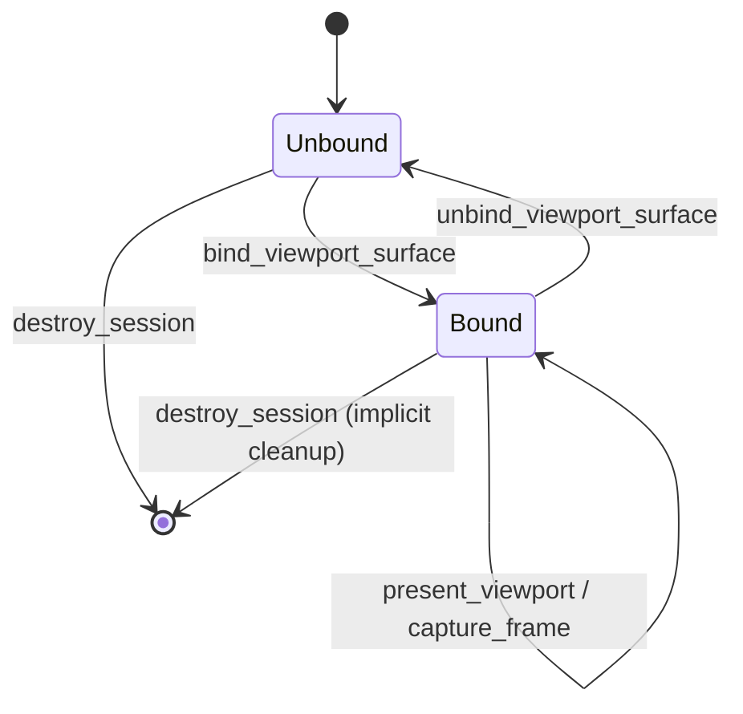
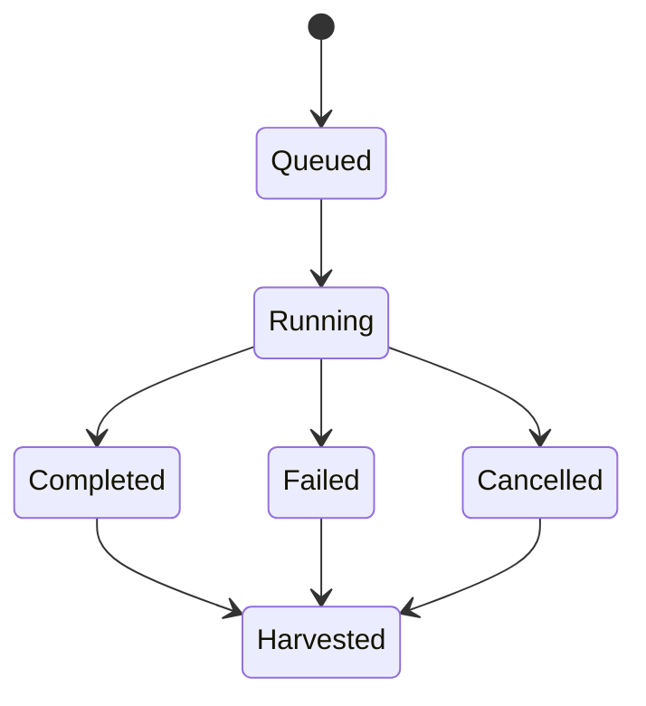
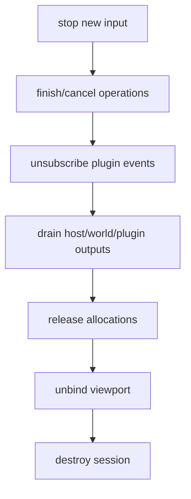

---
related_code:
  - zircon_runtime_interface/src/handles.rs
  - zircon_runtime_interface/src/runtime_api/session/session.rs
  - zircon_runtime_interface/src/runtime_api/session/operation.rs
  - zircon_runtime_interface/src/runtime_api/session/viewport.rs
  - zircon_runtime_interface/src/runtime_api/session/plugin_event_mirror.rs
implementation_files:
  - zircon_runtime_interface/src/handles.rs
  - zircon_runtime_interface/src/runtime_api/session
plan_sources:
  - user: 2026-09-09 为 ZirconEngine 构建引擎说明书级 Wiki
tests:
  - zircon_runtime_interface/src/runtime_api/session/session_identity_tests.rs
doc_type: api-reference
---

# Session、Viewport 与 Operation Handle

## Opaque handle 规则

`ZrRuntimeSessionHandle`、`ZrRuntimeViewportHandle`、`ZrRuntimePluginHandle`、`ZrRuntimeAllocationId` 都是 `repr(transparent) u64`。`0` 是 invalid；非零只代表形状有效，不代表对象仍存活。句柄不携带类型 tag，调用方必须按参数位置传入正确种类。

```rust
let session = ZrRuntimeSessionHandle::new(raw);
if !session.is_valid() { return Err("session not created") }
```

默认单 viewport 为 `ZIRCON_RUNTIME_DEFAULT_VIEWPORT_HANDLE_V1 == 1`。不要自行递增生成 viewport；其生命周期由 bind/unbind API 管理。

## 会话状态

| 阶段 | 允许操作 | 禁止操作 |
| --- | --- | --- |
| invalid | 无 | 所有 API |
| created | event、tick、query、watch、operation | destroy 后继续调用 |
| draining | 释放 allocation、排空请求 | 新建长操作 |
| destroyed | 无 | 任何 handle 调用 |

`destroy_session` 成功后，所有 viewport、watch token、operation、plugin subscription 和 allocation 都失效。实现可能先返回错误并保留诊断；宿主应按错误说明执行 drain/retry，而非盲目重复 destroy。

## Operation handle

`ZrRuntimeOperationHandle` 为不透明 u64，新建于 `submit_operation` 输出。状态由 `ZrRuntimeOperationStatusV2` 描述：`phase`、`progress`、`detail_kind`、`detail`、`updated_at_ms` 等字段必须按 DTO 版本解码。

```rust
let mut handle = ZrRuntimeOperationHandle::invalid();
submit(session, request, &mut handle)?;
loop {
    let status = poll(session, handle)?;
    match status.phase {
        ZrRuntimeOperationPhase::Queued | ZrRuntimeOperationPhase::Running => continue,
        ZrRuntimeOperationPhase::Completed | ZrRuntimeOperationPhase::Failed |
        ZrRuntimeOperationPhase::Cancelled => break,
    }
}
let result = harvest(session, handle)?;
```

`poll` 只读状态；`harvest` 消费终态结果。未到终态 harvest 返回 `InvalidArgument` 或 `Error`，成功 harvest 后不得再次 harvest。

## Viewport 生命周期



bind 请求中的 native target 必须与平台匹配；Windows Win32 surface 不能在无窗口句柄时提交。unbind 后不能 present，需重新 bind。

## Plugin subscription

订阅返回 `ZrRuntimePluginEventSubscriptionHandle`。subscription 属于 session，插件卸载或 session destroy 会使其失效。取消订阅应幂等：已取消 token 返回 `NotFound` 或成功空操作，宿主都不能继续 drain 旧 token。

## 负面案例

* 句柄值被序列化后跨进程使用：必然无效；只传 DTO，不传 opaque raw。
* session A 的 operation 在 session B poll：`NotFound`。
* destroy 期间 callback 重入同一 session：拒绝或 `Error`；宿主应在 callback quiescence 后销毁。
* invalid handle 作为输出初值是安全的；错误路径不应留下上一次成功句柄。

## 测试清单

覆盖 invalid/valid 判定、跨 session、重复 destroy、unbind 后 present、终态 harvest 顺序和插件取消竞态。

## 生命周期 API 组合

推荐将句柄封装为不实现 `Deref` 的 Rust newtype，避免把 raw u64 当数组索引：

```rust
struct SessionOwner { raw: ZrRuntimeSessionHandle, api: RuntimeApi }
impl Drop for SessionOwner {
    fn drop(&mut self) { self.api.destroy(self.raw); }
}
```

真实项目应显式执行 drain/release 后再 drop；`Drop` 中不能 panic，也不能在未知线程调用 runtime。

## Operation 状态机



`ZrRuntimeOperationOutcomeV1` 只在 harvest 结果中出现；poll 期间应使用 `phase` 与 `detail_kind` 更新进度条。进度值不是严格单调保证，UI 应允许回退或 unknown。

## Pick ticket

`ZrRuntimeViewportPickTicket` 与 operation handle 不同：ticket 只绑定一次异步 viewport pick。`ZrRuntimeViewportPickDispositionV1` 表示 hit/miss/cancelled/invalid 等终态；poll 输出必须先初始化为空结果，避免 ticket 失效时读取旧命中。

## 句柄审计

生产日志至少记录 `session.raw()`、operation/ticket raw、generation 和调用线程。不要记录指针地址作为稳定身份；指针地址可能被 allocator 重用。

## Handle 类型字段

| 类型 | 底层 | invalid | owner |
| --- | --- | ---: | --- |
| `ZrRuntimeSessionHandle` | `u64` | 0 | runtime session |
| `ZrRuntimeViewportHandle` | `u64` | 0 | session viewport |
| `ZrRuntimePluginHandle` | `u64` | 0 | plugin registry |
| `ZrRuntimeAllocationId` | `u64` | 0 | session allocation table |
| `ZrRuntimeOperationHandle` | `u64` | 0 | operation queue |
| `ZrRuntimeViewportPickTicket` | `u64` | 源码定义 | pick scheduler |
| `WatchToken` | `u64` opaque | 源码定义 | world watch table |

所有类型都实现 `raw`/`is_valid`（`WatchToken` 的可见构造遵循 watch 模块），但 raw 值之间不互换。

## Session config 前置条件

调用 `create_session` 前应校验 project/profile 字符串不为空、路径编码不超过对应 limit、wake sink callback 与 token 成对。成功时输出 handle 必须从 invalid 变为非零；失败时输出仍应是 invalid。

## Destroy drain 顺序



顺序不是强制每个实现都相同，但宿主必须保证 destroy 前不再产生新 owned allocation。destroy 返回后再执行 cleanup 属于错误。

## OperationStatus 字段手册

| 字段 | 类型 | 说明 |
| --- | --- | --- |
| `abi_version` | `u32` | `ZIRCON_RUNTIME_ABI_VERSION_V2` |
| `phase` | `u32` | `Queued` 到 `Harvested` 的 raw 值 |
| `detail_kind` | `u32` | 队列/限额/deadline/panic 等原因 |
| `reserved` | `u32` | 必须为 0，未来扩展占位 |
| `handle` | `ZrRuntimeOperationHandle` | 返回对象身份 |
| `completed_work` | `u64` | 已完成单位 |
| `total_work` | `u64` | 总单位，0 表示未知 |
| `detail_value` | `u64` | detail_kind 对应数值 |

未知 phase/detail raw 值不能静默映射到 Completed；应显示 unknown 并停止 harvest。

## Poll/harvest 约束

poll 是 allocation-free 固定布局输出，可高频调用但应受宿主轮询节流；harvest 输出 owned result，必须 release。终态包括 Completed、Failed、Cancelled、Expired、Harvested；Harvested 表示结果已消费，不可再次取回。

## 竞态测试

并发测试应覆盖 destroy 与 poll、unsubscribe 与 drain、cancel pick 与 poll、release allocation 与 destroy 的交错。预期结果可以是明确 `NotFound/Error`，但不得 use-after-free、死锁或 double free。
