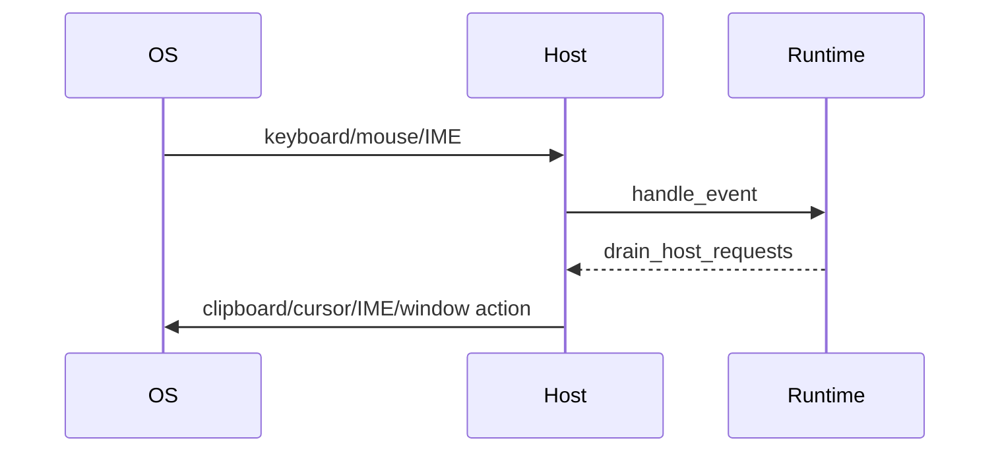

---
related_code:
  - zircon_runtime_interface/src/runtime_api/host/host_requests.rs
  - zircon_runtime_interface/src/runtime_api/host/clipboard.rs
  - zircon_runtime_interface/src/runtime_api/host/ui_action.rs
  - zircon_runtime_interface/src/runtime_api/session/events.rs
  - zircon_runtime_interface/src/runtime_api/session/translated_events.rs
  - zircon_runtime_interface/src/runtime_api/constants.rs
implementation_files:
  - zircon_runtime_interface/src/runtime_api/host
  - zircon_runtime_interface/src/runtime_api/session/events.rs
plan_sources:
  - user: 2026-09-09 为 ZirconEngine 构建引擎说明书级 Wiki
tests:
  - zircon_runtime_interface/src/tests/window_input_contracts.rs
doc_type: api-reference
---

# 输入、窗口、IME 与 Clipboard Host Request

## 两个方向

宿主输入通过 `handle_event(session, ZrRuntimeEventV1)` 进入 runtime；runtime 反向请求通过 `drain_host_requests(session, *mut ZrOwnedResultV2)` 输出。前者是同步 borrowed DTO，后者是分页的 owned JSON 批次。

## 事件类型

| 常量 | 载荷重点 |
| --- | --- |
| `ZR_RUNTIME_EVENT_KIND_KEYBOARD_V1` | key code、action pressed/released/text |
| `MOUSE_BUTTON` / `MOUSE_MOTION` / `MOUSE_WHEEL` | viewport 坐标、按钮、滚轮单位 |
| `TOUCH` / `GAMEPAD_*` | touch phase、axis/button、connection |
| `IME` | preedit、commit、surrounding text、cursor area |
| `WINDOW_STATUS` | close、destroy、scale、theme、occlusion |
| `VIEWPORT_RESIZED` / `VIEWPORT_CAMERA` | viewport 尺寸和相机投影 |
| `FILE_DRAG_DROP` | hover/drop/cancel 与文件列表 |
| `ACCESSIBILITY_ACTION` | UI 节点动作请求 |

所有 event payload 都受 `ZR_RUNTIME_EVENT_PAYLOAD_MAX_ENCODED_BYTES_V1`（256 KiB）约束。未知 kind 必须保留 raw code 并返回 `UnsupportedVersion`，不能按相近事件猜测。

## Host request 批次

`ZrRuntimeHostRequestBatchV1` 包含批次版本、请求数量和编码 payload。`ZrRuntimeHostRequestV1` 的 variant 包括 clipboard、cursor、gamepad rumble、IME、UI action、project scene transition。请求处理顺序就是 runtime 产生顺序；宿主应记录 request id/sequence 以便重放。

```rust
let mut out = ZrOwnedResultV2::empty();
let status = unsafe { (api.drain_host_requests.unwrap())(session, &mut out) };
if status.is_ok() && !out.is_empty() {
    let batch: ZrRuntimeHostRequestBatchV1 = decode_owned(&out)?;
    for request in batch.requests { host.dispatch(request)?; }
    release(session, out.allocation)?;
}
```

## Clipboard

`ZrRuntimeClipboardHostRequestV1` 表达 read/write 意图；结果 `ZrRuntimeClipboardResultV1` 携带成功标志、文本和错误信息。文本最大 32 KiB encoded bytes。拒绝空来源、超过预算或不支持的 mime；失败应返回 typed result，而不是空字符串成功。

## IME

IME request 的 kind 包括 enable/disable、preedit、commit、delete surrounding、cursor area、surrounding text。`ZrRuntimeImeCursorAreaV1` 必须声明 `ZrRuntimeImeCoordinateSpaceV1`；宿主不得把 viewport 像素直接当屏幕坐标。`ZrRuntimeImeTextRangeV1` 使用 UTF-16/字节语义时按字段说明转换，不能用 Rust 字符索引替代。

## 窗口与光标

cursor request 支持 show/hide、grab mode 和 position；window status 事件中的 bool 使用稳定常量 `ZR_RUNTIME_WINDOW_BOOL_TRUE/FALSE_V1`。close requested 是可否决通知，destroyed 是终态事实，顺序不可颠倒。

## 时序图



## 负面案例与测试

* drain 返回空批次是正常；`allow_empty` 只适用于对应输出预算。
* IME disable 后仍提交 preedit：应丢弃或返回状态错误。
* close requested 后重复提交 frame：宿主应停止新帧并等待 destroyed。
* gamepad axis 未知值使用 `UNKNOWN` 常量，不把它当 0。

测试每个 event kind 的版本、长度、坐标空间、顺序和未知 kind；测试 clipboard 超长、IME range 越界、拖放 cancel 和窗口状态幂等。

## 事件封包建议

事件生产器应在 OS 线程完成单位转换，再构造 `ZrRuntimeEventV1`。每个事件至少包含 `kind`、`abi_version` 和 payload slice；payload 的 UTF-8 文本先验证，再交给 runtime。

```rust
fn send_text(api: &RuntimeApi, session: ZrRuntimeSessionHandle, text: &str) -> ZrStatus {
    let bytes = text.as_bytes();
    let event = ZrRuntimeEventV1::text(bytes); // 使用源码提供的构造路径
    unsafe { (api.handle_event)(session, event) }
}
```

示例中的 `text` 构造仅表示调用形状；实际字段初始化应跟随 `events.rs` 的当前定义。不能把 `String` 或 `Vec` 直接嵌入 `repr(C)` 事件。

## 鼠标与触摸坐标

鼠标 motion/button 使用 viewport-local 浮点坐标；窗口缩放变化后，宿主应先更新 metrics，再发送下一笔 pointer event。触摸事件必须发送 `STARTED -> MOVED* -> ENDED/CANCELLED`，同一 pointer id 不能在未终止时复用。

滚轮单位通过 `ZR_RUNTIME_MOUSE_WHEEL_UNIT_LINE_V1` 或 `...PIXEL_V1` 指示；坐标存在性由 `ZR_RUNTIME_MOUSE_WHEEL_COORDS_PRESENT_V1` 表达。单位未知时应丢弃事件并记诊断。

## Keyboard 与 IME 交互

键盘 pressed/released 是物理按键状态，text action 是文本输入结果，二者不应合并去重。IME preedit 可多次替换，commit 是不可逆文本；宿主应按照序号处理，不能基于本地 key repeat 猜测 commit。

## Scene transition

`ZrRuntimeProjectSceneTransitionRequestV1` 通过 `ZrRuntimeProjectSceneTransitionPolicyV1` 指定 replace/additive 等策略；结果 `ZrRuntimeProjectSceneTransitionResultV1` 返回 status/error。请求失败时保留当前场景，不把“未找到场景”当作空场景成功。

## Host 批次 drain 策略

建议每个 tick 最多 drain 一次，处理完成后 release allocation；若输出接近 256 KiB，下一轮继续 drain。处理过程中收到的新请求进入后续批次，不要在同一批次中递归 drain 造成饥饿。

## 兼容性检查

| 检查 | 依据 |
| --- | --- |
| event kind | `runtime_api/constants.rs` 常量 |
| payload bytes | `ZR_RUNTIME_EVENT_PAYLOAD_MAX_ENCODED_BYTES_V1` |
| clipboard text | `ZR_RUNTIME_CLIPBOARD_TEXT_MAX_ENCODED_BYTES_V1` |
| host batch | `ZR_RUNTIME_HOST_REQUEST_OUTPUT_LIMIT_V1` |
| IME coordinate | `ZrRuntimeImeCoordinateSpaceV1` |
| scene transition | policy/status/error enum |

## 回放测试

将 OS 事件录制为 `(timestamp, kind, payload)` 文档，回放时固定 timestamp 顺序并断言 host request 批次。测试必须覆盖窗口 scale factor 变化夹在 pointer/IME 事件之间、destroyed 后事件被拒绝，以及 clipboard provider 不可用时的 typed error。

## Host request 字段核对

| request | 必填语义 | 完成回执 |
| --- | --- | --- |
| Clipboard | operation、text/mime、request identity | `ZrRuntimeClipboardResultV1` |
| Cursor | kind、grab mode、optional position | host side effect |
| Gamepad rumble | kind、duration/strength | host side effect |
| IME | kind、coordinate space、text/range | IME state event |
| UI action | node/action payload | accessibility invalidation |
| Scene transition | scene id、policy | `ZrRuntimeProjectSceneTransitionResultV1` |

宿主应把每个 request 映射为可重试或不可重试类别，并保留失败原因。side effect 已执行但回执丢失时，不可简单重放 clipboard write 或 scene transition。

## File drag/drop

drag hovered 事件只表示当前 pointer 在目标区域；dropped 才包含最终文件列表；cancelled 结束一次 drag session。路径应按 project root 规范化，拒绝 `..` 穿越和不存在的临时文件。

## Window status 顺序

`SURFACE_RECREATED` 后旧 native surface handle 立即失效，宿主必须重新 bind。`SCALE_FACTOR_CHANGED` 应先更新 metrics，再重建 IME cursor area。`OCCLUDED` 可降低 frame demand，但不能销毁 session。

## 事件去重

OS 可能重复发送 focus、scale 或 cursor enter/leave；runtime 负责语义去重，宿主不应通过删除相邻事件改变顺序。对于按键 repeat，保留 action 字段让 runtime 决定文本生成。

## 平台适配测试

Windows Win32、无 native surface 的 headless、DPI 125%/200%、多窗口 close、IME 中文 preedit、触摸 cancel、gamepad disconnect 和文件拖放 cancel 都应有回放 fixture。所有 fixture 标注目标平台与事件版本。

## 字段级编码规则

整数状态字段使用接口常量的 raw 值；浮点坐标使用 DTO serializer 当前约定；文本统一 UTF-8。宿主不能依赖 Rust enum discriminant 之外的内存布局来编码 JSON。

## 输入时间戳

如果 DTO 带 timestamp，使用单调时钟并保持非递减。跨平台事件汇聚时记录 source clock 和转换偏移；不要把 wall-clock 回拨解释为 frame discontinuity。

## Clipboard 安全

读取剪贴板前检查应用权限和文本长度；写入时按请求 policy 过滤控制字符。runtime 返回失败 result 时 UI 应保留旧剪贴板状态，不显示伪造成功。

## IME surrounding text

surrounding text 只发送编辑控件必要窗口，避免把整篇文档跨 ABI 传输。text range 超出 UTF-16/字节边界时返回 `InvalidArgument`，宿主重新请求合法范围。

## Host request 幂等表

| 操作 | 幂等性 |
| --- | --- |
| cursor show/hide | 幂等 |
| cursor grab | 需匹配 release |
| clipboard read | 只读，可重试 |
| clipboard write | 可能重复副作用 |
| rumble | 不保证幂等 |
| scene replace | 需 request identity |
