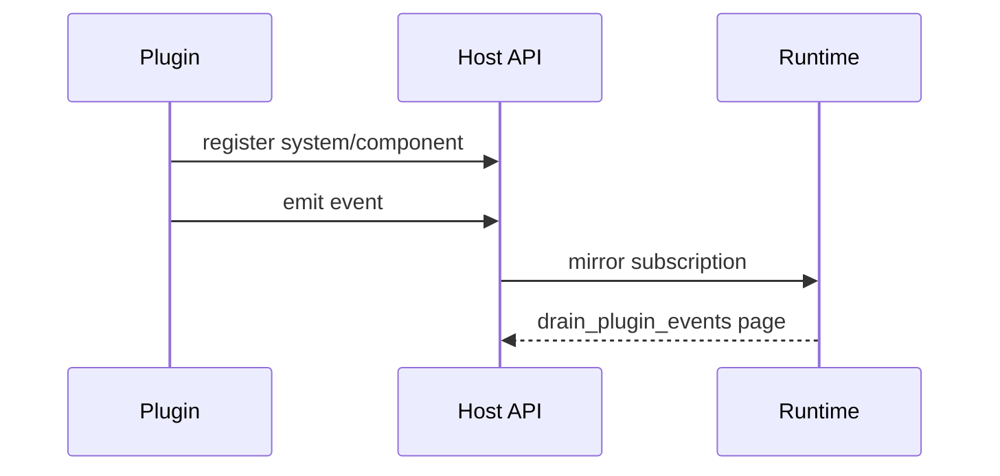
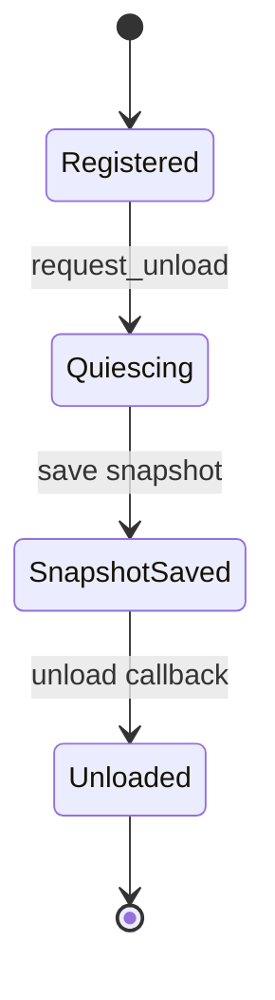

---
related_code:
  - zircon_runtime_interface/src/plugin_api.rs
  - zircon_runtime_interface/src/export/mod.rs
  - zircon_runtime_interface/src/manifest.rs
  - zircon_runtime_interface/src/runtime_api/session/plugin_event_mirror.rs
implementation_files:
  - zircon_runtime_interface/src/plugin_api.rs
  - zircon_runtime_interface/src/export
  - zircon_runtime_interface/src/manifest.rs
plan_sources:
  - user: 2026-09-09 为 ZirconEngine 构建引擎说明书级 Wiki
tests:
  - zircon_runtime_interface/src/tests/plugin_api_contracts.rs
doc_type: api-reference
---

# 插件 Entry、Host API 与事件镜像

## Entry 版本

稳定入口符号为 `zircon_plugin_entry_v1`、`v3`、`v4`。插件 manifest 的 `ZrPluginModuleDescriptorV1` 字段：`abi_version`、`kind`、`name`、`crate_name`、`target_modes`、`capabilities`。`target_modes` 与 capabilities 是编码列表，必须按 manifest 约定解析并拒绝未知必需能力。

## Host API V3/V4

`ZrHostApiV3` 与 `ZrHostApiV4` 都带 `abi_version`、`size_bytes`、`ecs`、`asset`、`event`、`bridge`、`diagnostics`。V4 的 ECS 字段升级为 `ZrHostEcsApiV2`，其他分区仍是 V1。表中 callback 都是 `Option`，缺失即能力不可用。

| 分区 | 方法 |
| --- | --- |
| ECS | register_system、register_component、spawn_command |
| Asset | request |
| Event | emit、drain |
| Bridge | call |
| Diagnostics | emit、metric |

## System registration

`ZrSystemRegistrationV2` 增加 `accesses`、`thread_affinity`。access 声明 `mode`（READ/WRITE）、`domain`（COMPONENT/RESOURCE）和 stable id；runtime 用它构建调度依赖。`MAIN_THREAD_ONLY` 不得在 worker 调用，`WORKER_SAFE` 也不保证无锁共享状态安全。

```rust
let registration = ZrSystemRegistrationV2::empty(2);
// 填写 system_id、stage/order、accesses、invoke、user_data 后再 register_system。
```

## Component descriptor

`ZrComponentDescV1` 以 `type_id`、`display_name`、`schema` 和 `storage_kind` 描述反射组件。schema 是数据契约，不是 Rust type name；type_id 必须稳定且全局唯一。重复注册、空 type_id 或不支持 storage kind 应返回 `InvalidArgument`。

## Plugin event mirror

runtime session 侧订阅返回 subscription handle；事件以 `ZrRuntimePluginEventDeliveryBatchV1` 分页，每页受 `ZR_RUNTIME_PLUGIN_EVENT_PAGE_MAX_DELIVERIES_V1` 和 `...MAX_ENCODED_BYTES_V1` 限制。delivery 包含 topic、publisher/plugin handle、sequence 与 payload。sequence 可跳号，跳号表示丢弃或分页边界，不可当作连续数组下标。



## 快照与卸载

`ZrPluginStateSnapshotApiV1` 的 save/restore callback 用于热重载；快照 bytes 必须由插件自有 allocator 和 owner token 管理。卸载前先取消 event subscription、停止 system 调度、保存 snapshot，再调用 unload。callback panic 必须由 `catch_native_callback_panic` 收敛为 `Panic`。

## 安全边界

ABI 表中不能出现 trait object、Rust slice、`String`、`Vec` 或引用。所有指针要求对齐、长度受限、生命周期覆盖同步调用。插件不可保存 runtime 内部地址；只保存 stable id、opaque handle 和序列化快照。

## 测试清单

测试 V3/V4 表形状、能力缺失、重复注册、线程亲和违规、事件分页、sequence 跳号、snapshot round-trip、unload 后 callback 和 panic 捕获。

## Entry report 字段

`ZrPluginEntryReportV1` 包含 `abi_version`、`plugin_id`、`package_manifest`、`modules`/`module_count`、`diagnostics` 和 `api` 指针。entry 返回前必须保证所有 borrowed slices 和 module array 在宿主读取期间有效；宿主应立即复制 manifest、diagnostics 和 descriptor 内容。

```rust
let report = unsafe { entry(&host_api) };
if report.api.is_null() || report.plugin_id.is_empty() {
    return Err(PluginLoadError::InvalidReport);
}
```

示例只展示空指针和空 id 检查；实际加载还需校验 report ABI、module_count 上限和每个 descriptor 的 size。

## Registration ordering

建议按以下顺序注册：component descriptors -> systems -> event topics -> asset handlers -> diagnostics hooks。system 的 `before/after/set_names` 依赖必须在调度图构建前完成；注册完成后再启动 frame loop。重复 stable id 应返回明确错误，不应覆盖旧 callback。

## Access declaration

`ZrNativeSystemAccessV1` 的 `stable_id` 必须与组件 type id 或资源 id 的 canonical 字符串一致。READ/WRITE 组合决定冲突边：同一 domain 的两个 WRITE 冲突，READ 与 WRITE 需要排序；不同 domain 不代表可以无序执行，因为插件可能在 callback 中桥接资源。

## Bridge call

`ZrHostBridgeApiV1::call` 用 byte slice 传递 bridge name/request/response。调用者应设置超时、最大响应 bytes 和 capability 检查；runtime 不应把 bridge 作为任意代码执行入口。错误响应仍需通过 owned buffer 释放。

## 事件分页与背压

订阅请求上限为 256 KiB/64 items；事件输出由 page max deliveries/encoded bytes 双重限制。宿主消费速度低于插件生产速度时，runtime 可丢弃旧事件并通过 sequence gap 暴露；插件不得依赖“每个事件必达”实现状态机，应提供 snapshot 或 query 修复路径。

## 卸载阶段图



quiescing 期间停止新事件、等待 in-flight system callback 返回；snapshot restore 失败时保留旧插件实例，禁止先卸载后恢复。

## 安全与审计

manifest capabilities 应在 entry 前做 allow-list；日志记录 plugin id、entry symbol、module ids、ABI versions、registration counts。永远不要把 `user_data` 当作可解引用地址，除非 callback owner 明确保证其生命周期。

## HostEcsApi 字段核对

`ZrHostEcsApiV1/V2` 的 callback 槽位分别为 `register_system`、`register_component`、`spawn_command`；V2 仅升级 system registration 签名。宿主应以 `abi_version + size_bytes` 判断可访问字段，不能假设 V2 的尾部字段在 V1 内存中存在。

## Native callback 约束

callback 输入输出均使用固定 DTO 与 byte slice；执行期间不得 unwind、阻塞等待同一 runtime 队列或修改注册表迭代器。耗时工作提交 operation，callback 只做校验和 enqueue。

## Event topic 设计

topic 由 namespace/name/stable_hash (`ZrEventTypeId`) 组成。namespace 和 name 用 canonical UTF-8，stable_hash 用于快速比较但不能替代字符串冲突检查。插件升级时保持 topic identity，改变 payload schema 则升级 topic version。

## Asset request

`ZrHostAssetApiV1::request` 只表达资源请求，不直接返回 GPU 对象。返回 bytes 后由 runtime asset layer 负责 decode、dependency 和 residency。插件必须处理 NotFound、LimitExceeded 和 BridgeNotEnabled。

## Snapshot 版本

snapshot bytes 自带插件 schema/version；restore 前验证 plugin id、BuildSet 和 schema。未知版本进入兼容失败路径并保留旧实例。快照不得包含 session handle、指针或线程 id 等瞬时身份。

## 安全测试

测试恶意 plugin：错误 size、超长 topic、空 callback、重复 component id、worker callback、panic、无限递归 event emit、超大 snapshot。预期是拒绝/隔离且宿主进程不崩溃。

## Descriptor 字段手册

| 字段 | 规则 |
| --- | --- |
| `abi_version` | descriptor 版本，必须被 host 支持 |
| `kind` | `ZrPluginModuleKind` raw 值 |
| `name` | 稳定显示名，受 native string limit |
| `crate_name` | 构建产物 identity，不作为权限依据 |
| `target_modes` | 目标模式编码列表 |
| `capabilities` | capability allow-list 输入 |

空 name、重复 module name、未知 kind 和超长列表必须在 entry report 验证阶段拒绝。

## Registration 错误传播

host callback 返回 `ZrStatus` 后，插件 entry 应停止后续注册并返回 diagnostics；不能继续运行部分注册的 system graph。宿主在失败时回滚已注册 descriptor 或销毁临时 plugin context。

## Event drain 消费

drain 返回空 page 是正常背压状态；page 中每个 delivery 的 payload bytes 解析失败时，宿主应记录 sequence 并跳过该 delivery，不能让整个 session 进入未定义状态。连续 decode failure 触发插件隔离。

## ABI 迁移

从 V3 到 V4 时先在测试环境加载双版本 plugin，再发布新的 entry symbol。旧 host 不得尝试把 V4 report cast 成 V3；新 host 可明确拒绝旧能力不足的 plugin。

## 运行时安全边界

插件代码不应持有 host API 指针超过 entry/注册阶段，除非文档明确其 owner 生命周期。卸载流程必须等待所有 callback 返回，避免 vtable/code segment 已卸载仍被调用。
