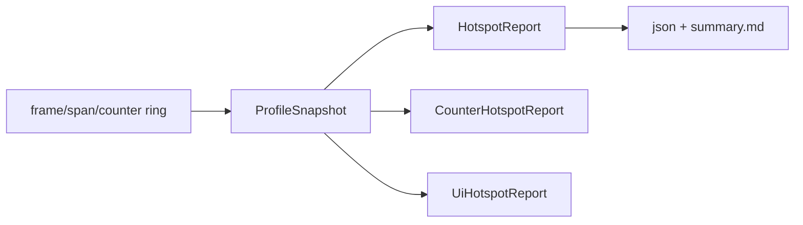

---
related_code:
  - zircon_runtime_interface/src/profiling.rs
  - zircon_runtime_interface/src/status.rs
  - zircon_runtime_interface/src/runtime_api/abi/api_table.rs
implementation_files:
  - zircon_runtime_interface/src/profiling.rs
  - zircon_runtime_interface/src/runtime_api/abi/api_table.rs
plan_sources:
  - user: 2026-09-09 为 ZirconEngine 构建引擎说明书级 Wiki
tests:
  - zircon_runtime_interface/src/profiling.rs
  - zircon_runtime/src/dynamic_api/tests
doc_type: api-reference
---

# Profiling 与诊断 DTO

## profile_control 能力

`profile_control` 是 `ZrRuntimeApiV8` optional slot。缺失时 UI 应隐藏 profiling 控件，而不是调用空函数。profile 输出目录默认 `target/zircon-profiles`，session id 默认 `local`；标准文件包括 `timeline.zrtrace.json`、`timeline.perfetto.json`、`hotspots.json`、`counter_hotspots.json`、`ui_hotspots.json`、`summary.md`。

## 配置字段

`ProfileCaptureConfig`：`session_id`、`output_root`、`max_frames`、`max_spans`、`max_counters`、`frame_budget_ms`、`include_perfetto`。`normalized()` 将 0 值替换为默认值并夹紧硬上限：默认 512 frames/16,384 spans/4,096 counters，capture 硬上限分别 4,096/131,072/32,768，frame budget 最大 60,000 ms。

```rust
let config = ProfileCaptureConfig {
    session_id: "editor".into(),
    output_root: "target/zircon-profiles".into(),
    max_frames: 256, max_spans: 8192, max_counters: 2048,
    frame_budget_ms: 16.67, include_perfetto: true,
}.normalized();
```

## Snapshot 字段

`ProfileSnapshot` 携带 session、output root、active、feature_enabled、frame budget、frames、spans、counters、recorder_retention。frame 记录 stream/name/index/start/duration/budget/over_budget；span 记录 id、parent、frame、category、path、depth；counter 记录 value/timestamp/frame。

Retention 使用 capacity/written/overwritten/retained 和 oldest/newest sequence 描述环形缓冲，`overwritten > 0` 表示历史数据已丢失，不应据此推断没有热点。

## 报告 DTO

`HotspotEntry` 聚合 total/avg/p95/max、count、frame_count、over_budget_count；`CounterHotspotEntry` 聚合数值 counter；`UiScenarioHotspot` 细分 invalidation、paint、layout、GPU upload、cache hit/miss 等计数。报告中的 `hints`/`alerts` 是诊断建议，不是稳定机器可执行指令。



## 预算与性能

profile 本身应受 25,000 us request limit；capture 输出受 16 MiB/65,536 items response limit。生产模式建议降低 spans/counters，只在问题复现窗口开启 `active`。读取报告应使用流式 JSON，避免在 UI 线程构造全量字符串。

## 负面案例

* feature disabled 与 active false 是不同状态：前者表示编译能力缺失，后者表示运行时未录制。
* frame budget 非有限或负值应归一化/拒绝，不应生成 NaN 报告。
* 环形缓冲覆盖后 p95 只代表 retained 样本，报告应显示 retention 统计。
* 不存在 profile_control 时返回 `UnsupportedVersion`，不要 fallback 到隐式文件写入。

## 测试清单

测试 normalized 默认/硬上限、环形覆盖计数、p95 样本、feature disabled、Perfetto 开关、输出路径和超预算状态。

## 时间与聚合语义

`start_us`、`duration_us`、`timestamp_us` 使用单调 profile 时钟的微秒值；不要与 wall-clock 日期直接相减。`frame_index` 从 recorder 启动后递增，丢帧不补号。p95 是 retained 样本的近似/计算值，样本不足时应显示 count，而不是伪造 0。

## 采集策略

短问题使用 `max_frames=128`、适量 spans；长尾问题扩大 frames 并保留 counters。打开 `include_perfetto` 会增加写盘成本，应在复现窗口启用。录制停止后再读取 snapshot，避免读取正在扩展的 Vec。

```rust
fn capture_window(api: &ProfileApi) -> Result<ProfileSnapshot, ProfileError> {
    api.start(ProfileCaptureConfig { max_frames: 256, ..Default::default() })?;
    run_repro_case();
    api.stop()?;
    api.snapshot()
}
```

`ProfileApi` 仅是应用层包装示意；动态 ABI 通过 `profile_control` 函数指针传入编码 request。

## UI hotspot 读取

`UiScenarioHotspot` 的字段按域分组：host invalidation、paint/presentation、asset editor pane、cache、GPU upload、software fallback。比较两个报告时先对齐 `scenario` 和 `frame_count`，再比较 p95/总量；不同采样窗口不能直接比较绝对 bytes。

## 输出文件契约

* `timeline.zrtrace.json`：runtime 原生 timeline。
* `timeline.perfetto.json`：`include_perfetto=true` 时生成。
* `hotspots.json`：span 聚合。
* `counter_hotspots.json`：counter 聚合。
* `ui_hotspots.json`：UI scenario 聚合。
* `summary.md`：面向人的摘要和 hints。

写入采用临时文件后 rename，避免进程中断留下半个 JSON。输出目录路径应是宿主允许的 workspace 子目录，不接受任意系统根路径。

## 诊断与隐私

span name/path 可能包含资产路径，summary 发布前应脱敏。插件不得把用户文本写进 counter name。profile 文件不属于 ABI allocation，不使用 `release_allocation`；由文件系统生命周期管理。

## 回归门槛

将 frame p95、over_budget_count、GPU upload bytes、software fallback count 纳入 CI 趋势；只在基线变化超过阈值时失败，避免把采样噪声当功能错误。每次阈值调整记录 profile config 和机器信息。

## ProfileControl 请求形状

动态 profile control 通过 V2 callback 接收编码 request；请求应表达 start/stop/snapshot、session id、config 和输出策略。callback 返回 `ZrStatus`，snapshot/报告通过 owned allocation 或文件路径交付，具体 envelope 以 profiling 模块实现为准。

## Counter 命名与采样丢失

counter name/path 使用稳定 ASCII namespace；单位写入 name 或报告元数据，不能让同名 counter 在不同单位间复用。`overwritten` 增长时在 summary 中报告 retention ratio，UI 应显示样本被覆盖，而不是把缺失 span 当作零耗时。

## 性能回归示例

```rust
assert!(report.hotspots.iter().all(|h| h.avg_us <= h.max_us));
assert!(report.hotspots.iter().all(|h| h.count >= h.frame_count));
```

这些断言是报告一致性检查，不保证业务性能阈值；阈值由项目基线决定。

## 文件清理

profile session 结束后可删除旧 timeline，但保留 summary、配置和版本信息。清理任务不得删除当前 active session 的目录；路径必须限制在 `output_root` 下。

## 字段不变量

* `duration_us >= 0`，非空样本中 `max_us >= p95_us >= avg_us`。
* `over_budget_count <= count`，`frame_count <= count`。
* `retained <= capacity`，覆盖后必须报告 `overwritten`。
* `frame_budget_ms` 必须有限且大于 0。

## 采集 API C 形状

```c
typedef ZrStatus (*ZrRuntimeProfileControlFnV2)(
    ZrRuntimeSessionHandle session, ZrByteSlice request,
    ZrOwnedResultV2 *response);
```

request/response 的具体 envelope 由 profiling 实现定义；宿主仍必须执行 slice limit、输出 carrier 和 release 检查。

## 报告比较与恢复

比较前固定机器、BuildSet、frame budget、采样容量和 scenario。输出目录不可写时返回错误并保持 active 状态可查询；半文件不能被下一次报告当作完整 JSON。

## Profile 测试案例

建立空 session、单 frame、超 budget frame、父子 span、counter 覆盖、feature disabled、输出目录不可写、Perfetto 关闭/开启等 fixture，并断言文件集合、schema/version 和 retention 字段。
