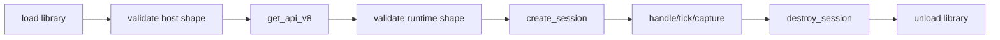

---
related_code:
  - zircon_runtime_interface/src/runtime_api/abi/api_table.rs
  - zircon_runtime_interface/src/runtime_api/abi/api_shape.rs
  - zircon_runtime_interface/src/runtime_api/abi/host_api_shape.rs
  - zircon_runtime_interface/src/runtime_build_set/mod.rs
  - zircon_runtime_interface/src/version.rs
implementation_files:
  - zircon_runtime_interface/src/runtime_api/abi/api_table.rs
  - zircon_runtime_interface/src/runtime_api/abi/api_shape.rs
plan_sources:
  - user: 2026-09-09 为 ZirconEngine 构建引擎说明书级 Wiki
tests:
  - zircon_runtime_interface/src/runtime_api/abi/api_shape_tests.rs
  - zircon_runtime_interface/src/runtime_api/abi/host_api_shape_tests.rs
doc_type: api-reference
---

# ZrRuntimeApiV8 表与握手

## 定位

`ZrRuntimeApiV8` 是动态库唯一公开的运行时入口。`repr(C)`、字段顺序、函数指针签名和 `size_bytes` 均属于 **内部 lockstep ABI**：宿主与 runtime 必须来自同一 BuildSet。它不是面向第三方的语义版本协商协议，不能通过“忽略尾部字段”来兼容。

入口符号是 `ZR_RUNTIME_GET_API_SYMBOL_V8`（以 NUL 结尾的字节串），表版本为 `ZIRCON_RUNTIME_API_VERSION_V8`。加载流程必须先构造 `ZrHostApiV1`，再调用 `ZrRuntimeGetApiFnV8`。

## 表头与槽位

| 字段 | 类型 | 约束 |
| --- | --- | --- |
| `abi_version` | `u32` | 必须等于 runtime API V8 常量 |
| `size_bytes` | `usize` | 必须精确等于 `size_of::<ZrRuntimeApiV8>()` |
| 函数槽位 | `Option<unsafe extern "C" fn(...) -> ZrStatus>` | required 槽位不可为 `None`，optional 按能力分区判断 |

Required 槽位：`create_session`、`destroy_session`、`release_allocation`、`handle_event`、`capture_frame`、`submit_highlight_set`、`tick_frame`、`subscribe_plugin_event`、`unsubscribe_plugin_event`、`drain_plugin_events`、`submit_operation`、`poll_operation`、`harvest_operation`、`query_world`、`watch_world`、`unwatch_world`、`drain_world_invalidations`、`request_viewport_pick`、`poll_viewport_pick`、`cancel_viewport_pick`。

Optional 槽位：`capture_accessibility_tree`、`bind_viewport_surface`、`unbind_viewport_surface`、`present_viewport`、`profile_control`、`drain_host_requests`。native present 三槽必须同时存在；否则宿主只能使用 frame capture 或软件 presenter。

## 函数签名速查

```rust
pub type ZrRuntimeGetApiFnV8 = unsafe extern "C" fn(*const ZrHostApiV1) -> *const ZrRuntimeApiV8;
pub type ZrRuntimeCreateSessionFnV3 = unsafe extern "C" fn(ZrRuntimeSessionConfigV3, *mut ZrRuntimeSessionHandle) -> ZrStatus;
pub type ZrRuntimeDestroySessionFnV1 = unsafe extern "C" fn(ZrRuntimeSessionHandle) -> ZrStatus;
pub type ZrRuntimeReleaseAllocationFnV2 = unsafe extern "C" fn(ZrRuntimeSessionHandle, ZrRuntimeAllocationId) -> ZrStatus;
pub type ZrRuntimeHandleEventFnV1 = unsafe extern "C" fn(ZrRuntimeSessionHandle, ZrRuntimeEventV1) -> ZrStatus;
pub type ZrRuntimeCaptureFrameFnV2 = unsafe extern "C" fn(ZrRuntimeSessionHandle, ZrRuntimeFrameRequestV1, *mut ZrRuntimeFrameV2) -> ZrStatus;
pub type ZrRuntimeTickFrameFnV2 = unsafe extern "C" fn(ZrRuntimeSessionHandle, *mut ZrRuntimeFrameDemandV1) -> ZrStatus;
pub type ZrRuntimeQueryWorldFnV2 = unsafe extern "C" fn(ZrRuntimeSessionHandle, ZrByteSlice, *mut ZrOwnedResultV2) -> ZrStatus;
```

视口 surface、plugin event、operation、world watch 和 host request 的完整签名以源码为准；文档中的 `V1/V2/V3` 是 DTO 的独立版本族，不代表可以混用字段。

## C 侧握手

```c
typedef const struct ZrRuntimeApiV8 *(*ZrRuntimeGetApiFnV8)(const ZrHostApiV1 *host);
ZrHostApiV1 host = { .abi_version = 1, .size_bytes = sizeof(ZrHostApiV1),
                     .diagnostics_sink = NULL, .fetch_resource = NULL };
const ZrRuntimeApiV8 *api = get_api(&host);
if (!api || api->abi_version != ZIRCON_RUNTIME_API_VERSION_V8 ||
    api->size_bytes != sizeof(*api)) return ABI_REJECTED;
if (!api->create_session || !api->destroy_session) return ABI_REJECTED;
```

调用前应使用 `validate_runtime_api_v8_shape` 和 `validate_runtime_host_api_v1_shape`；验证失败时不可读取任何可选函数指针。

## 生命周期图



## 负面路径

* 空 API 指针、未对齐指针、错误版本、非精确尺寸均为握手失败，不得猜测旧表。
* `Option<fn>` 为 `None` 返回 `UnsupportedVersion` 或能力缺失；不能把缺失的 accessibility 槽伪装成空树成功。
* API 表指针只在动态库 owner 存活期间有效；宿主必须复制函数指针并保持 library owner。
* 任何 callback panic 必须在 runtime 边界捕获为 `ZrStatusCode::Panic`，宿主不能跨 FFI unwind。

## 测试清单

1. 断言 required/optional 名称集合与 BuildSet 生成集合一致。
2. 构造错误 `size_bytes`、错误 `abi_version` 和缺失槽位，确认验证器拒绝。
3. 构造只存在一个 native-present 槽的表，确认宿主回退 capture。
4. 在库 owner drop 后禁止调用任何已缓存函数指针。

## 逐槽位调用约定

| 槽位 | 输入 | 输出 | 典型失败 |
| --- | --- | --- | --- |
| `create_session` | `ZrRuntimeSessionConfigV3`、可写 handle | session handle | profile/project 无效、能力拒绝 |
| `destroy_session` | session | `ZrStatus` | allocation 未释放、正在 callback |
| `release_allocation` | session、allocation | `ZrStatus` | 重复释放、跨 session |
| `handle_event` | session、event DTO | `ZrStatus` | payload 超限、未知 kind |
| `capture_frame` | session、frame request | `ZrRuntimeFrameV2` | 尺寸超限、viewport 不存在 |
| `tick_frame` | session、可写 frame demand | demand | 时间跳变、会话已销毁 |
| `query_world` | session、JSON slice | owned result | query malformed、预算超限 |
| `watch_world` | session、JSON slice | watch token | selector 无效、预算超限 |
| `drain_world_invalidations` | session | owned result | 无效 session |
| `submit_operation` | session、operation request | operation handle | 重复 id、权限拒绝 |
| `poll_operation` | session、operation handle | operation status | handle 不存在 |
| `harvest_operation` | session、operation handle | owned result | 尚未终态、已 harvest |
| `request_viewport_pick` | session、pick request | ticket | 坐标越界、队列满 |
| `poll_viewport_pick` | session、ticket | pick result | ticket 过期 |
| `cancel_viewport_pick` | session、ticket | status | 已完成或不存在 |

## 空槽与能力矩阵

宿主启动时把 optional 槽位映射为能力矩阵：

```rust
struct RuntimeCapabilities {
    accessibility: bool,
    native_present: bool,
    profiling: bool,
    host_requests: bool,
}
let caps = RuntimeCapabilities {
    accessibility: api.capture_accessibility_tree.is_some(),
    native_present: api.bind_viewport_surface.is_some()
        && api.unbind_viewport_surface.is_some()
        && api.present_viewport.is_some(),
    profiling: api.profile_control.is_some(),
    host_requests: api.drain_host_requests.is_some(),
};
```

能力变化只允许在 session 创建前读取；运行期间 callback 槽位不得热替换。UI 层应根据矩阵禁用命令，并把原因记录到诊断面板。

## 并发与线程

表本身是 immutable，可在多个线程读取；具体函数是否线程安全由 session 实现约束。默认策略是同一 session 的 tick、event、destroy 串行化，query/poll 可在 runtime 明确声明时并行。宿主不得从 callback 内重入会改变 session 生命周期的槽位。

## C 错误处理模板

```c
ZrStatus st = api->tick_frame(session, &demand);
if (st.code != ZR_STATUS_OK) {
    char diag[4097];
    size_t n = st.diagnostics.len < 4096 ? st.diagnostics.len : 4096;
    memcpy(diag, st.diagnostics.data, n);
    diag[n] = '\0';
    log_runtime_error(st.code, diag);
}
```

diagnostics 是 borrowed，复制后才能异步写日志。状态码未知时按 `Error` 处理，保留 raw `u32` 供诊断。

## 版本升级流程

1. 在接口 crate 增加新 `Vn` 表与 BuildSet 槽集合。
2. 更新 loader 的精确 symbol 和 shape 验证。
3. 为每个 DTO 增加跨版本测试和拒绝未知字段测试。
4. 同时发布 runtime、app、host 三类制品；sidecar digest 必须一致。
5. 删除旧表 fallback，完成硬切后再更新本页。

## 调用前后置条件矩阵

| API | 前置条件 | 成功后置条件 | 禁止行为 |
| --- | --- | --- | --- |
| `create_session` | config 版本正确、输出指针可写 | 输出非零 session | 使用未初始化 handle |
| `handle_event` | event bytes 在调用期间有效 | runtime 消费或拒绝事件 | 保存 event 指针 |
| `capture_frame` | request 尺寸合法 | frame carrier shape 合法 | 读取未初始化 frame |
| `tick_frame` | demand 指针可写 | demand 写回下一帧策略 | 在 callback 中 destroy |
| `query_world` | JSON slice 通过 limit | allocation 可解码 | 释放前缓存 data 指针 |
| `watch_world` | registration JSON 合法 | token 归属当前 session | 跨 session unwatch |
| `submit_operation` | operation id 非空 | handle 可 poll | 重复提交同 id |
| `harvest_operation` | phase 为终态 | output 可 release | 非终态 harvest |
| `request_viewport_pick` | viewport/pixel 合法 | ticket 非零 | 复用旧 ticket |
| `poll_viewport_pick` | ticket 属于 session | result disposition 已初始化 | 读取旧命中 |

## Rust 统一错误包装

```rust
enum RuntimeCallError { Status(ZrStatusCode, String), MissingCapability(&'static str), BadCarrier }
fn check(status: ZrStatus, carrier_ok: bool) -> Result<(), RuntimeCallError> {
    if !carrier_ok { return Err(RuntimeCallError::BadCarrier); }
    if status.code == ZrStatusCode::Ok as u32 { Ok(()) }
    else { Err(RuntimeCallError::Status(ZrStatusCode::from_raw(status.code), read_diag(status))) }
}
```

应用层包装必须先检查 carrier 再解析 bytes；不能因为状态为 Ok 就跳过长度、allocation 和 UTF-8 校验。

## ABI 取证清单

发布前保存 `size_of::<ZrHostApiV1>()`、`size_of::<ZrRuntimeApiV8>()`、每个字段 offset、required/optional slot 名称快照、callback C header 和目标架构。它们用于 loader rejection 的可重复诊断。

## 发布验收记录

发布包必须同时携带 runtime library、host loader、interface crate 版本和 BuildSet digest。验收脚本应加载真实动态库，读取 entry symbol，执行 shape validator，并创建/销毁一次最小 session。

## 最小 smoke 流程

```text
load -> get_api_v8 -> validate -> create_session -> tick_frame -> destroy_session
```

smoke 失败时先分离库加载失败、表形状失败、session 配置失败三类，不要把所有错误归为 ABI 不兼容。

## 观测信号

记录每个槽位调用计数、状态码分布、平均耗时、最大 payload、allocation outstanding 和 capability missing。高错误率时保留最近一次 request 的 schema/version，不保留敏感正文。

## 线程模型声明

宿主包装器应公开 `&RuntimeApi` 可跨线程共享的只读能力，以及 session 操作所需的串行 guard。若 runtime 实现声明 query 可并行，仍需保证同一 output carrier 不被并发写入。

## 停机语义

收到 `Panic`、`BridgeNotEnabled` 或连续 `Error` 时，应用层可将 session 标记为 fused：停止 event/tick、释放 owned allocations、尝试 destroy，最后卸载库。fused session 不自动恢复到半初始化状态。
