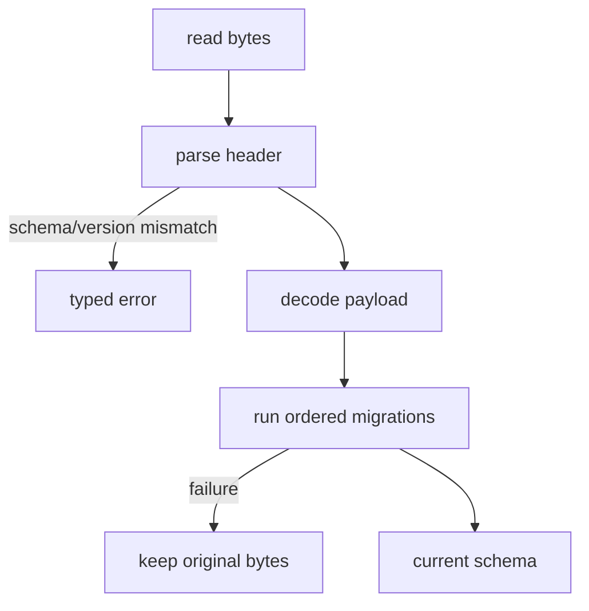

---
related_code:
  - zircon_runtime_interface/src/serialization/mod.rs
  - zircon_runtime_interface/src/serialization/versioned_schema.rs
  - zircon_runtime_interface/src/serialization/payload_header.rs
  - zircon_runtime_interface/src/serialization/schema_id.rs
  - zircon_runtime_interface/src/serialization/budget.rs
  - zircon_runtime_interface/src/version.rs
  - zircon_runtime_interface/src/status.rs
implementation_files:
  - zircon_runtime_interface/src/serialization
  - zircon_runtime_interface/src/version.rs
plan_sources:
  - user: 2026-09-09 为 ZirconEngine 构建引擎说明书级 Wiki
tests:
  - zircon_runtime_interface/src/serialization/tests
  - zircon_runtime_interface/src/tests/abi_safety_contracts.rs
doc_type: api-reference
---

# 序列化、状态码与兼容策略

## ABI 与持久化分离

动态 API 的 JSON DTO 是瞬时 wire message；项目/资产持久化必须使用 `VersionedSchema`、`PayloadHeader` 和 migration chain。不要把 `repr(C)` 内存或 ABI JSON 直接当长期资产格式。

```rust
pub trait VersionedSchema: Sized {
    const SCHEMA: SchemaId;
    const VERSION: u32;
    fn migrations() -> &'static MigrationChain<Self>;
}
```

`SchemaId` 最大 128 bytes，必须满足命名校验；header 先验证 schema/version，再解码 payload，迁移步骤必须严格递增且无重复。

## Format 与预算

canonical text 是 pretty JSON 且只有一个结尾换行；binary 使用受控 header 和 payload。项目 manifest 最大 4 MiB、嵌套深度 32、table 16,384、array 65,536。JSON 通用深度上限 128。浮点写入拒绝 NaN/Infinity。

## 状态码

`ZrStatusCode` 原始值通过 `from_raw` 收敛到 `Error`、`UnsupportedVersion`、`InvalidArgument`、`NotFound`、`CapabilityDenied`、`Panic`、`BridgeNotEnabled`、`LimitExceeded` 等。`ZrStatus { code, diagnostics }` 的 diagnostics borrowed，最大 4 KiB，必须在本次调用返回后同步复制。

| 码 | 是否重试 | 正确动作 |
| --- | --- | --- |
| `Ok` | 否 | 校验输出 carrier |
| `InvalidArgument` | 否 | 修正字段/指针 |
| `LimitExceeded` | 条件 | 分页、减小 payload |
| `UnsupportedVersion` | 否 | 重新匹配 BuildSet |
| `NotFound` | 否 | 检查生命周期 |
| `Error` | 条件 | 读取诊断后决定 |
| `Panic` | 否 | 融合/重启会话 |

## Rust 写入与读取

```rust
let bytes = write_versioned(&document, Format::Text)?;
let loaded = load_versioned::<Document>(&bytes, Format::Text)?;
```

读取未来版本应产生明确的 unsupported error；不能截断未知字段后继续写回，因为这会破坏 forward data。迁移失败必须保留原始 bytes，避免半迁移覆盖。

## 兼容矩阵

* API table：V8 精确版本和精确 size。
* DTO：各自 `V1/V2/V3` 版本字段独立校验。
* plugin entry：v1/v3/v4 是不同符号，不自动 fallback。
* 持久化 schema：按 schema id/version migration，与 table 版本独立。

## 失败时序



## 测试清单

覆盖 canonical newline、未知字段、schema id 越界、未来版本、重复/乱序 migration、非有限浮点、manifest 预算和未知状态码收敛。

## SchemaId 命名

schema id 使用稳定 ASCII 路径（例如 `zircon.project-manifest`），长度不得超过 `MAX_SCHEMA_ID_BYTES`。禁止把 crate 版本、绝对路径或随机 UUID 拼入 schema id；这些值会让迁移链失去可寻址性。

## MigrationChain 约束

迁移步骤按 `from_version -> to_version` 严格递增，不能跳过当前版本声明之外的隐式步骤。每一步应是纯函数或事务式转换：失败时返回 typed error，原始 payload 仍可重试。新增字段应提供默认值；删除字段应在迁移中显式丢弃并记录诊断。

```rust
static CHAIN: MigrationChain<GameSettings> = MigrationChain::new(&[
    // 迁移函数的具体签名以 migration 模块公开定义为准。
]);
```

上例用于说明链是静态、可审计的值；不要把闭包或捕获运行时状态放入 migration chain。

## Text 与 binary 选择

| 场景 | 格式 | 原因 |
| --- | --- | --- |
| 项目清单、人工审阅 | canonical text | 可 diff、稳定换行 |
| 大型资产、快速加载 | binary | 受控 header、较小体积 |
| 动态 ABI 消息 | JSON DTO | 与表版本解耦 |
| 调试快照 | text + summary | 便于故障回放 |

格式不是兼容性的替代品；同一 schema/version 的 text 与 binary 都必须经过相同语义校验。

## Status 诊断读取

```rust
fn status_message(status: ZrStatus) -> String {
    unsafe { status.diagnostics.checked_slice(4 * 1024) }
        .map(|bytes| String::from_utf8_lossy(bytes).into_owned())
        .unwrap_or_else(|_| "invalid diagnostics".into())
}
```

diagnostics 可能包含非 UTF-8；lossy 记录不能改变原始状态码。生产系统应同时保存 raw code 和截断标志。

## Unknown fields 与 forward data

启用 `deny_unknown_fields` 的 DTO 收到新字段时应返回 `UnsupportedVersion` 或 decode error。持久化 loader 不应“读后写”未知字段，否则旧版本工具会静默破坏未来数据；应提供只读查看或原样保留策略。

## 兼容性测试矩阵

每个 schema 测试 current/current、previous/current、future/current、malformed header、truncated payload、unknown field、duplicate migration。每个 ABI DTO 测试错误 version、错误 size、空 carrier、超预算和未知 enum raw 值。

## `PayloadHeader` 字段

| 字段 | 作用 |
| --- | --- |
| schema id | 路由到正确 `VersionedSchema` |
| schema version | 选择 migration 起点 |
| format marker | 区分 text/binary 解码器 |
| payload length/check | 截断与完整性校验 |

header 不是安全边界；解码器仍需检查 nesting、array/table 和处理时间预算。长度字段超过文件实际长度必须立即返回 truncated error。

## WriteError 与 LoadError

写入失败包括 schema 无效、非有限浮点、sink I/O、预算超限和序列化值不支持。读取失败包括 header malformed、schema mismatch、future version、migration failure、decode error 和 budget exceeded。

## 原子更新方案

```text
write temp -> flush -> fsync (按平台策略) -> rename -> retain backup
```

rename 前任何错误都保留原文件。迁移写回必须在新文件完成并通过再次 load 验证后替换旧版本。

## Schema 登记表

每个 schema 记录 owner、当前 version、支持的旧版本、migration fixture、废弃字段和下一个 breaking 版本。ABI V8 的升级不能替代 schema migration，反之亦然。

## `SchemaId` API

```rust
let id = SchemaId::new("zircon.example.settings");
assert_eq!(id.as_str(), "zircon.example.settings");
```

`SchemaId::new` 只接受符合源码校验的稳定字符串；失败通过 `SchemaIdError` 表达。不要在 schema id 中使用大小写不一致、尾随空格、绝对路径或动态 locale。

## VersionedSchema 最小实现

```rust
impl VersionedSchema for Settings {
    const SCHEMA: SchemaId = SchemaId::new("zircon.example.settings");
    const VERSION: u32 = 2;
    fn migrations() -> &'static MigrationChain<Self> { &SETTINGS_MIGRATIONS }
}
```

`MigrationChain` 必须是静态值，迁移函数不能访问网络、时间或当前 session。这样同一输入在 CI、editor 和 runtime 中才能得到相同结果。

## Binary header 检查顺序

```text
magic -> format -> schema id length -> schema id bytes -> version -> payload length -> payload
```

每一步都检查剩余输入长度和预算；不能根据 payload length 分配未经限制的 Vec。binary malformed 与 schema mismatch 应区分诊断。

## Canonical text 规则

canonical writer 固定字段顺序来自 serde 结构定义，缩进和结尾换行稳定。map key 需要确定性排序；浮点拒绝 NaN/Infinity。文本比较应基于 UTF-8 bytes，不能按操作系统换行自动重写。

## Migration 示例

```text
v1 { volume } -> v2 { volume, muted=false }
v2 -> current decode
```

每一步迁移前验证输入 version，输出 version 必须恰好为下一步起点。重复执行已完成迁移应被拒绝或识别为 no-op，不能再次改变值。

## 读取恢复

| 错误 | 保留原 bytes | 是否自动重试 |
| --- | --- | --- |
| header truncated | 是 | 否，等待完整文件 |
| unknown schema | 是 | 否 |
| future version | 是 | 否，交给新工具 |
| migration failed | 是 | 仅修复后 |
| transient I/O | 是 | 可重试 |
| budget exceeded | 是 | 缩小/升级策略 |

## 状态码原始值

`ZrStatusCode::from_raw` 对未知值返回 `Error` 语义，但宿主应保留 raw u32。诊断 slice 读取失败（null、超过 4 KiB）不能覆盖原始 status。

## 资产与 ABI 交叉边界

资产文件的 schema/version 不能由 `ZrRuntimeApiV8.abi_version` 代替。反向也不成立：升级 project manifest format 不会自动升级 runtime table。发布清单应同时列出两套版本。

## Migration 测试模板

```rust
#[test]
fn v1_fixture_migrates_to_current() {
    let bytes = include_bytes!("fixtures/settings-v1.json");
    let value = load_versioned::<Settings>(bytes, Format::Text).unwrap();
    assert_eq!(value.volume, 0.8);
    assert!(!value.muted);
}
```

另测 future version、重复步骤、乱序步骤、未知字段、超深 JSON、超大数组和非有限浮点。

## 发布前 checklist

* schema id 与 owner 登记。
* current version 与 migration chain 对齐。
* text/binary round-trip。
* 原子写入与 backup 恢复。
* loader 错误诊断不泄露 payload。
* ABI/DTO 版本分离并在 Wiki 导航中可查。
