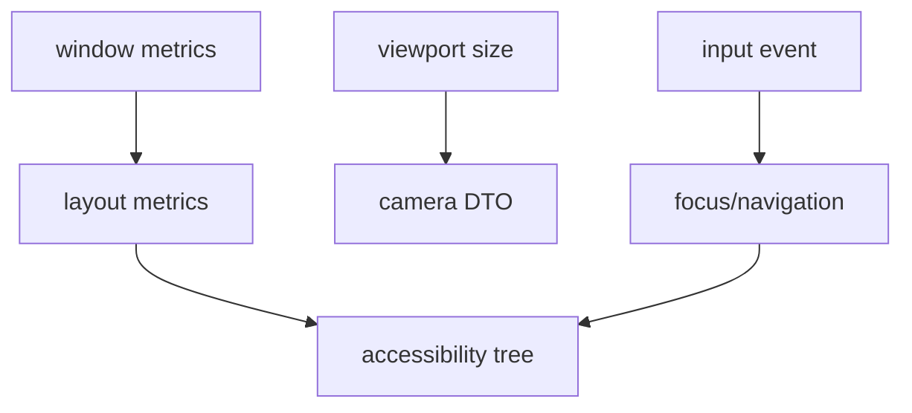

---
related_code:
  - zircon_runtime_interface/src/ui/accessibility.rs
  - zircon_runtime_interface/src/ui/layout/metrics.rs
  - zircon_runtime_interface/src/ui/layout/style.rs
  - zircon_runtime_interface/src/ui/focus.rs
  - zircon_runtime_interface/src/ui/navigation.rs
  - zircon_runtime_interface/src/runtime_api/session/camera.rs
  - zircon_runtime_interface/src/runtime_api/session/viewport.rs
implementation_files:
  - zircon_runtime_interface/src/ui
  - zircon_runtime_interface/src/runtime_api/session/camera.rs
plan_sources:
  - user: 2026-09-09 为 ZirconEngine 构建引擎说明书级 Wiki
tests:
  - zircon_runtime_interface/src/ui
  - zircon_runtime_interface/src/runtime_api/session/editor_transform_tests.rs
doc_type: api-reference
---

# UI、Accessibility、Transform 与 Camera DTO

## DTO 边界

UI interface 暴露布局、焦点、导航、文本和 accessibility 的数据模型；动态 API 只传输 `ZrRuntimeAccessibilityTreeRequestV1`、`ZrRuntimeViewportCameraV1`、`ZrRuntimeTransformV1` 等固定 DTO。UI 节点 arena、Rust trait 和 GPU resource 不跨 ABI。

## Accessibility tree

capture 请求通过 optional `capture_accessibility_tree` 槽位返回 `ZrOwnedResultV2`。输出预算为 16 MiB/65,536 items，节点应包含稳定 node id、role、name、bounds、state、children。action 反向走 `ZR_RUNTIME_EVENT_KIND_ACCESSIBILITY_ACTION_V1`，宿主必须验证 node id 属于当前 tree generation。

```rust
let request = ZrRuntimeAccessibilityTreeRequestV1::default();
let mut out = ZrOwnedResultV2::empty();
let status = unsafe { api.capture_accessibility_tree.unwrap()(session, request, &mut out) };
```

## Layout 与 focus

`UiLayoutMetrics` 描述 scale、flow direction、viewport size；`UiLayoutStyle` 包含 display、flex/grid、gap、edges、position、overflow。`UiFocus`/navigation DTO 用稳定 node path 和 route phase 表达焦点移动。尺寸必须是有限非负值；百分比和 auto 只能在对应 layout backend 支持时使用。

## Camera

`ZrRuntimeViewportCameraV1` 的投影常量为 perspective/orthographic；请求预算 4 KiB、1 item、1,000 us。字段包含 viewport handle、projection、position、orientation、near/far 和视口尺寸（具体字段以 `camera.rs` 为准）。near/far 必须满足 `near > 0` 且 `far > near`；正交尺寸不能为 0。



## Transform 写入

`ZrRuntimeEditorTransformWriteV1` 通过事件提交 phase（begin/update/end）和 `ZrRuntimeTransformV1`。写入必须携带 world replacement epoch；epoch 不匹配返回 `ZrRuntimeEditorTransformError`，调用方应重新 query snapshot。旋转四元数需归一化，scale 不应为 NaN。

## 视口 metrics

`ZrRuntimeViewportSizeV1` 表示像素宽高；`ZrRuntimeViewportMetricsV1` 还携带 scale、focused/occluded 等窗口状态。尺寸变化事件先于下一帧 capture；宿主收到 resize 后更新 surface，再 present。

## 负面案例

* accessibility optional 槽缺失：显示“不可用”能力，不返回空树成功。
* tree generation 变化后使用旧 action：拒绝，防止节点复用导致误操作。
* camera projection 未知 raw 值：`UnsupportedVersion`。
* viewport width/height 超过 16,384 或 RGBA 超 256 MiB：`LimitExceeded`。

## 测试清单

测试树 generation、节点 bounds、focus route、camera 参数边界、resize 顺序、transform epoch 冲突和无障碍槽位缺失。

## Accessibility node 语义

node id 只在当前 capture generation 内稳定；role/name/state 是供平台适配器使用的语义字段，不能直接当渲染材质或 ECS component id。children 顺序应与视觉/键盘顺序一致；隐藏节点可保留但必须标记不可操作。

## Focus 与导航

导航请求先经过 focus scope，再按方向/Tab 顺序选择候选节点。宿主收到 `ACCESSIBILITY_ACTION` 时应检查 action kind、node id、tree generation 和当前 focus owner。action 成功后 runtime 产生新的 focus/paint invalidation，宿主不应自行改写焦点树。

## Layout 数值

`UiDimension` 的 auto/length/percent 只能在对应 backend 支持时解析；长度和 gap 使用逻辑像素，最终乘以 `UiLayoutMetrics.scale` 转成物理像素。负 margin 是否允许由 style 字段语义决定，非法 NaN/Infinity 一律拒绝。

## Camera 与投影

perspective 使用 near/far、视场相关参数；orthographic 使用视图尺寸。投影切换必须伴随 viewport camera event，下一次 pick 使用新矩阵。相机 DTO 的数组字段按 `[f32; 3]`/`[f32; 4]` 固定顺序传输，不要序列化为可变长度数组。

```rust
let camera = ZrRuntimeViewportCameraV1 {
    // 字段顺序和默认值以 camera.rs 当前定义为准。
};
```

此代码仅展示固定布局初始化位置；在实际代码中应使用源码提供的 constructor/default，避免漏填新增字段。

## Transform 编辑协议

begin 阶段建立 operation/transaction participant；update 阶段可合并连续鼠标拖动；end 阶段提交并触发 world invalidation。若收到 `ZrRuntimeEditorTransformError`，UI 应回滚 preview 并重新 query snapshot，而不是继续发送 update。

## Surface 与 metrics 顺序

resize -> 更新 `ZrRuntimeViewportSizeV1` -> 重新 bind surface（如 native surface 失效）-> capture/present。scale factor changed 事件先于依赖 DPI 的 cursor/IME coordinate 转换；窗口 destroyed 后所有 metrics 只读缓存失效。

## 负向测试扩展

| 输入 | 预期 |
| --- | --- |
| tree action stale generation | 拒绝并给诊断 |
| node id unknown | `NotFound` |
| camera far <= near | `InvalidArgument` |
| NaN transform quaternion | `InvalidArgument` |
| scale factor <= 0 | `InvalidArgument` |
| accessibility output > 16 MiB | `LimitExceeded` |
| projection raw unknown | `UnsupportedVersion` |

## 可观测性

记录 accessibility generation、节点数、action reject reason、layout backend/fallback、camera projection、resize 次数和 transform epoch。日志中不要输出完整 accessibility text；需要诊断时使用 hash 或截断摘要。

## Accessibility node 语义

node id 只在当前 capture generation 内稳定；role/name/state 是供平台适配器使用的语义字段，不能直接当渲染材质或 ECS component id。children 顺序应与视觉/键盘顺序一致；隐藏节点可保留但必须标记不可操作。

## Focus 与导航

导航请求先经过 focus scope，再按方向/Tab 顺序选择候选节点。宿主收到 `ACCESSIBILITY_ACTION` 时应检查 action kind、node id、tree generation 和当前 focus owner。action 成功后 runtime 产生新的 focus/paint invalidation，宿主不应自行改写焦点树。

## Layout 数值

`UiDimension` 的 auto/length/percent 只能在对应 backend 支持时解析；长度和 gap 使用逻辑像素，最终乘以 `UiLayoutMetrics.scale` 转成物理像素。非法 NaN/Infinity 一律拒绝。

## Camera C 示例

```c
ZrRuntimeViewportCameraV1 camera = {
  .abi_version = ZIRCON_RUNTIME_ABI_VERSION_V1,
  .transform = transform,
  .projection_kind = ZR_RUNTIME_VIEWPORT_CAMERA_PROJECTION_PERSPECTIVE_V1,
  .fov_y_radians = 1.0f, .ortho_size = 10.0f,
  .z_near = 0.1f, .z_far = 1000.0f
};
```

调用前检查所有浮点有限且 `z_far > z_near`；projection raw 常量必须来自 interface crate。

## Transform 编辑协议

begin 阶段建立 operation/transaction participant；update 阶段可合并连续鼠标拖动；end 阶段提交并触发 world invalidation。若收到 `ZrRuntimeEditorTransformError`，UI 应回滚 preview 并重新 query snapshot。

## 视觉/无障碍一致性测试

对同一 UI fixture 同时截图和 capture tree，断言可操作节点 bounds 覆盖可见控件、focus 顺序稳定、隐藏节点不可 action。DPI 变化、滚动虚拟列表和弹窗打开/关闭都要重复测试。

## `ZrRuntimeViewportCameraV1` 精确字段

| 字段 | 类型 | 有效范围 |
| --- | --- | --- |
| `abi_version` | `u32` | 当前 camera ABI |
| `transform` | `Transform` | 平移/旋转/缩放有限 |
| `projection_kind` | `u32` | perspective/orthographic 常量 |
| `fov_y_radians` | `f32` | perspective 时有限且 >0 |
| `ortho_size` | `f32` | orthographic 时 >0 |
| `z_near` | `f32` | >0 |
| `z_far` | `f32` | > z_near |

## Viewport metrics 与 surface target

`ZrRuntimeViewportMetricsV1` 是 `logical_size`、`device_scale_factor`、`physical_size` 的 `repr(C)` 记录；`ZrRuntimeNativeSurfaceTargetV1` 是 `abi_version`、`kind`、`window_handle`、`display_handle`。`NONE` kind 时两个 handle 必须为 0；`WIN32` kind 时使用 HWND/HINSTANCE raw。

## Resize、camera 与 pick

resize 后未更新 camera/metrics 就 pick 会使用旧矩阵；宿主应丢弃过渡 ticket。present 成功只表示提交，不代表 GPU 已完成；需要 readback 时使用 capture API。

## Accessibility capture 失败

tree 过大返回 `LimitExceeded`；节点 generation 失效返回 stale error；能力槽缺失返回 `UnsupportedVersion`。UI 应保留键盘导航和视觉反馈，不能因为 capture 失败而阻塞输入。

## UI 测试断言

测试有限浮点、零/负尺寸、DPI scale、RTL flow、隐藏节点、stale action、projection raw、tree generation 和 transform epoch；每个 reject 都要有稳定错误分类。
