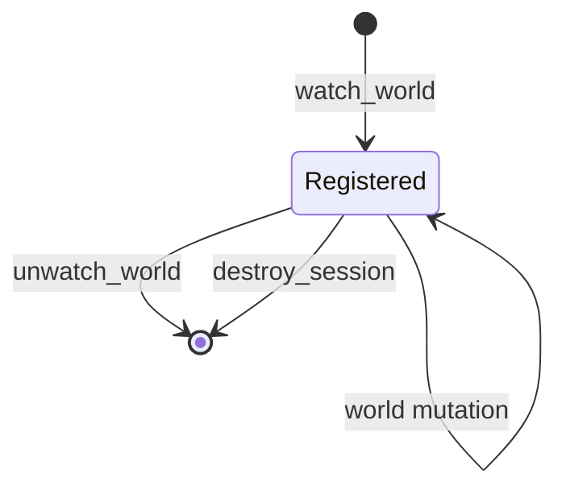

---
related_code:
  - zircon_runtime_interface/src/world_sync/query.rs
  - zircon_runtime_interface/src/world_sync/watch.rs
  - zircon_runtime_interface/src/world_sync/invalidation.rs
  - zircon_runtime_interface/src/runtime_api/abi/api_table.rs
implementation_files:
  - zircon_runtime_interface/src/world_sync
  - zircon_runtime/src/dynamic_api/session/world_sync.rs
plan_sources:
  - user: 2026-09-09 为 ZirconEngine 构建引擎说明书级 Wiki
tests:
  - zircon_runtime_interface/src/tests/world_sync_contracts.rs
doc_type: api-reference
---

# World Query、Watch 与 Invalidation

## 查询模型

`WorldQuery` 是 tagged enum：`Components`、`Hierarchy`、`InspectionFields`、`TransformSnapshot`。组件查询使用 `ComponentSelector`、`QueryFilter { with, without }`；结果为确定性排序的 `EntityRow`。层级查询返回 parent/children 投影；inspection 查询面向 Inspector 字段；transform snapshot 用于编辑事务起点。

```rust
let query = WorldQuery::Components(ComponentWorldQuery {
    filter: QueryFilter { with: vec!["zircon.transform.Transform".into()], without: vec![] },
    select: vec![ComponentSelector::new("zircon.transform.Transform")],
    generation_hint: Some(last_generation),
});
let bytes = serde_json::to_vec(&query)?;
```

`generation_hint` 与当前 generation 相同且未溢出时返回 `NotModified`；`u64::MAX` 不参与增量优化。调用方不能假设 generation 连续，必须以返回值覆盖缓存版本。

## Watch

`WatchRegistration` 描述 query、过滤器和 scope；成功返回 `WatchToken(u64)`。token 只在创建它的 session 有效。取消通过 `unwatch_world(session, token, *mut u8)`，输出字节表示是否实际移除。



## Invalidation 批次

`InvalidationBatch` 包含 generation、world replacement epoch 和 `WorldFact` 列表。fact 可表达实体创建/删除、组件变更、层级变更、资源重载等。批次为空是合法状态；消费后立即 release allocation。若发现 replacement epoch 改变，应使旧编辑事务和 entity cache 全部失效。

## ABI 调用

```rust
let mut result = ZrOwnedResultV2::empty();
let status = unsafe { (api.query_world)(session, slice(bytes), &mut result) };
if status.is_ok() { let decoded = decode_owned(&result)?; release(session, result.allocation)?; }
```

query/watch 请求预算分别为 1 MiB/16,384 items 和 256 KiB/1,024 items；处理时间上限 25,000/10,000 微秒。超过上限应缩小选择集合或拆分 watch。

## 一致性约定

查询结果与 invalidation 不是同一事务快照。收到 invalidation 后再次 query 才能获得新投影；不要直接对旧 rows 就地猜测组件值。watch 回调只提供事实，不保证每个中间状态都保留。

## 失败处理

`NotFound`：token/session 不存在；`LimitExceeded`：请求过大；`InvalidArgument`：JSON、selector 或输出指针错误；`UnsupportedVersion`：未知 query variant。`NotModified` 不是错误，不应触发全量刷新。

## 测试清单

覆盖四类 query、generation 命中/溢出、replacement epoch、watch 重复取消、空批次、事实排序、预算限制及跨 session token。

## 字段与结果约定

| 类型 | 关键字段 | 解释 |
| --- | --- | --- |
| `ComponentSelector` | component type id、field selection | 反射类型名，不能为空 |
| `QueryFilter` | `with`、`without` | with 必须满足，without 必须排除 |
| `ComponentWorldQuery` | filter、select、generation_hint | 返回 `ComponentRows` 或 `NotModified` |
| `WorldHierarchyQuery` | root/entity scope、generation_hint | 返回 parent/children 行 |
| `WorldInspectionFieldsQuery` | entity、field paths、generation_hint | 缺失实体返回 `EntityMissing` |
| `WorldTransformSnapshotQuery` | entity、generation_hint | 返回 local transform 与 replacement epoch |
| `InvalidationBatch` | generation、replacement epoch、facts | 增量事实，不是完整快照 |

`EntityRow` 的 entity id 是 `u64`，只能当 opaque identity；不要把它当内存地址或数组位置。`WorldHierarchyRow` 的 parent 缺失代表根节点，而不是实体不存在。

## 查询分页

接口一次返回受 1 MiB/16,384 items 上限约束。对于大型世界，按 root、组件类型或稳定 entity 范围拆分 query；每一页都带 generation，只有所有页 generation 相同才可合并。若期间发生 replacement，丢弃已合并页并重新开始。

```rust
for chunk in scopes {
    let request = WorldQuery::Components(chunk.into_query(last_generation));
    let page = query_world(request)?;
    cache.merge_page(page)?;
}
```

上例的 `into_query` 为宿主封装示意，不是接口 crate 的固定方法；实际构造使用公开 struct 字段。

## Watch registration 设计

watch 的 filter 应尽量窄，避免所有组件变更都生成 invalidation。每个 watch 记录本地用途和创建 generation；收到 batch 后先按 token 路由，再按 fact kind 更新对应缓存。取消时删除本地 token 映射，即使 runtime 返回 `NotFound` 也不要继续消费。

## Fact 合并

同一 batch 内同一实体的多条 fact 不保证已合并。推荐按 `(generation, entity)` 分组，再按 fact 顺序应用。删除事实覆盖后续组件变更；replacement fact 覆盖整个 world，并清空 hierarchy、inspection、transform 缓存。

## 读写边界

world sync 是只读通道。修改 transform、组件或场景必须提交 operation/编辑事务，然后等待 operation 终态，再通过 query 验证结果。直接根据 query DTO 拼接写请求属于未定义协议。

## 可观测性

记录 query 类型、selector 数量、输入 bytes、输出 bytes、generation 命中率、耗时和 `LimitExceeded` 次数。不要记录完整 payload 作为日志，尤其是 inspection 字段可能包含用户数据。

## 故障恢复矩阵

| 故障 | 恢复 |
| --- | --- |
| `NotModified` | 保留缓存 generation |
| replacement epoch changed | 清空缓存并全量 query |
| output limit | 按 scope/selector 拆分 |
| malformed JSON | 修正 serializer，不重试原文 |
| watch token not found | 删除本地映射并重新 watch |
| session destroyed | 停止消费，等待新 session |

## Query JSON 示例

```json
{
  "kind": "components",
  "filter": {"with": ["zircon.transform.Transform"], "without": ["gameplay.Disabled"]},
  "select": [{"type_id": "zircon.transform.Transform"}],
  "generation_hint": 42
}
```

实际 serde tag/字段名必须以 `query.rs` 定义为准；示例用于说明 selector、filter、hint 的关系，不能复制为未经验证的 wire contract。

## ComponentSelector 审核

selector 的 type id 需要先在反射 registry 中存在。空 select、重复 select、with 与 without 同时包含同一 type id 都应在调用前拒绝。字段选择如果为空，表示整个反射组件还是非法，取决于该 query variant 的定义；宿主不要自行推断。

## Hierarchy 读取

Hierarchy query 只返回当前 runtime world 的投影，不保证每个父节点都在结果集中。根节点使用 `parent=None`；循环 hierarchy 应被 runtime 拒绝并产生诊断。客户端构造树时按 entity id 去重，检测重复 child 引用。

## Inspection fields

Inspection field path 使用 schema 定义的稳定路径，不是 UI 标签。路径不存在返回字段级缺失或整体 `EntityMissing`，不要把缺失字段映射为默认 0 后写回。敏感字段应由权限层在 query 前过滤。

## Transform snapshot

snapshot 是编辑事务的基线，包括 local transform、generation 和 `world_replacement_epoch`。更新时必须带原始 epoch；若 epoch 改变，说明 scene/world 被替换，旧 undo participant 也应失效。

## WatchKey 与 scope

`WatchKey` 用于区分组件、hierarchy、inspection、transform 等监听目的。一个 `WatchRegistration` 可以绑定多个事实来源，但应保持 scope 窄。scope 变化时取消旧 token 再创建新 token，避免同一 mutation 被重复消费。

## Invalidation facts

| fact | cache action |
| --- | --- |
| entity created | 增量加入 entity index |
| entity removed | 删除所有 entity rows/children |
| component changed | 使相关 selector rows 失效 |
| hierarchy changed | 重建 parent/children 投影 |
| transform changed | 刷新 transform snapshot |
| asset reload | 标记依赖该 asset 的 projection |
| world replaced | 清空所有 cache |

事实应用应幂等：重复同一 generation/fact 不应产生第二次副作用。generation 回退代表旧批次或错误 provider，应拒绝合并。

## Host drain 循环

```rust
loop {
    let batch = drain_world_invalidations(session)?;
    if batch.facts.is_empty() { break; }
    if batch.generation < cache.generation() { return Err(StaleBatch); }
    cache.apply(batch)?;
}
```

真实 wrapper 需要处理 allocation release、空批次和输出预算；示例只表达消费顺序。

## 查询一致性测试

1. 在 generation 10 查询后 mutation，再 query generation 10，断言返回 generation 11 rows。
2. 使用 generation 11 hint，断言 `NotModified` 不产生 allocation 泄漏。
3. replacement epoch 改变后，旧 transform update 必须拒绝。
4. 同一 entity 多条 fact 按 generation 顺序合并且删除覆盖更新。
5. watch cancel 后 mutation 不再生成该 token 的事实。

## Backpressure 与服务质量

高频 editor watch 应按组件类型拆分并设置消费预算；debug inspector 可降低刷新频率。runtime 可能丢弃旧 batch，sequence/generation gap 是客户端触发全量 query 的信号。不可在每个 invalidation 内同步执行重型 UI rebuild。

## 权限与隐私

world query 的 selector、inspection paths 和 asset ids 都应通过项目权限检查。诊断日志记录 query kind、计数和耗时，不记录完整 component payload。跨插件共享 query 结果前先移除敏感字段。

## 兼容性审计

新增 `WorldQuery` variant、`WorldFact` variant 或结果字段属于 DTO breaking change，应新增版本或协调 lockstep BuildSet。旧宿主遇到未知 tag 只能返回 `UnsupportedVersion`，不能把未知事实当作 `NoOp`。
