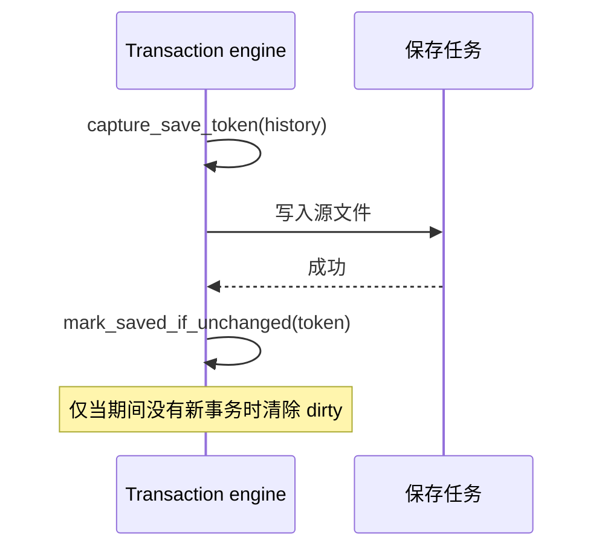

---
related_code:
  - zircon_editor/src/core/editing/engine/history.rs
  - zircon_editor/src/core/editing/engine/transaction/engine_state.rs
  - zircon_editor/src/core/editing/engine/transaction/scope.rs
  - zircon_editor/src/core/editing/engine/journal
  - zircon_editor/src/core/editor_operation.rs
implementation_files:
  - zircon_editor/src/core/editing/engine/history.rs
  - zircon_editor/src/core/editing/engine/transaction/engine_state.rs
  - zircon_editor/src/core/editing/engine/transaction/scope.rs
plan_sources:
  - user: 2026-09-09 补充 ZirconEngine 最佳实践、方案示例与详细 Wiki
tests:
  - zircon_editor/src/core/editing/engine
  - zircon_editor/src/core/commands
  - zircon_editor/src/core/editor_event
doc_type: workflow-detail
---

# 编辑器事务、撤销与保存实践

Zircon 的作者态修改应通过 `EditorTransactionEngine` 形成 `EditCommand` 事务；菜单、快捷键和远程入口则由 `EditorOperationPath` 统一路由。命令“可以执行”不代表“应写入历史”：打开窗口、hover 与 focus 一类 transient 行为不能污染 undo 或 durable journal。实现入口见 [history.rs](https://github.com/He-Jiahui/ZirconEngine/blob/main/zircon_editor/src/core/editing/engine/history.rs)、[transaction scope](https://github.com/He-Jiahui/ZirconEngine/blob/main/zircon_editor/src/core/editing/engine/transaction/scope.rs) 与 [editor operation](https://github.com/He-Jiahui/ZirconEngine/blob/main/zircon_editor/src/core/editor_operation.rs)。

## 先决定操作的持久性

| 操作 | 历史上下文 | 是否事务 | 是否 journal | 保存后影响 |
| --- | --- | --- | --- | --- |
| Scene/资产字段修改 | `Document(DocumentId)` | 是 | codec 可用时是 | 影响源资产 dirty |
| 全局作者偏好 | `Global` | 视是否可撤销而定 | 仅在有 codec 时 | 不应伪装为文档已修改 |
| Play 世界操作 | `PlaySession(PlayInstanceId)` | 是 | 否 | session 结束时丢弃，不成为源资产保存点 |
| 打开面板、hover、focus | 无 | 否 | 否 | 只产生 UI/event effect |

`HistoryContextId` 的这三类边界及 Play history 的 volatile 性质由编辑引擎实现维护；相关 API 说明见 [命令、事务与撤销系统](../editor/commands-transactions.md)。

## 事务必须显式结束

**推荐，实际 API 形状：**

```rust
use zircon_editor::core::editing::engine::{EditorTransactionEngine, HistoryContextId};

fn rename(engine: &EditorTransactionEngine, document_id: DocumentId) -> Result<(), EditorError> {
    let mut tx = engine.begin("Rename Actor", HistoryContextId::Document(document_id))?;
    tx.add_participant(document_id);
    tx.push(rename_command()?);
    tx.commit()?;
    Ok(())
}
```

一条事务携带命令序列、参与文档、selection 快照与显著性。Undo 按逆序 revert，Redo 按正序 apply；中途失败时引擎补偿已执行部分，补偿再失败时以 `RollbackFailed` 停止正常编辑流。不要在插件中抓取 engine 内部锁，也不要依赖 scope drop 来猜测提交结果；未显式 commit/cancel 的 drop error 必须被宿主处理。事务与补偿规则可在 [engine_state.rs](https://github.com/He-Jiahui/ZirconEngine/blob/main/zircon_editor/src/core/editing/engine/transaction/engine_state.rs) 查证。

**反模式，示意伪代码：**

```rust
// 错误：每个 pointer move 都写入一个独立的用户可见 undo 项。
on_pointer_move(|position| engine.execute(move_gizmo(position)));
```

对于 drag、滑块和连续文本提交，使用 `operation_group` 与 merge 语义：begin 建立 interactive state，move 更新预览，end 只提交一个事务，cancel 恢复起始状态。否则 history 很快填满、redo 分支反复断裂，且保存点更容易不可达。

## 保存不是“写盘成功”就结束



**推荐，实际 API 形状：**

```rust
let token = engine.capture_save_token(history)?;
save_document_to_disk()?;
let outcome = engine.mark_saved_if_unchanged(token)?;
```

保存 I/O 期间可能发生新事务。save token 将“开始保存时的 history top”与完成时状态比较，避免旧写入完成后把新修改误标为 saved。`HistoryStatus` 还提供 `dirty`、current/saved top 与 `saved_top_reachable`；capacity 淘汰保存点时，后者会变为 false，文档必须继续显示 dirty。流程的公开说明见 [命令、事务与撤销系统](../editor/commands-transactions.md)。

## Journal 只记录可重放命令

| 命令性质 | Codec 策略 | 崩溃恢复承诺 |
| --- | --- | --- |
| 输入和结果可稳定序列化 | 注册 `EditCommandCodecRegistry` codec | 可写入 `DurableJournal` 并在身份验证后重放 |
| 依赖当前进程对象、窗口或临时资源 | 不注册 codec | 仅内存 undo；报告 `CommandJournalUnavailable` |
| 读取损坏日志尾部 | reader 报告损坏 | 不能默默跳过并声称完整恢复 |

不要为了“全部可恢复”而把 native handle、窗口指针或不可版本化 payload 塞进 journal。journal replayer 会在 codec 和文档身份通过后重放；保存源文件后可 compact 已覆盖前缀。相关模块在 [journal](https://github.com/He-Jiahui/ZirconEngine/tree/main/zircon_editor/src/core/editing/engine/journal)。

## 失败定位

| 症状 | 首先检查 | 修复 |
| --- | --- | --- |
| Undo 后 selection 或文档只恢复一半 | `EditCommand` 的 apply/revert 与 `CommandEffect` | 令失败报告准确区分 `Unchanged`/`Applied`，补齐 revert |
| 点击一次产生很多 undo 项 | operation group、merge mode 与 pointer lifecycle | 将 move 设为预览，把 end 合成一次 commit |
| 保存后仍 dirty | save token outcome、保存期间的新提交、saved top 是否可达 | 只用 `mark_saved_if_unchanged`，不要手工清 dirty |
| Play 修改出现在源资产待保存列表 | history context | 改为 `PlaySession`，结束时 `discard_play_history` |
| 崩溃后无法恢复命令 | codec registry 与 document identity | 为稳定命令增加版本化 codec，或明确标为内存操作 |

## 合入前核对

- [ ] 每个作者态变更都选择了 `Global`、`Document` 或 `PlaySession` 中正确的 history context。
- [ ] 事务显式 commit 或 cancel；所有 participant 和 selection 影响都被纳入事务。
- [ ] 高频交互合并为一个可理解的 undo 单元，cancel 能回到初始状态。
- [ ] 异步保存采用 save token，UI 从 `HistoryStatus` 投影 dirty。
- [ ] 只有有稳定 codec 的命令才承诺 durable journal/replay；失败路径有 editor engine 测试。
