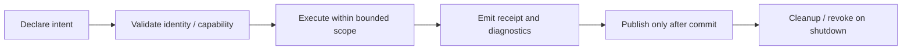

---
related_code:
  - zircon_runtime/src/core/runtime
  - zircon_runtime/src/core/manager
  - zircon_editor/src/core/editing
  - zircon_plugins/plugin_sdk/src
  - zircon_runtime/src/graphics
implementation_files:
  - zircon_runtime/src/core/runtime
  - zircon_editor/src/core/editing
  - zircon_plugins/plugin_sdk/src
plan_sources:
  - user: 2026-09-09 扩展 ZirconEngine Wiki 教程与机制说明
  - docs/wiki/rust-api.md
tests:
  - zircon_runtime/src/core/runtime/tests
  - zircon_editor/src/tests
  - zircon_plugins/plugin_sdk/src
doc_type: category-index
---

# 工程最佳实践

这些规则用于把“能运行的示例”提升为可维护的引擎扩展。每条规则都围绕 ownership、generation、错误语义和可观测性；如果某个产品 profile 有更严格的约束，以 profile 合同为准。

## 决策矩阵

| 你正在设计 | 首先保证 | 对应指南 |
| --- | --- | --- |
| Runtime service 或 manager API | trait 边界、handle identity、guard 作用域 | [句柄、错误与所有权](rust-handles-errors-and-ownership.md) |
| 插件或原生分发包 | manifest authority、capability、ABI buffer ownership | [插件清单与 ABI](plugin-manifest-capabilities-native-abi.md) |
| 编辑器命令/保存功能 | 显式事务、补偿、save token、dirty 不变量 | [事务、撤销与保存](editor-transactions-undo-save.md) |
| Render Graph 或 GPU 资源 | resource version、lease、submission、surface generation | [渲染资源与性能](rendering-resource-lifetime-performance.md) |

## 共同原则

1. **声明先于执行**：descriptor、manifest、query 或 command 先表达意图，再让 owner 校验。
2. **边界内执行**：guard、transaction、lease 和 output budget 的作用域尽可能短且显式。
3. **提交后发布**：候选资源、编辑结果和插件注册未 commit 前，不向其他消费者宣称可用。
4. **失败可恢复**：错误要能区分配置、能力、generation、超时和内部故障；恢复动作不能绕过 owner。

## 反模式速查

| 反模式 | 结果 | 替代方案 |
| --- | --- | --- |
| 缓存 concrete `Arc` 跨卸载使用 | 旧实例绕过 generation/drain | 缓存 typed handle，每次 `enter` |
| UI 直接写 runtime World | 无法撤销、保存和回放 | command/transaction/gateway |
| 以文件名或显示路径作资源身份 | 移动/重载后引用漂移 | URI、UUID、ResourceId |
| 把 `query_stats` 当 GPU fence | 误判提交完成 | 使用明确 completion/capture API |
| 手工拼 native 导出和释放函数 | ABI 或 allocator 不匹配 | SDK 生成入口与 owned buffer helper |

## 如何把规则落到测试

- 为每个 public operation 测试一次“identity 变化后拒绝旧结果”。
- 为每个批量提交测试“候选失败不发布，last-good 仍可读”。
- 为每个 shutdown 测试“新 admission 关闭后，已有调用可 drain 或报告超时”。
- 为每个用户可见错误保留结构化 code、阶段和建议动作，而不只比较完整字符串。

继续阅读：[教程](../tutorials/index.md)、[机制指南](../mechanisms/index.md)、[方案配方](../recipes/index.md)。
