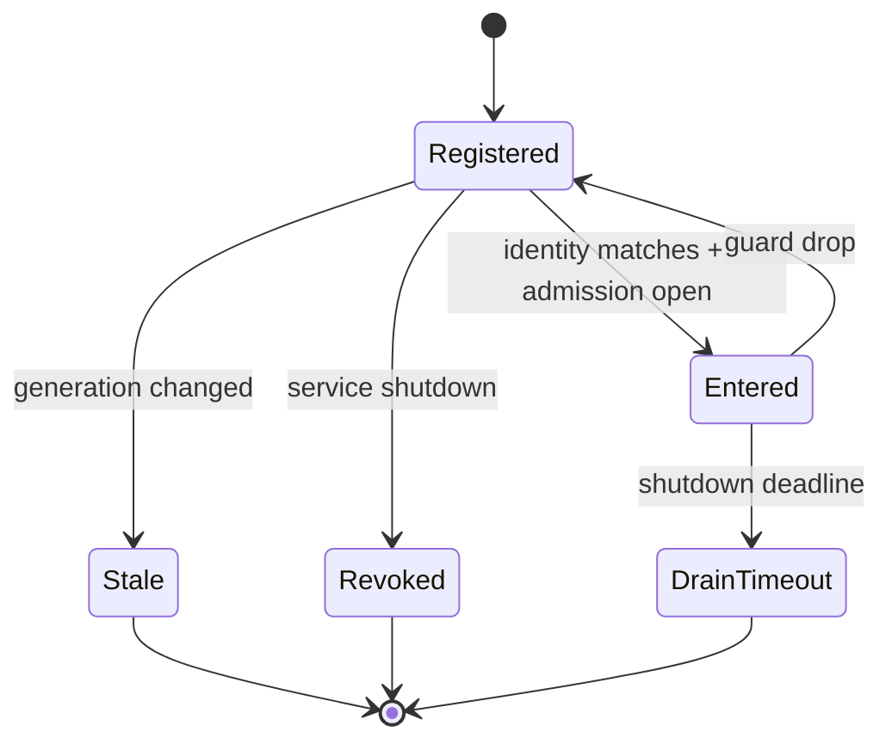

---
related_code:
  - zircon_runtime/src/core/runtime/handle/resolution.rs
  - zircon_runtime/src/core/runtime/error.rs
  - zircon_runtime/src/core/manager/resolver.rs
implementation_files:
  - zircon_runtime/src/core/runtime/handle
  - zircon_runtime/src/core/manager
plan_sources:
  - docs/wiki/best-practices/rust-handles-errors-and-ownership.md
tests:
  - zircon_runtime/src/core/runtime/tests/resolution
  - zircon_runtime/src/core/manager/tests.rs
doc_type: reference-guide
---

# API 所有权、句柄与错误决策指南

本指南定义跨模块 Rust API 的长期引用边界。ZirconEngine 将服务身份拆成注册名、类型和 generation；调用期间再通过 `ServiceCallGuard` 参与卸载排空。这个组合比直接传递 `Arc<T>` 多一道验证，却把热重载、插件卸载和并发关闭变成可证明的状态机。

## 接口地图

| 接口 | 用途 | 生命周期 | 失败类型 |
| --- | --- | --- | --- |
| `manager_service_handle` | 从 `CoreHandle` 取得带身份的 manager handle | 可跨帧保存 | 未注册、类型不匹配、generation 过期 |
| `ManagerResolver::resolve` | 将 handle 解析为契约对象 | 一次解析 | service unavailable |
| `ServiceHandle::enter` | 为一次调用建立 in-flight guard | 词法作用域 | shutdown、过期、超时 |
| `CoreWeak::upgrade` | 弱引用恢复 runtime | 瞬时 | runtime 已销毁 |
| `CoreError` | 向上层保留结构化原因 | 跨层传递 | 配置、能力、内部故障 |

## 决策矩阵

| 场景 | 推荐表示 | 关键不变量 | 不能做什么 |
| --- | --- | --- | --- |
| 同一函数内调用 | `Arc<T>` | 调用结束前 owner 仍存活 | 缓存 slot index |
| 跨帧调用可卸载服务 | `ServiceHandle<T>` | 每次 `enter` 重新验证 generation | 持有裸 `Arc` |
| 多线程共享契约 | `ManagerServiceHandle<dyn Trait>` | trait 必须 `Send + Sync` | 下转型到私有结构 |
| callback 反向访问 runtime | `CoreWeak` | 升级失败可安全退出 | 构造强引用环 |
| 需等待关闭的批处理 | 短 guard + 有界队列 | drain 有截止时间 | guard 跨 await |

## 句柄状态机



`Registered` 只表示曾经解析成功，不代表现在可调用。generation 变化后必须得到明确的 stale 错误；不能自动指向新实例，因为那会把旧调用意图转移到另一个对象。

## 推荐调用形状

```rust
use zircon_runtime::core::manager::{manager_service_handle, ManagerResolver};

pub trait TelemetryApi: Send + Sync {
    fn sample_count(&self) -> u64;
}

pub fn read_sample(core: zircon_runtime::core::CoreHandle)
    -> Result<u64, zircon_runtime::core::CoreError>
{
    let handle = manager_service_handle::<dyn TelemetryApi>(
        &core,
        "Diagnostics.Manager.Telemetry",
    )?;
    let api = ManagerResolver::new(core).resolve(handle)?;
    Ok(api.sample_count())
}
```

将 `resolve` 放在请求边界，错误可在这里转换成 UI 或脚本层诊断。若需要高频调用，缓存 typed handle；每一帧仍调用 `enter`，不要缓存 guard。

## 错误分层

1. **配置错误**：注册名为空、manifest 字段缺失。启动阶段失败并指出修复字段。
2. **能力错误**：插件没有声明 capability。不要重试，应该降级或隐藏入口。
3. **身份错误**：generation、类型或 runtime id 不匹配。重新解析 handle，然后重新执行意图。
4. **时序错误**：shutdown 或 drain timeout。交由调度器重排，不在业务层 busy-loop。
5. **内部错误**：锁、IO 或 panic 转换。记录 correlation id，并保留原始 source。

```rust
fn retry_policy(err: &zircon_runtime::core::CoreError) -> &'static str {
    match err {
        zircon_runtime::core::CoreError::ServiceUnavailable { .. } => "re-resolve",
        zircon_runtime::core::CoreError::Shutdown { .. } => "defer",
        _ => "surface",
    }
}
```

示例仅展示策略分流；实际枚举字段以当前 crate 定义为准。文档和测试不要依赖完整错误字符串。

## 线程与异步边界

- guard 默认是同步作用域对象；进入异步任务前复制不可变输入，立即释放 guard。
- 需要长计算时，将任务提交到 owner 队列，由 owner 在有效代际内执行。
- `CoreWeak` 升级必须在 callback 入口完成；升级失败是正常关闭路径，不应 panic。
- 对外 trait 的返回类型优先使用值、快照或拥有型错误，避免泄露内部锁。

## 反模式

| 代码味道 | 风险 | 修复 |
| --- | --- | --- |
| `cache: Arc<ConcreteManager>` | 绕过代际检查 | 缓存契约 handle |
| `unsafe { &*raw }` | 生命周期不可证明 | 通过 SDK/guard 访问 |
| `while err.is_unavailable() {}` | 关闭时 CPU 自旋 | 指数退避并设置 deadline |
| `map_err(|_| anyhow!("failed"))` | 丢失阶段与身份 | 保留 `CoreError` source |
| guard 存入 `tokio::spawn` | 阻塞 drain | 传值快照或 job id |

## 失败与恢复剧本

### 服务热重载

1. 收到 stale 错误后停止当前批次。
2. 用 registry name 重新取得 handle。
3. 校验新 capability 和版本。
4. 以幂等输入重放请求。
5. 记录旧/新 generation 和重放次数。

### 关闭超时

1. 关闭 admission，拒绝新 `enter`。
2. 等待 in-flight 降为零。
3. 到达 deadline 后记录持有者标签。
4. 取消可取消任务，保留 last-good 状态。
5. 下一次启动进行完整 registry rebuild。

## 性能与可观测性

建议按服务记录：`resolve_latency_us`、`enter_reject_count`、`stale_generation_count`、`in_flight_peak`、`drain_timeout_count`、`retry_after_reload`。基线测试应分别测冷解析与热 handle；不要用 `query_stats` 推断服务完成。

| 指标 | 目标 | 告警 |
| --- | --- | --- |
| 热路径 `enter` p99 | 小于 10 us | 连续 5 分钟超标 |
| stale 重试率 | 小于 0.1% | 代际抖动或调用方缓存错误 |
| drain timeout | 0 | 任何一次都调查 |
| 强引用环 | 0 | shutdown 后对象仍存活 |

## 测试设计

- 注册、解析、调用、卸载四阶段各有单测。
- 同一 slot 重建后，旧 handle 必须失败，新 handle 必须成功。
- 并发 `enter` 与 shutdown 运行至少 1000 次，验证无 use-after-free。
- 对每个 `CoreError` 分支断言结构化字段。
- 通过 `CoreWeak` 升级失败测试 callback 的安静退出。

## 与成熟引擎的对照

Unreal 的 `TWeakObjectPtr` 和模块生命周期通知强调对象失效检查；Bevy 的资源访问以世界借用在系统边界结束；Godot 的 `ObjectID` 也要求重新取得对象。ZirconEngine 的 generation + guard 将两点合并到服务调用协议，适合动态模块和原生插件。

## 发布前清单

- [ ] 每个跨模块 API 都有 trait 契约和 owner。
- [ ] 长期引用都带 generation 或可重新解析身份。
- [ ] guard 不跨线程等待、阻塞 IO 或 `await`。
- [ ] 错误含阶段、身份、建议动作和 source。
- [ ] shutdown 有 admission、drain、deadline 三步。
- [ ] 热重载能重解析并幂等重放。
- [ ] 指标能区分 stale、能力拒绝和内部故障。
- [ ] 单测覆盖旧代际拒绝和弱引用失败。

## 精确来源

- `zircon_runtime/src/core/runtime/handle/resolution.rs`：`ServiceHandle`、guard、drain。
- `zircon_runtime/src/core/runtime/handle/service_identity.rs`：runtime/index/generation identity。
- `zircon_runtime/src/core/manager/resolver.rs`：`ManagerResolver` 和契约句柄。
- `zircon_runtime/src/core/runtime/error.rs`：结构化 `CoreError`。
- `zircon_runtime/src/core/runtime/tests/resolution`：解析与代际回归。

## 公共接口审查问题

在发布任何 `pub fn` 前逐项回答：返回值由谁拥有？失败时是否保留 enough context？对象能否跨 module unload？是否允许线程切换？是否能重入？每一个“不确定”都应减少公开面，而不是用注释掩盖。

| 审查问题 | 是 | 否 |
| --- | --- | --- |
| 会跨卸载保存吗 | typed handle + generation | 短期 `Arc` 可接受 |
| 会在 callback 调用吗 | weak upgrade + error | 直接 owner reference |
| 会跨 async 边界吗 | snapshot/job id | guard 可留在栈上 |
| 错误需 UI 展示吗 | code + remedy + context | 内部 source 仍保留 |

## Ownership 词汇表

`owner` 是唯一能改变/销毁资源的模块；`borrower` 只在约定作用域读取；`observer` 接收快照或事件；`authority` 决定请求能否执行；`receipt` 说明一次尝试的结果。API 文档应选择这些词，而不要含糊地说“管理”“获得”或“处理”。

## 错误转换边界

runtime 层返回 `CoreError`；编辑器 gateway 将其映射为可本地化诊断；脚本层再映射为稳定 error code。转换只能增加用户上下文，不能删除 source、generation、operation id。日志记录结构化错误，UI 不显示内部路径或密钥。

## 对象图检查

启动时 owner -> registry -> service 可以是强引用；service -> runtime 必须是弱引用；event subscription 持有 cancel token 而不是 owner。shutdown 测试应在 drop 后断言 weak upgrade 为 `None`，并用 heap/profile 工具检查无环。

## 压力测试配方

同时运行 32 个 resolver、每 10 ms reload 一次服务、随机关闭 runtime，持续 60 秒。断言没有 panic、每个 guard 都释放、stale 被拒绝、drain 有界。保留随机种子、服务名和 generation trace，失败时可重演。

## 交付检查清单（扩展）

- [ ] public API 文档说明 owner、线程和重入。
- [ ] 句柄状态变化能被 trace 关联。
- [ ] error conversion 不删除 source/generation。
- [ ] 对象图不存在 service 到 runtime 的强环。
- [ ] reload/shutdown 压测可复现。
- [ ] 所有 example 明示示意或可编译状态。

## API 设计模板

新增接口的文档应按以下顺序书写：

1. intent：调用方想完成什么业务动作。
2. authority：哪个模块拥有决定权和副作用。
3. input：输入值、版本、generation、线程要求。
4. output：值、快照、receipt 或 stream。
5. errors：每个错误的恢复动作与不可重试条件。
6. lifetime：返回对象能保存多久，何时必须重新解析。
7. observability：operation id、指标和 trace 字段。
8. examples：成功、拒绝、过期、关闭至少各一例。

## 公开 trait 的演进

trait 新增方法会破坏外部实现。优先通过扩展 trait、默认方法或版本化契约演进；删除方法先经历 deprecated 周期。`dyn Trait` 作为服务边界时，文档须说明 object safety、`Send + Sync` 和错误类型。不要把内部泛型、闭包或关联生命周期直接暴露给插件。

## 锁与回调

持锁期间只执行不调用外部代码的短操作。需要回调时复制 immutable snapshot，释放锁，再调用订阅者。订阅者回调可要求取消自身，因此 registry 需要 deferred removal 队列。测试应模拟回调重入 register/unregister，验证不会死锁或迭代器失效。

## 跨线程交付

把不可 `Send` 的对象转换成 owner queue 的 job；不要为了跨线程强行 `unsafe impl Send`。job 携带 source generation，执行时再次验证。线程切换后的错误需保留 origin thread/module，便于排障。高频 telemetry 可使用无锁 ring buffer，但满时必须定义丢弃策略。

## 兼容与废弃

在文档中标注 `stable`、`experimental`、`deprecated`。deprecated API 提供迁移表和移除版本，不应只在编译器 warning 中说明。插件 ABI 与 Rust API 的废弃节奏独立管理，避免 host 更新迫使所有插件同步升级。

## 验收样例

实现者提交 API 时附一段最小 compile example、一段 stale example 和一条错误断言。reviewer 可以只运行该 example 验证 ownership 与返回值方向。示例中的名字必须来自公开 re-export；若是伪代码，应在标题明确标注。

## 最终审查清单

- [ ] intent、authority、lifetime、errors 都写成可验证句子。
- [ ] trait 演进不要求外部实现立即破坏性修改。
- [ ] 回调不会在持锁期间执行。
- [ ] 跨线程 job 带 generation 和取消语义。
- [ ] deprecated 有迁移版本和替代 API。
- [ ] compile/stale/error examples 均可定位到测试。
