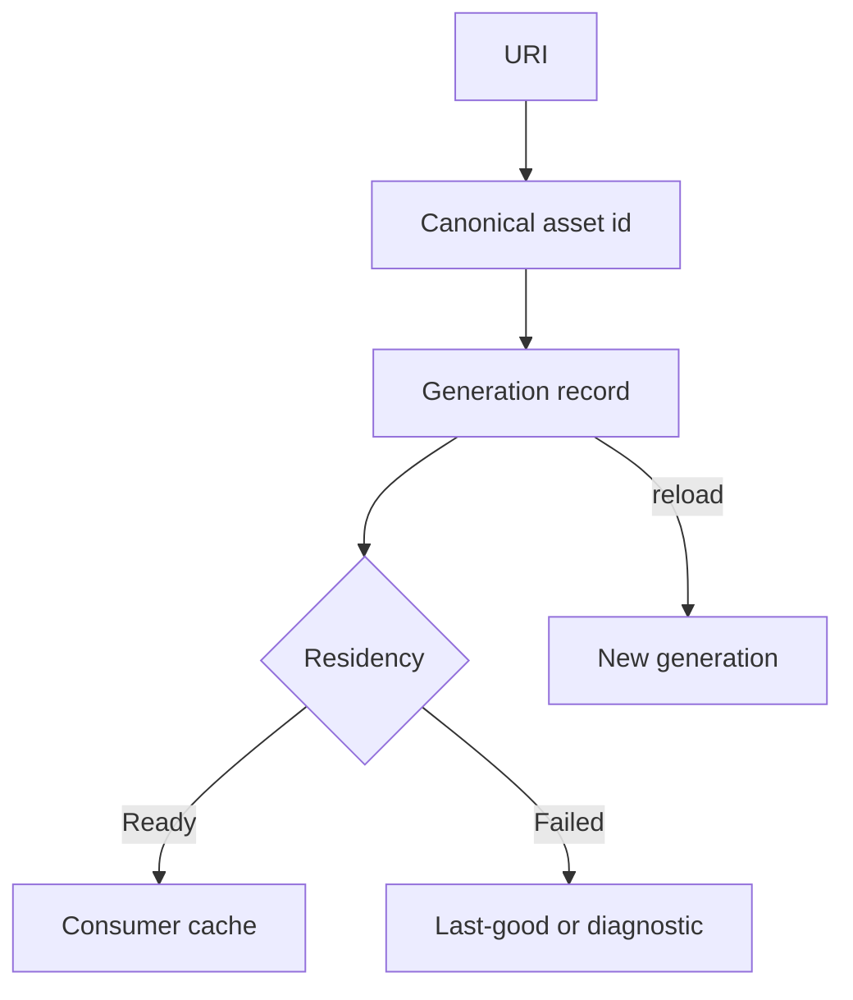

---
related_code:
  - zircon_runtime/src/core/resource
  - zircon_runtime/src/asset/project
  - zircon_runtime_interface/src/world_sync/invalidation.rs
implementation_files:
  - zircon_runtime/src/core/resource
  - zircon_runtime/src/asset/project
plan_sources:
  - docs/wiki/mechanisms/asset-import-readiness-residency.md
tests:
  - zircon_runtime/src/asset/tests
  - zircon_runtime/src/asset/project
doc_type: reference-guide
---

# 资源身份、代际与缓存实践

资源缓存必须回答三个不同问题：这是谁（identity）、现在是哪一版（generation）、能否立即使用（readiness）。路径、内存地址和文件时间都不能单独承担这三个语义。

## 身份层次

| 层 | 例子 | 稳定性 | 用途 |
| --- | --- | --- | --- |
| URI/path | `project://textures/ui.png` | 可迁移 | 人类输入、导入发现 |
| asset id | UUID/`ResourceId` | 稳定 | 引用、序列化 |
| generation | 单调递增整数 | 每次重载变化 | 拒绝过期读取 |
| residency | Unloaded/Loading/Ready/Failed | 动态 | 是否可消费 |



## 决策矩阵

| 需求 | 缓存键 | 失效触发 | 读取策略 |
| --- | --- | --- | --- |
| 编辑器预览 | id + generation | 文件变化/手动 reload | last-good 优先 |
| 运行时只读 | id + artifact hash | 包版本变化 | 失败即降级 |
| 依赖图 | id -> dependency ids | manifest 变化 | 递归 readiness |
| GPU 资源 | id + device/surface generation | device lost | 重建 descriptor |

## 不变量

1. canonical id 由 owner 生成，调用方不能从显示名猜测。
2. generation 只递增，不复用旧值。
3. 新版本完整验证并提交后才能替换 last-good。
4. 依赖 readiness 未满足时，父资源不能报告 Ready。
5. 删除是 tombstone/diagnostic 事件，而非静默从缓存消失。

## API 使用形状

```rust
// 调用形状示意；应用层应把这些分支接入自己的队列和诊断系统。
use zircon_runtime::asset::{AssetLoadState, Assets, Handle, MeshAsset};

let state = assets.load_state(handle);
match state {
    AssetLoadState::Loaded => {
        if let Some(mesh) = assets.get_cloned(handle) {
            render_queue.submit(mesh);
        }
    }
    AssetLoadState::Loading | AssetLoadState::Reloading => schedule_retry(handle),
    AssetLoadState::Failed => report(assets.failure_reason(handle)),
    AssetLoadState::NotLoaded => request_load(handle),
}
```

示例中的 `handle` 是 `Handle<MeshAsset>`，`assets` 是 `Assets<MeshAsset>`；`request_load` 代表由拥有 `ProjectAssetManager` 的层提交加载请求。核心规则是先观察 state，再取得 payload，避免把空值当成加载中。

## 依赖和批量导入

`scan_and_import` 产生候选 artifact。导入器应先写临时文件和 manifest，再原子替换索引。跨文件依赖使用 asset id，不使用绝对路径。批量失败时保留每项 receipt，让成功项继续发布，失败项保持 last-good。

## 缓存容量

按内存类别制定预算：CPU decoded、GPU resident、metadata、transient staging。淘汰顺序通常是 transient -> cold decoded -> reloadable GPU；带编辑 dirty token 的对象不得自动淘汰。

## 反模式

| 反模式 | 后果 | 替代 |
| --- | --- | --- |
| 以 basename 作 key | 同名冲突 | canonical id |
| generation 回绕 | 旧引用误判有效 | checked increment + reset session |
| reload 先删旧对象 | 预览闪烁/引用断裂 | 双版本提交 |
| 依赖未就绪仍返回 Ready | 渲染空资源 | recursive readiness |
| 用文件 mtime 判等价 | 时钟/复制导致错失变更 | content hash + importer version |

## 故障恢复

- 导入失败：保留旧 artifact，写入 `failure_reason`，修复后从失败阶段重试。
- 依赖循环：在图构建阶段拒绝并输出环路，而不是递归栈溢出。
- 设备丢失：提升 device generation，丢弃 GPU payload，按 id 重建。
- 外部删除：发 invalidation batch，消费者退回占位或 last-good。

## 指标

`asset_cache_hit_ratio`、`load_ready_latency_ms`、`dependency_wait_ms`、`reload_generation_rate`、`artifact_bytes`、`gpu_resident_bytes`、`eviction_count`、`last_good_fallback_total`。把 id、generation、importer version 放入 trace span。

## 测试

- 相同 URI canonicalize 到同一 id；大小写和分隔符规则固定。
- reload 后旧 generation 读取失败，新 generation 成功。
- 依赖失败时父资源不是 Ready。
- 导入中断不会留下半写 artifact。
- 缓存淘汰后再次 load 得到等价 payload。

## 成熟引擎对照

Unreal 的 `FSoftObjectPath` 与 derived data cache 分离引用和构建产物；Bevy 的 asset handles 通过弱/强引用表达加载状态；Godot 的 `ResourceUID` 把稳定身份从路径中抽离。ZirconEngine 应坚持 id、generation、residency 三层，不把它们折叠成一个布尔值。

## 清单

- [ ] 所有序列化引用使用 stable id。
- [ ] 每次 reload 都有 generation 和 receipt。
- [ ] last-good 与候选版本分开存放。
- [ ] 依赖 readiness 递归可解释。
- [ ] 缓存预算按类别统计。
- [ ] 删除、设备丢失和导入失败都有恢复路径。

## 精确来源

- `zircon_runtime/src/core/resource`：资源状态、缓存和依赖。
- `zircon_runtime/src/asset/project`：`ProjectManager` 导入、artifact 和索引。
- `zircon_runtime_interface/src/world_sync/invalidation.rs`：失效批次 DTO。
- `zircon_runtime/src/asset/tests`：generation、依赖和缓存回归。

## API 参数说明

| API | 输入 | 输出 | 调用者责任 |
| --- | --- | --- | --- |
| `ProjectAssetManager::load` | stable asset id | admission receipt | 不重复提交同一 generation |
| `load_state` | id | residency snapshot | 快照可能在返回后变化 |
| `failure_reason` | id | structured diagnostic | 只读展示，不拼接新错误 |
| `dependency_load_state` | id | dependency summary | 处理 partial/unknown |
| `subscribe_asset_events` | filter | event stream | drop token on shutdown |
| `Assets::acquire` | id | owned/guarded payload | 不跨 generation 保存 |

## 选择缓存层

| 层 | 适合 | 淘汰条件 | 是否可重建 |
| --- | --- | --- | --- |
| URI index | 查找和迁移 | manifest 变更 | 是 |
| metadata cache | inspector | schema/importer 变更 | 是 |
| CPU decoded | gameplay 读取 | memory pressure | 是 |
| GPU resident | draw | device/surface generation | 是 |
| editor dirty | 未保存编辑 | 显式丢弃/保存 | 否，需用户确认 |

## 失效事件处理

事件至少区分 `Added`、`Changed`、`Removed`、`ImportFailed`、`GenerationAdvanced`。批处理消费顺序按 event generation 排序；旧事件到达时仅记录 stale，不覆盖新状态。订阅者应保存 cursor，重连后从 cursor 或全量 snapshot 恢复。

```rust
for event in assets.subscribe_asset_events(filter) {
    if event.generation() < cache.generation(event.id()) {
        metrics.stale_events += 1;
        continue;
    }
    cache.apply(event);
}
```

## 依赖图算法约束

- 构图使用 canonical id，禁止通过显示路径去重。
- DFS 维护 visiting/visited 两组，遇到 visiting 立即报告环。
- 拓扑排序结果持久化到 import receipt，便于复现。
- 跨插件依赖包含 plugin manifest digest。
- 大图按 connected component 并行，但发布仍按 component 原子提交。

## 内存和并发

读路径允许多个 immutable handle；写路径由 asset owner 串行化。缓存统计使用 atomic counters，不在每次读取时获取全局锁。大 payload 使用 mmap 或分块读取，避免复制到事件总线。达到预算时发出 backpressure receipt，调用方应等待而不是无界排队。

## 典型排障

1. 记录 URI、canonical id、generation、importer version。
2. 查询 `load_state` 与 `failure_reason`。
3. 展开 dependency graph，定位第一个非 Ready 节点。
4. 比较 artifact/content hash，排除缓存污染。
5. 清理 derived cache，重跑定向导入。
6. 若仍失败，保留原始输入和 receipt 交给 importer owner。

## 兼容策略

资源引用迁移必须提供旧 id -> 新 id 映射。rename 只改 URI index，不改变 id；copy 才产生新 id。合并资源时保留 tombstone 和 redirect 生命周期，至少跨一个发布周期。运行时包中应拒绝指向 tombstone 的强引用，并返回可定位的迁移建议。

## 性能实验方案

使用 1k、10k、100k 资产图分别测冷启动、增量 reload、全量 rebuild。固定磁盘、线程数和输入 hash；记录扫描、解析、依赖排序、artifact 写入、索引提交、首次 Ready 的时间。报告 p50/p95/p99 和峰值内存，不用单次最快值作为结论。

## 交付检查清单（扩展）

- [ ] rename/copy/merge/delete 的 identity 规则写入测试。
- [ ] event cursor 可重连，旧事件不会覆盖新 generation。
- [ ] dependency cycle 有具体路径和 owner。
- [ ] importer digest 进入 cache key。
- [ ] dirty asset 永不被静默淘汰。
- [ ] 预算超限返回 backpressure receipt。
- [ ] 100k 资产图测试有稳定上限。

## API 语义约定

`load` 是请求，不是同步完成承诺；`load_state` 是瞬时观察，不应缓存为永久事实；`assets()` 返回的集合需要注明是否包含 failed/unloaded 条目；`load_artifact_by_id` 必须校验 artifact digest 与 importer generation。文档若省略这些区别，调用方会把竞态误当成错误。

## 版本化缓存条目

缓存条目建议包含：asset id、generation、schema、importer id/version、platform、quality profile、dependency digest、payload size、created_at。`created_at` 只用于淘汰和诊断，不参与语义 hash。读取时先验证 header，再映射 payload；header 不匹配返回 cache miss 而不是 fatal error。

## 并发去重

同一 id/generation 的并发 load 应合并为一个 in-flight future 或 owner job，等待者共享结果 receipt。不同 generation 不应合并；新 generation 到达时可以取消旧 job。去重表必须有上限和超时，防止永远等待的 importer 占满内存。

## 热重载窗口

文件 watcher 可能在写入过程中发送多个事件。先 debounce，再读取稳定文件并计算 hash；若 hash 未变，不推进 generation。导入完成前继续提供旧 payload。editor 预览显示“候选处理中”，不要把未完成的临时文件加入公共索引。

## 资产分片

大型模型、纹理和音频可拆成 chunk。父资源 Ready 的定义必须包含必要 chunk，非必要 chunk 可标记 PartialReady。消费者根据 residency 选择低质量 fallback；文档和 API 不应把 PartialReady 偷换成 Ready。

## 内容寻址与可追溯性

构建系统可用 content hash 做 dedup，但 stable asset id 仍用于用户引用。receipt 同时记录 id、hash 和来源 URI。出现“两个 id 指向同一 payload”时，缓存可以共享 bytes，但引用和 dirty 状态保持独立。

## 迁移案例

旧项目按路径保存引用时，先生成 path -> id 表，再遍历 scene/world/document 引用，最后写入 redirect/tombstone。迁移报告列出无法解析的路径和候选匹配，不自动选择相似 basename。完成后运行全项目 load smoke，确认没有 orphan id。

## 资源团队协作清单

- [ ] importer owner 定义 input/output schema 和失败阶段。
- [ ] runtime owner 定义 readiness 与 fallback。
- [ ] editor owner 定义 preview/dirty 行为。
- [ ] build owner 定义 digest 和 cache eviction。
- [ ] QA owner 提供大图、循环依赖、损坏文件 fixture。

## 运行手册

每次线上资源异常先冻结自动清理，再导出 registry snapshot、asset events 和 cache summary。确认问题属于 source、importer、artifact、GPU residency 哪一层后，仅清理对应层。清理前保存 ids、generations、hashes，以便回滚和复现。

## 审查问题

- 这个 id 是否在 rename、copy、merge 后保持预期？
- generation 推进是否只发生在成功 commit？
- failed/partial/ready 是否可区分？
- last-good 是否有明确保留期限？
- cache eviction 是否尊重 dirty 和 active leases？
- 依赖图和 importer digest 是否进入 receipt？

## 最小验收

在 clean project 导入 10k 资源，随机修改、删除、恢复和 reload，持续 30 分钟。验收无 orphan id、无半写 artifact、无 generation 回退，峰值内存和队列深度均在 profile 预算内。
