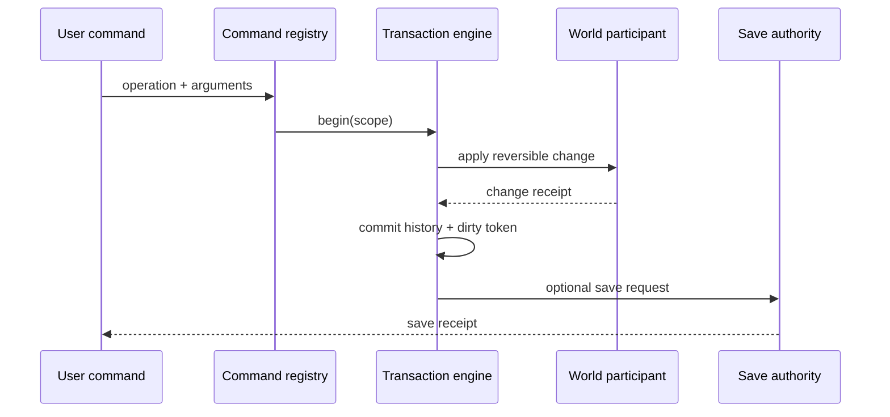

---
related_code:
  - zircon_editor/src/core/editing
  - zircon_editor/src/core/project
  - zircon_runtime_interface/src/world_sync/invalidation.rs
implementation_files:
  - zircon_editor/src/core/editing
  - zircon_editor/src/core/project
plan_sources:
  - docs/wiki/best-practices/editor-transactions-undo-save.md
tests:
  - zircon_editor/src/tests
  - zircon_editor/src/core/editing
doc_type: reference-guide
---

# 编辑器事务、脏状态与保存实践

编辑器的一次用户动作应成为可撤销、可重放、可审计的事务。`EditorTransactionEngine` 负责作用域和 history；project authority 负责保存 authority；runtime gateway 负责把合法变更同步到运行时。三者不能互相越权。

## 事务链



## 决策矩阵

| 操作 | 事务 | dirty | undo |
| --- | --- | --- | --- |
| 单属性修改 | 一个 scope | 是 | 是 |
| 拖拽连续变换 | begin/update/commit | 最终一次 | 一个 history entry |
| 导入资产 | 独立 import transaction | 资产/项目分别标记 | 通常补偿式 |
| 批量脚本修改 | 显式 batch | 一次 token | 可分组 |
| 只读查询 | 不开事务 | 否 | 否 |

## 不变量

1. 未 commit 的 participant 变化对 history 不可见。
2. commit 成功才推进 dirty token。
3. undo/redo 改变 token，但不会伪造“已保存”。
4. 保存只接受当前 authority 和 token；旧 token 的异步保存不能清 dirty。
5. 事务失败执行补偿，不能留下半个 participant。

## API 示例

```rust
let mut tx = editor_transactions.begin(HistoryContextId::new("scene"))?;
tx.add_participant(world_participant)?;
tx.push(EditorOperationInvocation::parse(
    "scene.transform.set_position",
)?.with_arguments(args))?;
let receipt = tx.commit()?;
if receipt.dirty_token().is_some() {
    project.request_save(receipt.dirty_token())?;
}
```

示例对应当前事务 API 的调用形状；具体操作参数由 `EditorCommandDescriptor::operation` 声明。

## 连续交互

拖拽、旋转和刷子工具在 pointer-down 时创建 scope，在 pointer-move 时更新暂存值，在 pointer-up 时 commit；pointer-cancel 执行 rollback。每次 move 不写 history，避免撤销栈污染。工具切换或窗口失焦必须触发 cancel/commit 策略。

## 保存 token

save 请求携带 document id、dirty token、schema version、plugin set digest。写入临时文件、校验 hash、fsync 后原子替换。完成时只有 token 仍等于当前 token 才能清 dirty；若用户在保存期间继续编辑，旧保存 receipt 标记 superseded。

## 反模式

| 反模式 | 后果 | 修复 |
| --- | --- | --- |
| UI 直接改 world | 无 undo/审计 | command + participant |
| 每个 pointer-move 入 history | 撤销栈爆炸 | interaction scope |
| 保存完成即清 dirty | 新编辑被覆盖 | token compare |
| undo 直接写磁盘 | 无法分组/回滚 | undo 仍走事务 |
| participant commit 顺序不定 | 重放不稳定 | descriptor 顺序 + receipt |

## 故障恢复

- participant apply 失败：按已成功 participant 逆序补偿，保留 failure report。
- 文件写入失败：保留 temp 和原文件，dirty 不变。
- 保存 token 过期：丢弃旧 receipt，提示有未保存修改。
- undo history 损坏：加载最近可验证 checkpoint，后续操作进入新 history generation。
- runtime sync 失败：编辑器事务仍可提交，但显示 runtime out-of-date 并支持重试。

## 指标

`transaction_commit_ms`、`rollback_ms`、`history_depth`、`dirty_age_ms`、`save_bytes`、`save_fsync_ms`、`superseded_save_total`、`runtime_sync_lag_ms`。按 operation id 和 document 类型统计，区分交互事务与批处理事务。

## 测试

- 任意 participant 失败都会完全补偿。
- 连续拖拽只生成一个 history entry。
- undo/redo 后 dirty token 与保存状态正确。
- 保存期间新编辑不会被旧 receipt 清除。
- 崩溃恢复能从 checkpoint/backup 继续。
- runtime gateway 断开不破坏 editor history。

## 成熟引擎对照

Unreal editor transaction buffer 把细粒度属性修改聚合为用户动作；Godot UndoRedo 记录可逆方法和参数；Bevy editor 工具通常通过 command/event 把 world 写入集中化。ZirconEngine 还需要把 dirty token、保存 authority 和 runtime sync receipt 纳入同一条可观察链。

## 清单

- [ ] 每个写操作都有 operation descriptor 和 participant。
- [ ] interaction scope 聚合连续输入。
- [ ] commit、undo、redo 都产生 receipt。
- [ ] save token 比较防止旧保存清 dirty。
- [ ] 文件写入使用 temp + fsync + atomic replace。
- [ ] 失败补偿和崩溃恢复有测试。

## 精确来源

- `zircon_editor/src/core/editing`：事务、命令、history。
- `zircon_editor/src/core/project`：project authority 与保存。
- `zircon_runtime_interface/src/world_sync/invalidation.rs`：dirty/invalidation DTO。
- `docs/wiki/best-practices/editor-transactions-undo-save.md`：已有工作流指南。

## 复杂案例：跨场景重命名

跨场景重命名同时更新 hierarchy、引用索引、编辑器标签和运行时镜像。先在事务中收集受影响 document ids，建立 old -> new 映射，再让每个 participant 应用同一映射。任何 participant 失败都按逆序补偿；成功后一次性提交 history 和 dirty tokens。异步保存按 document token 分批，旧 token 不能覆盖新编辑。

## 复杂案例：导入后自动修复

导入器生成 artifact 后，编辑器可创建“修复引用”事务。事务输入必须包含 importer receipt、旧 generation 和修复策略。若 artifact generation 在事务期间变化，操作应返回 stale 并要求重新预览；不要自动把修复应用到新版本。修复记录保存到 history，便于用户撤销但不重新运行导入器。

## Participant 设计

participant 接口应提供 `prepare`、`apply`、`commit`、`rollback` 四个明确阶段。`prepare` 只读验证和分配临时资源；`apply` 改变内存候选状态；`commit` 发布；`rollback` 释放候选并恢复旧快照。participant 不应在 `prepare` 写持久文件，也不应在 `rollback` 依赖网络。

## History 压缩

连续数值变化可保存起点/终点和插值策略，而不是所有中间值。压缩必须保持 undo 语义，且 operation descriptor 版本固定。压缩失败时退回未压缩 entries。history checkpoint 定期写入 canonical snapshot，启动恢复时先验证 checkpoint hash，再重放后续 entries。

## 并发保存与锁

同一 document 只能有一个 writer；不同 document 可并行。保存锁的粒度是 document id，不是全局 editor。UI 显示每个文档的 saving/superseded/error 状态，避免全局 spinner 掩盖单个失败。锁等待纳入 `save_lock_wait_ms` 指标。

## 调试报告字段

事务诊断至少输出 transaction id、history context、operation ids、participant ids、before/after hash、dirty token、save token、runtime sync receipt。报告可以脱敏后附在 bug；不要依赖开发者本地日志上下文。

## Editor profile 差异

交互 profile 允许即时 preview 和较短事务；批处理 profile 允许更大 scope，但必须有 progress、cancel 和 checkpoint；headless profile 禁用 UI participant，只提交 runtime/project participant。profile 差异写入 descriptor，测试矩阵按 profile 执行。

## 交付检查清单（扩展三）

- [ ] participant 四阶段契约可单独测试。
- [ ] 跨 document 映射具有统一 old/new generation。
- [ ] history 压缩保持 undo 等价。
- [ ] checkpoint 有 hash、版本和恢复测试。
- [ ] 保存锁按 document 粒度并可观测。
- [ ] 事务报告足以脱离现场复现。

## 脚本与批处理入口

脚本批量修改必须通过与 UI 相同的 `EditorOperationInvocation` 和 transaction engine。脚本 host 负责限制操作数、总耗时和内存；每个批次保存 checkpoint。脚本异常时只回滚当前 scope，不影响之前已提交且有 receipt 的批次。

## 多用户/外部变更

文件 watcher 或版本控制拉取产生外部变更时，先比较 document hash 和 dirty token。无本地修改可直接 reload；有本地修改进入三方合并事务，冲突作为显式 participant。合并未完成前禁止清 dirty 或覆盖用户文件。

## Undo 与外部资源

事务引用外部 asset 时保存 stable id、generation 和必要的 before snapshot。undo 时若 generation 已变化，不能盲目写回旧 payload；显示“资源已更新”，提供 rebase 或取消。history entry 应标注外部依赖，便于清理和诊断。

## 崩溃恢复

周期性写 checkpoint 和 append-only journal。启动时按 hash 验证 checkpoint，重放 journal，遇到第一条不可验证 entry 停止并生成 recovery report。恢复过程不触发网络、插件副作用或自动保存，用户确认后才提交新文档。

## 事务性能

统计 participant 数量、snapshot bytes、apply/rollback/commit 时间和 history compression ratio。大批量操作优先 chunk 化，但 chunk 边界必须符合用户可理解的撤销语义。超过预算时显示可取消进度，不在主线程阻塞。

## 交付检查清单（扩展四）

- [ ] 脚本与 UI 共享 operation/transaction contract。
- [ ] 外部变更有 hash、dirty token 和三方合并路径。
- [ ] 外部资源引用带 generation，undo 可处理 stale。
- [ ] checkpoint/journal 恢复有 hash 验证和人工确认。
- [ ] 大事务有 chunk、progress、cancel 和性能指标。

## 事务边界与权限

事务 descriptor 还应声明所需 capability、可修改的 document kind 和最大 participant 数。没有编辑权限的命令在 `begin` 前拒绝；不要先修改内存再在 commit 阶段检查权限。批处理命令可以使用较高 quota，但仍不能越过 project authority。

## 选择快照策略

小对象使用结构化 before/after 值；大场景使用 copy-on-write page 或 entity delta；外部二进制只保存 stable id、generation 和 hash。快照策略写入 history entry，恢复时必须使用相同解码器版本，否则报告 incompatible history。

## 通知顺序

事务提交后通知顺序固定为 history -> dirty -> runtime sync -> UI refresh -> autosave suggestion。UI 不应在 world participant 尚未 commit 时刷新；runtime sync 失败也不能撤销已提交 history。通知携带 transaction id，订阅者可去重。

## 取消竞态

commit 与 cancel 同时到达时由 transaction owner 决定 winner。winner 一旦发布不可逆；loser 返回 superseded receipt。测试必须用 barrier 在 prepare/apply/commit 三个阶段注入竞态，确保不会出现两个 winner。

## 交付检查清单（扩展五）

- [ ] descriptor 声明 capability、document kind、participant/quota。
- [ ] 权限在 begin 前检查。
- [ ] 快照策略按对象规模选择并版本化。
- [ ] 提交通知顺序固定且可去重。
- [ ] commit/cancel 竞态只有一个 winner。

## 终验案例

用命令注册表执行“创建实体 -> 修改变换 -> 保存 -> undo -> redo”，同时启动 runtime sync 和文件 watcher。验收 history、dirty、save、runtime receipt 的 transaction id 可串联，任何阶段失败均有明确 owner 和恢复动作。

## 失败注入表

| 注入点 | 预期 |
| --- | --- |
| command parse | 不创建 transaction |
| participant prepare | 无 dirty/history |
| participant apply | 逆序 rollback |
| commit | 一次性推进 token |
| save fsync | dirty 保持 |
| runtime sync | history 保持，显示 out-of-date |

失败注入应在 CI 的编辑器 contract suite 中运行，并保存 transaction report。
