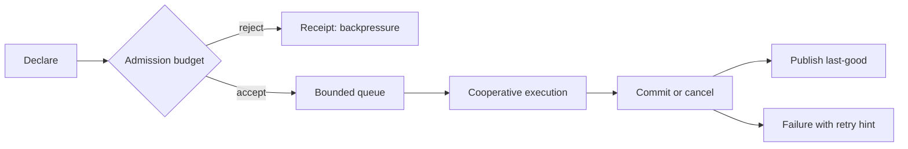

---
related_code:
  - zircon_runtime/src/core/runtime/time.rs
  - zircon_runtime/src/core/runtime/lifecycle.rs
  - zircon_runtime/src/core/runtime/handle/resolution.rs
implementation_files:
  - zircon_runtime/src/core/runtime
plan_sources:
  - docs/wiki/mechanisms/frame-data-event-time-flow.md
tests:
  - zircon_runtime/src/core/runtime/tests
doc_type: reference-guide
---

# 生命周期、取消与背压实践

运行时工作不是“提交后一定完成”的单向调用，而是从 admission、排队、执行到提交/取消的有限状态机。调用方要明确谁拥有任务、谁可以取消、哪些结果可以丢弃，以及关闭时最后一个合法观察点在哪里。

## 生命周期模型

| 阶段 | owner | 可取消 | 对外可见 |
| --- | --- | --- | --- |
| Declared | descriptor/registry | 是 | 仅诊断 |
| Admitted | scheduler | 是 | 队列长度 |
| Running | module/service | 仅协作式 | progress |
| Committing | owner | 否或补偿 | receipt |
| Published | consumer | 否 | last-good |
| Revoked | runtime | 已取消 | failure reason |



## 决策矩阵

| 工作类型 | 队列 | 取消方式 | 重试 |
| --- | --- | --- | --- |
| 交互输入 | 丢弃旧值的 latest-only | sequence token | 不重试旧输入 |
| 资产导入 | 有界 FIFO | `CancellationToken`/阶段检查 | 从失败阶段恢复 |
| GPU 提交 | submission 顺序 | fence 之前撤销 | 只重建未提交资源 |
| 编辑器保存 | 单写者队列 | 保存前可撤销 | 使用 dirty token |
| 后台扫描 | 低优先级队列 | 关闭时取消 | 指数退避 |

## 背压不变量

1. 队列必须有上限；无限 `VecDeque` 不是策略。
2. 每个 admission 拒绝都生成可诊断 receipt。
3. 取消是幂等的；重复取消不改变已提交结果。
4. 已发布结果不能被“取消”倒滚，必须发布补偿事件。
5. 关闭从拒绝新 admission 开始，而不是先销毁 owner。

## Rust 调用形状

```rust
struct WorkReceipt { id: u64, accepted: bool, reason: Option<String> }

fn submit_bounded(queue: &mut std::collections::VecDeque<Job>, job: Job,
                  capacity: usize) -> WorkReceipt {
    if queue.len() >= capacity {
        return WorkReceipt { id: job.id(), accepted: false,
            reason: Some("queue_full".into()) };
    }
    let id = job.id();
    queue.push_back(job);
    WorkReceipt { id, accepted: true, reason: None }
}
```

示例表达 admission 语义；实际 runtime 应把队列交给模块 owner，并在 frame boundary 采样长度。

## 协作式取消

长任务每个可观测阶段检查取消标记：扫描文件、解码、转换、写 artifact、发布索引。检查点返回 `Cancelled { stage, bytes_processed }`，让 UI 解释“已取消于解码 42%”，而不是笼统失败。

不要在任意线程直接释放共享资源。取消请求只改变 token，资源释放仍由 owner 在安全边界执行。

## 时间预算

`tick_time`/`advance_time_by` 建立 frame snapshot。将每项任务绑定 `budget_us`，超过预算时把未处理输入留在队列，并记录 `over_budget_count`。不要用 wall clock 直接改变模拟状态；固定步进应使用 snapshot 的 `fixed_step_budget`。

## 反模式与恢复

| 反模式 | 症状 | 修复 |
| --- | --- | --- |
| 无限重试 | CPU 飙升、日志洪水 | 最大尝试次数 + 抖动退避 |
| 强制线程终止 | mutex 泄漏、状态半写 | 协作式 token |
| 取消后立即删除 artifact | 旧引用失效 | 保留 last-good，延迟清理 |
| 以队列长度代替进度 | 用户看到假进度 | 阶段/字节/实体计数 |
| 任务持有 service guard 到结束 | shutdown 永不完成 | 分段解析，短 guard |

关闭剧本：停止生产者、关闭 admission、等待短任务、取消长任务、等待 drain deadline、记录未完成 job id，最后才销毁模块。

## 指标

`queue_depth`、`queue_reject_total`、`job_age_ms`、`cancel_latency_ms`、`budget_overrun_total`、`drain_remaining`、`last_good_generation`。按 module、job kind、priority 维度打点；不要只看平均值，至少看 p95/p99。

## 测试

- 容量为 0、1、N 时 admission 结果确定。
- 取消发生在每个阶段都不会发布半成品。
- 关闭期间不再接受新任务，已有任务可在 deadline 内 drain。
- 预算耗尽后下一帧能继续，且结果顺序稳定。
- 重复取消、重复提交 receipt 均幂等。

## 成熟引擎对照

Unreal 的任务图强调依赖和取消传播；Bevy 的 schedule 将系统放在明确阶段；Godot 的 threaded resource loader 通过状态轮询和取消避免阻塞主线程。ZirconEngine 应保留同样的阶段边界，同时利用 module shutdown/drain 约束原生插件。

## 清单

- [ ] 每类异步工作有 owner、队列上限和取消 token。
- [ ] admission 拒绝可见且可统计。
- [ ] 结果只在 commit 后发布，取消不破坏 last-good。
- [ ] 所有循环受 frame/time budget 限制。
- [ ] shutdown 顺序在测试中被锁定。
- [ ] 指标含 job kind、generation 和阶段。

## 精确来源

- `zircon_runtime/src/core/runtime/time.rs`：frame snapshot 与时间策略。
- `zircon_runtime/src/core/runtime/lifecycle.rs`：module lifecycle 与 cleanup。
- `zircon_runtime/src/core/runtime/handle/resolution.rs`：in-flight drain。
- `zircon_runtime/src/core/runtime/tests`：时间、关闭和生命周期回归。

## API 参数说明

| API/概念 | 输入 | 结果 | 责任 |
| --- | --- | --- | --- |
| `ModuleLifecycle::build/ready` | module context | phase receipt | 只在声明依赖满足后推进 |
| `tick_time` | frame delta/policy | `FrameTimeSnapshot` | 使用 snapshot，不读共享时钟 |
| `shutdown_registered_modules_with_drain_timeout` | deadline | shutdown report | 记录未 drain 的模块 |
| admission gate | job metadata | accepted/rejected | 向调用方返回原因 |

## 取消协议

取消 token 包含 `request_id`、`generation` 和 `reason`。子任务只能观察 token，不能清除父任务取消。父任务取消后，所有派生任务最终都要返回 cancelled 或 committed；不能出现“父已取消、子仍无限运行”。取消原因至少有 user、superseded、shutdown、budget 和 dependency_failed。

## 背压策略

| 策略 | 适用 | 丢弃规则 | 用户反馈 |
| --- | --- | --- | --- |
| latest-only | 光标/resize | 保留最新 | 无需逐项显示 |
| coalesce | 同一资源 reload | 合并 generation | 显示正在更新 |
| bounded FIFO | 导入/保存 | 不丢数据 | 显示队列位置 |
| priority queue | 交互优先 | 低优先级延迟 | 显示后台进行中 |

禁止把所有工作塞进同一个全局 FIFO；渲染、输入和导入需要独立预算，避免低优先级扫描阻塞交互。

## 关闭顺序

```text
stop producers
  -> close admission
  -> publish cancellation
  -> drain short jobs
  -> wait until deadline
  -> revoke services
  -> cleanup modules
```

服务 revoke 必须发生在新 admission 关闭之后；否则新调用会在清理期间进入已销毁状态。cleanup_until 只负责有限时间的最后机会，不能成为无限重试循环。

## 幂等与重试

每个 job 带幂等 key。重试前检查 receipt 是否已经 committed；若已提交，返回原 receipt 而不是再次写入。外部 IO 采用指数退避并加入随机抖动；配置错误和 capability deny 不重试。重试次数、首次时间和最终阶段写入诊断。

## 负载测试

构造生产速率高于消费速率的压测，观察队列是否稳定在上限。测试突发 10x 输入、长尾任务、随机取消和同时 shutdown。验收条件是：内存有上限、拒绝可解释、取消延迟有界、last-good 不被破坏。

## 常见恢复剧本

### superseded

新 generation 到达时取消旧 job；旧 job 到达 commit 时比较 generation，若过期只释放临时资源并返回 stale。

### dependency failed

停止父 job，保留已成功子 artifact；依赖修复后只重跑受影响 component，不全量清空缓存。

### budget exceeded

保存 cursor（文件偏移、实体索引或 pass id），下一帧从 cursor 继续。cursor 必须绑定 generation，防止旧输入恢复到新资源。

## 指标解释

`job_age_ms` 衡量等待而非执行；`cancel_latency_ms` 从请求到 owner 观察 token；`drain_remaining` 是尚未释放的 in-flight 数。所有指标按 priority 分组，否则平均值会掩盖交互队列饥饿。

## 交付检查清单（扩展）

- [ ] token 有 request/generation/reason。
- [ ] 每个队列有容量、优先级和拒绝策略。
- [ ] job cursor 可恢复且绑定 generation。
- [ ] retry 只针对可重试错误并幂等。
- [ ] shutdown 顺序有并发测试。
- [ ] 压测覆盖突发、长尾、取消和断电模拟。

## Job 描述模板

每个可调度 job 至少声明 `kind`、`priority`、`request_id`、`source_generation`、`deadline`、`estimated_cost`、`cancel_reason` 和 `idempotency_key`。缺少 estimated cost 的 job 只能进入低优先级队列；缺少 deadline 的外部 IO 不得在 runtime profile 中运行。

## 优先级反转

高优先级 job 依赖低优先级 job 时，调度器应临时提升依赖优先级或返回 blocked receipt。不要让高优先级线程同步等待低优先级队列。指标记录 priority inversion 次数和等待链，排障时可画出依赖 DAG。

## 生产速率控制

生产者根据 queue watermark 调整速率：低于 low watermark 正常生产，高于 high watermark 限速或合并，达到 capacity 直接拒绝。watermark 变化要有 hysteresis，避免在边界来回抖动。每个 producer 都收到明确的 retry-after。

## 取消与资源清理

取消检查点之后创建的资源必须挂在 job-local arena；job 返回 cancelled 时 arena 一次性释放。已转移给 owner 的资源不能由 worker 释放。测试用资源计数器验证取消路径和成功路径最终数量相同。

## Deadline 传播

父 job 的 deadline 传给子 job，子 job 可更早结束但不能延后。跨线程传递 deadline 使用 monotonic instant，不使用 wall-clock 时间戳。超时错误携带 elapsed、remaining 和 stage，调用方据此选择降级或重试。

## 恢复演练

每个季度用故障注入演练：导入队列满、渲染线程停顿、插件 callback 超时、磁盘满、runtime 被提前关闭。验收不仅是恢复成功，还要检查用户看到的状态、日志 correlation、临时文件和内存是否归还。

## 调度器 review 清单

- [ ] job 字段完整且有默认上限。
- [ ] 优先级依赖不会造成反转。
- [ ] watermark 有 hysteresis 和 retry-after。
- [ ] deadline 使用 monotonic clock 并向下传播。
- [ ] cancel 释放 job-local 资源且不释放 owner 资源。
- [ ] 故障演练结果归档到 release evidence。

## Runbook

发现队列持续满时先确认 producer、consumer、priority 和 job age，再选择限速、合并、扩容或降级。不要盲目增大容量；若 job age 已超过用户可接受窗口，应取消旧 job 并保留最新意图。关闭问题优先检查仍持有 guard 的线程和未完成 callback。

## 设计审查问题

- 每个等待是否有 deadline？
- 每个拒绝是否有 retry-after 或不可重试原因？
- 取消后是否有 owner 负责清理？
- 重试是否幂等并绑定 generation？
- 背压是否按 priority 隔离？

## 最小验收

以 4 倍生产速率运行 15 分钟，注入随机取消和 shutdown。验收内存稳定、拒绝比例可解释、cancel latency 有界、所有 in-flight 最终归零。
