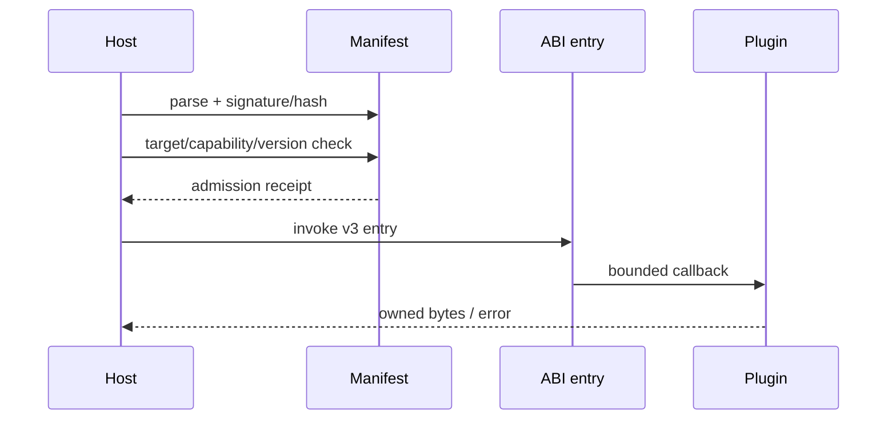

---
related_code:
  - zircon_plugins/plugin_sdk/src
  - zircon_runtime/src/plugin
  - zircon_runtime_interface/src/version.rs
implementation_files:
  - zircon_plugins/plugin_sdk/src
  - zircon_runtime/src/plugin
plan_sources:
  - docs/wiki/best-practices/plugin-manifest-capabilities-native-abi.md
tests:
  - zircon_plugins/plugin_sdk/src
  - zircon_runtime/src/plugin
doc_type: reference-guide
---

# 插件 ABI、安全与能力实践

插件边界是信任边界。manifest 声明“插件是谁、需要什么、支持什么”；ABI 表定义“如何调用、谁分配/释放内存”；capability 决定“允许做什么”。三者必须独立校验。

## 加载闸门



## 决策矩阵

| 风险 | 默认策略 | 失败动作 |
| --- | --- | --- |
| 未知 capability | deny | 不加载 |
| ABI major 不兼容 | deny | 提示升级 |
| ABI minor 不兼容 | capability negotiation | 降级可选功能 |
| callback panic | catch boundary | 记录并撤销插件 |
| 外部 buffer | host-owned wrapper | 拷贝或拒绝 |

## Manifest 示例

```toml
[plugin]
id = "com.example.texture"
abi = 3
entry = "zircon_plugin_texture_runtime_entry_v3"
capabilities = ["runtime.asset.importer.texture.container"]
targets = ["runtime", "editor"]
```

字段只是示意，真实 schema 以 `PluginModuleManifest` 与 SDK 校验器为准。版本号必须与导出符号和 host function table 同时检查。

## 内存与 ABI

跨动态库边界传递 `Vec<u8>`、Rust trait object 或含 Rust 布局的 struct 都是不安全的。使用 `NativePluginHostFunctionTableV3` 提供的 host allocator 和 `owned_bytes`，由分配方提供释放函数。buffer 必须带长度、容量、ABI 版本和 owner token。

```rust
let payload = zircon_plugins::plugin_sdk::owned_bytes(bytes)?;
host.submit(payload); // host 负责最终释放
```

示例强调 ownership，不承诺所有 SDK 路径名称完全一致。

## 能力最小化

能力字符串采用稳定命名空间；新增能力只能扩大声明，不应让 host 根据插件 id 猜权限。运行时和编辑器能力分开，导入器只拿到输入文件、artifact 写入和诊断权限，不应获得任意 world 写权限。

## 反模式

| 反模式 | 后果 | 修复 |
| --- | --- | --- |
| `pub extern "C" fn` 手写 buffer | allocator mismatch | SDK wrapper |
| capability 只在 UI 隐藏 | 恶意插件仍可调用 | host admission deny |
| callback 捕获 `&mut Host` | 重入/借用冲突 | handle + bounded call |
| panic 穿过 ABI | 进程未定义行为 | `catch_native_callback_panic` |
| 静默接受未知字段 | 配置绕过审计 | strict parse + warning |

## 故障恢复

加载失败保留 manifest digest 和拒绝原因；callback 超时则撤销 admission、等待 in-flight drain；插件崩溃后隔离其缓存和临时文件，重启时采用 quarantine 列表。升级过程先加载新 generation，验证健康后再撤销旧实例。

## 指标

`plugin_load_ms`、`manifest_reject_total`、`capability_denied_total`、`abi_callback_ms`、`callback_panic_total`、`buffer_bytes_inflight`、`plugin_quarantine_total`。日志必须包含 plugin id、ABI、manifest hash 和 generation。

## 测试

- 每个 ABI major/minor 组合都有兼容性矩阵。
- 未声明 capability 的调用在 host 层被拒绝。
- 乱序/重复释放 buffer 不会 double free。
- callback panic 被捕获且插件可撤销。
- 恶意超长 payload、无效 UTF-8、未知字段都返回结构化错误。

## 成熟引擎对照

Unreal 模块加载器和插件描述文件把依赖/版本放在 host；Godot GDExtension 以稳定 C ABI 和显式初始化函数隔离 Rust/C++ 布局；Bevy 动态库生态也倾向 C-compatible facade。ZirconEngine 应保持 manifest、capability、ABI 三层闸门，不将安全寄托在约定。

## 清单

- [ ] manifest 有 id、ABI、目标、capability、digest。
- [ ] 所有跨边界数据使用 C-compatible owner 语义。
- [ ] callback panic/timeout 可捕获和撤销。
- [ ] capability 默认 deny，最小授权。
- [ ] 升级采用双 generation 健康检查。
- [ ] 拒绝原因和指标可检索。

## 精确来源

- `zircon_plugins/plugin_sdk/src`：native ABI、owned buffer、panic boundary。
- `zircon_runtime/src/plugin`：manifest、capability 和加载契约。
- `zircon_runtime_interface/src/version.rs`：ABI 版本常量。

## API 参数说明

| 接口 | 作用 | 调用边界 | 失败处理 |
| --- | --- | --- | --- |
| `runtime_plugin_descriptor` | 描述 id/版本/目标 | host parse | deny |
| `runtime_capabilities` | capability 声明 | admission | 缺失即拒绝 |
| `native_dist_runtime_plugin_v3!` | 生成入口 | C ABI | 不手写导出 |
| `NativePluginHostFunctionTableV3` | host services | 版本化 table | 缺函数则降级 |
| `catch_native_callback_panic` | 捕获 panic | ABI boundary | quarantine |

## 信任模型

区分 signed plugin、workspace plugin、开发模式 plugin。签名证明来源，不证明行为；capability 仍需最小化。开发模式可允许未签名，但必须显示警告、隔离目录并禁用生产密钥访问。

## 兼容矩阵

| Host ABI | Plugin ABI | 结果 |
| ---: | ---: | --- |
| 3.x | 3.x | 允许，按 capability 协商 |
| 3.x | 2.x | 拒绝或走显式 shim |
| 2.x | 3.x | 拒绝 |
| unknown | any | 拒绝 |

minor 字段新增必须有 `has_*`/长度保护；host function table 尾部扩展，不能改变已有字段顺序或 calling convention。

## 资源限制

manifest 可声明最大内存、callback 时间、并发任务、文件范围和网络权限。host 必须执行限制，而不是只记录。超限返回 quota error，插件进入冷却或 quarantine；不能让单插件拖垮主线程。

## 重入与线程

ABI callback 默认不可重入；若允许重入，必须在 manifest 和 host table 中显式声明。回调期间不能持有 host 全局锁调用插件。线程模型写入 descriptor，所有异步 callback 带 generation 和 cancellation token。

## 安全测试

- fuzz manifest parser、长度字段、未知枚举和 UTF-8。
- 传入空指针、未对齐指针、超大长度，验证 host 拒绝。
- callback panic、超时、递归重入、重复释放。
- capability 越权尝试访问 world、文件和网络。
- plugin unload 与 in-flight callback 并发。

## 事件与审计

审计事件包含 plugin id、publisher、manifest hash、ABI、capability、host decision、reason、generation。payload 内容只记录 hash/size。生产日志应能回答“谁在何时请求了哪项 capability，结果是什么”。

## 交付检查清单（扩展）

- [ ] ABI major/minor matrix 有自动化测试。
- [ ] capability 和 resource quota 在 host 强制执行。
- [ ] buffer owner、长度、释放函数明确。
- [ ] panic/timeout/reentrancy 有隔离策略。
- [ ] 签名、digest、quarantine 状态可审计。
- [ ] 生产与开发加载模式明确区分。

## 导出符号和命名

导出符号包含插件 family、目标、ABI major，例如 `*_runtime_entry_v3`。名称稳定后不得复用到不兼容实现。manifest `entry` 和实际动态库导出必须双向校验，避免 host 按猜测 symbol 加载。crate/package 名称用于诊断，不应成为授权依据。

## Host 函数表演进

函数表头包含 ABI version、struct size 和 feature bits。插件调用前先检查 host size 是否覆盖目标函数；host 新增尾部函数时老插件仍能运行。移除函数改为 feature bit 关闭，不能留下悬空函数指针。

## 文件与网络策略

导入器只可读取 host 分配的输入句柄，写入 host 提供的 artifact staging 区。网络能力独立声明且默认关闭；任何 URL 需经过 allowlist、大小限制和 timeout。不要把 OS path 或环境变量原样暴露给插件。

## Quarantine 生命周期

首次 panic/越权记录事件并停止当前任务；重复故障进入 quarantine，下一次启动前不自动加载。用户可在诊断界面手动启用开发插件，但生产 profile 不应绕过 quarantine。解除隔离需要新 digest 或明确管理员操作。

## 交付检查清单（扩展二）

- [ ] entry symbol 与 manifest 双向匹配。
- [ ] host table 有 version、size、feature bit。
- [ ] 文件/网络仅通过受限 host handle。
- [ ] quarantine 不能被普通自动重试绕过。
- [ ] 审计不记录敏感 payload。

## 入口实现审查

入口函数第一步应验证 ABI header、pointer/length、manifest generation 和 host table size；第二步建立 callback scope；第三步调用插件行为；最后将 panic/error 转换为稳定 receipt。入口不应执行复杂业务、读取全局环境或隐式加载其他插件。

## Capability 分组

能力按 read、write、execute、network 四类分组。read 也要限定对象范围，write 需要 staging/commit，execute 需要时间和内存 quota，network 需要域名 allowlist。新增 capability 先进入 deny-by-default 阶段，观察实际调用后再纳入生产 profile。

## 插件数据隔离

每个插件拥有独立 cache/staging/log namespace。插件卸载时清理临时文件和 in-flight handles，但保留审计摘要。一个插件产生的 asset artifact 必须通过 host importer receipt 才能进入公共索引，不能直接写 registry 文件。

## 升级与回滚

升级顺序是下载、校验签名/digest、解析 manifest、静态 capability 审查、加载新 generation、健康探测、切换流量、撤销旧 generation。健康探测失败时删除新临时状态并恢复旧插件；旧插件仍需保留到所有 in-flight callback drain 完成。

## 威胁建模表

| 威胁 | 控制 | 证据 |
| --- | --- | --- |
| 恶意 manifest | strict parser + deny | parser fuzz |
| 越权文件 | host path sandbox | negative test |
| allocator mismatch | owned buffer | ASan/valgrind |
| callback hang | deadline/watchdog | timeout test |
| stale callback | generation gate | unload race test |
| 日志泄露 | field redaction | snapshot audit |

## 开发体验

SDK 应提供 manifest builder、capability constants、entry macro、owned buffer、panic catcher 和 test host。开发者不应复制 host table 定义到自己的 crate。示例项目必须覆盖拒绝、降级和 cleanup，而不只展示 happy path。

## 交付检查清单（扩展三）

- [ ] 入口顺序是 validate -> scope -> invoke -> receipt。
- [ ] capability 按 read/write/execute/network 最小授权。
- [ ] plugin cache/staging/log 隔离。
- [ ] 升级有健康探测、drain 和回滚。
- [ ] 威胁模型每项有测试证据。
- [ ] SDK 提供统一 builder/wrapper，禁止复制 ABI。

## 运营 Runbook

插件故障时先按 manifest digest 定位版本，再查看 capability decision、callback latency、panic 和 quarantine 事件。禁止直接删除插件目录来“修复”；先停止 admission、drain、导出审计和临时文件清单，再回滚到上一健康 generation。

## 发布审查问题

- entry symbol、ABI、struct size 是否一致？
- 新 capability 是否有最小授权和 deny 测试？
- 所有 buffer 是否可证明 owner 与释放函数？
- timeout/panic/reentrancy 是否不会穿过边界？
- 回滚是否保留旧插件直到 drain 完成？

## 最小验收

运行 100 次加载/卸载循环，随机注入 callback panic、超时、无效 buffer 和越权 capability。验收进程不崩溃、无 double free、无强引用泄漏，quarantine 和恢复报告可读。
