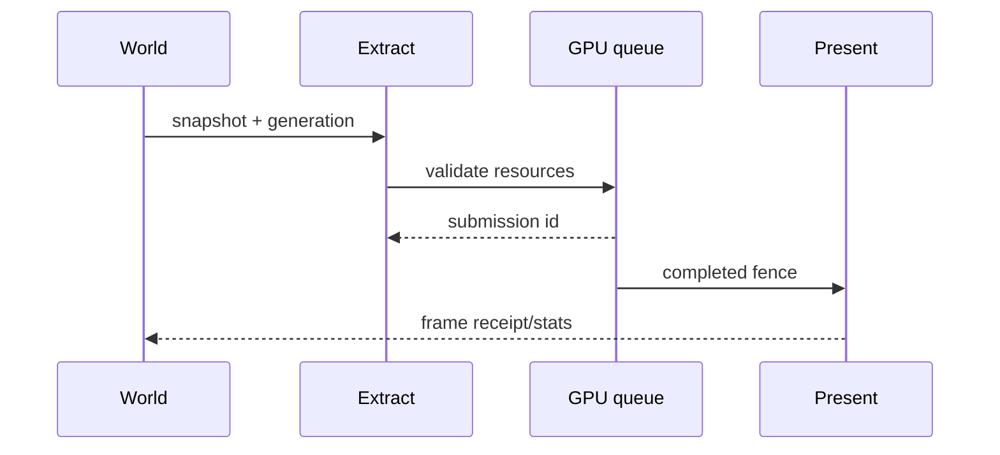

---
related_code:
  - zircon_runtime/src/graphics
  - zircon_runtime/src/core/runtime/time.rs
implementation_files:
  - zircon_runtime/src/graphics
plan_sources:
  - docs/wiki/best-practices/rendering-resource-lifetime-performance.md
tests:
  - zircon_runtime/src/graphics/tests
doc_type: reference-guide
---

# 渲染资源、帧预算与提交实践

渲染 API 的稳定边界是 `RenderFramework` 的 viewport、extract、present、stats 操作。资源创建、帧提取和呈现必须区分，否则“提交成功”会被误认为“GPU 已完成”。

## 帧管线



## 决策矩阵

| 资源 | 生命周期 owner | 失效依据 | 预算 |
| --- | --- | --- | --- |
| viewport/surface | render framework | surface generation | 数量、像素面积 |
| mesh/texture | asset + GPU cache | asset generation/device | bytes |
| transient buffer | frame allocator | frame index | per-frame bytes |
| UI draw list | UI extract | tree revision | commands/vertices |

## 三个完成点

1. `extract accepted`：CPU 快照已进入渲染队列。
2. `submitted`：GPU submission id 已分配。
3. `presented`：交换链完成呈现。

`query_stats` 仅用于诊断采样，不能替代 fence。上层状态机应保存 submission id 与 frame index。

## 示例

```rust
use zircon_runtime::core::framework::render::{RenderFramework, RenderViewportDescriptor};
use zircon_runtime::core::math::UVec2;

let viewport = renderer.create_viewport(
    RenderViewportDescriptor::new(UVec2::new(1280, 720)).with_label("main"),
)?;
// submit_frame_extract 和 present_frame_extract 是两个消费路径；每个调用各自取得一个 owned extract。
renderer.submit_frame_extract(viewport, extract)?;
let stats = renderer.query_stats()?;
```

若要直接呈现到已绑定的 Surface，在另一个帧边界调用
`renderer.present_frame_extract(viewport, present_extract)?`。两个方法都返回 `Result<(), RenderFrameworkError>`，不会返回可代替 GPU fence 的 receipt。

## 资源不变量

- render thread 只消费已验证 generation 的资源。
- surface 重建期间，旧 viewport 不再接收新的 extract。
- transient 资源不得跨 frame 持有。
- present 失败保留 CPU world 和 last-good frame，可在下一帧重试。
- device lost 后所有 GPU payload 标记失效并重新上传。

## 帧预算

建议拆分 CPU update、extract、submit、present、UI layout、GPU wait 六类预算。每类记录 p50/p95/p99、overrun 次数和 backlog。固定时间策略来自 `FrameTimeSnapshot`，不要在 render thread 读取未校正 wall clock。

| 指标 | 目标示例 | 处置 |
| --- | --- | --- |
| extract p99 | < 2 ms | 降低查询批量 |
| submit backlog | < 2 frames | 合并 draw/提高并发 |
| GPU wait p99 | < 4 ms | 降低分辨率或资源上传 |
| transient peak | < budget | 复用 arena |
| present miss | 0 | 触发降级策略 |

## 反模式

| 反模式 | 结果 | 修复 |
| --- | --- | --- |
| 每个实体立即创建 GPU buffer | 分配抖动 | frame batch + cache |
| 以 CPU receipt 当 fence | 提前释放资源 | 等 completed fence |
| surface resize 时继续 present | 黑帧/设备错误 | generation gate |
| stats 每 draw 查询 | pipeline stall | 帧尾采样 |
| 将 upload 放在 UI 回调 | 输入卡顿 | 异步 staging 队列 |

## 故障恢复

- surface lost：unbind，创建新 surface，提升 generation，再绑定 viewport。
- shader 编译失败：保留旧 pipeline，报告 source line 和 variant key。
- 显存超预算：先淘汰可重载资源，再降低 streaming quality，最后阻止新 admission。
- present timeout：丢弃当前 transient，重放最近 world snapshot。

## 测试

- viewport create/destroy 顺序与重复 destroy。
- surface generation 变化后旧 extract 被拒绝。
- submission、present、stats 顺序不会被打乱。
- budget overrun 只影响调度，不破坏资源 ownership。
- device lost 模拟后 last-good CPU 状态仍可重建。

## 成熟引擎对照

Unreal Render Graph 通过 pass lifetime 和 transient allocator 管理资源；Bevy RenderApp 分离 extract/prepare/queue；Godot 的 RenderingDevice 以显式 RID 和同步边界表达资源。ZirconEngine 的 extract/present API 应保持同样的阶段可见性，并把 generation 纳入 surface/resource identity。

## 清单

- [ ] 明确 extract、submit、present 三个完成点。
- [ ] 每种资源都有 owner、generation 和预算。
- [ ] 不用 stats 推断 GPU 完成。
- [ ] surface/device lost 有 last-good 与重建路径。
- [ ] 帧预算按阶段采样 p95/p99。
- [ ] transient 不跨帧，upload 不阻塞 UI。

## 精确来源

- `zircon_runtime/src/graphics`：`RenderFramework` 与 viewport/frame API。
- `zircon_runtime/src/core/runtime/time.rs`：帧时间快照。
- `zircon_runtime/src/graphics/tests`：提交、呈现和资源生命周期测试。

## API 参数说明

| API | 输入 | 输出 | 关键检查 |
| --- | --- | --- | --- |
| `create_viewport` | surface descriptor | viewport handle | format/size/device |
| `submit_frame_extract` | viewport + extract | submission receipt | resource generation |
| `bind_viewport_surface` | viewport + surface | bind receipt | surface generation |
| `present_frame_extract` | viewport + submission | present receipt | completed fence |
| `query_stats` | viewport | diagnostic snapshot | 非同步完成证明 |

## 帧内资源分类

将资源分为 persistent、streaming、transient、readback。persistent 由资产 owner 管理；streaming 允许降级；transient 只在当前 frame 有效；readback 必须标记 fence。任何跨 frame 的引用都要经过 resource registry，而不是保存 GPU 原始句柄。

## Draw 与批处理

按 pipeline、material、texture set 排序，但保留透明物体的深度约束。批处理键必须包含 shader variant 和 surface format；遗漏任一字段会造成错误重用。UI draw list 可合并相邻 clip/scissor 相同的命令，不能跨窗口合并。

## 上传策略

大资源使用 staging ring，按 frame budget 分片；每片带 source generation。上传完成前消费者看到 last-good；generation 不同则丢弃旧片。读回操作放入低优先级队列，避免同步 map 阻塞 render thread。

## 预算分配示例

| 类别 | 60 FPS | 120 FPS | 触发降级 |
| --- | ---: | ---: | --- |
| CPU extract | 3 ms | 1.5 ms | 减少可见查询 |
| GPU passes | 12 ms | 6 ms | 降分辨率 |
| upload | 2 ms | 1 ms | 延迟 streaming |
| UI layout | 2 ms | 1 ms | 冻结非关键面板 |
| present margin | 1 ms | 0.5 ms | 丢弃过期 frame |

数值是 profile 起点，不是硬编码常数；产品 profile 应在启动 receipt 中声明。

## RenderGraph 不变量

- pass 读取的资源必须先由 prepare/queue 阶段声明。
- 写后读和读后写依赖显式存在。
- transient alias 只能发生在生命周期不重叠时。
- barrier 由图生成，业务代码不手写跨队列同步。
- graph compile 失败不清空上一次可呈现图。

## 故障注入

测试中注入 surface resize、device lost、shader compile fail、OOM、present timeout。每种故障都应验证：错误 receipt、last-good frame、资源释放、下一帧是否能恢复，以及日志是否包含 surface/device generation。

## 性能剖析方法

CPU 使用 tracing span 包住 extract/prepare/queue/present；GPU 使用 timestamp query 或平台 profiler。比较 GPU busy、等待、带宽和 descriptor churn。仅看 FPS 无法定位 CPU 阻塞或 GPU 空转。

## 交付检查清单（扩展）

- [ ] 资源类型、owner、generation、fence 已写明。
- [ ] persistent/transient/readback 不混用。
- [ ] submission 与 presented 有独立 receipt。
- [ ] 图编译失败保留 last-good。
- [ ] 上传、UI、GPU 等预算有 profile 配置。
- [ ] 故障注入覆盖 device/surface/shader/OOM。

## Frame graph 审查问题

每个 pass 审查输入资源、输出资源、读写状态、队列、预算和 fallback。若 pass 只能在某平台执行，descriptor 标注 capability；graph compiler 在构建期拒绝未满足能力，而不是在 GPU 线程 panic。调试视图展示拓扑、barrier 和 resource lifetime。

## 多窗口策略

窗口拥有独立 surface generation、frame budget 和 present cadence。共享 GPU 资源可以引用同一 asset generation，但不能共享 viewport handle。后台窗口可降频或暂停 present；恢复时丢弃过期 transient，重建 extract。

## 降级等级

定义 full、balanced、low、safe 四级 profile。显存压力优先降低 streaming mip，GPU 超时再降低分辨率/后处理，CPU extract 超时减少可见查询。每次降级生成 receipt，恢复采用滞回阈值避免抖动。

## 捕获与回放

帧捕获保存 world snapshot、asset generations、pipeline keys、surface descriptor 和 input sequence。回放禁止读取实时 wall clock；使用 snapshot time policy。捕获文件不应包含指针或设备地址，保证跨机器诊断。

## 交付检查清单（扩展二）

- [ ] pass 输入/输出/barrier/budget 可审查。
- [ ] 多窗口不共享 viewport identity。
- [ ] 降级等级和滞回阈值写入 profile。
- [ ] capture/replay 不依赖实时 clock 或设备地址。
- [ ] graph compiler 的 capability deny 有测试。

## 预算配置版本

预算属于 product profile，不应散落在 pass 实现的 magic numbers 中。配置包含 target FPS、分辨率等级、CPU/GPU/upload/UI budgets、降级阈值和恢复滞回。启动 receipt 写入 profile digest，性能报告必须指明使用哪一版配置。

## 交付检查清单（扩展三）

- [ ] 预算集中在 profile，并带 digest。
- [ ] pass 实现只读取预算，不硬编码产品阈值。
- [ ] 报告包含 profile、平台、驱动和 GPU 型号。
- [ ] 降级/恢复有滞回和回归测试。

## 终验案例

录制一段包含窗口 resize、资产 reload、UI 更新和 device lost 的 frame capture，分别在 full 与 low profile 回放。验收资源 generation 不错配、last-good frame 可见、预算 receipt 完整，回放不依赖实时设备地址。

## 调试输出模板

```text
frame=1842 profile=balanced surface_gen=7
extract=1.42ms submit=2.10ms present=3.87ms gpu_wait=0.91ms
draws=842 vertices=182k transient=18.4MB backlog=1
fallback=none resource_stale=0
```

## 运营 Runbook

出现黑帧先区分 extract 未接受、submit 未完成、surface generation 失效和 present 失败。导出 frame receipt、resource generations、surface descriptor 与 GPU timestamps，再决定重放 snapshot、重建 surface 或降级 profile。不要先清空整个 GPU cache。

## 审查问题

- 每个 GPU resource 是否有 owner、fence 和 device generation？
- transient 是否跨帧泄漏？
- UI 与 world 是否共享错误的 surface/viewport？
- 预算超限是否产生 receipt 而非静默丢帧？
- capture 是否能在另一台机器重放？

## 最小验收

运行 60/120 FPS profile，各执行 resize、device lost、shader fail、OOM 注入 100 次。验收没有 use-after-free，last-good 可呈现，恢复时间和峰值内存处于预算内。

## 失败注入表

| 注入点 | 预期 |
| --- | --- |
| extract validation | 拒绝当前 receipt，保留上一帧 |
| resource generation | 丢弃旧资源，不释放新资源 |
| graph compile | 使用 last-good graph |
| submit timeout | 清理 transient，下一帧重放 |
| present failure | 重建 surface generation |
| device lost | 重建 GPU payload |

每项注入都记录 frame id、surface generation、resource generations 和 profile digest。
