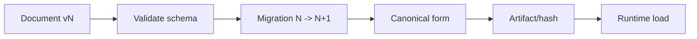

---
related_code:
  - zircon_runtime_interface/src/serialization/mod.rs
  - zircon_runtime_interface/src/version.rs
  - zircon_runtime/src/asset/project
implementation_files:
  - zircon_runtime_interface/src/serialization/mod.rs
  - zircon_runtime/src/asset/project
plan_sources:
  - docs/wiki/app-runtime-api/serialization-contracts.md
tests:
  - zircon_runtime_interface/src
  - zircon_runtime/src/asset/tests
doc_type: reference-guide
---

# 序列化、版本迁移与兼容性实践

序列化格式是跨进程、跨版本的公开接口。区分 wire schema、编辑器文档、运行时 artifact 和缓存格式；它们的兼容承诺不同，不能用同一套“尽量反序列化”策略。

## 格式分层

| 格式 | 读写方 | 兼容承诺 | 失败策略 |
| --- | --- | --- | --- |
| wire DTO | runtime/editor | 向后兼容 | 结构化拒绝 |
| project document | 人类/编辑器 | 可迁移 | 备份后迁移 |
| runtime artifact | 同版本 runtime | hash/version pin | 重新构建 |
| derived cache | 本地机器 | 可删除 | cache miss |



## 版本规则

- major：字段语义或 ABI 不兼容，必须拒绝或提供显式迁移。
- minor：新增可选字段，旧读者忽略，默认值稳定。
- patch：修复校验/诊断，不改变 wire shape。
- 每个文档保存 schema version、engine version、plugin set digest。

## Rust 形状

```rust
#[derive(serde::Serialize, serde::Deserialize)]
struct AssetDocumentV2 {
    schema: u32,
    id: String,
    #[serde(default)]
    tags: Vec<String>,
}

fn migrate(bytes: &[u8]) -> Result<AssetDocumentV2, MigrationError> {
    let version = peek_schema(bytes)?;
    match version {
        1 => migrate_v1_to_v2(bytes),
        2 => decode_v2(bytes),
        other => Err(MigrationError::Unsupported(other)),
    }
}
```

迁移应是纯函数、可重复、可审计。写回前生成备份和 content hash；迁移失败不能覆盖原文件。

## 规范化与哈希

字段顺序、浮点格式、路径分隔符和 Unicode 规范化必须固定，否则相同语义产生不同 hash。缓存 key 应包含 schema version、importer version、平台和依赖 digest。不要将随机 UUID 或时间戳写入 canonical payload。

## 反模式

| 反模式 | 后果 | 修复 |
| --- | --- | --- |
| 直接 `unwrap` decode | 损坏文件导致崩溃 | 结构化错误 |
| 缺字段默认为业务关键值 | 数据语义改变 | 显式迁移/拒绝 |
| 迁移覆盖源文件 | 无法回滚 | temp + backup + atomic rename |
| 用 debug 格式作协议 | 编译器变化破坏 | 明确 schema |
| cache 命中不校验依赖 | 旧 artifact | digest key |

## 故障恢复

损坏文档：保留原始 bytes 和诊断 offset；从最近备份恢复。未知 schema：只读打开并提示升级。artifact hash 不匹配：删除 derived cache，重新导入；不能强行加载。批量迁移部分失败时，按文件独立提交并生成报告。

## 观测与测试

记录 `schema_version`、`migration_path`、`bytes_in/out`、`decode_ms`、`unknown_field_count`、`artifact_hash`。测试包括 golden fixtures、往返稳定性、旧版本读取、新版本向后读取、随机损坏、截断和超大字段。

## 成熟引擎对照

Unreal 使用资产版本和 derived data key；Godot 场景文本保留显式格式版本并允许迁移；Bevy 的反射/场景序列化强调类型注册和 schema 演进。ZirconEngine 需要把 migration 与 runtime load 分开，使缓存失效不影响源文档。

## 清单

- [ ] 每种格式有 owner、schema version 和兼容表。
- [ ] 迁移纯函数、可重复、可回滚。
- [ ] canonical hash 不含随机字段。
- [ ] cache key 包含依赖与平台 digest。
- [ ] 损坏/未知版本不会 panic。
- [ ] golden fixture 纳入 CI。

## 精确来源

- `zircon_runtime_interface/src/serialization/mod.rs`：公开序列化契约。
- `zircon_runtime_interface/src/version.rs`：版本常量。
- `zircon_runtime/src/asset/project`：文档、artifact 和迁移入口。
- `docs/wiki/app-runtime-api/serialization-contracts.md`：格式说明。

## API 参数说明

| 接口/概念 | 输入 | 输出 | 兼容责任 |
| --- | --- | --- | --- |
| serializer | typed DTO | bytes | 固定 schema |
| deserializer | bytes + version | typed value/error | 不 panic |
| migration | old document | new document | 幂等、可回滚 |
| canonicalizer | value | canonical bytes | 稳定 hash |
| artifact loader | id + digest | runtime payload | 校验依赖 |

## 字段演进

新增字段优先 optional + 默认值；删除字段先进入 deprecated 周期，再由 migration 清理。枚举新增必须有 unknown 分支。required 字段的语义改变应升 major，而不是复用旧名字。

## 数字与浮点

协议中的计数、索引使用明确宽度整数；时间使用单位和 epoch 字段；浮点定义 NaN、Infinity、-0 的策略。物理/变换数据需要 epsilon 规则，canonical hash 前进行规范化，否则平台差异会导致无意义 cache miss。

## 安全边界

解码前限制总字节、嵌套深度、数组长度和字符串长度。未知字段可保留原始 bytes 以支持 round-trip，但不能执行其中的指令。反序列化不应触发 IO、插件加载或任意脚本。

## 金丝雀迁移

发布前在副本目录运行迁移，比较新旧文档的语义摘要、引用数量和 hash。失败率超过阈值停止 rollout。迁移报告包含文件、旧版本、新版本、耗时、警告和 backup 路径。

## 测试夹具

每个 schema version 保留最小、完整、未知字段、边界数字、损坏和历史真实样本。往返测试比较 canonical bytes；允许 map 顺序变化，但不允许语义字段变化。跨平台 fixture 使用 LF、UTF-8 和明确时区。

## 故障恢复流程

1. 复制原始输入并计算 hash。
2. 解析 header，确认 schema/engine/plugin digest。
3. 运行只读 migration，输出报告。
4. 写临时文件并 fsync。
5. 原子替换，保留 backup 和 rollback token。
6. 重新加载并验证 artifact 依赖。

## 交付检查清单（扩展）

- [ ] schema/version/engine/plugin digest 全部持久化。
- [ ] 迁移在副本上执行并有 backup。
- [ ] 解码有深度、长度和时间预算。
- [ ] canonical hash 跨平台稳定。
- [ ] unknown enum/field 有明确策略。
- [ ] golden、property、fuzz、回滚测试均覆盖。

## Wire 与内存模型分离

不要把 Rust 内存布局、`repr(Rust)`、指针或平台相关 `usize` 写入磁盘。wire DTO 使用固定类型并在边界转换；内存优化（intern、arena、索引）是私有实现，随时可替换。此分离也让插件 ABI、远程编辑器和离线工具共享同一文档。

## 引用完整性

迁移后遍历所有 asset/entity/component 引用，检查 target 存在、类型允许、generation hint 合理。孤儿引用保留原值和诊断，不能静默置空；交互式迁移提供用户选择，批处理迁移输出 machine-readable report。

## 决定何时破坏兼容

当旧字段无法映射且默认值会改变用户意图时，选择 major/显式转换工具。不要为了“自动打开”猜测单位、坐标系、颜色空间或权限。拒绝并给出版本/升级路径比静默数据损坏更可靠。

## 性能指标细化

对大项目同时记录 parse CPU、allocation count、峰值 RSS、temporary bytes、migration writes、fsync latency。迁移大文件采用 streaming parser，保持可取消；取消后删除 temp，不触碰原文档。

## 交付检查清单（扩展二）

- [ ] wire 不含 pointer、usize 或编译器布局。
- [ ] 引用完整性有自动审计。
- [ ] 不可逆语义变化会拒绝而非猜测。
- [ ] 大文件迁移可流式、可取消。
- [ ] 报告记录版本、hash、warning、backup。

## 迁移工具接口

迁移工具应提供 `inspect`、`plan`、`apply`、`verify`、`rollback` 五个子命令。`inspect` 只读 header 和统计；`plan` 输出将执行的步骤；`apply` 写 staging；`verify` 比较引用/语义摘要；`rollback` 使用 backup token 恢复。CI 默认只运行 inspect/plan，发布流水线明确授权 apply。

## 语义摘要

对场景、world 和 asset 文档生成不含随机字段的摘要：实体数量、组件类型集合、引用数量、层级深度、材质/纹理依赖。迁移前后摘要应保持预期等价；字段重命名或默认值变化需在报告中说明。摘要不替代完整 hash，只用于人工审查。

## 合并冲突

版本控制冲突先在 wire/document 层解析，再按 stable id 合并。数组按 key 合并而不是按位置；同一 id 的标量冲突需要用户决策。自动合并结果进入临时 branch，不能直接标记 clean。冲突报告包含两侧 generation 和来源 commit。

## 备份保留

成功迁移至少保留一个最近 backup 和一个迁移前 hash；大项目按容量策略保留最近 N 个。备份路径不应影响 canonical hash。清理任务跳过 dirty、正在使用和 quarantine 文档，并记录删除 receipt。

## 交付检查清单（扩展四）

- [ ] migration tool 有 inspect/plan/apply/verify/rollback。
- [ ] 迁移前后有稳定语义摘要。
- [ ] 冲突按 stable id 处理且需要人工确认。
- [ ] backup/hash 保留策略可审计。
- [ ] 自动清理不会删除 dirty 或 quarantine 文档。

## 终验案例

选取最近两个 schema 版本的真实项目副本，执行 inspect、plan、apply、verify、rollback 全流程。验收源文件 hash 在 apply 前不变，verify 能发现引用差异，rollback 恢复原 hash，重复 apply 结果幂等。

## 报告模板

```text
document=project://sample.scene old_schema=4 new_schema=5
input_hash=... output_hash=... migration=v4_to_v5
refs_before=138 refs_after=138 warnings=0 backup=sample.scene.bak
status=verified
```

## 远程与本地格式

远程 editor/runtime 通道优先使用 versioned DTO 和长度前缀；本地项目文件可使用人类可读格式，但必须生成 canonical hash。两者不要直接复用内部 struct。网络输入额外限制 frame size、压缩比和 decode time，防止资源耗尽。

## 并行迁移

不同文件可并行迁移，但同一 asset dependency component 要按拓扑顺序。迁移 worker 返回 immutable result，单写者负责提交和 index 更新。若某 component 失败，其他独立 component 可提交，报告必须列出未迁移依赖。

## 版本兼容窗口

产品声明读窗口（例如最近两个 major）和写版本（当前一个）。读旧写新由 migration 完成；不支持写旧格式，避免新字段丢失。插件可声明自己支持的 schema range，host 在加载前协商。

## 安全审查

检查反序列化是否触发构造函数副作用、路径穿越、符号链接写入和 zip bomb。artifact manifest 中的路径必须 canonicalize 到 staging root 内；拒绝 `..`、绝对路径和未知压缩方法。诊断只输出安全的相对路径。

## 交付检查清单（扩展三）

- [ ] 远程 DTO 与内部 struct 分离。
- [ ] 并行迁移按 dependency topology 提交。
- [ ] 读窗口、写版本和插件 range 明确。
- [ ] 解码/压缩/路径安全有 fuzz 和负例。
- [ ] 部分成功报告列出依赖影响。

## 运营 Runbook

发现无法打开文档时保留原始 bytes、hash、schema header 和 migration report。先复制到隔离目录运行只读迁移，再决定恢复 backup、修复依赖或升级工具。原文件未经用户确认不得覆盖；derived cache 可删除，source document 不可删除。

## 审查问题

- wire schema 是否独立于 Rust 内存布局？
- 版本 major/minor/patch 的承诺是否写清？
- unknown field/enum、路径和压缩是否安全？
- migration 是否幂等、可取消、可回滚？
- golden fixture 是否覆盖真实历史样本？

## 最小验收

对最近两个 major 的 fixtures 执行读旧写新、往返 hash、随机截断、未知字段和路径穿越测试。验收迁移不改原文档、失败报告可定位、重试结果一致。
