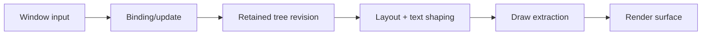

---
related_code:
  - zircon_runtime_interface/src/ui
  - zircon_runtime/src/ui
implementation_files:
  - zircon_runtime_interface/src/ui
  - zircon_runtime/src/ui
plan_sources:
  - docs/wiki/ui/layout.md
  - docs/wiki/ui/text.md
tests:
  - zircon_runtime_interface/src/ui
  - zircon_runtime/src/ui
doc_type: reference-guide
---

# UI 保留树、布局与文本性能实践

Zircon UI 将声明输入、保留树、布局快照、绘制提取和窗口输入适配分开。组件更新不应直接触碰 renderer；应通过 revision 和 binding effect 让下游按需失效。

## 更新链



## 决策矩阵

| 变化 | 失效范围 | 是否重排 | 优化方式 |
| --- | --- | --- | --- |
| 文本内容 | text node + ancestors | 是 | shape cache |
| 颜色/opacity | paint subtree | 否 | draw list patch |
| 子节点增删 | parent subtree | 是 | keyed diff |
| 窗口尺寸 | root | 是 | measure cache 分区 |
| 输入 hover | state node | 通常否 | 局部绑定 |

## 稳定身份

每个节点使用稳定 key；不要以数组位置作为 identity。key 变化意味着销毁/重建，焦点、光标和动画状态会丢失。动态列表必须区分“重新排序”和“替换节点”。

## 文本路径

文本更新依次经过 UTF-8 验证、字体选择、shaping、行布局、hit-test、draw extraction。字体 fallback、语言脚本和 DPI 都应作为 cache key。编辑状态使用 selection/composition snapshot，避免在每次按键时重建整个窗口。

```rust
let query = ComponentSelector::new("zircon.ui.Text");
let filter = QueryFilter::default();
let revision = tree.revision();
if cache.revision != revision {
    layout.recompute(query, filter)?;
}
```

代码表达按 revision 增量更新的调用形状，具体 UI facade 以当前 crate 文档为准。

## 性能预算

按窗口记录节点数、dirty 节点数、layout passes、shape cache hit、draw commands、text glyphs 和 input-to-present latency。布局预算超限时优先冻结非关键面板，而不是丢弃输入顺序。

| 指标 | 目标 | 诊断 |
| --- | --- | --- |
| dirty ratio | < 20% | 错误的全树 invalidation |
| shape cache hit | > 90% | cache key 或字体变化 |
| layout p99 | < 2 ms | 深层嵌套/测量循环 |
| input latency p99 | < 16 ms | 主线程阻塞 |

## 反模式

- 每个字符变化都重建 root。
- 通过 `sleep` 等待布局完成。
- 在 UI 回调中同步读取 GPU 资源。
- 以显示文本比较节点，而不使用 key。
- 未限制文本长度和 glyph 数量。

## 故障恢复

布局循环时记录 node key 路径和约束栈，回退到最近有效快照；字体缺失时使用 fallback 并发出诊断；draw extraction 失败时保留上一帧绘制列表，下一 revision 再尝试。

## 测试

- keyed diff 保留焦点和 selection。
- 文本 shaping 在不同 DPI、字体 fallback 下结果稳定。
- resize 只触发必要 subtree 重排。
- 输入序列号乱序时被拒绝或重排。
- 过长文本触发预算保护而不崩溃。

## 成熟引擎对照

Unreal Slate 使用 retained widget tree 和 invalidation panel；Godot Control 通过最小尺寸与通知传播布局；Slint 将 reactive binding 与渲染分层。ZirconEngine 应采用同样的局部失效，并把 world/query revision 与 UI revision 分开统计。

## 清单

- [ ] 节点有稳定 key 和 revision。
- [ ] paint 变化不触发布局重排。
- [ ] 文本 cache key 包含字体、语言、DPI。
- [ ] 输入适配保留 timestamp/sequence。
- [ ] 布局、shaping、draw 都有预算指标。
- [ ] 失效和 fallback 有可观察诊断。

## 精确来源

- `zircon_runtime_interface/src/ui`：窗口输入、绑定和 UI DTO。
- `zircon_runtime/src/ui`：布局、文本和渲染实现。
- `docs/zircon_runtime_interface/ui/layout.md`、`text.md`：公开契约说明。

## API 参数说明

| 接口 | 输入 | 结果 | 约束 |
| --- | --- | --- | --- |
| `UiRuntimeEventAdapterContext::for_window` | window id | adapter context | id 必须稳定 |
| `runtime_events_to_window_input_pump_batch` | ordered events | pump batch | 保留 sequence/timestamp |
| `WorldQuery` | selector/filter/generation | snapshot result | 过期结果拒绝 |
| binding/update | state + revision | effect | 只触发局部失效 |

## 布局约束传播

布局过程为 measure -> arrange -> paint。measure 只读取约束和 intrinsic size；arrange 写入最终 rect；paint 不得改变布局。若组件在 paint 阶段修改尺寸，会产生下一帧循环，应记录 offending key 和 revision。

## 列表与虚拟化

长列表使用 viewport range、overscan 和 stable key。overscan 太小会在快速滚动时出现空白，太大则增加 layout/glyph 成本。回收节点前保存 focus、selection 和 scroll anchor；异步数据到达时按 key 合并，而不是按索引覆盖。

## 文本缓存键

shape cache key 至少包含：文本 hash、字体族/版本、字号、语言、方向、特性、DPI、letter spacing。layout cache 额外包含可用宽度和换行策略。编辑中的 composition text 应与 committed text 分离，IME 取消时只撤销 composition 层。

## 输入与焦点

窗口事件适配必须验证 sequence 单调性和 timestamp 域。focus path 变更生成 revision；hit-test 只读取最近布局快照，不在输入回调中同步重排。modal 层拥有优先级，关闭后恢复之前的 focus token。

## 反模式详表

| 反模式 | 诊断信号 | 修复 |
| --- | --- | --- |
| 全树 dirty | dirty ratio 接近 100% | 按 key/revision 局部失效 |
| 位置作 key | 列表重排后焦点跳转 | stable id |
| 同步字体加载 | 首帧卡顿 | 预热/异步 fallback |
| 每帧全量 shaping | glyph CPU 占比高 | shape cache |
| paint 修改布局 | layout pass 螺旋 | 单向 measure/arrange/paint |

## 可观测性

记录 `tree_revision`、`dirty_nodes`、`layout_passes`、`shape_cache_hit`、`glyph_count`、`draw_commands`、`focus_changes`、`input_to_present_ms`。trace span 携带 window id 和 root key；不要把完整用户文本写入 span。

## 故障恢复

布局约束非法时回退到父节点可用 rect；字体缺失使用 fallback 并显示诊断图标；输入批次乱序时拒绝旧 sequence 并请求窗口 snapshot；draw 提取失败保留上一 revision 的 draw list。

## 测试矩阵

| 维度 | 案例 |
| --- | --- |
| DPI | 1.0/1.25/2.0 |
| 语言 | 拉丁、阿拉伯、中文、emoji |
| 输入 | 键盘、鼠标、触控、IME |
| 树变化 | 插入、删除、重排、virtualize |
| 性能 | 1k/10k 节点、长文本 |

## 交付检查清单（扩展）

- [ ] stable key、tree revision、focus token 有定义。
- [ ] measure/arrange/paint 单向执行。
- [ ] 文本 cache key 覆盖字体、语言、DPI、宽度。
- [ ] 输入 sequence/timestamp 不丢失。
- [ ] 虚拟列表有 overscan 和 anchor 恢复。
- [ ] dirty ratio、layout p99、input latency 纳入预算。

## 可访问性同步

accessibility tree 必须与 retained tree revision 对齐。可访问性名称、role、value 变化是独立的局部失效，不能依赖 paint 结果反推。焦点移动先更新语义树，再生成 platform event；虚拟化节点在离屏时保持必要的语义占位。

## 主题和样式

主题 token 改变会影响 paint，可能影响字体/边框导致 layout。样式系统应声明 token 的影响域：paint-only、measure-affecting 或 input-affecting。动态主题切换按 revision 批处理，避免每个节点单独重建 draw list。

## 截图与视觉回归

视觉测试固定 viewport、DPI、字体包、主题和动画时间。比较 geometry/text structure 与像素阈值；像素差异先检查字体 fallback 和抗锯齿，再判断业务回归。每个失败 artifact 保存树 dump、布局 snapshot、draw command 摘要。

## 交付检查清单（扩展二）

- [ ] semantic/accessibility tree 与 UI revision 对齐。
- [ ] token 标注 layout/paint 影响域。
- [ ] 主题切换批处理且受预算约束。
- [ ] 视觉回归固定字体、DPI、时间。
- [ ] 失败 artifact 含 tree/layout/draw 摘要。

## UI API 版本化

窗口输入 DTO、layout snapshot、accessibility snapshot 和 draw extraction receipt 应各自有 revision。不要把一个全局 frame number 当作所有接口的版本。跨线程消费 snapshot 时，验证 window id、tree revision 和 surface generation；任何不匹配都返回 stale 并请求新 snapshot。

## 动画与可中断性

动画状态由 monotonic time 和 animation generation 驱动。用户交互、主题切换或节点删除会提升 generation，使旧动画 tick 无法覆盖新状态。长动画在 reduced-motion profile 下跳到终态或缩短 duration，但必须保持语义事件顺序。

## 无障碍性能

accessibility tree 更新按 semantic diff 批处理；单个 paint-only 变化不应触发完整语义树重建。屏幕阅读器事件具有顺序号和去重 token。大型列表提供虚拟化语义范围，保证当前可见项与总数可读。

## 交付检查清单（扩展四）

- [ ] input/layout/accessibility/draw revision 分离。
- [ ] snapshot 消费验证 window/tree/surface identity。
- [ ] 动画 generation 可中断且 reduced-motion 有测试。
- [ ] accessibility diff 批处理、事件可去重。
- [ ] 虚拟列表提供可访问的范围和位置。

## 运营 Runbook

UI 卡顿先查看 input-to-present、dirty ratio、layout passes、shape cache hit 和 draw commands。若 dirty ratio 突升，导出 tree revision diff；若 shaping 占比高，比较字体/DPI cache key；若 present 等待高，交给 render profile 排查。不要只通过降低动画帧率掩盖布局循环。

## 审查问题

- 节点 key 是否稳定且不依赖数组位置？
- state、layout、paint、accessibility 的失效域是否分离？
- 输入 sequence/timestamp 是否可追溯？
- 大列表、长文本和 IME 是否有取消和预算？
- 视觉回归是否固定字体、DPI、时间？

## 最小验收

在 1k/10k 节点、四种语言、三种 DPI、键盘/IME/触控输入下运行 30 分钟。验收无焦点丢失、layout pass 螺旋、不可解释空白，p99 输入延迟满足 profile。

## API 兼容边界

UI public DTO 应使用值类型和稳定枚举；渲染器内部 node pointer、布局缓存和字体句柄不应跨 `zircon_runtime_interface`。window adapter 返回的 timestamp、sequence、user/device id 必须原样保留，平台事件映射不能丢失 synthetic 标记。

## 交互状态机

按钮、拖拽、文本编辑等控件将 `Idle`、`Pressed`、`Captured`、`Cancelled`、`Committed` 作为显式状态。窗口失焦、modal 打开、sequence gap 都会触发 cancel 或重新同步。状态转换记录 control key 和 input sequence，避免“鼠标抬起丢失后控件永久按下”。

## 渲染提取节流

当树 revision 未变时，复用 draw extraction；仅 surface generation、DPI 或 animation clock 变化时重新计算受影响层。动画可将 paint-only 属性放入 GPU uniform，避免每帧重排。节流不能延迟 accessibility 或 keyboard focus 更新。

## 大文本和表格

大文本使用分块 layout 和可见行缓存；表格按列宽/排序/filter revision 分区失效。复制/搜索在 worker 线程执行，结果以 query id 回传并验证当前 document revision。超过大小预算时显示截断诊断和导出操作，不让 UI 卡死。

## 调试工具

提供 tree inspector、dirty overlay、layout constraint trace、hit-test path、focus path、glyph cache stats 和 draw command list。每个工具通过 observer snapshot 读取，不能改变运行时树。诊断快照包含 revision、window id、DPI 和 theme digest。

## 交付检查清单（扩展三）

- [ ] public UI DTO 与内部缓存/句柄隔离。
- [ ] 控件状态包含失焦、取消、sequence gap。
- [ ] revision 未变时复用 draw extraction。
- [ ] 大文本/表格有分块、可取消和大小预算。
- [ ] inspector/overlay 只读且快照可复现。
