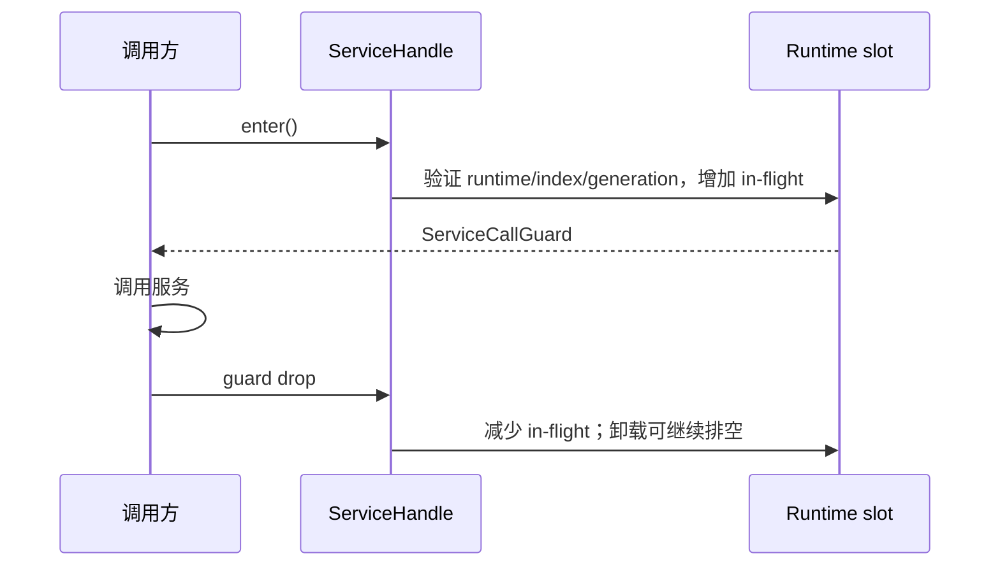

---
related_code:
  - zircon_runtime/src/core/runtime/handle/resolution.rs
  - zircon_runtime/src/core/runtime/handle/service_identity.rs
  - zircon_runtime/src/core/runtime/error.rs
  - zircon_runtime/src/core/manager/resolver.rs
implementation_files:
  - zircon_runtime/src/core/runtime/handle/resolution.rs
  - zircon_runtime/src/core/manager/resolver.rs
plan_sources:
  - user: 2026-09-09 补充 ZirconEngine 最佳实践、方案示例与详细 Wiki
tests:
  - zircon_runtime/src/core/runtime/tests/resolution
  - zircon_runtime/src/core/manager/tests.rs
doc_type: workflow-detail
---

# Rust API、句柄与错误所有权实践

本页适用于需要从 runtime、manager 或 plugin service 取得长期引用的扩展。公开入口的核心约束是：服务名称和类型用于定位，generation 用于拒绝过期对象，`ServiceCallGuard` 用于把一次调用纳入卸载排空协议。实现见 [resolution.rs](https://github.com/He-Jiahui/ZirconEngine/blob/main/zircon_runtime/src/core/runtime/handle/resolution.rs) 与 [resolver.rs](https://github.com/He-Jiahui/ZirconEngine/blob/main/zircon_runtime/src/core/manager/resolver.rs)。



## 先选引用模型

| 需求 | 应持有的值 | 原因 | 不要使用 |
| --- | --- | --- | --- |
| 只在一段同步逻辑中调用已解析服务 | `Arc<T>` 或该调用点的临时解析结果 | 生命周期短，错误能在边界返回 | 跨帧缓存裸 slot/index |
| 服务可能卸载，且调用必须参与排空 | `ServiceHandle<T>`，每次调用先 `enter()` | `enter()` 重新验证 identity，并由 guard 管理 in-flight 计数 | 仅缓存 `Arc<T>` 后在卸载期间继续调用 |
| manager 的稳定 trait 契约 | `ManagerServiceHandle<dyn Contract>` 加 `ManagerResolver` | 调用者依赖 contract，不耦合 concrete type | 直接解析第一方 manager struct |
| 被 registry 反向拥有的服务需要引用 runtime | `CoreWeak` | 避免 registry -> service -> runtime 的强引用环 | 在 service 内永久保存 `CoreHandle` |

`ServiceHandle` 内部保存 `CoreWeak`、注册 identity 和服务 `Arc`；只有 `enter()` 成功才得到可解引用的 `ServiceCallGuard`。guard 的 `Drop` 会释放 slot 的 in-flight 计数，因此 guard 不应穿越不受控的阻塞、线程等待或异步长期任务。[`resolution.rs`](https://github.com/He-Jiahui/ZirconEngine/blob/main/zircon_runtime/src/core/runtime/handle/resolution.rs) 中的 `begin_service_call`、`release_service_call` 和 `wait_for_service_calls_to_drain` 是这条规则的直接依据。

## 以契约暴露 API

**推荐，实际 API 形状：**

```rust
use zircon_runtime::core::manager::{manager_service_handle, ManagerResolver};

trait GameplayApi: Send + Sync {
    fn active_actor_count(&self) -> usize;
}

fn sample(core: zircon_runtime::core::CoreHandle) -> Result<usize, zircon_runtime::core::CoreError> {
    let handle = manager_service_handle::<dyn GameplayApi>(
        &core,
        "Gameplay.Manager.GameplayManager",
    )?;
    let api = ManagerResolver::new(core).resolve(handle)?;
    Ok(api.active_actor_count())
}
```

这让注册表名称、service kind 与 trait downcast 由 runtime 集中检查。重复解析时，按当前 API 的所有权语义显式 `clone()` handle；不要猜测解析方法是否借用 handle。可参阅 [Manager 句柄与解析](../core-runtime/manager-handles-and-resolution.md)。

**反模式，示意伪代码：**

```rust
// 错误：把一度有效的对象地址和字符串拆开的假设长期化。
let manager = core.resolve_manager::<ConcreteGameplayManager>("...")?;
cache.raw_index = 7;
cache.manager = manager;
```

这会同时绕过 trait 边界与 generation 验证。服务卸载并重建后，同一个 slot 可以代表不同实例；正确行为应是旧 identity 返回过期或不可用错误，而不是静默调用新对象。

## 让错误保留决策信息

| 场景 | 处理 | 调用者可恢复性 |
| --- | --- | --- |
| 名称不存在或 service kind 不匹配 | 原样返回 `CoreError` | 修正模块依赖或 canonical name |
| runtime 已释放 | 返回 `RuntimeUnavailable` | 终止该次操作；重建宿主后再获取 handle |
| generation、slot 或 kind 已变化 | 返回 stale/unavailable 类 `CoreError` | 丢弃旧 handle，重新发现服务 |
| 依赖成环、初始化失败 | 返回结构化 runtime error | 修正 descriptor/dependency，不要改写成空值 |
| 卸载等待超时 | 保留 `ServiceCallDrainTimeout` 的 module、budget 与 in-flight 信息 | 缩短调用临界区，定位未释放 guard 的任务 |

不要把 `CoreError` 压扁为 `Option` 或只记录字符串。`MissingService`、`ServiceKindMismatch`、`DependencyCycle` 与 drain timeout 都是源码定义的可诊断分支，丢失它们会让上层无法区分配置、生命周期和并发问题；错误枚举见 [error.rs](https://github.com/He-Jiahui/ZirconEngine/blob/main/zircon_runtime/src/core/runtime/error.rs)。

## 失败定位

| 症状 | 首先检查 | 常见根因 | 修复方向 |
| --- | --- | --- | --- |
| 解析立即报 `MissingService` | canonical `RegistryName` 与模块注册 | 名称手写错误，模块未进入 registry | 从 descriptor/resolver 取得名称，声明依赖 |
| 报 kind mismatch | 名称所属的 `ServiceKind` | 以 manager API 解析 driver/plugin | 选择对应的 resolve/handle API |
| 卸载卡住或 drain timeout | guard 的作用域与后台任务 | guard 被长期保存或跨 await/blocking 调用 | 复制必要数据后尽快 drop guard |
| 重载后偶发失败 | identity/generation | 缓存了过期 handle 或裸索引 | 在生命周期边界重新发现并处理 stale error |

## 合入前核对

- [ ] 对外 API 依赖 trait contract，而不是第一方 concrete struct。
- [ ] 长寿命服务调用通过 `ServiceHandle::enter()`，guard 的作用域只包住实际调用。
- [ ] registry-owned 对象只保存 `CoreWeak`，没有新的强引用环。
- [ ] 错误保留 `CoreError` 的结构化上下文，调用方对 stale/unavailable 有恢复或终止路径。
- [ ] 测试至少覆盖错误 service name、错误 kind、runtime 释放或 generation 变化中的一项相应行为。

相关参考：[运行时 Rust API 指南](../core-runtime/rust-api-guide.md)、[Manager 句柄与解析](../core-runtime/manager-handles-and-resolution.md)。
