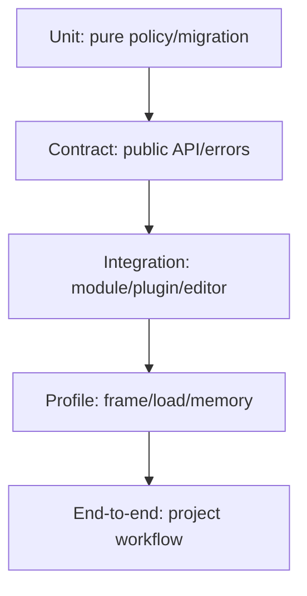

---
related_code:
  - zircon_runtime/src/core/runtime/tests
  - zircon_editor/src/tests
  - tests
implementation_files:
  - zircon_runtime/src
  - zircon_editor/src
  - zircon_plugins
plan_sources:
  - docs/wiki/contributing-docs.md
tests:
  - zircon_runtime/src/core/runtime/tests
  - zircon_editor/src/tests
  - tests
doc_type: reference-guide
---

# 测试、可观测性与发布实践

引擎质量不是单一 `cargo test` 通过，而是契约测试、生命周期压力、golden 数据、性能预算和可回滚发布共同证明。每个公开接口都应有“成功、拒绝、过期、取消、恢复”五类证据。

## 测试金字塔



## 决策矩阵

| 变更 | 最低验证 | 额外证据 |
| --- | --- | --- |
| 纯策略 | 单元 + property | fuzz 边界 |
| public API | contract + compile example | semver review |
| module lifecycle | 并发 shutdown | soak/log trace |
| renderer | golden frame + budget | GPU profile |
| plugin ABI | compatibility matrix | quarantine/recovery |
| schema | old/new fixtures | migration rollback |

## 契约测试模板

```rust
#[test]
fn stale_handle_is_rejected_after_rebuild() {
    let (core, old) = fixture_with_service();
    shutdown_and_rebuild(&core);
    let err = old.enter().expect_err("old generation must fail");
    assert!(err.is_stale_generation());
}
```

测试断言结构化谓词，不比较完整错误字符串。并发测试要控制随机种子并输出 seed，方便复现。

## 可观测性合同

每个跨边界操作至少带：`operation_id`、`module`、`generation`、`correlation_id`、`elapsed_us`、`outcome`。日志、指标、trace 使用同一命名；敏感路径和用户数据禁止写入日志。

推荐指标：错误率、p95/p99 latency、队列深度、in-flight、缓存命中、内存峰值、GPU wait、dirty/save failure、插件拒绝。发布 gate 应读取这些指标，而不是只看平均值。

## Release checklist

1. 锁定 Cargo.lock、ABI/schema 版本和插件 digest。
2. 运行单元、契约、集成、golden、压力测试。
3. 生成 artifact manifest 与 SBOM/许可证报告。
4. 在 clean project 上执行导入、编辑、保存、运行、导出冒烟流程。
5. 小比例发布，观察 crash、latency、fallback、拒绝和内存指标。
6. 保留上一版本 artifact 与迁移回滚脚本。

## 反模式

- 只测试成功路径。
- 在 CI 中使用未固定的时间、网络或随机种子。
- 日志打印完整资产内容或插件 payload。
- 性能回归只看本地一次运行。
- 发布后无法重建相同 artifact。

## 失败与恢复

测试失败先按支持层向下定位：serialization/query/handle，再看 editor 或 end-to-end。线上指标异常时冻结 rollout、保留 last-good、导出 correlation trace；回滚只回滚版本，不删除用户源文档。

## 成熟引擎对照

Unreal 自动化测试和 Insights 结合功能与性能证据；Bevy 强调 schedule/world 的可测试系统边界；Godot CI 以项目样例和回归场景守住编辑器行为。ZirconEngine 应补齐同等级的契约、golden 和 release evidence。

## 清单

- [ ] 每个公开 API 覆盖五类结果。
- [ ] 测试输出 seed、版本、平台和 artifact hash。
- [ ] trace 字段跨 runtime/editor/plugin 一致。
- [ ] 性能 gate 使用 p95/p99 和预算。
- [ ] 发布可重建、可观测、可回滚。
- [ ] 源文档、缓存和用户数据的恢复边界明确。

## 精确来源

- `zircon_runtime/src/core/runtime/tests`：runtime 契约和生命周期测试。
- `zircon_editor/src/tests`：编辑器事务、布局和工作台测试。
- `tests`：端到端项目回归。
- `docs/wiki/contributing-docs.md`：文档与验证规范。
