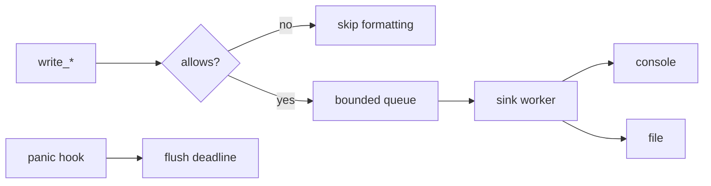

---
related_code:
  - zircon_runtime/src/diagnostic_log/level.rs
  - zircon_runtime/src/diagnostic_log/settings.rs
  - zircon_runtime/src/diagnostic_log/sink.rs
  - zircon_runtime/src/diagnostic_log/diagnostics.rs
implementation_files:
  - zircon_runtime/src/diagnostic_log/sink.rs
  - zircon_runtime/src/diagnostic_log/level.rs
plan_sources:
  - user: 2026-09-09 完善诊断日志 API、过滤、sink 与最佳实践
tests:
  - zircon_runtime/src/diagnostic_log/level.rs
  - zircon_runtime/src/diagnostic_log/sink.rs
doc_type: module-detail
---

# 诊断日志 API

`zircon_runtime::diagnostic_log` 是进程级、可配置、带有界队列的诊断输出层。它同时支持 console/file sink、Unity 兼容模式、scope 前缀过滤、panic flush 和 shutdown。日志 sink 的生命周期独立于 CoreRuntime，但 runtime 诊断快照可以写入同一套路径。

## 级别与过滤

| 类型/API | 内容 |
| --- | --- |
| `DiagnosticLogLevel::{Verbose,Debug,Log,Warn,Error}` | 记录严重性；解析器兼容 `trace`/`info` 输入 |
| `DiagnosticLogFilter::{Off,Minimum(level)}` | 关闭或设置最低级别 |
| `DiagnosticLogFilterConfig::new(minimum)` | 创建默认过滤器 |
| `from_env_or_default()` | 从环境变量读取配置 |
| `parse(value)` | 字符串解析，错误为 `DiagnosticLogLevelParseError` |
| `allows(level, scope)` | 判断记录是否通过 |
| `filter_for_scope(scope)` | 获取 scope 有效规则 |

`DiagnosticLogLevelParseError::value()` 返回原始非法文本。解析失败不应静默当作 Error，否则会放大噪声；应用启动时应显式报告配置错误。

## Settings builder

| API | 参数/返回 |
| --- | --- |
| `DiagnosticLogSettings::new(channel)` | 创建普通 channel 设置 |
| `unity_compatible(channel)` | Unity 行格式和路径策略 |
| `with_filter(filter)` | 设置 `DiagnosticLogFilterConfig` |
| `with_location(location)` | `DiagnosticLogLocation` |
| `with_console_enabled(bool)` | 开关 console sink |
| `with_file_enabled(bool)` | 开关 file sink |
| `with_sink_settings(settings)` | 设置队列/批次/flush |
| `diagnostic_lines()` | 输出可读配置行 |
| `format_diagnostics()` | 组合为字符串 |

`DiagnosticLogSinkSettings` 字段通过 builder 设置：`with_queue_capacity`、`with_max_batch_records`、`with_max_batch_bytes`、`with_flush_interval`、`with_critical_enqueue_timeout`。容量值会在内部 normalized；调用方不应依赖未公开的规范化细节。

## 进程函数

| 函数 | 行为 |
| --- | --- |
| `initialize_process_log(channel)` | 默认设置初始化并返回路径 |
| `initialize_process_log_with_filter(channel, filter)` | 初始化并覆盖 filter |
| `initialize_process_log_with_config(settings)` | 完整配置入口 |
| `initialize_process_log_with_location*` | 指定路径/过滤 |
| `initialize_process_log_with_settings(settings)` | 统一底层入口 |
| `write_diagnostic_log(scope, message)` | 默认级别写入 |
| `write_*_log(scope, message)` | debug/log/warn/error 快捷入口 |
| `write_diagnostic_log_at(level, scope, message)` | 指定级别 |
| `diagnostic_log_allows(level)` | 全局过滤判断 |
| `diagnostic_log_allows_for_scope(level, scope)` | scope 过滤判断 |
| `diagnostic_log_sink_snapshot()` | 返回 `Option<DiagnosticLogSinkSnapshot>` |
| `flush_process_log(timeout)` | deadline 内 flush，返回 bool |
| `shutdown_process_log(timeout)` | 停止 sink，返回 bool |
| `install_process_log_panic_flush(timeout)` | 安装 panic hook flush |

```rust
use std::time::Duration;
use zircon_runtime::diagnostic_log::*;

let settings = DiagnosticLogSettings::new("editor")
    .with_console_enabled(true)
    .with_file_enabled(true);
let _path = initialize_process_log_with_settings(settings);
write_log("asset", "import started");
assert!(flush_process_log(Duration::from_millis(50)));
```

## 背压和线程

普通日志通过 bounded queue 入队；critical enqueue 可等待 `critical_enqueue_timeout`。队列满时不能阻塞 render/owner 线程，优先使用 lazy API：`write_*_log_lazy` 只有通过 filter 才计算 message。sink worker 负责批量写入，snapshot 只读计数。



## 失败处理

初始化返回 `None` 表示路径或 sink 建立失败；业务不应因此 panic，可退回 console-only。`flush_process_log`/`shutdown_process_log` 返回 false 表示 deadline 不足或 sink 已不可用，应在最终错误报告中带上 snapshot。重复初始化必须遵循源码定义的替换策略，不要并行创建多个 process sink。

## 负例

- 在每帧字符串插值后才调用 `diagnostic_log_allows`：浪费 CPU；改用 lazy API。
- 在 panic hook 中执行无界 flush：会遮蔽原始 panic；使用有限 timeout。
- 把用户输入直接作为 scope：scope cardinality 爆炸，过滤和聚合失效。
- 把日志文件当作事务存储：sink 只保证尽力写入，不提供崩溃一致性。

Bevy tracing 和 Godot logger 都将日志级别、sink、线程输出分离；Zircon 额外提供 bounded byte budget 与 Unity-compatible 初始化，服务于 editor/runtime 共用日志协议。

测试映射：`diagnostic_log/tests` 覆盖 sink 生命周期、过滤、背压；`level/tests` 覆盖 parse、scope precedence；CI 仅验证行为，不保证磁盘路径可用性。

## 完整快照字段

`DiagnosticLogSinkSnapshot` 用于观察 sink 状态，包含队列深度、峰值、写入/丢弃计数、flush 结果和最近错误摘要（字段以当前 `sink/metrics.rs` 为准）。诊断格式化函数 `format_diagnostic_store_snapshot`、`format_diagnostic_store_current_snapshot` 和 `write_diagnostic_store_snapshot` 负责把 runtime store 快照写成多行日志。

## 第二组调用形状

```rust
let filter = DiagnosticLogFilterConfig::from_env_or_default();
let settings = DiagnosticLogSettings::new("runtime")
    .with_filter(filter)
    .with_sink_settings(DiagnosticLogSinkSettings::default()
        .with_queue_capacity(4096));
initialize_process_log_with_settings(settings);
write_debug_log_lazy("render", || format!("frame={}", frame_index));
```

```rust
if let Some(snapshot) = diagnostic_log_sink_snapshot() {
    write_log("diagnostics", format!("queue={:?}", snapshot));
}
```

负例：每个插件调用 `initialize_process_log` 覆盖全局 sink；应由 app composition 统一初始化，插件只写日志。`shutdown_process_log` 后继续写入属于未定义业务顺序，应在模块 cleanup 前停止 producer。

## 验证要点

验证 filter precedence、bounded queue、critical timeout、panic flush 和 shutdown idempotency；磁盘不可写时检查 `Option<PathBuf>` 与 snapshot，而不是假设日志已持久化。

## API 调用前后契约

| 调用 | 前置 | 成功后 | 失败/边界 |
| --- | --- | --- | --- |
| `initialize_process_log*` | 进程 sink 未占用 | 返回可选文件路径 | 返回 `None`，保留 console fallback |
| `write_*` | sink 可用或 no-op | 入队/直接输出 | filter 拒绝时不格式化 |
| `write_*_lazy` | closure 可调用 | 通过 filter 后求值 | closure panic 不应跨 FFI |
| `flush_process_log` | sink 已初始化 | 队列尽可能清空 | timeout 返回 false |
| `shutdown_process_log` | producer 已停止 | worker 退出 | timeout 返回 false，不能重入写入 |

## Scope 设计

scope 采用稳定短名称，例如 `runtime.core`, `render.extract`, `asset.import`。模块名、插件 id 和 operation id 放入结构化 message，而不是无限生成 scope。这样 `DiagnosticLogFilterConfig::parse` 的前缀匹配保持可预测，聚合统计也不会产生高 cardinality。

## 生产环境清单

- release profile 默认最低级别为 `Log`，调试 profile 默认最低级别为 `Verbose`。
- 文件 sink 使用 rotation 或外部 log collector，避免单文件无限增长。
- 对日志 payload 做隐私脱敏，尤其是路径、token、用户输入。
- 在退出路径先 `flush_process_log`，再 shutdown runtime task graph。
- 把 sink snapshot 和 runtime diagnostic snapshot 关联同一 frame index。
- 监控 dropped、queue age、critical enqueue timeout 三类指标。

## 测试场景

1. 空队列 flush 必须快速返回 true。
2. bounded queue 满载时 drop 计数单调增加。
3. filter 拒绝记录时 lazy closure 不执行。
4. sink worker 停止后写入不得 panic。
5. panic hook 只 flush 有限时间并保留原 panic。
6. 重复 shutdown 结果稳定且不创建新 worker。
