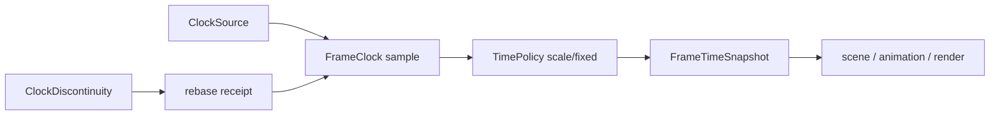

---
related_code:
  - zircon_runtime/src/core/framework/events.rs
  - zircon_runtime/src/core/framework/time/mod.rs
  - zircon_runtime/src/core/framework/time/policy.rs
  - zircon_runtime/src/core/runtime/runtime.rs
implementation_files:
  - zircon_runtime/src/core/framework/events.rs
  - zircon_runtime/src/core/framework/time/policy.rs
plan_sources:
  - user: 2026-09-09 完善事件、配置与时间公开接口说明
tests:
  - zircon_runtime/src/core/runtime/tests/events
  - zircon_runtime/src/core/framework/tests.rs
doc_type: module-detail
---

# 事件、配置与时间框架

CoreRuntime 提供三个跨模块基础：JSON 事件总线、键值 config store 和 typed time/state。它们都由 runtime owner 管理，模块只通过 `CoreHandle` 或 `CoreRuntime` facade 访问。

## EventBus

| API | 参数 | 返回/行为 |
| --- | --- | --- |
| `publish_event(topic, payload)` | `Into<String>`, `serde_json::Value` | 按 topic 投递；无订阅者时安全丢弃 |
| `subscribe_events(topic, policy)` | topic + `EngineEventDeliveryPolicy` | `Box<dyn EngineEventSubscription>` |
| `recv()` | 无 | 阻塞，`Disconnected` 表示 bus 已关闭 |
| `try_recv()` | 无 | `Empty` 或 `Disconnected`，不阻塞 |
| `recv_timeout(duration)` | `Duration` | `Timeout` 或 `Disconnected` |
| `event_bus_diagnostics()` | 无 | `EventBusDiagnosticsSnapshot` |

策略含义：`Lossless` 保留每条消息但可能反压 publisher；`BoundedDropOldest{capacity}` 固定内存并淘汰最旧值；`Latest` 只保留最新消息。UI 状态刷新适合 Latest，输入/命令日志适合 Lossless，遥测适合 bounded。

```rust
use zircon_runtime::core::framework::events::EngineEventDeliveryPolicy;
let sub = runtime.subscribe_events(
    "asset/imported",
    EngineEventDeliveryPolicy::Latest,
);
runtime.publish_event("asset/imported", serde_json::json!({"id": 42}));
let event = sub.try_recv()?;
```

订阅对象是 `Send + Sync`，可由消费者线程持有；不要在 bus 回调中递归 publish 同一主题造成无界队列。`EngineEvent` 的 payload 必须可序列化且大小受应用策略约束。

## Config store

| API | 说明 |
| --- | --- |
| `store_config_value(key, value)` | 覆盖 key 的 JSON 值 |
| `load_config_value(key)` | 缺失返回 `None` |
| `snapshot_config_values()` | 返回独立 `HashMap` 快照 |
| `load_config::<T>(key)` | JSON 反序列化失败映射 `CoreError` |

配置读取应在模块激活时完成并缓存强类型结果；每帧调用 `load_config` 会产生解析和分配。敏感信息不应进入 config store，它不是加密存储。

## 时间策略与帧推进

`tick_time(max_fixed_steps)` 使用 runtime 的 `FrameClock`；`advance_time_by(real_delta, max_fixed_steps)` 适合测试与回放。`FrameTimeSnapshot` 同时描述 real、scaled、fixed step 和 frame index。外部 wall clock 跳变必须通过 `submit_clock_discontinuity(ClockDiscontinuity)`，以获取 `FrameClockRebaseReceipt`，而不是手动改 snapshot。



`TimePolicyTransaction` 的提交会先验证策略，再由 `apply_time_policy` 应用；成功后 generation 增加。并发使用者应重新读取当前 policy，而不是覆盖未知策略。`TimePolicyError` 通常代表非法 fixed step 或 scale。

## typed state

`init_state<T>()`、`insert_state<T>()`、`state<T>()`、`next_state<T>()`、`set_next_state` 和 `apply_state_transition` 组成 typed state machine。`T: StateSpec` 决定唯一类型键；`set_next_state_if_neq` 避免重复 transition。hooks (`register_on_enter/exit/transition`) 应保持短小、无阻塞。

## 失败与性能

- 事件订阅断开后停止重试；断线是生命周期信号。
- config 反序列化失败记录 key 和目标类型，保留旧缓存。
- fixed step 超过 `max_fixed_steps` 时优先记录积压诊断，不无限追帧。
- Snapshot 是跨模块一致性边界；不要让一个系统读取新时间、另一个系统读取旧时间。

Bevy 的 `Time`/`Events` 提供 typed resource 和帧事件的参考，Godot 的 signal 机制则强调主题化通知。Zircon 有意保留 JSON payload 以跨 ABI，并把丢弃策略与诊断计数显式化。

相关验证：`core/runtime/tests/events`、`core/framework/tests.rs` 以及 time policy 单元测试。

## 完整枚举与字段

`EngineEvent` 字段为 `topic: String`、`payload: serde_json::Value`。`EngineEventDeliveryPolicy` 变体为 `Lossless`、`BoundedDropOldest { capacity: NonZeroUsize }`、`Latest`；`EventBusDiagnosticsMode` 为 `Enabled`、`Sampled { every: NonZeroU64 }`、`Disabled`。接收错误完整变体为 `EngineEventReceiveError::Disconnected`、`EngineEventTryReceiveError::{Empty, Disconnected}`、`EngineEventReceiveTimeoutError::{Timeout, Disconnected}`。

`EventBusDiagnosticsSnapshot` 公开字段包含 `enabled`、`topics`、`subscribers`、`published`、`delivered`、`dropped`、`disconnected`、`queued`、`peak_queued`、`waiting_receivers`、`waiting_publishers` 以及 queue/publish timing samples。字段是快照，不保证跨调用原子一致。

## 调用形状与负例

```rust
let sub = runtime.subscribe_events("world/changed", EngineEventDeliveryPolicy::BoundedDropOldest {
    capacity: NonZeroUsize::new(32).unwrap(),
});
while let Ok(event) = sub.try_recv() { process(event); }
```

```rust
let tx = TimePolicyTransaction::new(runtime.time_policy());
runtime.apply_time_policy(tx)?;
```

示例中的 transaction 构造以当前 policy API 为准；不可直接假设字段布局。负例是把 `recv_timeout` 放在 render thread 的每帧路径中，这会把消息等待引入帧预算；应改用 `try_recv` 或独立消费线程。

## 测试映射

| 主题 | 测试 |
| --- | --- |
| publish/subscribe | `tests/events/structure/event_bus/publish.rs`、`subscribe.rs` |
| prune/drop policy | `tests/events/structure/event_bus/prune.rs` |
| disconnected receiver | `tests/events/behavior.rs` |
| fixed-step policy | `framework/tests.rs` |

## 与其他引擎的差异

Bevy `Events<T>` 依靠类型资源和 reader cursor；Godot signal 依靠对象连接。Zircon 选择字符串 topic + JSON，换取跨 Rust/动态 ABI 的稳定载荷；代价是运行时校验和分配，因而必须显式选择 bounded policy 并限制 payload 大小。

## 事件消费模式

### 单消费者

适用于资源导入通知。创建一个 `Lossless` 订阅，在专用线程中阻塞 `recv`，将事件转换为 owner command，再由主线程 apply。线程退出时丢弃订阅，让其他 publisher 收到 disconnected 诊断。

### 多消费者

每个消费者拥有独立 subscription；`Latest` 不保证每个中间状态都可见，适合 UI。若多个系统必须看到同一序列，应分别使用 Lossless 或在 payload 中携带 sequence number，并在消费者端检测跳号。

### 轮询

render/editor frame loop 只能使用 `try_recv`，每帧设置最大消费条数。无限 drain 会让恶意插件的事件淹没 frame budget。超过预算时记录 `queued`、`dropped` 和 `peak_queued`。

## 配置版本化

配置 key 应采用 `<domain>.<feature>.<version>` 形式，例如 `render.pipeline.v2`。`load_config<T>` 的目标类型改变时，先读取旧版本并迁移，再写入新 key；不要在反序列化失败时直接覆盖为默认值。

```rust
fn load_render_config(core: &CoreRuntime) -> Result<RenderConfig, CoreError> {
    match core.load_config("render.pipeline.v2") {
        Ok(config) => Ok(config),
        Err(error) => {
            write_warn("config", format!("migration required: {error}"));
            migrate_v1(core)?
        }
    }
}
```

## 时间策略迁移

1. 读取 `time_policy_generation` 和当前 policy。
2. 构造 transaction，填写期望 generation。
3. 调用 `apply_time_policy`。
4. 成功后广播 receipt；失败时重新读取，不覆盖其他模块的更新。

固定步策略必须规定最大 catch-up steps。暂停/恢复使用 virtual clock 或显式 discontinuity，而不是把 real delta 设为极大值。

## 事件和配置的线程边界

| 操作 | 推荐线程 | 原因 |
| --- | --- | --- |
| publish 小消息 | 任意 Send 线程 | bus 内部同步保护 |
| recv/try_recv | 消费者线程 | 避免 owner 阻塞 |
| store config | owner/config thread | 保持写入顺序 |
| snapshot config | 任意 | 返回独立副本 |
| apply time policy | runtime owner | generation 原子提交 |
| state transition | owner | hooks 顺序稳定 |

## 负例清单

- 用 `Latest` 传输不可丢失的输入命令。
- 在事件 payload 中存放裸指针、临时路径或未版本化结构。
- 在 hook 中再次触发相同 state transition，形成递归 transition。
- 在 worker 线程调用 `set_next_state`，绕过 owner 的阶段一致性。
- 用 wall clock 计算任务 deadline；deadline 必须使用 monotonic source。

## 与参考引擎的意图差异

Bevy 事件 reader 会在固定帧边界清理事件；Zircon 的订阅生命周期由对象 drop 决定，因此插件可在运行时启停。Godot signal 可携带 Variant，但缺少统一 bounded/drop 诊断；Zircon 明确将丢弃计数纳入 `EventBusDiagnosticsSnapshot`，便于线上判定是消费者慢还是生产者异常。
