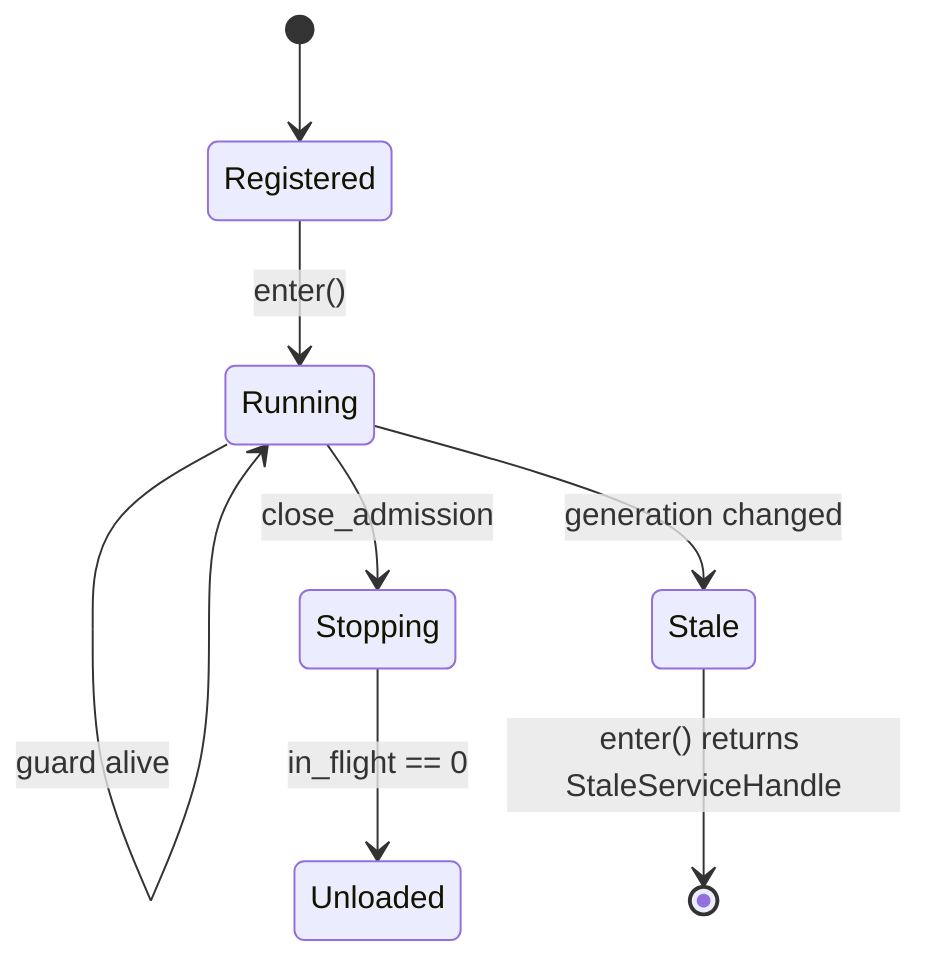
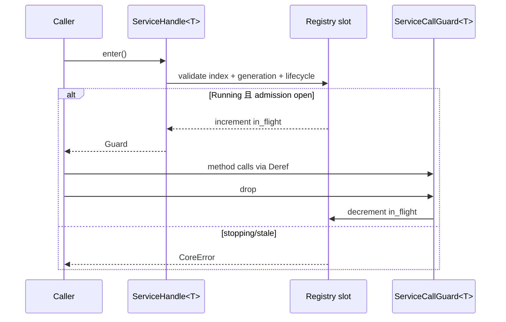

---
related_code:
  - zircon_runtime/src/core/runtime/handle/core_handle.rs
  - zircon_runtime/src/core/runtime/handle/resolution.rs
  - zircon_runtime/src/core/runtime/weak.rs
  - zircon_runtime/src/core/runtime/state/service_entry.rs
implementation_files:
  - zircon_runtime/src/core/runtime/handle/resolution.rs
plan_sources:
  - user: 2026-09-09 完善 CoreHandle、CoreWeak 与服务准入说明
tests:
  - zircon_runtime/src/core/runtime/tests/weak.rs
  - zircon_runtime/src/core/runtime/tests/resolution
  - zircon_runtime/src/core/runtime/tests/activation/behavior/deactivation
doc_type: module-detail
---

# CoreHandle、CoreWeak 与服务准入

句柄 API 的核心目标是让服务可以跨线程、跨模块访问，同时让卸载流程知道还有多少调用正在进行。`CoreHandle` 是强引用，`CoreWeak` 是不阻止 runtime drop 的弱引用；`ServiceHandle<T>` 是绑定 registry generation 的服务引用，必须通过 `enter()` 获得 `ServiceCallGuard<T>` 才能调用。

## 类型与所有权

| 类型 | 所有权 | 公开用途 |
| --- | --- | --- |
| `CoreHandle` | `Arc<CoreRuntimeInner>` 强持有 | 解析服务、提交事件、访问 scheduler |
| `CoreWeak` | `Weak<CoreRuntimeInner>` | module/plugin context 反向访问 core |
| `ServiceHandle<T>` | weak core + `Arc<T>` + identity | 缓存某一代服务，调用前验证准入 |
| `ServiceCallGuard<T>` | 持有 admitted slot | `Deref<T>`，drop 时减少 in-flight |



## CoreHandle API

| 方法 | 返回 | 说明 |
| --- | --- | --- |
| `downgrade()` | `CoreWeak` | 不增加 runtime 强引用 |
| `scheduler()` | `&JobScheduler` | runtime-owned scheduler facade |
| `task_graph()` | `&EngineTaskGraph` | 显式 task scope owner |
| `task_graph_worker_inventory()` | `TaskGraphWorkerInventory` | worker 数量快照 |
| `resolve_driver::<T>(name)` | `Result<Arc<T>, CoreError>` | eager/lazy 创建并 downcast |
| `resolve_manager::<T>(name)` | 同上 | manager 名称解析 |
| `resolve_plugin::<T>(name)` | 同上 | plugin 服务解析 |
| `resolve_*_handle::<T>(name)` | `Result<ServiceHandle<T>, CoreError>` | generation-bound 句柄 |

## CoreWeak API

`CoreWeak::upgrade()` 在 runtime 尚存时返回 `Option<CoreHandle>`；`resolve_driver/manager/plugin` 会先 upgrade，runtime 已 drop 则返回 `CoreError::RuntimeUnavailable`。弱句柄适合存放于模块 context、回调闭包和插件对象中，避免 Arc 环。

```rust
fn callback(core: zircon_runtime::core::CoreWeak) {
    let Some(core) = core.upgrade() else { return; };
    let _manager = core.resolve_manager::<MyManager>("Manager:MyModule:MyManager");
}
```

这是示意调用形状；真实 registry name 必须使用 `RegistryName`/descriptor 生成的 canonical key，不要手写未验证字符串。

## 服务准入流程



`ServiceCallGuard` 的 drop 是 drain 的唯一可靠信号。不要把 `Arc<T>` 从 `resolve_manager` 得到后长期持有并假设它自动阻止卸载；只有 guard 计数参与 shutdown admission。

## 错误表

| 错误 | 触发 | 调用方动作 |
| --- | --- | --- |
| `MissingService` | 名称不存在 | 检查模块是否注册/feature 是否开启 |
| `ServiceKindMismatch` | driver 当 manager 解析 | 修正 descriptor 或访问器 |
| `ServiceDowncast` | `T` 与工厂实例类型不符 | 统一公开 trait/object 类型 |
| `ServiceUnavailable` | stopping/unloaded | 延迟到下次激活或退出 |
| `StaleServiceHandle` | generation/index 改变 | 重新解析新 handle |
| `RuntimeUnavailable` | weak upgrade 失败 | 结束回调，不重试无界循环 |
| `DependencyCycle` | lazy factory 递归形成环 | 修正依赖图，不能靠 sleep 解决 |

## 并发与性能

- 解析首次可能执行 factory、递归解析依赖并触发模块激活；热路径应缓存 handle。
- 同一服务由一个初始化 owner 线程 claim；其他线程等待 registry condition variable，检测到等待环时返回 `DependencyCycle`。
- `enter()` 是短临界区；将 IO、GPU flush 或长计算放在 guard 外会缩短 shutdown drain 时间。
- handle 包含 generation，卸载/重载后旧 handle 不会“误调用”新实例。

## 最佳实践

1. 在模块 `build`/`ready` 里解析依赖，避免每帧按字符串查找。
2. 将 `ServiceHandle` 存在可替换的资源对象中，处理 `StaleServiceHandle` 时原子刷新。
3. 关闭前停止生产者，再等待 guard drop；不要强制清空服务 map。
4. 仅在确实需要弱生命周期时使用 `CoreWeak`；业务 owner 不应只持弱引用导致服务提前释放。

## 相关测试

`tests/weak.rs` 验证 upgrade 语义；`tests/resolution` 覆盖 lazy factory、依赖环、精确依赖解析；`tests/activation/behavior/deactivation` 验证 guard drain 和 blocked unload。

## 字段与不可变性

`ServiceHandle<T>` 的公开行为由三个私有字段共同决定：`CoreWeak`、`RegisteredServiceIdentity` 和 `Arc<T>`。调用方无法替换 identity，也不能把一个 `Arc<T>` 重新标记为另一服务。`ServiceCallGuard<T>` 同样只通过 `enter` 创建，`Deref` 只读借用目标 trait。

| 状态字段（内部） | 影响 |
| --- | --- |
| `index` | registry 槽位置，防止同名删除后复用旧槽 |
| `generation` | provider/module reload 代次 |
| `lifecycle` | Registered/Initializing/Running/Stopping/Unloaded |
| `in_flight_calls` | shutdown drain 计数 |
| `initialization_owner` | 解析 claim 的线程身份 |

## 两种正确调用形状

```rust
fn use_render(handle: &ServiceHandle<RenderServiceImpl>) -> Result<(), CoreError> {
    let service = handle.enter()?;
    service.render_frame();
    Ok(())
}
```

```rust
fn optional_tick(core: &CoreWeak) {
    let Some(core) = core.upgrade() else { return };
    let resolver = zircon_runtime::core::manager::ManagerResolver::new(core.clone());
    let Ok(handle) = zircon_runtime::core::manager::manager_service_handle::<dyn TickService>(
        &core,
        "Gameplay.Manager.TickService",
    ) else { return };
    match resolver.resolve(handle) {
        Ok(service) => service.tick(),
        Err(CoreError::ServiceUnavailable(_)) => {},
        Err(error) => eprintln!("runtime service unavailable: {error}"),
    }
}
```

这里使用 `manager_service_handle::<dyn TickService>` 加 `ManagerResolver::resolve`，因为 `CoreHandle::resolve_manager` 走具体 `Any` downcast，不能直接写 `resolve_manager::<dyn TickService>`。`Gameplay.Manager.TickService` 必须是已注册的 canonical `RegistryName`。

第一种使用具体的 sized 服务类型并保证 guard 在调用期间存活；第二种使用 manager trait-object helper，适合 shutdown 竞态中的弱回调。`ManagerServiceHandle` 解析为 `Arc<dyn Trait>`，它与需要 `enter()` 的核心 `ServiceHandle<T>` 是两套不同访问面。以下是负例：

```rust
// 错误：把 Arc 当作 admission guard。
let service = core.resolve_manager::<MyService>("Manager:My")?;
drop(runtime); // service 仍存活，但不再拥有合法 runtime admission
```

## 竞争与等待

同一服务首次解析时只有一个线程执行 factory；其他线程挂在 `service_resolution_changed`。若等待图回到自身，立即返回 `DependencyCycle`。factory panic 会清理 initializing claim，使后续解析可以重试；因此 factory 应保持幂等，不要在 claim 期间发布半成品到全局。

## 关闭检查表

1. 关闭 producer，阻止新 `enter`。
2. 等待现有 guard drop；超时记录 service name 与 in-flight 数。
3. 执行 module cleanup；失败时保留 identity 诊断。
4. 丢弃旧 handle，重新激活时重新 resolve。

这些步骤是 unload 安全性的组成部分，不能通过 `mem::forget(guard)` 绕过。
