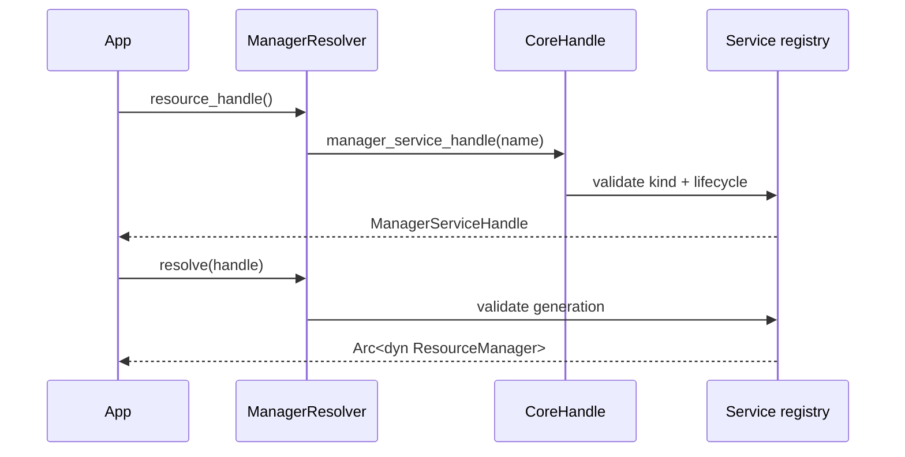

---
related_code:
  - zircon_runtime/src/core/manager/mod.rs
  - zircon_runtime/src/core/manager/resolver.rs
  - zircon_runtime/src/core/manager/service.rs
  - zircon_runtime/src/core/runtime/handle/resolution.rs
implementation_files:
  - zircon_runtime/src/core/manager/resolver.rs
  - zircon_runtime/src/core/manager/service.rs
plan_sources:
  - user: 2026-09-09 完善 ManagerResolver 与类型化句柄接口
tests:
  - zircon_runtime/src/core/manager/tests.rs
  - zircon_runtime/src/core/runtime/tests/resolution
doc_type: module-detail
---

# ManagerResolver 与类型化句柄

`zircon_runtime::core::manager` 把 registry 中的字符串服务名包装成稳定的 trait-object 句柄。它解决两个问题：调用方不必重复拼接 canonical name；manager 被卸载或重载时，句柄仍能通过 generation 检查避免访问错误实例。

## 公共名称

| 常量 | 默认值语义 | feature |
| --- | --- | --- |
| `RENDERING_MANAGER_NAME` | rendering manager registry key | always |
| `RENDER_FRAMEWORK_NAME` | render framework key | always |
| `RESOURCE_MANAGER_NAME` | resource manager key | always |
| `LEVEL_MANAGER_NAME` | scene level manager key | always |
| `INPUT_MANAGER_NAME` | input manager key | always |
| `INPUT_ACTION_MANAGER_NAME` | input action key | always |
| `CONFIG_MANAGER_NAME` | config manager key | always |
| `ANIMATION_MANAGER_NAME` | animation manager key | always |
| `NAVIGATION_MANAGER_NAME` | navigation key | always |
| `AI_MANAGER_NAME` | AI manager key | `ai-contracts` |
| `PHYSICS_MANAGER_NAME` | physics key | `physics-contracts` |
| `SOUND_MANAGER_NAME` | sound key | `sound-contracts` |
| `NET_MANAGER_NAME` | net key | `net-contracts` |

## ManagerResolver

```rust
#[derive(Clone, Debug)]
pub struct ManagerResolver { /* CoreWeak */ }

impl ManagerResolver {
    pub fn new(core: CoreHandle) -> Self;
    pub fn resolve<T: ?Sized + Send + Sync + 'static>(
        &self,
        handle: ManagerServiceHandle<T>,
    ) -> Result<Arc<T>, CoreError>;
}
```

专用访问器包括 `rendering_handle`、`render_framework_handle`、`resource_handle`、`level_handle`、`input_handle`、`input_actions_handle`、`config_handle`、`animation_handle`、`navigation_handle` 和 `platform_preferences_handle`；feature-gated 访问器为 `ai_handle`、`physics_handle`、`sound_handle`、`net_handle`。

| 函数 | 返回 |
| --- | --- |
| `rendering_manager_handle(&CoreHandle)` | `Result<ManagerServiceHandle<dyn RenderingManager>, CoreError>` |
| `render_framework_handle(&CoreHandle)` | 对应 `dyn RenderFramework` |
| `resource_manager_handle(&CoreHandle)` | 对应 `dyn ResourceManager` |
| `config_manager_handle(&CoreHandle)` | 对应 `dyn ConfigManager` |

示意调用形状：

```rust
let resolver = ManagerResolver::new(runtime.handle());
let handle = resolver.resource_handle()?;
let resource = resolver.resolve(handle)?;
```

## ManagerServiceHandle

`manager_service_handle(core, name)` 返回 `ManagerServiceHandle<T>`；`resolve_manager_service(core, handle)` 是无 resolver 场景的函数式入口。句柄内部保存 `RegisteredManagerService` 的 index/generation/name，不应自行构造。公开 trait 必须 `Send + Sync + 'static` 才能被解析。



## 错误与重试

`MissingService` 表示模块未注册；`ServiceKindMismatch` 表示名称对应的不是 manager；`ServiceDowncast` 表示实现类型与 trait 不一致；`StaleServiceHandle` 表示 reload/unload 后需重新取得 handle；`RuntimeUnavailable` 表示 resolver 的 weak core 已失效。只有 transient 的 `ServiceUnavailable` 才适合在模块 ready 阶段稍后重试，解析循环中不要忙等。

## feature gate 规则

文档和调用代码必须和 Cargo feature 同步。没有启用 `physics-contracts` 时，`PhysicsManager` 类型和 `physics_manager_handle` 根本不存在，不能以运行时“不可用”代替编译期条件。跨平台插件应使用 `#[cfg(feature = "...")]` 包围 import、注册和访问器。

## 并发与缓存

- resolver 可跨线程 clone；每次 `resolve` 会 upgrade weak core。
- 将 handle 缓存于模块状态，调用时短暂 resolve；不要缓存 `Arc<dyn Manager>` 作为卸载控制手段。
- manager 方法内部如需长任务，应转交 `EngineTaskGraph`，避免持有 registry 锁。

## 参考与测试

Fyrox 的 manager-like resource 由 editor/runtime crate 明确拥有；Bevy 的 resource access 则依赖 world borrow。Zircon 选择独立 manager registry，以支持插件热重载和 generation-safe handle。验证见 `core/manager/tests.rs`、`core/runtime/tests/resolution`。

## 完整访问器清单

| 访问器 | trait object |
| --- | --- |
| `rendering_handle` | `dyn RenderingManager` |
| `render_framework_handle` | `dyn RenderFramework` |
| `level_handle` | `dyn LevelManager` |
| `resource_handle` | `dyn ResourceManager` |
| `input_handle` | `dyn InputManager` |
| `input_actions_handle` | `dyn InputActionManager` |
| `config_handle` | `dyn ConfigManager` |
| `animation_handle` | `dyn AnimationManager` |
| `navigation_handle` | `dyn NavigationManager` |
| `platform_preferences_handle` | `dyn PreferenceStorage` |
| `ai_handle` | `dyn AiManager`，`ai-contracts` |
| `net_handle` | `dyn NetManager`，`net-contracts` |
| `physics_handle` | `dyn PhysicsManager`，`physics-contracts` |
| `sound_handle` | `dyn SoundManager`，`sound-contracts` |

## 两个调用形状与负例

```rust
let manager_handle = rendering_manager_handle(&core)?;
let manager = resolve_manager_service(&core, manager_handle)?;
let backend = manager.backend_info();
```

```rust
let resolver = ManagerResolver::new(core.clone());
let handle = resolver.config_handle()?;
let config = resolver.resolve(handle)?;
config.set_value("render", serde_json::json!({"quality": "high"}))?;
let value = config.get_value("render");
```

负例：保存 `Arc<dyn RenderingManager>` 跨 `deactivate_module`，然后继续提交帧。正确做法是缓存 handle，在每个生命周期阶段重新 resolve，并对 `StaleServiceHandle` 做一次受控刷新。

## 测试映射与边界

`manager/tests.rs` 验证名称常量、resolver 访问器和弱 core；`runtime/tests/resolution` 验证精确 service kind、downcast、stale generation。resolver 本身不负责激活模块，不应在 render loop 中把“缺少 manager”当成自动安装插件的信号。
