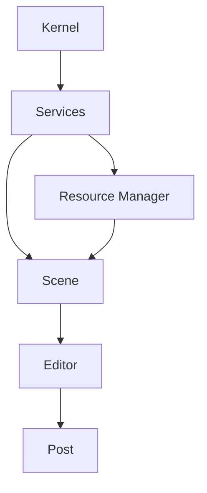
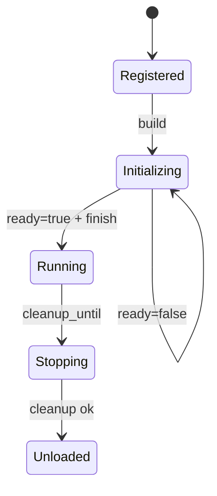

---
related_code:
  - zircon_runtime/src/core/runtime/descriptors/module_descriptor.rs
  - zircon_runtime/src/core/runtime/descriptors/module_order.rs
  - zircon_runtime/src/core/runtime/lifecycle.rs
  - zircon_runtime/src/core/runtime/descriptors/module_dependency_spec.rs
implementation_files:
  - zircon_runtime/src/core/runtime/descriptors/module_descriptor.rs
  - zircon_runtime/src/core/runtime/descriptors/module_order.rs
plan_sources:
  - user: 2026-09-09 完善 ModuleDescriptor、ModuleLifecycle 与依赖排序说明
tests:
  - zircon_runtime/src/core/runtime/tests/registration/behavior/module_order.rs
  - zircon_runtime/src/core/runtime/tests/registration/behavior/validation.rs
  - zircon_runtime/src/core/runtime/tests/activation/behavior/module_lifecycle.rs
doc_type: module-detail
---

# ModuleDescriptor 与生命周期排序

`ModuleDescriptor` 是模块进入 runtime registry 的声明对象。它把模块元数据、初始化层级、模块依赖、生命周期实现和 Driver/Manager/Plugin descriptor 收在一个不可变拓扑输入中。注册后 runtime 会构建 `FrozenModuleGraph`，后续激活与关闭都使用同一份排序结果。

## 构造器与 builder

| API | 参数/返回 | 约束 |
| --- | --- | --- |
| `ModuleDescriptor::new(name, description)` | `impl Into<String>` -> `Self` | 默认 `InitLevel::Post`、`NoopModuleLifecycle` |
| `with_init_level(level)` | `InitLevel` -> `Self` | 依赖模块不能处于更晚 level |
| `with_module_dependency(spec)` | `ModuleDependencySpec` -> `Self` | 同模块重复依赖会失败 |
| `with_lifecycle(Arc<dyn ModuleLifecycle>)` | 生命周期对象 -> `Self` | 对象必须 `Send + Sync` |
| `with_driver/manager/plugin(desc)` | descriptor -> `Self` | 名称组合成 canonical `RegistryName` |

```rust
use std::sync::Arc;
use zircon_runtime::core::{InitLevel, ModuleDescriptor, ModuleLifecycle};

let descriptor = ModuleDescriptor::new("physics", "Physics services")
    .with_init_level(InitLevel::Services)
    .with_lifecycle(Arc::new(MyLifecycle::default()));
runtime.register_module(descriptor)?;
```

## InitLevel 与拓扑

`InitLevel` 顺序为 `Kernel < Services < Scene < Editor < Post`。排序先检查名称唯一性、依赖存在性、重复依赖和 level 约束，再进行稳定拓扑遍历。作者声明顺序用于错误定位；遍历阶段使用确定性 lexical view，保证跨机器结果一致。



依赖边必须从被依赖模块指向当前模块。典型错误是 editor 模块反向依赖 scene，或 Post 模块被 Kernel 依赖；两者都会产生 `ModuleInitLevelViolation`。

## 模块级错误

| `CoreError` | 说明 |
| --- | --- |
| `DuplicateModule` | descriptor 名称重复 |
| `MissingModuleDependency` | 依赖未注册 |
| `DuplicateModuleDependency` | 同模块声明同一依赖两次 |
| `ModuleInitLevelViolation` | 依赖 level 晚于当前模块 |
| `ModuleDependencyCycle`/`DependencyCycle` | 拓扑或服务依赖成环 |
| `ModuleAlreadyActive` | 重复激活；可视为幂等结果或记录日志 |
| `ModuleCleanupTimeout` | cleanup 超过统一 deadline |

## ModuleLifecycle 回调

```rust
pub trait ModuleLifecycle: Send + Sync {
    fn build(&self, context: &ModuleContext) -> CoreResult<()>;
    fn ready(&self, context: &ModuleContext) -> CoreResult<bool>;
    fn finish(&self, context: &ModuleContext) -> CoreResult<()>;
    fn cleanup(&self, context: &ModuleContext) -> CoreResult<()>;
    fn cleanup_until(&self, context: &ModuleContext, deadline: Instant) -> CoreResult<()>;
}
```

默认实现全部成功，`ready` 返回 `true`。异步资源模块应在 `build` 启动加载，在 `ready` 检查依赖是否可用，只有准备好时返回 true；不要在 `ready` 内永久阻塞线程。



`cleanup_until` 接收宿主传入的绝对 deadline；默认实现忽略 deadline 并调用 `cleanup`，需要可中断 IO 的模块应覆写它。cleanup 失败会停止后续关闭，调用方必须根据 `CoreError` 决定 abort 或继续其他域。

## 服务描述与 startup mode

ModuleDescriptor 中的 Driver/Manager/Plugin descriptor 会进一步提供 `StartupMode::{Immediate, Lazy}`。Immediate 服务随模块启动解析；Lazy 服务首次 `resolve_*` 时初始化。即使是 Lazy，依赖图仍在 freeze 时校验，避免运行时才发现拼写错误。

## 设计对照

Fyrox 使用窄 crate 和 editor/runtime 分层，证明模块声明应独立于运行实例；Bevy 的 schedule 则强调系统顺序。Zircon 取两者交集：声明集中在 descriptor，执行由 CoreRuntime coordinator 控制，并额外把 cleanup deadline、service drain 和 generation 纳入契约。

## 验证清单

- 名称是否稳定且不依赖显示文本？
- module dependency 是否只指向更早 InitLevel？
- build 是否只做可回滚注册，不持有跨 runtime 强引用？
- ready 是否有明确的 false -> true 条件和通知路径？
- cleanup_until 是否尊重 deadline，并在超时返回可诊断错误？
- 是否为依赖排序和 lifecycle 添加行为测试？

相关测试位于 `core/runtime/tests/registration` 和 `activation/behavior/module_lifecycle.rs`。

## 完整字段参考

| 字段 | 类型 | 默认值/来源 |
| --- | --- | --- |
| `name` | `String` | `new` 参数；必须唯一 |
| `description` | `String` | `new` 参数；用于诊断 |
| `init_level` | `InitLevel` | `Post` |
| `module_dependencies` | `Vec<ModuleDependencySpec>` | 空 |
| `lifecycle` | `Arc<dyn ModuleLifecycle>` | `NoopModuleLifecycle` |
| `drivers` | `Vec<DriverDescriptor>` | 空 |
| `managers` | `Vec<ManagerDescriptor>` | 空 |
| `plugins` | `Vec<PluginDescriptor>` | 空 |

`InitLevel::{Kernel, Services, Scene, Editor, Post}` 是完整公开枚举变体；`StartupMode::{Immediate, Lazy}` 控制服务首次创建时机；`LifecycleState::{Registered, Initializing, Running, Stopping, Unloaded}` 只读出现在诊断和错误中。

## 两个调用示例

```rust
let core = CoreRuntime::try_new()?;
core.register_module(ModuleDescriptor::new("kernel", "base"))?;
core.activate_module("kernel")?;
```

```rust
let scene = ModuleDescriptor::new("scene", "scene services")
    .with_init_level(InitLevel::Scene)
    .with_module_dependency(ModuleDependencySpec::named("kernel"));
core.register_module(scene)?;
core.activate_registered_modules_with_ready_timeout(Duration::from_secs(2))?;
```

## 负例、回滚与测试

不要在 `ModuleLifecycle::build` 中修改另一个模块 descriptor；freeze 后拓扑不可变。不要在 `ready` 返回 false 后继续暴露 manager。build、ready、finish 任一失败都应让 coordinator 保留可诊断状态，下一次激活必须重新走完整阶段。排序、重复依赖和 cleanup timeout 分别由 registration behavior、module order 和 activation behavior 测试覆盖。
