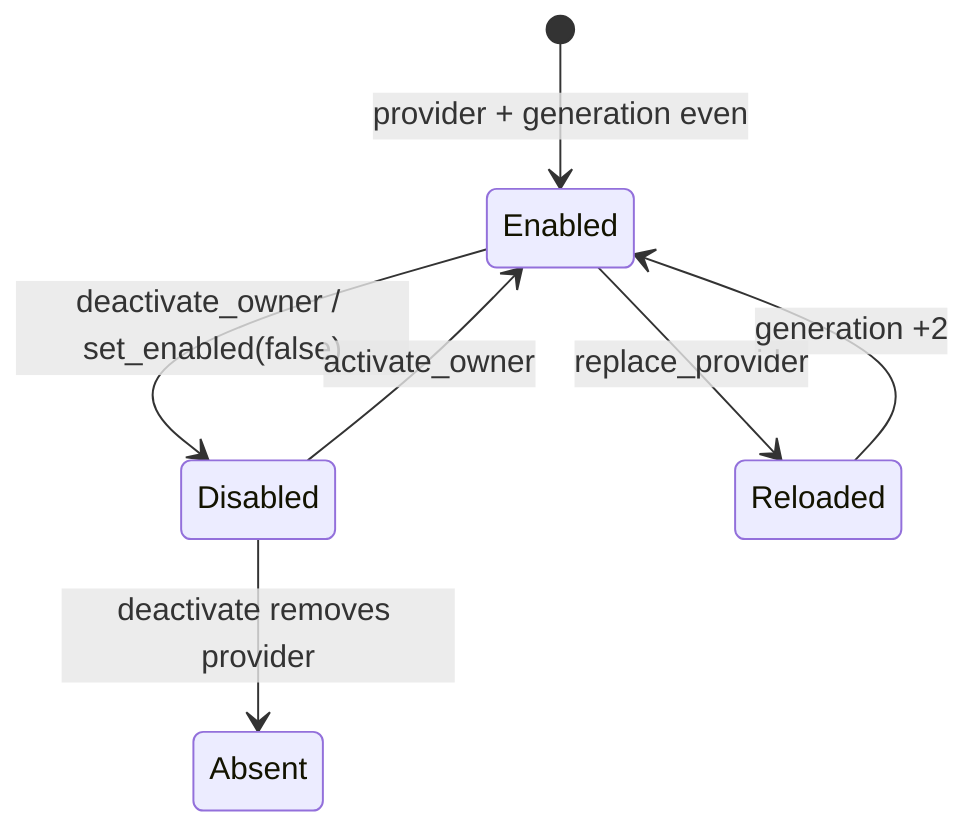

---
related_code:
  - zircon_runtime/src/platform/capability/status.rs
  - zircon_runtime/src/plugin/capability_status.rs
  - zircon_runtime/src/plugin/bridge/table.rs
  - zircon_runtime/src/plugin/bridge/weak.rs
  - zircon_runtime/src/plugin/bridge/import.rs
implementation_files:
  - zircon_runtime/src/plugin/bridge/table.rs
  - zircon_runtime/src/platform/capability/status.rs
plan_sources:
  - user: 2026-09-09 完善平台能力与插件桥接边界说明
tests:
  - zircon_runtime/src/plugin/bridge/table.rs
  - zircon_runtime/src/plugin/bridge/table/optimization_tests.rs
  - zircon_runtime/src/platform/tests
doc_type: module-detail
---

# 平台能力与插件桥边界

平台 capability 和 plugin bridge 是两个不同层次：platform 报告当前目标是否支持某能力；bridge 管理插件导出的接口 provider、owner、generation 和调用诊断。不要用 capability status 代替 bridge enablement，也不要把 bridge table 当作平台探测器。

## CapabilityStatus

平台层 `CapabilityStatus<T>` 变体：`Supported(T)`、`FeatureDisabled { feature: &'static str }`、`Unavailable { reason: &'static str }`；`is_supported()` 只对第一种返回 true。插件清单层 `plugin::CapabilityStatus` 变体：`Complete`、`Partial`、`Stub`、`Externalized`、`Unsupported`，用于声明实现成熟度。

```rust
match platform_capability() {
    CapabilityStatus::Supported(value) => use_backend(value),
    CapabilityStatus::FeatureDisabled { feature } => log_disabled(feature),
    CapabilityStatus::Unavailable { reason } => fallback(reason),
}
```

## BridgeEntry 与 FrozenBridgeTable

| API | 返回/规则 |
| --- | --- |
| `BridgeEntry::interface_id()` | 稳定接口 ID |
| `owner()` | `PluginModuleId` |
| `generation()` | 偶数通常 enabled，奇数 disabled |
| `is_enabled()` / `status()` | 当前可调用状态 |
| `provider_installed()` | provider 是否存在 |
| `diagnostics()` | call counters 快照 |
| `FrozenBridgeTable::resolve_slot(id)` | `Option<InterfaceSlot>` |
| `entry(slot)` / `entries()` | 读取 immutable table |
| `interface_status(id)` | absent/disabled/enabled |
| `interface_snapshots*()` | 单个、全部或按 owner 快照 |
| `diagnostics_summary*()` | 聚合统计 |
| `diagnostics_matrix*()` | 可供 devtools 展示 |
| `resolve_strong<T>()` | `Result<StrongBridge<T>, RuntimeExtensionRegistryError>` |
| `resolve_weak<T>()` | `WeakBridge<T>`，可在 disabled 时安全返回错误 |
| `set_enabled(slot, bool)` | 改变 enablement，slot 不存在则错误 |
| `activate/deactivate_owner*` | 批量 owner transition，可取 report |
| `replace_provider/reload_provider` | 替换 provider 并推进 generation |



`FrozenBridgeTable` 的 allocation immutable；状态通过 `ArcSwap` 原子替换。generation parity 是 enablement 契约，generation 递增还用于检测 provider reload 后的旧调用上下文。

## StrongBridge 与 WeakBridge

Strong bridge 适合模块激活期间的高频调用，但不应跨插件卸载保存；weak bridge 可长期缓存，调用时检查 enabled/provider。`WeakBridge::call`、`pin` 返回 `BridgeError`；最常见是 `Absent`、`NotEnabled` 或 provider 类型不匹配。桥接调用不得跨 Rust unwind 边界，native host 应使用 `catch_native_callback_panic`。

## 典型调用形状

```rust
let weak = table.resolve_weak::<dyn MyInterface>();
let value = weak.call(|provider| provider.sample())?;
```

```rust
let slot = table.resolve_slot(<dyn MyInterface as PluginInterface>::INTERFACE_ID)
    .ok_or("missing interface")?;
table.set_enabled(slot, true)?;
let snapshot = table.interface_snapshot(slot);
```

以上为调用形状；具体 provider 注册由 runtime extension registry 完成，外部调用方不能直接构造 `BridgeEntry` 或 `FrozenBridgeTable::from_exports`（后者 crate-private）。

## owner transition 与诊断

`activate_owner_with_report`、`deactivate_owner_with_report`、`set_owner_enabled_with_report` 返回 `BridgeOwnerTransitionReport`，内含 owner、mode、affected slots 和 snapshots。开发工具应展示 report，而不是在 transition 中逐个读取 provider。`BridgeDiagnosticsMatrix::diagnostic_lines()` 适合写入诊断日志。

## ABI、线程与生命周期

- bridge table 可跨线程读；provider 必须 `Send + Sync`。
- provider 替换使用原子快照，旧 Arc 在现有调用结束前仍保持有效。
- plugin unload 先 disable owner，再等待调用者释放 guard/bridge pin，最后移除 provider。
- interface ID 必须版本化（如 `.v1`），改变方法布局时发布新 ID，不复用旧 slot。
- capability `FeatureDisabled` 是编译/打包选择；bridge `Disabled` 是运行时状态，两者都要在错误诊断中保留。

## 参考与测试

Unreal 的 module interface/feature module 体现“能力声明与实现装载分离”；Godot 的 modules/platform 目录体现平台后端隔离。Zircon 用 frozen table + generation 提供更严格的热重载边界。测试见 `plugin/bridge/table.rs` 及 optimization tests、platform capability tests。

## 完整报告类型

`BridgeInterfaceSnapshot` 字段包含 `slot`、`interface_id`、`owner`、`generation`、`provider_installed`、`status` 和 diagnostics；`BridgeTableDiagnosticsSummary` 汇总 enabled/disabled/absent 计数；`BridgeDiagnosticsMatrix` 提供按接口的行集合；`BridgeOwnerTransitionReport` 包含 `owner`、`mode`、`affected_slots`、`snapshots`。这些类型适合 devtools/telemetry，不应作为 plugin business state 修改。

## 第二组调用形状

```rust
let report = table.deactivate_owner_with_report(plugin_id);
for row in report.snapshots {
    write_warn("plugin", row.diagnostic());
}
```

```rust
let table = extension_registry.bridge_table();
let status = table.interface_status("zircon.render.v1");
if status == BridgeInterfaceStatus::Enabled {
    let bridge = table.resolve_strong::<dyn RenderExtension>()?;
    bridge.submit();
}
```

负例：缓存 `StrongBridge` 穿过 owner deactivation；即使 Arc provider 尚存，调用也可能绕过当前 enablement policy。长生命周期对象应缓存 `WeakBridge` 并在每次 call/pin 时检查状态。

## 平台 gate 与验收

平台 backend 枚举（window/input/gamepad/event loop 等）由目标平台和 feature 决定；文档中的 `Supported` 不等于具体 backend 一定可创建。验收应分别检查 compile-time feature matrix、runtime capability status、bridge status/generation 和 owner transition report。
