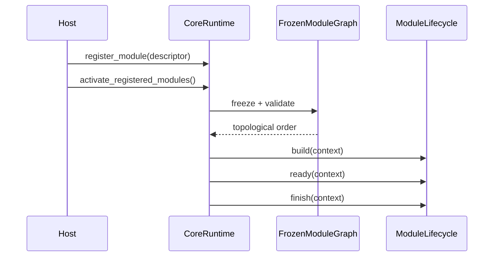

---
related_code:
  - zircon_runtime/src/core/runtime/runtime.rs
  - zircon_runtime/src/core/runtime/frame_clock.rs
  - zircon_runtime/src/core/runtime/random/service.rs
  - zircon_runtime/src/core/runtime/tasks/task_graph/engine_task_graph.rs
implementation_files:
  - zircon_runtime/src/core/runtime/runtime.rs
plan_sources:
  - user: 2026-09-09 完善 CoreRuntime 公开接口说明
tests:
  - zircon_runtime/src/core/runtime/tests/activation
  - zircon_runtime/src/core/runtime/tests/tasks.rs
doc_type: module-detail
---

# Runtime 构造、激活与关闭

`CoreRuntime` 是应用宿主拥有的 runtime facade。它持有一个 `CoreHandle`、一个 runtime-owned `EngineTaskGraph`、`FrameClock`、`RandomService` 以及模块/服务注册状态。一个进程可以创建多个 runtime；每个实例的 worker budget 和随机流相互隔离。

## 构造 API

| API | 参数 | 返回 | 失败语义 |
| --- | --- | --- | --- |
| `CoreRuntime::new()` | 无 | `Self` | 内部等价 `try_new().unwrap_or_else(panic)`；只适合已知配置有效的入口 |
| `CoreRuntime::try_new()` | 无 | `Result<Self, EngineTaskGraphInitError>` | 默认 `EngineTaskGraphOptions` 初始化失败时返回错误 |
| `try_with_task_graph_options(options)` | worker、pool 选项 | `Result<Self, EngineTaskGraphInitError>` | 不创建第二套全局 worker |
| `with_random_seed(seed)` | `u64` | `Self` | 使用默认 clock 与显式 master seed |
| `with_random_service_state(state)` | `RandomServiceState` | `Self` | 恢复 seed authority，不恢复 stream progress |
| `with_random_service_checkpoint(checkpoint)` | `RandomServiceCheckpoint` | `Result<Self, RandomServiceError>` | checkpoint 无效时返回错误 |
| `with_clock_source(source)` | `Arc<dyn ClockSource>` | `Self` | source 只影响 authoritative frame delta |
| `with_clock_source_and_random_seed(source, seed)` | clock + seed | `Self` | 便于确定性回放 |

示意调用形状：

```rust
use zircon_runtime::core::CoreRuntime;
use zircon_runtime::core::tasks::EngineTaskGraphOptions;

let runtime = CoreRuntime::try_with_task_graph_options(
    EngineTaskGraphOptions::with_worker_threads(4),
)?;
let handle = runtime.handle();
```

`scheduler()` 和 `task_graph()` 返回 runtime 自有执行 owner 的引用；不要另建 `TaskPools::default()` 来“补充”线程，因为会失去统一 shutdown 和诊断归属。

## 激活顺序



`register_module` 只改变可注册状态；第一次需要图的操作会冻结描述符。冻结之后，声明顺序、模块依赖和服务排序不会漂移。`activate_module(name)` 会激活该模块的依赖闭包；`activate_registered_modules()` 激活全部模块。

| API | 关键规则 |
| --- | --- |
| `register_module` | 重名、缺失依赖、重复依赖、init level 逆序在此阶段或 freeze 阶段失败 |
| `activate_module` | 先依赖后被依赖；并发调用同一模块由 coordinator 合并 |
| `activate_module_with_ready_timeout` | `ready` 返回 `false` 时等待通知，超时映射为 `CoreError` |
| `activate_registered_modules_with_ready_timeout` | 对完整图使用同一 ready budget |

## 帧与时间

| API | 语义 |
| --- | --- |
| `tick_time(max_fixed_steps)` | 从 clock source 采样一次外帧并执行固定步上限 |
| `advance_time_by(real_delta, max_fixed_steps)` | 测试、回放和宿主自带时钟使用；不会改变其他 monotonic clocks |
| `submit_clock_discontinuity(discontinuity)` | 显式 rebase，返回 `FrameClockRebaseReceipt` |
| `time_policy()` / `time_policy_generation()` | 读取当前策略和 generation |
| `apply_time_policy(transaction)` | 原子校验并提交策略，失败返回 `TimePolicyError` |

大 delta 不应直接循环调用 `advance_time_by` 追赶；先使用 discontinuity/rebase，避免固定步爆炸。`FrameTimeSnapshot` 是本帧只读结果，应在同一帧向场景、动画和渲染传递。

## 关闭 API

关闭必须按“停止新工作 -> drain 调用 -> 停止模块 -> 关闭 task graph”的方向执行：

```text
deactivate_module_with_drain_timeout
        ↓
shutdown_registered_modules_with_drain_timeout
        ↓
shutdown_task_graph
```

`shutdown_registered_modules_with_drain_timeout` 使用一个总 budget，并为逆激活顺序中的每个模块计算剩余时间；不是每个模块重新获得完整 timeout。`shutdown_task_graph` 只关闭 task graph admission 和其 worker，不代表平台窗口、渲染设备或外部插件已经停止。

常见错误：`ModuleCleanupTimeout` 表示 cleanup 没有在 deadline 前完成；`ServiceCallDrainTimeout` 表示仍有 in-flight guard；`TaskGraphShutdownError` 表示 worker 或 scope 未 quiesce。记录错误后，宿主应进入明确的 degraded/abort policy，不能继续接受新服务调用。

## 线程、所有权与性能

- `CoreRuntime`、`CoreHandle`、`CoreWeak` 可跨线程克隆；模块生命周期回调由调用激活的线程执行，但服务实现必须满足 `Send + Sync`。
- `tick_time`、模块激活和 task graph shutdown 通常应由 owner thread 串行调用。
- runtime 每实例创建自己的 worker set；多实例场景显式配置 worker 数量，避免过度订阅。
- 句柄 clone 是 `Arc` 增量；不要在每个热路径实体上重复解析名字，使用 `ServiceHandle` 或 manager handle 缓存身份。

## 对照与边界

Fyrox 的 editor/runtime 分离启发了 Zircon 的“宿主持有 runtime、模块只持有 context”边界；Bevy 的 `App::update` 提供了帧驱动参考。Zircon 有意把 shutdown budget、服务 drain 和模块拓扑作为一等契约，而不是交给 `App` 中的隐式系统顺序。

## 相关测试

- `core/runtime/tests/activation/behavior/activation.rs`：激活成功与竞争。
- `core/runtime/tests/activation/behavior/deactivation`：关闭顺序、veto、blocked unload。
- `core/runtime/tests/tasks.rs`：runtime-owned task graph 和 worker inventory。
- `core/runtime/tests/weak.rs`：runtime drop 后弱句柄升级失败。

## 完整公开符号速查

下面的列表按 `CoreRuntime` 当前 facade 的源码顺序整理；内部 helper 不在此伪装成 public API。

| 符号 | 签名摘要 | 生命周期阶段 |
| --- | --- | --- |
| `handle` | `fn handle(&self) -> CoreHandle` | 任意存活阶段 |
| `weak` | `fn weak(&self) -> CoreWeak` | 任意存活阶段 |
| `scheduler` | `fn scheduler(&self) -> &JobScheduler` | graph closing 前 |
| `task_graph` | `fn task_graph(&self) -> &EngineTaskGraph` | graph closing 前 |
| `random_service` | `fn random_service(&self) -> &RandomService` | 任意存活阶段 |
| `real_time` | `fn real_time(&self) -> Time<MonotonicReal>` | 任意存活阶段 |
| `diagnostic_store` | `fn diagnostic_store(&self) -> DiagnosticStore` | 任意存活阶段 |
| `diagnostic_store_snapshot` | `fn diagnostic_store_snapshot(&self) -> DiagnosticStoreSnapshot` | 任意存活阶段 |
| `record_diagnostic<U,T>` | `fn(..., unit: Option<U>, tags: impl IntoIterator<Item=T>)` | 任意存活阶段 |
| `publish_event` | `fn(topic: impl Into<String>, payload: Value)` | bus 可用时 |
| `subscribe_events` | `fn(topic, policy) -> Box<dyn EngineEventSubscription>` | bus 可用时 |
| `store_config_value` | `fn(key: impl Into<String>, value: Value)` | 任意存活阶段 |
| `load_config_value` | `fn(key: &str) -> Option<Value>` | 任意存活阶段 |
| `snapshot_config_values` | `fn() -> HashMap<String, Value>` | 任意存活阶段 |
| `load_config<T>` | `fn(key: &str) -> Result<T, CoreError>` | 任意存活阶段 |
| `init_state<T>` | `fn() -> StateTransitionEvent<T>` | owner thread |
| `insert_state<T>` | `fn(state: T) -> StateTransitionEvent<T>` | owner thread |
| `state<T>` | `fn() -> Option<State<T>>` | owner thread |
| `next_state<T>` | `fn() -> NextState<T>` | owner thread |
| `set_next_state<T>` | `fn(state: T)` | owner thread |
| `apply_state_transition<T>` | `fn() -> Option<StateTransitionEvent<T>>` | owner thread |

## 调用前后检查表

| 调用 | 调用前 | 成功后 | 失败后 |
| --- | --- | --- | --- |
| `try_new` | 无 runtime | worker、clock、registry ready | 无半初始化对象返回 |
| `register_module` | graph 未冻结 | descriptor 进入 registry | descriptor 不可见，错误可修复 |
| `activate_*` | 模块 Registered | Running，服务可解析 | coordinator 回滚到 Registered 或报告错误 |
| `tick_time` | clock 可采样 | frame index 前进 | discontinuity 需显式提交 |
| `deactivate_module` | Running | Stopping -> Unloaded | drain/cleanup 错误保留诊断 |
| `shutdown_task_graph` | admission open | worker joined | graph closing，不再接受新 scope |

## 负例与替代方案

```rust
// 负例：用 panic 掩盖可预期配置错误。
let runtime = CoreRuntime::new();
runtime.register_module(user_descriptor).unwrap();
```

```rust
// 推荐：在 app 边界映射错误并附带模块上下文。
let runtime = CoreRuntime::try_new()?;
runtime.register_module(user_descriptor)
    .map_err(|error| AppError::ModuleRegistration(error.to_string()))?;
```

```rust
// 负例：每个子系统创建自己的 worker pool，shutdown 无法统一收敛。
// let pool = TaskPools::default();
```

```rust
// 推荐：使用 runtime-owned scheduler。
runtime.scheduler().schedule(|| expensive_step());
```

## 参考实现差异

Fyrox 常由 editor crate 持有异步资源上下文，Bevy 则由 `App` 驱动所有 schedule。Zircon 保留 facade 与 owner 分离：facade 只转发，真正的 admission、generation、deadline 和诊断状态位于 runtime inner。这使多个 editor preview runtime 可以并存，也让 plugin unload 有明确的 drain 点。

## 测试映射补充

| 契约 | 测试 |
| --- | --- |
| runtime facade 复用同一 handle | `runtime.rs::runtime_facade_reuses_its_owned_handle` |
| 显式 worker budget | `runtime.rs::core_runtime_routes_scope_shutdown_through_its_execution_owner` |
| activation contention | `tests/activation/behavior/activation/contention.rs` |
| shutdown order | `tests/activation/behavior/deactivation/shutdown_order.rs` |
| reactivation | `tests/activation/behavior/reactivation.rs` |

## 维护要求

新增 facade 方法时同步更新本表、`api-index.md` 对应链接和测试映射；若方法是 `pub(crate)`，应在文中明确“内部 helper”，不要把它写进稳定调用示例。任何涉及 worker、clock、random source 的行为改变，都需要说明是否破坏多 runtime 隔离或确定性回放。
