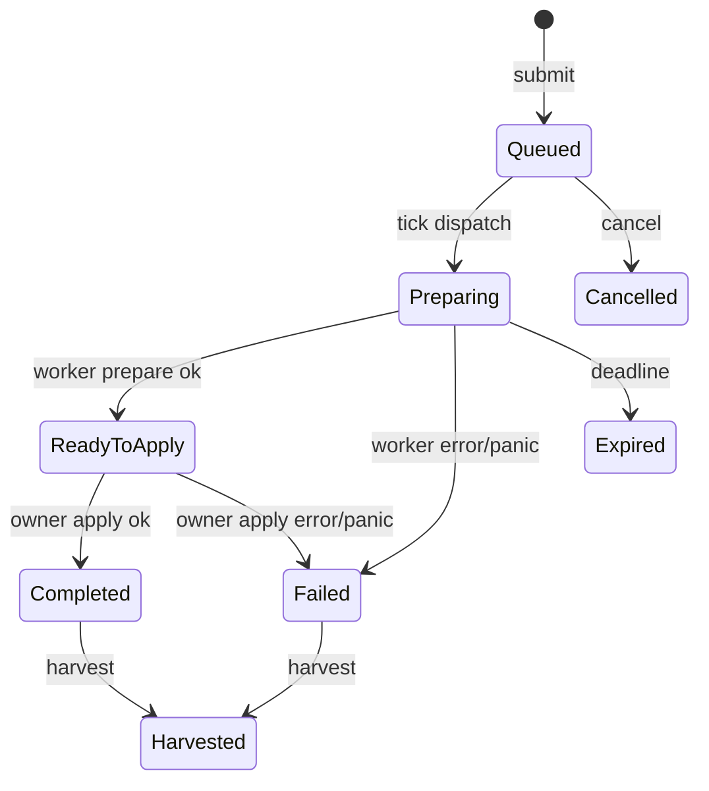

---
related_code:
  - zircon_runtime/src/operation/service.rs
  - zircon_runtime/src/operation/service/admission.rs
  - zircon_runtime/src/operation/handler.rs
  - zircon_runtime/src/operation/context.rs
implementation_files:
  - zircon_runtime/src/operation/service.rs
  - zircon_runtime/src/operation/service/admission.rs
plan_sources:
  - user: 2026-09-09 完善 RuntimeOperation 公开接口与机制案例
tests:
  - zircon_runtime/src/operation/tests
  - zircon_runtime/src/operation/tests/source_guards.rs
doc_type: module-detail
---

# RuntimeOperation 服务

`RuntimeOperationService` 是 runtime-owned 的有界异步操作注册表。它把 owner thread 上的 world snapshot/apply 与 worker thread 上的 prepare 分开，并通过 `zircon_runtime_interface` 的 V1/V2 DTO 与动态 ABI 对接。服务不会自行 tick；宿主必须在每帧调用 `tick(core, world)`。

## Handler 契约

```rust
pub trait RuntimeOperationHandler: Send + Sync {
    fn snapshot(
        &self,
        context: RuntimeOperationContext<'_>,
        payload: serde_json::Value,
    ) -> Result<serde_json::Value, RuntimeOperationHandlerError>;
    fn prepare(
        &self,
        snapshot: serde_json::Value,
    ) -> Result<RuntimeOperationPrepared, RuntimeOperationHandlerError>;
    fn apply(
        &self,
        context: RuntimeOperationContext<'_>,
        command: serde_json::Value,
    ) -> Result<(), RuntimeOperationHandlerError>;
}
```

实现必须把 world、CoreHandle 和非 Send 引用限定在 snapshot/apply；prepare 只处理拥有的数据。`RuntimeOperationPrepared::new(command, result)` 的 result 会保留到 harvest，command 只供 owner apply。

## 服务 API

| API | 参数 | 返回/限制 |
| --- | --- | --- |
| `new()` | 无 | 默认 limits |
| `register_handler(id, Arc<dyn RuntimeOperationHandler>)` | 非空 id | duplicate/empty 返回错误 |
| `max_retained_bytes()` | 无 | 原始 payload + prepare/result 上限 |
| `submit(request)` | V1 request | handle；校验 ABI、operation id、容量 |
| `submit_json(bytes)` | UTF-8/JSON bytes | decode 失败为 `InvalidRequest` |
| `submit_with_deadline(request, Option<Instant>)` | owner deadline | 超时变为 `Expired` |
| `poll(handle)` | ABI handle | `ZrRuntimeOperationStatusV2` |
| `cancel(handle)` | handle | queue/preparing/ready 可取消 |
| `tick(core, world)` | owner refs | 驱动 snapshot、prepare completion、apply |
| `harvest(handle)` | terminal handle | 一次性取走 V1 result |

## 状态机



`cancel` 在 `apply_claimed` 后返回 `NotCancellable`；`harvest` 只接受 Completed/Failed，一次成功 harvest 后再次调用返回 `AlreadyHarvested`。terminal result 受 TTL 维护，过期后返回 `OperationExpired`。

## tick 顺序

1. `expire_due_deadlines`：终止超时 queued/preparing/ready。
2. `drain_prepare_completions`：把 worker 结果放入 bounded state。
3. `apply_prepared`：owner thread 最多处理 limits 允许的 apply 数。
4. `snapshot_and_dispatch_queued_prepares`：读取 world 快照并提交 worker。

因此同一帧提交的操作通常至少经历一个 tick 才能进入 prepare；不要在 worker 线程直接改 `World`。`RuntimeOperationContext::core/world/world_mut` 仅在 owner phase 有效。

## 错误与容量

| 错误 | 处理 |
| --- | --- |
| `UnsupportedAbiVersion` | 升级 caller DTO 或降级 handler |
| `UnknownOperation` | 确认 handler 已在模块 build 注册 |
| `TaskCapacityReached` | 背压或等待 terminal/harvest |
| `RetainedBytesCapacityReached` | 缩小 payload/result 或提高配置 |
| `DeadlineTimerUnavailable` | 记录维护故障，避免无界重试 |
| `OwnerApplyFailed` | 结果为 Failed，harvest 仍可取诊断 |
| `NotTerminal` / `AlreadyHarvested` | 按状态机修正调用时机 |

`submit_json` 在 decode 前先保留原始字节预算；decode 失败会释放 reservation，避免攻击者用无效 JSON 耗尽容量。

## ABI 与示例

```rust
let request = ZrRuntimeOperationSubmitRequestV1 {
    abi_version: ZIRCON_RUNTIME_ABI_VERSION_V1,
    operation_id: "scene.spawn".into(),
    payload: serde_json::json!({"prefab":"hero"}),
};
let handle = service.submit(request)?;
service.tick(&runtime.handle(), &mut world);
let status = service.poll(handle)?;
```

这是示意调用形状；具体 DTO 字段以 `zircon_runtime_interface` 当前定义为准。动态 ABI harvest 必须在 owner apply 完成且 status terminal 后执行。

## 并发、性能和安全

- service state 用 mutex 保护；handler registry 只应在启动/模块 build 阶段修改。
- worker prepare 必须 `Send + Sync` 且不捕获 `&mut World`。
- limits 同时限制 task 数、retained bytes、in-flight prepares 和 owner applies；它们是稳定性边界，不是建议值。
- 对大型结果优先使用压缩/分页 payload，避免单次 JSON 分配阻塞 owner。
- handler panic 被 `catch_unwind` 转换为 Failed，不应跨 ABI unwinding。

相关测试覆盖 admission、deadline、harvest、panic 和 source guards；见 `zircon_runtime/src/operation/tests`。

## DTO 状态字段

ABI 层 `ZrRuntimeOperationStatusV2` 至少表达 handle、phase、detail kind/value、operation id 和错误/结果摘要；phase 变体包括 `Queued`、`Preparing`、`ReadyToApply`、`Completed`、`Failed`、`Cancelled`、`Expired`、`Harvested`。`ZrRuntimeOperationResultV1` 携带 ABI version、handle、operation id、成功/失败 payload。字段布局由 `zircon_runtime_interface` 维护，Rust 侧不要手写 repr 转换。

## 第二组调用形状

```rust
let handle = service.submit_json(br#"{"abi_version":1,"operation_id":"mesh.bake","payload":{}}"#)?;
loop {
    service.tick(&core, &mut world);
    match service.poll(handle)?.phase() {
        Some(ZrRuntimeOperationPhase::Completed)
        | Some(ZrRuntimeOperationPhase::Failed) => break,
        _ => std::thread::yield_now(),
    }
}
let result = service.harvest(handle)?;
```

```rust
let handle = service.submit_with_deadline(request, Some(Instant::now() + Duration::from_secs(1)))?;
if should_abort() { service.cancel(handle)?; }
```

负例：worker prepare 直接调用 `world_mut`；这违反 owner-thread 契约，可能导致数据竞争。另一个负例是重复 harvest；应在拿到结果后立即释放或记录 tombstone。

## 维护与容量验收

terminal TTL 到期会回收 result bytes；harvest 会立即释放 payload、prepared command/result 和 retained budget。测试必须覆盖 raw admission decode 失败时 reservation 回滚、deadline race、worker panic、owner apply error 和重复 cancel/harvest。

## 操作设计模板

| 阶段 | 允许访问 | 应做的事 | 禁止的事 |
| --- | --- | --- | --- |
| admission | request DTO | 校验 ABI、id、预算 | 分配无上限字符串 |
| snapshot | `&CoreHandle`, `&mut World` | 复制必要上下文 | 启动长时间 IO |
| prepare | owned JSON | CPU/IO、构造 command/result | 访问 world 或非 Send 状态 |
| apply | owner context | 提交实体/资源变更 | 等待 worker 自己完成 |
| harvest | terminal result | 一次性取结果 | 重复读取或修改 result |

每个 handler 都应定义幂等键。若宿主在 apply 后崩溃并重放请求，handler 可以根据业务 id 拒绝重复提交；RuntimeOperationService 本身只保证 handle 级一次 harvest，不理解业务语义。

## Deadline 案例

提交带 deadline 的操作时，deadline 在 admission 后由 maintenance alarm arm。若 tick 先看到 deadline 到期，任务进入 Expired；worker 即使稍后返回 Prepared，也不会重新进入 ReadyToApply。应用层应在 `poll` 中区分 Expired 与 Failed：前者通常是可重试，后者需要检查 handler 错误。

## ABI 安全边界

V1 request/result 的 ABI version 必须精确匹配 `ZIRCON_RUNTIME_ABI_VERSION_V1`。动态入口不得让 C/host callback 直接持有 `&mut World`；先进入 RuntimeOperationService，再由 owner tick 执行 apply。JSON 字节预算同时计算原始 request、payload、prepared command 和 result，防止仅限制 payload 却被 result 反向耗尽。

## 诊断字段建议

记录 operation id、handle.raw、phase、detail kind/value、queue depth、retained bytes、deadline 剩余时间和 handler 错误。不要把完整 payload 写入普通日志，尤其是插件或用户输入；使用摘要 hash 或字段白名单。

## 常见问题

**为什么 submit 成功但 poll 一直 Queued？** 宿主没有在 owner loop 调用 `tick`，或 owner apply/prepare 达到每帧上限。检查 runtime frame loop 和 diagnostics queue depth。

**为什么 cancel 返回 NotCancellable？** apply 已 claim，或任务已 terminal。取消必须在 Queued/Preparing/ReadyToApply 阶段发出。

**为什么 harvest 返回 NotTerminal？** worker prepare 或 owner apply 尚未完成；不要用 sleep 替代 poll/tick。

**为什么容量没有释放？** terminal 结果尚未 harvest 或 TTL 未到；成功 harvest 会立即释放 retained bytes。
