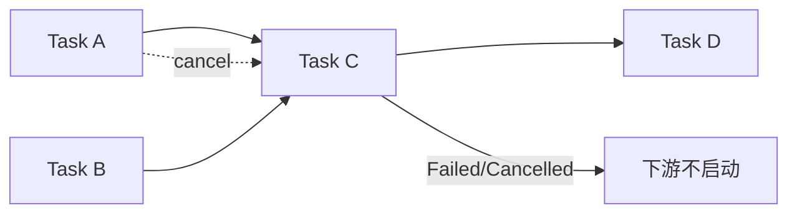

---
related_code:
  - zircon_runtime/src/core/runtime/tasks/task_graph/engine_task_graph.rs
  - zircon_runtime/src/core/runtime/tasks/job_scheduler.rs
  - zircon_runtime/src/core/runtime/tasks/job_handle.rs
  - zircon_runtime/src/core/runtime/tasks/task_graph/scope.rs
  - zircon_runtime/src/core/runtime/tasks/task_descriptor.rs
implementation_files:
  - zircon_runtime/src/core/runtime/tasks/job_scheduler.rs
  - zircon_runtime/src/core/runtime/tasks/task_graph/engine_task_graph.rs
plan_sources:
  - user: 2026-09-09 完善任务图、JobScheduler 与取消机制说明
tests:
  - zircon_runtime/src/core/runtime/tests/tasks.rs
  - zircon_runtime/src/core/runtime/tasks/job_scheduler/tests.rs
  - zircon_runtime/src/core/runtime/tasks/task_graph/scope/tests.rs
doc_type: module-detail
---

# 任务图、JobScheduler 与取消

任务系统分为 runtime-owned `EngineTaskGraph` 和其上的 `JobScheduler`。前者拥有 worker domains、scope admission 与 shutdown；后者提供轻量的 spawn/schedule/join API。任务完成状态通过 `JobHandle` 传播，依赖失败或取消会在 launch 前终止下游任务。

## 初始化与 scope

| API | 参数 | 返回 |
| --- | --- | --- |
| `EngineTaskGraph::try_new(options)` | `EngineTaskGraphOptions` | `Result<Self, EngineTaskGraphInitError>` |
| `create_scope(descriptor)` | `TaskGraphScopeDescriptor` | `Result<TaskGraphScope, TaskGraphAdmissionError>` |
| `worker_inventory()` | 无 | `TaskGraphWorkerInventory` |
| `shutdown(deadline)` | `Duration` | `Result<TaskGraphShutdownReport, TaskGraphShutdownError>` |
| `JobScheduler::from_pool(pool)` | `TaskPool` | scheduler facade |
| `with_diagnostics()` | 无 | 启用有界诊断 |

`TaskGraphScopeDescriptor::new(label)` 为 scope 命名；scope drop 不等于立即停止 worker，必须由 graph shutdown 收敛。runtime 已进入 closing 后新 scope 返回 `RuntimeStopped`。

## 调度 API

| API | 语义 |
| --- | --- |
| `spawn(FnOnce() + Send + 'static)` | fire-and-forget；panic 记录到 diagnostics |
| `schedule(FnOnce() + Send + 'static)` | 返回可等待 `JobHandle` |
| `schedule_after(&[JobHandle], task)` | 所有依赖 terminal 后才 launch |
| `wait_all(&[JobHandle])` | 组合 handle 并等待 |
| `install(task)` | 在 pool owner 上执行并返回值 |
| `join(a, b)` | 并行执行两个闭包并返回二元组 |
| `parallelism()` | 当前 pool worker 数 |
| `diagnostic_report()` | 队列、等待、完成计数快照 |
| `task_diagnostic_source()` | bounded observation source |

```rust
let prepare = runtime.scheduler().schedule(|| load_mesh());
let upload = runtime.scheduler().schedule_after(&[prepare], || upload_mesh());
upload.on_terminal(|| println!("upload terminal"));
upload.wait();
```

`wait()` 同步 terminal state，不保证 `on_terminal` observer 已执行完；需要后续逻辑时将它安排在 owner dispatcher 或显式 join 中。



## JobHandle 状态

`TaskState` 至少包含 `Pending`、`Running`、`Completed`、`Cancelled`、`Failed`；`terminal_state()` 返回 terminal 快照，`is_cancelled()` 只判断取消，不把 panic 混为取消。`combine(handles)` 对空 slice 返回 completed handle；任一依赖 panic 会使组合结果失败。

`on_terminal(observer)` 可注册多个 observer。observer panic 会被隔离并计数，使用 `terminal_observer_panic_count()` 观测；业务 panic 则由 `wait()` 重新 panic，或通过诊断报告查看。

## TaskGraphScope 与取消

scope admission 为任务分配 `TaskDescriptor { id, kind, label, cancellation_policy }`。`TaskCancellationToken` 可被 worker 检查；策略由 `TaskCancellationPolicy` 决定是 cooperative、deadline 还是 owner-forced。取消只能阻止尚未完成的工作，不能安全地中断任意外部 FFI。

## 关闭协议

```text
close scope admission
  -> wait task census == 0
  -> stop worker domains
  -> join workers
  -> emit TaskGraphShutdownReport
```

失败返回 `TaskGraphShutdownError`，报告可能包含未 join worker 或仍活动 scope。相对 timeout 只在最外层计算一次；runtime 内部使用绝对 deadline 版本继续关闭，避免超时预算被层层重置。

## 诊断与性能

启用 `with_diagnostics()` 后，scheduler 记录 scheduled、queued、active、dependency waiting、queue wait、explicit wait、completed、cancelled、panicked 等指标。诊断批次有容量上限，超过上限应按采样策略处理。短任务不要为每个闭包创建额外 channel；使用 `schedule` + combine。

Bevy `TaskPool`/`ComputeTaskPool` 提供 Rust 任务池参考，Godot 的 worker thread 也强调主线程资源提交。Zircon 有意把 graph ownership、scope census 和 shutdown report 暴露出来，以便 runtime 关闭与插件卸载可证明收敛。

## 常见错误

- 在 graph shutdown 后调用 scheduler：会 panic（admission 已关闭），应由上层先停止 producer。
- 在任务中持有 `ServiceCallGuard` 等待另一个依赖任务：可能造成 drain/依赖死锁。
- 通过共享可变全局状态绕过 scope：破坏多 runtime 隔离和诊断归属。
- 忽略 `JobHandle` panic：`wait()` 会重新抛出，生产代码应在边界捕获并记录。

相关测试：`core/runtime/tests/tasks.rs`、`job_scheduler/tests.rs`、`task_graph/scope/tests`。

## 公开类型字段与枚举

`TaskDescriptor` 字段为 `id: TaskId`、`kind: TaskPoolKind`、`label: String`、`cancellation_policy: TaskCancellationPolicy`；构造器 `new(id, kind, label)`，builder `with_cancellation_policy(policy)`。`TaskGraphScopeDescriptor::new(label)` 保存 scope 标签和容量策略。`JobHandle` 的公开查询为 `is_complete()`、`is_cancelled()`、`terminal_state()`、`on_terminal(observer)`、`terminal_observer_panic_count()`、`wait()`、`combine(handles)`、`completed()`。

`TaskGraphAdmissionError` 公开错误包括 runtime stopped、scope capacity 和 duplicate/invalid admission；`TaskGraphShutdownError` 包含 deadline、scope census 或 worker join 失败。具体变体应以当前 `task_graph/admission.rs`、`shutdown.rs` 为准，新增变体必须同步文档。

## 第二组调用形状

以下代码为伪代码片段，`write_log` 和 `import_batch` 由业务模块提供；取消 token 的来源和闭包签名与当前公开 API 一致。

```rust
let scope = runtime.create_task_graph_scope(
    TaskGraphScopeDescriptor::new("asset-import"),
)?;
let job = scope.submit(
    TaskDescriptor::new(TaskId::new(1), TaskPoolKind::Io, "asset-import"),
    move |token| {
        if token.is_cancellation_requested() { return; }
        import_batch();
    },
)?;
job.on_terminal(|| write_log("tasks", "import terminal"));
```

```rust
let a = runtime.scheduler().schedule(|| step_a());
let b = runtime.scheduler().schedule_after(&[a.clone()], || step_b());
let all = JobHandle::combine(&[a, b]);
all.wait();
```

负例：在 `on_terminal` 中调用同一 handle 的阻塞 `wait`，可能造成 dispatcher 自等待；observer 只应发布轻量通知。

## 诊断字段映射

`JobSchedulerReport` 与 `TaskDiagnosticSource` 记录 scheduled/queued/active/completed/cancelled/panicked、dependency wait、queue wait 和 explicit wait。诊断是 bounded observation，不能作为精确审计账本；需要严格计数时在业务层维护 idempotent receipt。

## 参考与验收

Bevy 的任务池允许 `scope` 受父任务控制；Zircon 增加 runtime-owned graph、worker inventory 和 shutdown report。验收重点是：scope 关闭后 admission 拒绝、依赖 panic 不启动下游、取消释放资源、所有 worker 在 deadline 内 join。
