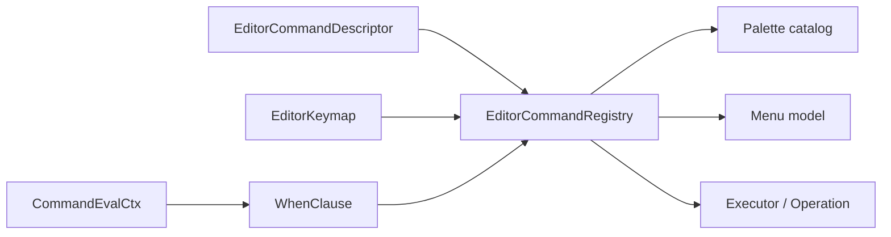
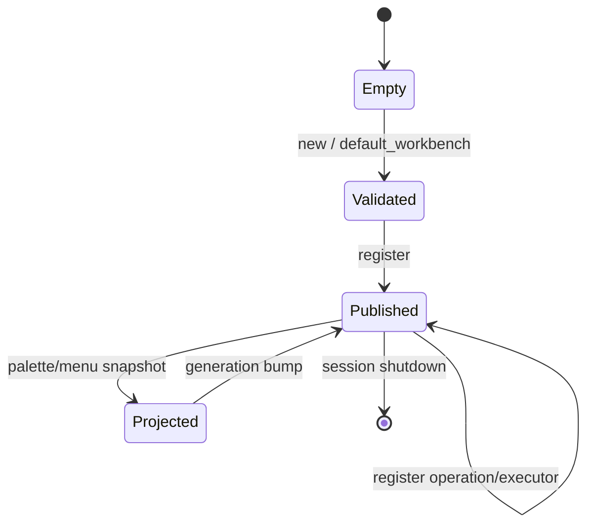

---
related_code:
  - zircon_editor/src/lib.rs
  - zircon_editor/src/core/commands/descriptor.rs
  - zircon_editor/src/core/commands/registry.rs
  - zircon_editor/src/core/commands/keymap.rs
  - zircon_editor/src/core/commands/palette.rs
  - zircon_editor/src/core/commands/when.rs
implementation_files:
  - zircon_editor/src/core/commands
plan_sources:
  - user: 2026-09-09 完善 ZirconEngine 公开接口、机制案例、教程与最佳实践
tests:
  - zircon_editor/src/core/commands
  - zircon_editor/src/tests
doc_type: module-detail
---

# Command Descriptor、Registry、Palette 与 Keymap

## 设计目标

编辑器命令是一个跨 UI、自动化、插件和 headless commandlet 的稳定身份。ZirconEngine 将“命令是什么”“何时可用”“如何执行”“怎么呈现”“哪个按键触发”拆开。



## 公共类型速查

| 类型 | 责任 | 稳定字段/方法 |
| --- | --- | --- |
| `EditorCommandDescriptor` | 描述命令契约 | `new`、`operation`、`native`、builder 链、`is_enabled` |
| `EditorCommandRegistry` | 注册、索引、分发 | `new`、`default_workbench`、`register`、`command` |
| `EditorKeymap` | 键盘 chord 解析 | `default_workbench`、`bindings`、`resolve_keyboard_input_when` |
| `EditorCommandPaletteMru` | 最近使用历史 | `new`、`entries`、`record` |
| `EditorCommandPaletteCatalog` | 可搜索命令快照 | `generation`、`len`、`is_empty` |
| `CommandEvalCtx` | enable/disable 输入 | 与 `WhenClause` 配合 |
| `WhenClause` | 条件表达式 | `all` 及公开枚举变体 |
| `EditorKeyBinding` | 命令到 chord 映射 | `command_id`、`chord` |

## 构造 Descriptor

```rust
let descriptor = EditorCommandDescriptor::operation(
    EditorOperationPath::parse("scene.save")?
)
.with_category(EditorCommandCategory::Scene)
.with_default_chord(EditorKeyChord::parse("Ctrl+S")?)
.with_keywords(["save", "scene"])
.with_callable_from_remote(true)
.with_execution_contract(contract);
```

可用 builder 的语义：

| 方法 | 约束 |
| --- | --- |
| `new` | 直接提供 id、presentation 和 action |
| `localized` | 使用 i18n key，不在 descriptor 中硬编码文案 |
| `operation` | 将 action 指向 operation route |
| `native` | 将 action 指向 native executor |
| `with_category` | 影响菜单分组和 palette 排序 |
| `with_menu_path` | 指定菜单树位置 |
| `with_menu_projection` | 选择菜单可见性/投影策略 |
| `with_default_chord` | 提供默认快捷键，不等于用户覆盖 |
| `with_when` | 增加启用条件 |
| `with_keywords` | 提供搜索词 |
| `with_payload_schema_id` | 声明输入 payload schema |
| `with_headless_commandlet_route` | 绑定无 UI commandlet route |
| `with_headless_commandlet_name` | 给 commandlet 一个稳定名称 |
| `with_callable_from_remote` | 明确允许远程调用 |
| `with_required_capabilities` | 增加能力门槛 |
| `with_execution_contract` | 声明输入/输出/耗时/资源预算 |

Descriptor 的 id 使用 `EditorOperationPath`。同一 registry 中 id 必须唯一；重复注册返回 `EditorCommandRegistryError`。

## Action、Event 与 Operation

`EditorCommandAction` 代表执行通道，`event()` 则是可选的宿主事件映射。不要把 UI menu item 当作命令身份；菜单可以重排，operation id 不应改变。

```rust
let id = EditorOperationPath::parse("asset.reimport")?;
let command = EditorCommandDescriptor::operation(id.clone())
    .with_event(EditorEvent::AssetReimportRequested)
    .with_headless_commandlet_name("asset-reimport");
registry.register(command)?;
```

## Registry 生命周期



主要方法：

| 方法 | 说明 |
| --- | --- |
| `new(commands)` | 批量构造并校验 descriptor |
| `default_workbench()` | 创建内置工作台命令集合 |
| `register()` | 单条注册并更新 generation |
| `register_operation()` | 注册 operation factory |
| `validate_descriptor()` | 在写入前检查约束 |
| `commands()` | 只读迭代器 |
| `generation()` | 投影缓存失效版本 |
| `command(id)` | 按 id 查询 |
| `command_for_headless_commandlet_route()` | 按 commandlet route 查询 |
| `operation_factory()` | 查找 operation factory |
| `register_native_executor()` | 增加 native executor |
| `revoke_native_executor()` | 撤销并返回是否存在 |
| `invoke_native_executor()` | 按 id 分发 native 调用 |
| `descriptor_for_event()` | 由事件反查命令 |
| `command_palette_catalog()` | 获取 palette 快照 |
| `menu_bar_model()`/`menu_model()` | 获取菜单投影 |
| `ensure_enabled()` | 不满足 when 时返回 dispatch error |

注册时 generation 增加，所有 UI 投影都必须携带 generation。消费旧 catalog 时要重新查询，而不是就地修补。

## Enable 条件与 `CommandEvalCtx`

`WhenClause` 是声明式条件。`EditorCommandDescriptor::is_enabled(&ctx)` 只回答当前是否可用，不执行命令。

```rust
let ctx = CommandEvalCtx::interactive()
    .with_project_open(true)
    .with_capabilities(["editor.commands"]);
if descriptor.is_enabled(&ctx) {
    registry.ensure_enabled(&id, &ctx)?;
}
```

无 UI 的 commandlet 使用 `CommandEvalCtx::headless(capabilities)`；该上下文的 `interactive` 标志为 false，不包含焦点、viewport 等 UI 状态。

建议按以下顺序构造条件：

1. session/project 是否存在。
2. 当前 document kind 是否匹配。
3. selection 数量与 domain 是否匹配。
4. runtime capability 是否满足。
5. 当前是否处于 operation/transaction busy。

条件失败应返回可观察的缺失 capability 或 dispatch error，不能在 UI 层静默隐藏所有信息。

## Keymap 与冲突

```rust
use zircon_runtime_interface::ui::dispatch::input::UiKeyboardInputEvent;

// 伪代码：`next_keyboard_event` 由 retained host 的输入适配层提供。
let keymap = EditorKeymap::default_workbench();
for binding in keymap.bindings() {
    println!("{} -> {:?}", binding.command_id(), binding.chord());
}
let input: UiKeyboardInputEvent = next_keyboard_event();
let command = keymap.resolve_keyboard_input_when(&input, |command_id| {
    registry
        .command(command_id)
        .is_some_and(|descriptor| descriptor.is_enabled(&ctx))
});
```

`resolve_keyboard_input_when` 不接收 `CommandEvalCtx` 本身，而是由调用者提供按命令 id 计算 enabled 的闭包；这样 keymap 不需要依赖 registry 的具体实现。

| API | 语义 |
| --- | --- |
| `bindings()` | 返回稳定顺序的只读绑定切片 |
| `resolve_keyboard_input_when()` | 同时考虑 chord 和 when |
| `chord_for_command()` | 按字符串 id 查询 |
| `with_overrides()` | 返回应用覆盖后的新 keymap |
| `conflicts_with_when()` | 计算条件重叠的冲突 |

`EditorKeymapConflict` 暴露 chord、first command id、second command id。冲突不是一律错误：when 条件互斥时可共存；条件可能重叠时必须在配置 UI 中显示。

## Palette 与 MRU

`EDITOR_COMMAND_PALETTE_MRU_CAPACITY` 当前为 `32`。`EditorCommandPaletteMru::record` 返回 bool，表示记录是否改变。

```rust
let mut mru = EditorCommandPaletteMru::new([
    EditorOperationPath::parse("scene.save")?,
])?;
mru.record(EditorOperationPath::parse("scene.focus")?);
let catalog = registry.command_palette_catalog();
assert!(catalog.len() >= 1);
```

palette 查询窗口包含：

- `catalog_generation()`：查询基于哪个 catalog。
- `total_match_count()`：全量匹配数。
- `offset()`/`len()`：窗口分页信息。
- `metrics()`：匹配耗时和候选统计。
- `entries()`：只读页面切片。
- `to_ui_value()`：转换为 Retained UI 值。

大 catalog 要使用窗口查询，避免每次按键都重新构造完整 UI 树。

## 远程与 Headless 契约

只有 descriptor 明确 `callable_from_remote(true)` 且声明 payload schema 时，远程 gateway 才应暴露该命令。headless route 用于 CI/commandlet，不应依赖 UI selection。

| 场景 | 必须声明 | 禁止假设 |
| --- | --- | --- |
| 菜单点击 | presentation/menu path | 有键盘焦点 |
| palette 调用 | keywords + enabled | 有选中节点 |
| 远程调用 | callable + schema + capability | UI thread 存在 |
| commandlet | headless route/name | viewport 已创建 |

## 机制案例：带条件的保存命令

```rust
let save = EditorCommandDescriptor::operation(
    EditorOperationPath::parse("document.save")?
)
.with_when(WhenClause::DocumentDirty)
.with_headless_commandlet_name("save-document")
.with_callable_from_remote(true);
registry.register(save)?;
```

执行前再次调用 `ensure_enabled`。因为 descriptor snapshot 可能在 palette 打开后过期，不能仅依赖打开 palette 时的 enabled 值。

## 错误与恢复

| 错误 | 原因 | 恢复 |
| --- | --- | --- |
| `EditorCommandRegistryError` | id 重复、action 不完整、schema 冲突 | 修正 descriptor 后重新注册 |
| `EditorCommandDispatchError` | disabled、缺 capability、executor 缺失 | 刷新 snapshot 或安装插件 |
| `EditorKeymapError` | chord 解析/覆盖非法 | 回退默认 keymap |
| palette generation mismatch | catalog 已更新 | 丢弃窗口并重新查询 |

## 与其他引擎的差异

- Unreal 的 `UI_COMMAND` 常把输入、菜单和执行绑定在宏声明；ZirconEngine 保留 descriptor/action/keymap 分层，便于远程和 headless。
- Fyrox 的 editor command 更偏 Rust trait；ZirconEngine 额外要求 operation path 可序列化。
- Godot 的快捷键资源可由用户覆盖；ZirconEngine 覆盖通过新 keymap 返回值实现，不修改 registry 默认值。
- slint 的 action 通常属于 UI；ZirconEngine command 可在没有 UI 的 commandlet 中执行。

## 最佳实践

- operation id 使用稳定、分层、可读的路径，如 `scene.node.rename`。
- builder 链在注册前完成，注册后视 descriptor 为不可变契约。
- 为远程命令写 payload schema 和 capability，而不是在 executor 内猜参数。
- keymap 覆盖生成新实例，保留默认 keymap 作为诊断基线。
- UI 只消费 generation 对齐的 palette/menu projection。
- 测试 disabled、冲突、撤销 executor 和旧 generation 四类边界。

## 来源与测试

- 导出列表：[zircon_editor/src/lib.rs](https://github.com/He-Jiahui/ZirconEngine/blob/main/zircon_editor/src/lib.rs)
- descriptor：[zircon_editor/src/core/commands/descriptor.rs](https://github.com/He-Jiahui/ZirconEngine/blob/main/zircon_editor/src/core/commands/descriptor.rs)
- registry：[zircon_editor/src/core/commands/registry.rs](https://github.com/He-Jiahui/ZirconEngine/blob/main/zircon_editor/src/core/commands/registry.rs)
- keymap：[zircon_editor/src/core/commands/keymap.rs](https://github.com/He-Jiahui/ZirconEngine/blob/main/zircon_editor/src/core/commands/keymap.rs)
- palette：[zircon_editor/src/core/commands/palette.rs](https://github.com/He-Jiahui/ZirconEngine/blob/main/zircon_editor/src/core/commands/palette.rs)
