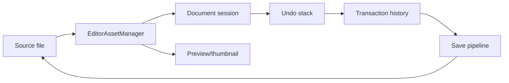
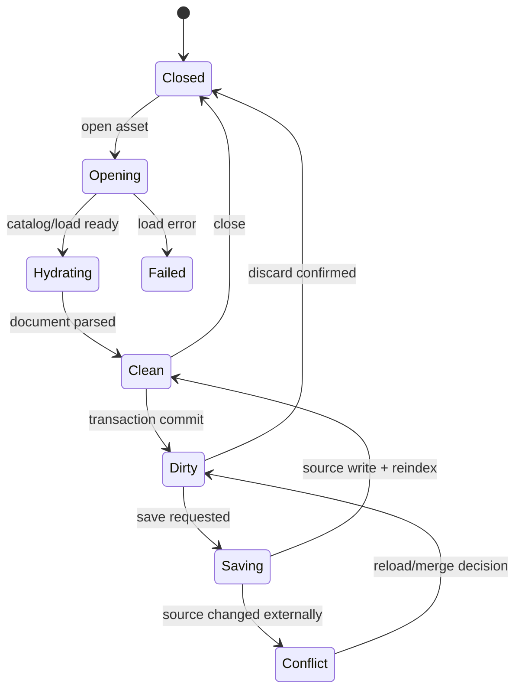
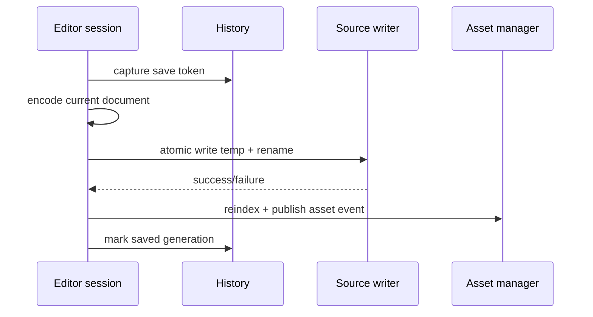

---
related_code:
  - zircon_editor/src/ui/asset_editor
  - zircon_editor/src/ui/host/asset_editor_sessions
  - zircon_editor/src/ui/host/editor_asset_manager
  - zircon_editor/src/core/project/scene_document.rs
  - zircon_editor/src/core/project/scene_load_job.rs
  - zircon_editor/src/core/editing/engine/transaction
implementation_files:
  - zircon_editor/src/ui/asset_editor
  - zircon_editor/src/ui/host/asset_editor_sessions
  - zircon_editor/src/ui/host/editor_asset_manager
plan_sources:
  - user: 2026-09-09 完善 ZirconEngine 公开接口、机制案例、教程与最佳实践
tests:
  - zircon_editor/src/ui/host/asset_editor_sessions
  - zircon_editor/src/ui/host/editor_asset_manager
  - zircon_editor/src/core/project/tests/scene_document.rs
doc_type: module-detail
---

# Document、Asset Editor、Dirty 与 Save

## 统一模型

文档编辑器把 source bytes、解析模型、undo stack、external effects 和 save pipeline 分开。资产 manager 管理 catalog/residency；document session 管理用户正在编辑的投影。



## Asset manager 与 session

`EditorAssetManager` 的 public API 负责 load、catalog、state、failure reason、dependency state 和 event subscription。不要让 asset editor 自己扫描磁盘；扫描/导入由 project manager 和 asset manager owner 完成。

| 层 | 责任 |
| --- | --- |
| catalog | asset id/path/type 映射 |
| load state | 未加载、加载中、已加载、失败 |
| dependency state | 直接/递归依赖是否 ready |
| document session | 可编辑 source/model |
| preview | 只读展示产物 |

## Asset editor 生命周期



## Dirty 定义

dirty 不是 UI flag。它由 document history generation、save token lineage 和 source conflict 状态共同决定：

| 状态 | 是否 dirty | 说明 |
| --- | --- | --- |
| 新打开且 token 对齐 | 否 | source 与 model 一致 |
| transaction commit | 是 | generation 前进 |
| undo 回到保存线 | 否 | token 可验证 |
| history 淘汰保存线 | 是 | 无法证明相等 |
| 外部 source 改变 | conflict | 需用户决策 |
| save 成功后 reindex | 否 | 新 token 建立 |

## Save 流程

```rust
// 调用形状；实际 session 由 Host 管理。
let token = document.save_token();
let bytes = document.encode_source()?;
project.write_source(path, bytes)?;
document.mark_saved(token)?;
```

保存必须捕获一致性 token，再写 source，最后原子更新 catalog/index。写文件失败时不能提前清 dirty。

## 外部变更

watcher 检测到 source change 时，session 应比较 source cursor/hash：

1. 若 clean，直接 reload。
2. 若 dirty 且外部内容等于当前编码，合并为 metadata refresh。
3. 若 dirty 且内容不同，进入 conflict。
4. 用户选择 reload、keep local 或导出副本。

禁止 watcher 线程直接 mutate document model；通过 Host event queue 投递。

## Scene document

`SceneDocument` 与 `SceneLoadJob` 负责场景 source 到 authoring world 的加载。场景编辑 transaction 以 document history context 标识，保存前要确保依赖和世界 route 可用。

## Asset editor undo

UI asset editor 的 `UiAssetEditorUndoStack` 可记录 source cursor 和 external effects。external effect（例如重命名依赖文件）必须有可逆描述；否则 save/undo 会产生 source 与内存不一致。

## 错误与恢复

| 错误 | 处理 |
| --- | --- |
| asset not found | 从 catalog 刷新，保留 tab route |
| parse failure | 展示 source diagnostic，不清 dirty |
| dependency not ready | 延迟 preview，禁止假装 loaded |
| source conflict | 决策 UI，暂停自动保存 |
| write failure | 保留 dirty/token，显示路径和 OS error |
| reindex failure | 标记 catalog stale，允许重试 |

## 机制案例：安全保存



## 最佳实践

- tab route 使用 asset id/path identity，不用显示名称。
- 任何 source write 都采用临时文件 + 原子替换策略。
- save token 只在写入和 reindex 都成功后更新。
- watcher 事件串行化到 Host，不跨线程修改 session。
- preview 读取 loaded artifact，不参与 dirty 判定。
- close 前处理 dirty/conflict 决策。

## 与其他引擎的差异

Unreal package dirty 通常挂在 UObject/package；ZirconEngine 以 history save token 证明 dirty。Godot Resource editor 使用 resource local-to-scene 语义；这里 source cursor 与 asset manager catalog 分离。Fyrox scene save 偏直接序列化；此处支持外部变更 conflict。

## 来源与测试

- Asset editor：[zircon_editor/src/ui/asset_editor](https://github.com/He-Jiahui/ZirconEngine/tree/main/zircon_editor/src/ui/asset_editor)
- Sessions：[zircon_editor/src/ui/host/asset_editor_sessions](https://github.com/He-Jiahui/ZirconEngine/tree/main/zircon_editor/src/ui/host/asset_editor_sessions)
- Manager：[zircon_editor/src/ui/host/editor_asset_manager](https://github.com/He-Jiahui/ZirconEngine/tree/main/zircon_editor/src/ui/host/editor_asset_manager)
- Scene tests：[zircon_editor/src/core/project/tests/scene_document.rs](https://github.com/He-Jiahui/ZirconEngine/blob/main/zircon_editor/src/core/project/tests/scene_document.rs)

## Session API 责任矩阵

| 操作 | asset manager | document session | transaction engine | watcher |
| --- | --- | --- | --- | --- |
| open | 解析 catalog/load | 创建 tab/model | 无 | 注册观察 |
| edit | 提供依赖 | 修改 draft | 记录 command | 忽略本地写入 |
| preview | 生成 artifact | 消费只读值 | 无 | 无 |
| save | reindex | 编码 source | mark saved | 抑制回声 |
| reload | 更新 catalog | 替换 model | 清理/重建 history | 发布状态 |
| close | 释放 handle | flush decision | cancel active | 注销观察 |

## 编码与版本

保存编码应带 schema/version 字段。读取旧版本时先迁移到内存模型，再由显式 save 写回新格式；不要在 watcher 线程中隐式重写 source。

```rust
let document = session.document();
let source = document.encode_source()?;
let parsed = Document::decode(&source)?;
assert_eq!(parsed.schema_version(), document.schema_version());
```

这是验证编码闭环的示意调用；真实 `Document` 类型按具体 asset editor 提供。

## 依赖加载状态

直接依赖 ready 不代表递归依赖 ready。渲染预览和可编辑操作应分别声明要求：

| 功能 | 要求 |
| --- | --- |
| 显示 source 文本 | source 可读 |
| 显示 inspector | 直接依赖 ready |
| 运行预览 | 递归依赖 ready |
| 修改 metadata | document 已 hydration |
| 导出 | 所有依赖和 codec ready |

## 关闭决策

关闭 tab 时有三种明确结果：保存并关闭、放弃并关闭、取消关闭。冲突状态不允许直接选择“保存覆盖”，除非用户确认 source path 和外部修改时间。

## 大文件与异步

大型 asset 的 parse、preview 和 reindex 必须使用 job/pipeline；UI 线程只消费 progress/diagnostic。加载 job 取消后，session 保留错误状态但不发布半成品 model。

## 安全边界

- source path 必须通过 project root admission。
- asset id 与磁盘路径双向映射要防止路径逃逸。
- 反序列化 payload 设置大小上限。
- preview 不执行任意脚本或 native code。
- 外部变更合并要保留原文件备份。

## 回归测试

- clean open/close 无 dirty prompt。
- edit-save-reopen 保持 source hash。
- undo-to-save-line 清除 dirty。
- 外部修改触发 conflict。
- write failure 保留 dirty。
- dependency gap 延迟 preview。
- watcher burst 合并为一次 refresh。

## 典型文档状态机断言

```rust
assert!(session.is_clean());
session.apply(command)?;
assert!(session.is_dirty());
session.undo()?;
assert!(session.is_clean());
session.save()?;
assert!(session.source_matches_disk()?);
```

测试重点是状态转换和错误恢复，不是 UI 文案。对每个 editor 类型都应覆盖空文档、最小合法文档、未知字段和损坏 source。

## 资源释放

关闭 session 时按 document -> preview -> dependency handles 顺序释放。任何后台 job 完成后发现 session generation 已变化，都只能丢弃结果并释放临时资源。

## 多文档事务

跨文档保存要么全部 source write 成功，要么保留每个文档 dirty；不能只清除成功的一半而不显示 partial result。必要时生成 recovery bundle。

## 交付前验收

- 每个 editor tab 都能从 route 恢复。
- source、model、preview 的 generation 可追踪。
- save/undo/reload 的结果可在 diagnostics 中解释。
- 外部修改不会覆盖本地 dirty 内容。
- 关闭流程释放 watcher、jobs 和 asset handles。
