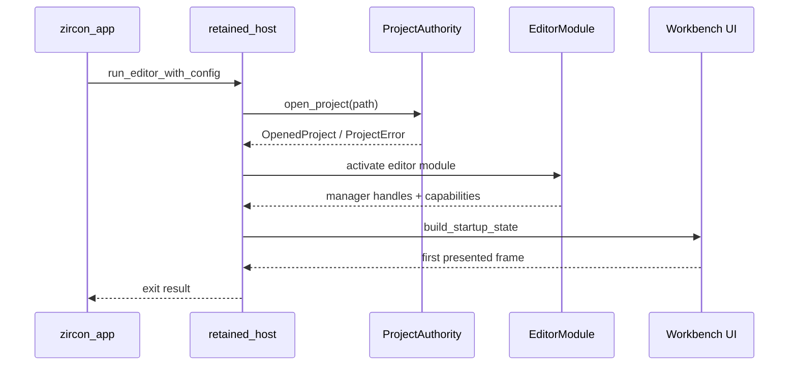
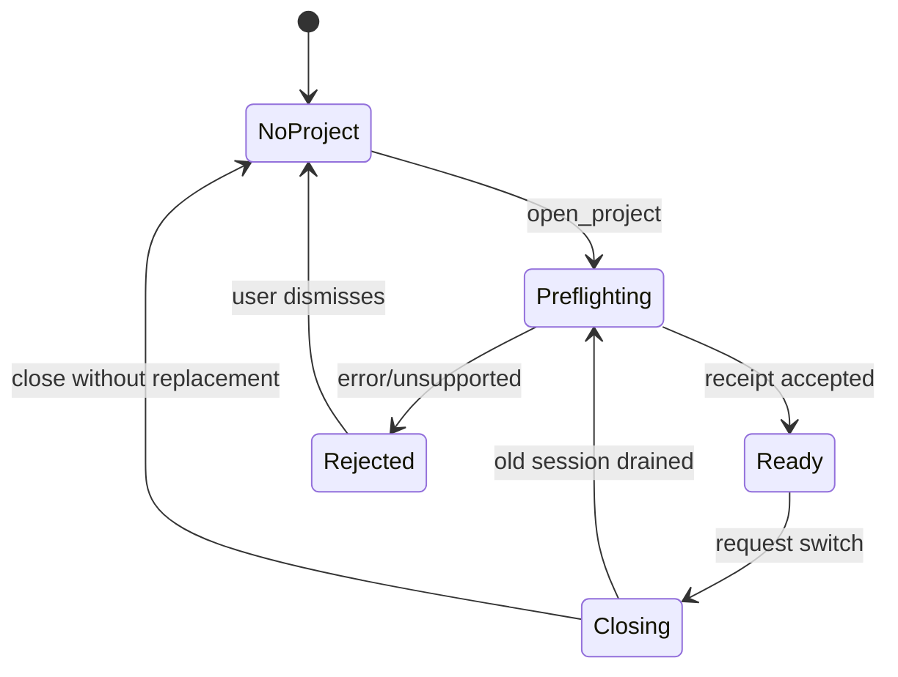

---
related_code:
  - zircon_editor/src/lib.rs
  - zircon_editor/src/ui/retained_host/mod.rs
  - zircon_editor/src/ui/host/module.rs
  - zircon_editor/src/core/project/authority/project_authority.rs
  - zircon_editor/src/core/project/authority/open_project.rs
  - zircon_app/src/entry
implementation_files:
  - zircon_editor/src/ui/retained_host
  - zircon_editor/src/ui/host/module.rs
  - zircon_editor/src/core/project/authority
plan_sources:
  - user: 2026-09-09 完善 ZirconEngine 公开接口、机制案例、教程与最佳实践
  - docs/plans/mvp/index.md
tests:
  - zircon_editor/src/core/project/authority/tests.rs
  - zircon_editor/src/core/project/tests
  - zircon_editor/src/tests
  - zircon_app/src/tests
doc_type: module-detail
---

# EditorHost、Session 与 ProjectAuthority

## 解决的问题

`zircon_editor` 将编辑器进程、编辑器会话和项目身份拆成三个层次。

| 层次 | 公开入口 | 负责内容 | 不负责内容 |
| --- | --- | --- | --- |
| Host | `run_editor`、`run_editor_with_config` | 窗口、Retained UI、帧循环、退出码 | 项目文件格式 |
| Session | `EditorHostRunConfig`、启动请求 | 一次编辑器运行的 profile、布局和自动化策略 | 持久化项目身份 |
| Project | `ProjectAuthority`、`OpenedProject` | 根目录、清单、场景与资产授权 | UI 控件生命周期 |

Host 只能在一个已解析的项目上下文上创建工作台。Session 退出不会自动删除项目目录，也不会替调用者提交未保存变更。

## 顶层 Rust API

`zircon_editor/src/lib.rs` 当前重导出以下宿主符号：

| 符号 | 签名/形状 | 用途 |
| --- | --- | --- |
| `run_editor` | `fn run_editor(...)` | 使用默认启动配置运行编辑器 |
| `run_editor_with_config` | `fn run_editor_with_config(config: EditorHostRunConfig, ...)` | 指定启动布局、退出策略 |
| `run_editor_with_startup_request` | `fn run_editor_with_startup_request(...)` | 从结构化启动请求启动 |
| `EditorHostRunConfig` | `pub struct` | Host 行为配置 |
| `EditorGuiStartupRequest` | `pub struct` | GUI 启动参数的跨层载体 |
| `ProjectAuthority` | `pub struct ProjectAuthority` | 无状态项目身份服务 |
| `EditorHostDriver` | `pub trait/struct` | Host module 的驱动连接 |
| `EditorModule` | `pub struct` | 编辑器模块描述 |

具体参数会随宿主后端变化；优先使用 rustdoc 中的构造器，不要复制内部 `retained_host::app` 的函数。

## 启动时序



### 阶段一：解析启动请求

1. App 将命令行或 Hub 请求转换为 `EditorGuiStartupRequest`。
2. Host 校验 profile、窗口后端和自动化选项。
3. `with_exit_after_first_presented_frame` 只改变退出策略，不跳过模块激活。
4. `with_startup_layout_preset` 选择布局种子，不覆盖用户工作区持久化文件。

### 阶段二：打开项目

`ProjectAuthority::open_project` 是项目根解析的唯一 owner。调用者应传入用户选定的目录，而不是手工拼接 `project.toml`。

```rust
// 调用形状；具体返回字段以当前 rustdoc 为准。
let authority = zircon_editor::core::project::authority::ProjectAuthority::default();
let opened = authority.open_project(project_root)?;
println!("root = {:?}", opened.root());
```

项目打开至少包含以下检查：

| 检查 | 失败含义 | 恢复动作 |
| --- | --- | --- |
| 根目录可访问 | 路径不存在或权限不足 | 提示用户选择目录 |
| 清单可解析 | manifest 损坏或版本未知 | 进入迁移/拒绝流程 |
| 目录边界 | 路径逃逸项目根 | 拒绝并记录诊断 |
| 最近项目记录 | 最近路径已失效 | 从列表移除，不删除磁盘 |

### 阶段三：模块和服务

`EditorModule` 对外提供固定服务名常量：

| 常量 | 默认值语义 |
| --- | --- |
| `EDITOR_MODULE_NAME` | 编辑器模块标识 |
| `EDITOR_HOST_DRIVER_NAME` | Host 驱动服务 |
| `EDITOR_MANAGER_NAME` | 编辑器 manager |
| `EDITOR_ASSET_MANAGER_NAME` | 资产管理服务 |
| `EDITOR_COMMAND_REGISTRY_NAME` | 命令注册表 |
| `EDITOR_KEYMAP_NAME` | 键位映射 |

服务解析应走 `IManager`/manager handle 路径，而不是访问 `EditorModule` 内部字段。这样才能在 headless、自动化和远程 gateway profile 下保持一致。

## `EditorHostRunConfig` 语义

配置对象的常见组合如下：

```rust
let config = EditorHostRunConfig::new()
    .with_startup_layout_preset("scene")
    .with_exit_after_first_presented_frame();
run_editor_with_config(config, startup_request)?;
```

| 选项 | 对启动的影响 | 不能保证 |
| --- | --- | --- |
| 默认构造 | 使用产品默认布局和持续帧循环 | 不保证项目自动打开 |
| 启动布局 preset | 首帧使用指定布局 | 不覆盖已存在的用户布局 |
| 首帧后退出 | 首帧呈现后返回 | 不保证异步导入已经完成 |
| startup request | 传递项目、窗口、自动化参数 | 不绕过项目 preflight |

自动化测试要把“首帧呈现”与“项目导入完成”分开断言。首帧只证明 Host/UI 已经可呈现。

## 所有权与线程边界

| 对象 | 所有权 | 线程约束 |
| --- | --- | --- |
| `ProjectAuthority` | `Copy`、无状态 | 可跨线程调用 |
| `OpenedProject` | 调用者持有 | 读字段可共享，写操作经 manager |
| Host UI 状态 | Host 持有 | UI 线程/事件循环 |
| `EditorHostRunConfig` | 启动前移动 | 构造阶段可在任意线程 |
| Window/View registry | Workbench 持有 | 不跨 UI 线程直接修改 |

不要把 `OpenedProject` 当作全局 singleton。多项目测试可同时构造 authority，但一个 Host session 只应有一个 active project。

## 项目切换



项目切换顺序必须是：

1. 停止接收新的编辑操作。
2. 结束活动 transaction 和 play session。
3. 刷新或丢弃 watcher backlog。
4. 释放 viewport surface 和 asset handles。
5. 关闭旧 `OpenedProject`。
6. 对新根目录执行 preflight。
7. 重建 registry projection 和布局。

如果在步骤 3 之后仍有未提交 dirty 文档，Host 必须显示保存/放弃决策，而不能静默切换。

## 错误分类

| 错误类别 | 典型来源 | 是否可重试 |
| --- | --- | --- |
| 路径错误 | `ProjectError`、Windows 编码检查 | 修正路径后 |
| 清单迁移 | `ProjectPreflight` decision | 选择迁移策略后 |
| 模块缺失 | module activation report | 安装插件/修正 profile 后 |
| 图形初始化 | Host backend | 更换 backend 或 headless |
| UI 自动化 | startup request | 修正 preset/退出条件 |

诊断应记录原始路径、profile、project generation 和 Host phase；不要只显示“打开失败”。

## 机制案例：一次性导出 Host

目标是验证一个项目能否完成首帧，而不留后台进程。

```rust
let request = EditorGuiStartupRequest::for_project(project_root);
let config = EditorHostRunConfig::new()
    .with_startup_layout_preset("minimal")
    .with_exit_after_first_presented_frame();
let result = run_editor_with_startup_request(config, request)?;
assert!(result.first_frame_presented());
```

检查点：

- 使用受管 target 目录运行测试。
- 使用临时项目根，不修改真实用户布局。
- 等待返回值，不用固定 sleep 判定完成。
- 记录 `EditorError` 的 phase 和 source。
- 结束后确认 viewport surface 已解绑。

## 与其他引擎的差异

| 参考 | 相似点 | ZirconEngine 的刻意差异 |
| --- | --- | --- |
| Unreal Editor | Editor instance + project browser | ProjectAuthority 无状态；项目身份不藏在全局 editor singleton |
| Fyrox | editor/run separation | Host 通过 runtime gateway 交换帧，不让 UI 直接持有 runtime world |
| Godot | project manager + editor session | preflight receipt 是显式对象，可被自动化测试消费 |
| slint | retained UI loop | retained host 只负责呈现，编辑语义仍在 core/editor |

## 最佳实践清单

- 入口统一使用 `run_editor_with_*`，不要调用 `retained_host::app` 私有 helper。
- 把项目根目录交给 `ProjectAuthority`，不要自行解析清单。
- 用首帧事件做 UI 可用性断言，用 manager 状态做导入完成断言。
- 项目切换前显式处理 dirty 状态。
- 不跨线程直接操作 Window/View registry。
- 将 profile、项目路径和启动 preset 写入诊断上下文。

## 来源与测试

- Host 导出：[zircon_editor/src/lib.rs](https://github.com/He-Jiahui/ZirconEngine/blob/main/zircon_editor/src/lib.rs)
- Host 实现：[zircon_editor/src/ui/retained_host](https://github.com/He-Jiahui/ZirconEngine/tree/main/zircon_editor/src/ui/retained_host)
- 项目授权：[zircon_editor/src/core/project/authority](https://github.com/He-Jiahui/ZirconEngine/tree/main/zircon_editor/src/core/project/authority)
- 项目测试：[zircon_editor/src/core/project/authority/tests.rs](https://github.com/He-Jiahui/ZirconEngine/blob/main/zircon_editor/src/core/project/authority/tests.rs)
- App 集成：[zircon_app/src/entry](https://github.com/He-Jiahui/ZirconEngine/tree/main/zircon_app/src/entry)

## Host 返回值与退出

Host 返回值应由 App 负责转成产品退出码。常见原因包括正常用户退出、首帧自动化退出、项目打开失败、模块激活失败和 fatal runtime error。不要在 Host 内调用 `std::process::exit`，否则测试无法清理资源。

## 项目根与路径规范

路径输入应在 authority 边界规范化：

1. 转为绝对路径。
2. 去除 `.`/`..` 逃逸。
3. 在 Windows 上保留盘符/UNC 语义。
4. 验证项目清单位于 root 内。
5. 对外诊断使用 project-relative path。

## Session 事件

Host session 应将以下阶段发布给 UI/Hub：`Starting`、`ProjectOpening`、`ModulesActivating`、`WorkbenchReady`、`Closing`、`Closed`。事件是状态观察，不是可重入命令入口。

## 自动化约束

- 首帧模式不能假设 asset import 已结束。
- headless profile 不能创建 native window。
- 自动化失败必须包含 phase 和最近一条诊断。
- 测试结束要 drain gateway、watcher 和 background jobs。

## 生命周期负例

| 负例 | 影响 |
| --- | --- |
| 先建 UI 后 open project | NoProject 状态泄漏到 active pane |
| 关闭 Host 前不 cancel transaction | Drop error/dirty 丢失 |
| 切换项目时保留旧 gateway handle | world/frame 串线 |
| 直接删除最近项目目录 | 用户数据损失 |
| 用 sleep 等待首帧 | CI 抖动 |

## 集成测试建议

- 空项目首帧启动。
- 清单迁移拒绝/接受。
- 缺模块时 fallback。
- 首帧后退出且无后台线程。
- 项目切换 dirty prompt。
- Windows/UNC 路径 round-trip。
