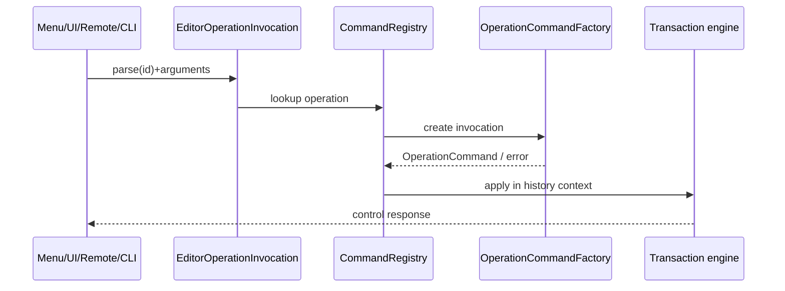
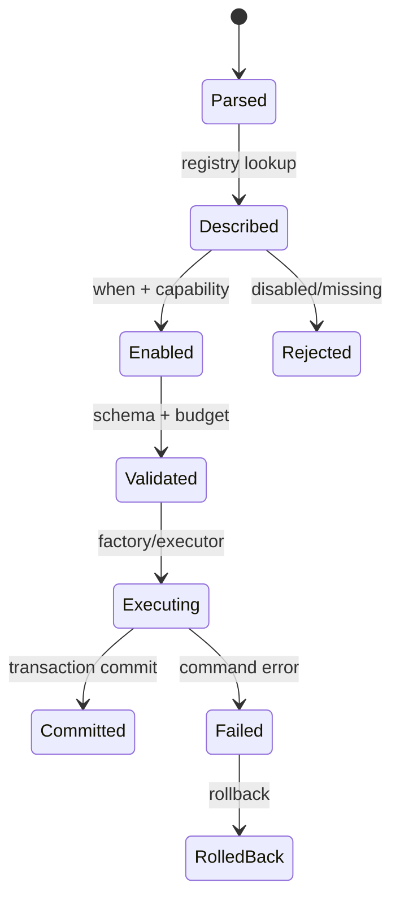

---
related_code:
  - zircon_editor/src/core/editor_operation.rs
  - zircon_editor/src/core/editing/operation/mod.rs
  - zircon_editor/src/core/editing/operation/factory.rs
  - zircon_editor/src/core/editing/operation/registration.rs
  - zircon_editor/src/core/commands/registry.rs
implementation_files:
  - zircon_editor/src/core/editor_operation.rs
  - zircon_editor/src/core/editing/operation
plan_sources:
  - user: 2026-09-09 完善 ZirconEngine 公开接口、机制案例、教程与最佳实践
tests:
  - zircon_editor/src/core/editing/operation
  - zircon_editor/src/core/editor_operation
doc_type: module-detail
---

# OperationPath 与调用评估

## 契约定位

`EditorOperationPath` 是菜单、UI binding、远程 gateway 和 CLI 共用的稳定命令身份。它不是 Rust 函数名，也不是本地化 key；发布后应保持兼容。



## `EditorOperationPath`

```rust
let path = EditorOperationPath::parse("scene.node.rename")?;
assert_eq!(path.as_str(), "scene.node.rename");
```

| API | 行为 |
| --- | --- |
| `parse(value)` | 调用 `EditorCommandId::parse`；非法值返回 `InvalidOperationPath(String)` |
| `as_str()` | 借用稳定字符串，不分配 |
| `Borrow<str>` | 可作为 registry 查询 key |
| `Display` | 输出原始 path |
| `Serialize/Deserialize` | JSON 中以字符串编码并重新校验 |

路径命名建议使用小写点分段：`<domain>.<resource>.<verb>`。不要在 path 中包含 locale、快捷键或文件系统路径。

## `EditorOperationInvocation`

```rust
let call = EditorOperationInvocation::parse("asset.reimport")?
    .with_arguments(serde_json::json!({"asset_id": "..."}))
    .with_operation_group("import-batch");
```

字段语义：

| 字段 | 类型 | 默认值 | 约束 |
| --- | --- | --- | --- |
| `operation_id` | `EditorOperationPath` | 必填 | 必须可解析 |
| `arguments` | `serde_json::Value` | `Null` | 由 descriptor schema 校验 |
| `operation_group` | `Option<String>` | `None` | 用于合并/互斥，不是 history label |

`new` 只初始化身份；参数验证应放在 factory/descriptor 边界。调用者不要把任意 JSON 直接 downcast 到业务类型。

## 来源与控制响应

`EditorOperationSource` 用于审计调用来源：`Menu`、`UiBinding`、`Remote`、`Cli`。`EditorOperationControlRequest` 当前包含：

- `InvokeOperation(EditorOperationInvocation)`
- `ListOperations`
- `QueryOperationHistory`

结果统一用 `EditorOperationControlResponse`：

```rust
let ok = EditorOperationControlResponse::success("scene.save", None);
let err = EditorOperationControlResponse::failure("scene.save", "document is dirty");
```

成功响应不能同时带 `error`；失败响应的 `value` 必须为 `None`。远程层应保留 `operation_id` 以便 UI 对应 pending row。

## Factory 与注册

`OperationCommandFactory` 是 `Send + Sync` trait。`OperationCommandFactoryRegistration` 将 factory 与 operation path、history context 等元数据绑定。registry 的 `register_operation` 负责建立索引。

典型实现形状：

```rust
struct RenameFactory;
impl OperationCommandFactory for RenameFactory {
    fn create(&self, invocation: &EditorOperationInvocation)
        -> Result<OperationCommand, OperationCommandFactoryError> {
        // 解析 arguments，返回可放入 transaction 的 command。
        todo!()
    }
}
```

上面是调用形状，trait 的精确关联类型以当前源码为准。factory 不应直接改 UI state；它只构造可回滚 command。

## 评估步骤

1. 解析 path。
2. 查询 descriptor。
3. 用 `CommandEvalCtx` 检查 `WhenClause`、document、selection 和 capability。
4. 验证 payload schema 与资源预算。
5. 按 source 检查远程/CLI/headless 许可。
6. 查找 operation factory 或 native executor。
7. 创建 command 并放入 transaction。
8. 返回 receipt/history id。



## 错误分类

| 错误 | 所属阶段 | 调用者处理 |
| --- | --- | --- |
| `InvalidOperationPath` | parse | 修正 path |
| `OperationCommandFactoryError` | factory | 显示字段/资源诊断 |
| `EditorCommandDispatchError` | registry | 刷新 eval snapshot |
| `EditCommandError` | transaction | 取消或恢复 engine |
| payload schema error | validate | 返回结构化字段错误 |

区分“未找到 operation”和“operation 被禁用”。前者通常是版本/插件问题，后者是当前上下文暂不可用。

## 远程调用限制

remote source 必须满足 descriptor 的 `callable_from_remote` 与 required capabilities。禁止以字符串形式接受任意 operation 后绕过 registry；这会跳过 when、资源预算和审计。

## 机制案例：批量导入

将多个资产调用放在一个 operation group 中：

```rust
for asset in assets {
    let call = EditorOperationInvocation::parse("asset.import")?
        .with_arguments(json!({"path": asset}))
        .with_operation_group("import-batch");
    gateway.invoke(call)?;
}
```

组内命令是否合并由 transaction engine 的 reservation/merge 规则决定，不能仅根据 group 字符串假设原子性。UI 应展示 group 的整体进度和单项失败。

## 与其他引擎的差异

- Unreal 的 editor command 常通过 `FUICommandList` 绑定 delegate；ZirconEngine 把序列化 operation path 作为跨进程身份。
- Godot 的 `EditorPlugin` 可直接调用 editor API；ZirconEngine 要求先经过 descriptor/capability 门。
- Fyrox 的命令 trait 偏编译期；ZirconEngine 同时支持动态插件和远程 JSON。

## 最佳实践

- 保持 path 稳定，语义变化时新增版本化 path。
- 在 factory 边界完成 JSON 校验并返回可定位错误。
- 将不可逆操作标记为需要确认的 command，而不是在 executor 内弹窗。
- 为每个远程 operation 写 schema、capability、headless 规则和 history 语义。
- 用来源字段记录审计，不把 source 塞进 arguments。

## 来源与测试

- Operation DTO：[zircon_editor/src/core/editor_operation.rs](https://github.com/He-Jiahui/ZirconEngine/blob/main/zircon_editor/src/core/editor_operation.rs)
- Factory：[zircon_editor/src/core/editing/operation/factory.rs](https://github.com/He-Jiahui/ZirconEngine/blob/main/zircon_editor/src/core/editing/operation/factory.rs)
- Registration：[zircon_editor/src/core/editing/operation/registration.rs](https://github.com/He-Jiahui/ZirconEngine/blob/main/zircon_editor/src/core/editing/operation/registration.rs)
- Registry：[zircon_editor/src/core/commands/registry.rs](https://github.com/He-Jiahui/ZirconEngine/blob/main/zircon_editor/src/core/commands/registry.rs)

## 参数校验模板

factory 应将输入拆为“结构验证”和“语义验证”两层：

```rust
fn parse_asset_id(args: &serde_json::Value) -> Result<AssetId, OperationCommandFactoryError> {
    let raw = args.get("asset_id")
        .and_then(serde_json::Value::as_str)
        .ok_or_else(|| OperationCommandFactoryError::InvalidArguments("asset_id".into()))?;
    AssetId::parse(raw).map_err(|_| OperationCommandFactoryError::InvalidArguments("asset_id".into()))
}
```

结构验证检查字段存在、类型、数组长度和未知字段策略；语义验证检查 asset 是否属于当前项目、document 是否打开、capability 是否满足。两层错误都应带 operation id。

## 调用来源矩阵

| Source | 入口 | 是否需要 UI | 典型失败 |
| --- | --- | --- | --- |
| `Menu` | menu action binding | 是 | view 未激活 |
| `UiBinding` | pointer/key route | 是 | focus/capture 不匹配 |
| `Remote` | gateway control request | 否 | capability/schema |
| `Cli` | commandlet parser | 否 | headless route 缺失 |

同一 operation 可以支持多个 source，但 source-specific precondition 必须在 descriptor 中表达或由统一 dispatcher 检查。

## Operation group 不变量

`operation_group` 只是协调 hint。真正的原子性来自 transaction scope；group 不得被解释为跨 session 的分布式事务。

- group id 在单个 session 内唯一即可。
- group 中任一调用失败时，调用方决定整体取消或逐项继续。
- group 结束后应清理 pending 调用。
- 重连后不要自动重放未知 group。

## 历史查询

`QueryOperationHistory` 返回的是可审计摘要，不应暴露 command 内部指针。摘要至少包括 operation id、source、时间/帧、结果和 error code。UI 可用它解释“为什么这个按钮刚刚失败”。

## 测试建议

- 非法 path：空字符串、首字符数字、连续分隔符。
- arguments：缺字段、错误类型、超长字符串、未知字段。
- source：remote 禁用、CLI 无 headless route。
- generation：descriptor 更新后旧 invocation 重新评估。
- failure：factory 返回错误时 transaction 必须未提交。
- serialization：JSON round-trip 后 path/arguments/group 相等。

## 性能边界

path parse 和 descriptor lookup 应是 O(1) 或摊销 O(log n)；不要在每次键盘事件中扫描所有 factories。大型参数 payload 应在 gateway 层限制字节数，避免 factory 分配不受控内存。

## 兼容策略

operation path 一旦发布，删除前先将 descriptor 标记 deprecated，并保留 failure response 指向替代 path。JSON 字段新增应使用 `Option`/默认值，改变字段含义时提高 schema id 版本。

## 观测与日志

每次调用记录 start/end、source、operation id、descriptor generation、duration 和结果类别。arguments 只记录 schema id 与摘要，不记录完整内容。慢调用应关联 transaction id，便于从 palette/remote 追到 history。

## 并发与取消

dispatcher 可拒绝同一 operation group 的重入。取消请求只能取消尚未 commit 的工作；已经提交的 command 使用 undo，而不是伪造取消成功。长任务要返回 progress handle，不能阻塞 UI callback。

## API 评审清单

- path 是否稳定且可序列化？
- descriptor 是否声明 when/capability/schema？
- remote/CLI 是否有明确许可？
- factory 是否只构造 command？
- failure 是否保留 operation id？
- history/undo 是否有测试？
