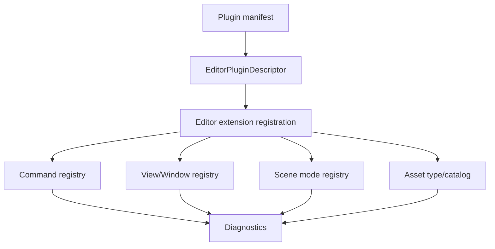
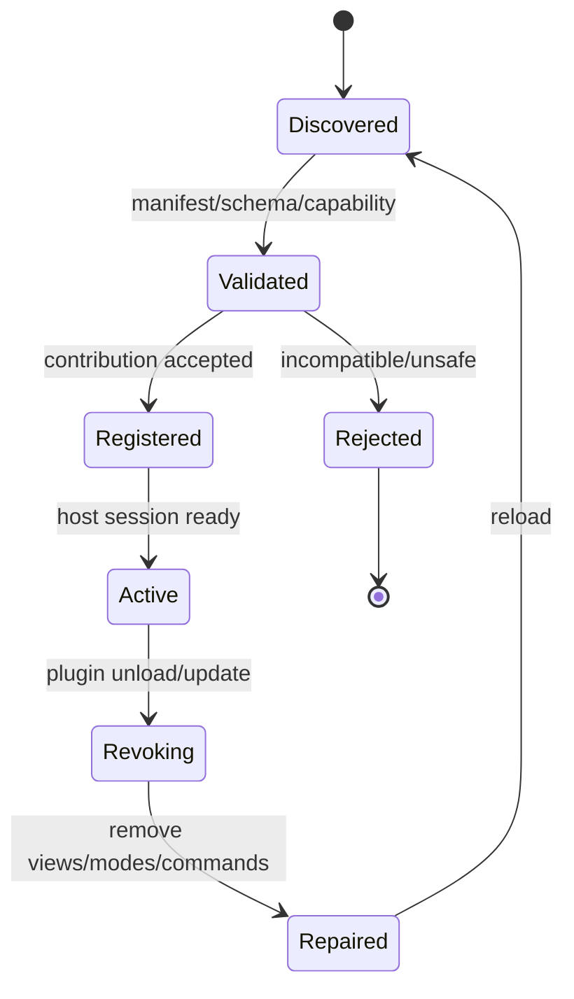

---
related_code:
  - zircon_editor/src/core/plugin
  - zircon_editor/src/ui/host/editor_extension_registration.rs
  - zircon_editor/src/ui/host/editor_capabilities.rs
  - zircon_editor/src/ui/host/editor_capability_report.rs
  - zircon_editor/src/ui/host/editor_error.rs
  - zircon_app/src/plugins
  - zircon_plugins/plugin_sdk/src/lib.rs
implementation_files:
  - zircon_editor/src/core/plugin
  - zircon_editor/src/ui/host/editor_extension_registration.rs
  - zircon_app/src/plugins
plan_sources:
  - user: 2026-09-09 完善 ZirconEngine 公开接口、机制案例、教程与最佳实践
tests:
  - zircon_editor/src/core/plugin
  - zircon_editor/src/ui/host/editor_event_runtime_access/tests.rs
  - zircon_app/src/plugins/tests.rs
doc_type: module-detail
---

# Editor Plugin、Contributions 与 Diagnostics

## 扩展边界

插件可以贡献命令、scene mode、view/window、asset type、native executor 和 runtime capability，但不能绕过 editor host、transaction 或 gateway。



## Plugin descriptor 与报告

`EditorPlugin`、`EditorPluginDescriptor`、`EditorExtensionCatalogReport` 和 `EditorPluginRegistrationReport` 是顶层重导出。descriptor 应包含稳定 owner id、版本、capabilities 和可撤销 contribution 标识。

报告的用途是把“发现了什么”和“启用了什么”分开：

| 报告 | 消费者 | 典型字段语义 |
| --- | --- | --- |
| catalog report | 启动/preflight | plugin 是否被发现、版本是否兼容 |
| registration report | Host/UI | 哪些 contribution 成功、哪些被拒绝 |
| capability report | runtime/editor | 能力集合与缺失原因 |

## 注册/撤销 API

`EditorExtensionRegistration` 提供 `register_editor_extension`、`register_editor_plugin_registration`、`allocate_editor_tool_instance`、`replace_editor_plugin_ui_template_contributions` 和 `revoke_editor_plugin_contribution`。

```rust
let report = host.register_editor_extension(plugin_descriptor, extension)?;
for diagnostic in report.diagnostics() {
    tracing::warn!(code = diagnostic.code(), "extension rejected");
}
```

调用形状可能由 Host context 包装；关键语义是注册返回报告、撤销按 contribution owner 做成组操作。

## 生命周期



撤销顺序很重要：先停止新调用，再关闭 view instances，退出 scene modes，撤销 commands/executors，最后释放 plugin library。

## 能力门控

每个 contribution 都应声明所需 capabilities。缺失能力时，registration report 必须可解释地指出 owner、capability 和 fallback。

不要将“插件加载成功”当作“所有 contribution 可用”。runtime composition、profile 和平台会改变能力集合。

## Native ABI 安全

native executor/host function table 必须使用 SDK 提供的 ABI 版本和 panic boundary。插件不得跨 ABI 直接传 Rust trait object 或借用 editor 内存。

推荐边界：

1. manifest 声明 ABI/version。
2. Host 校验 capability。
3. payload 通过 owned bytes/serde schema 传递。
4. callback panic 被捕获并转为诊断。
5. revoke 等待 in-flight call drain。

## Diagnostics 模型

`EditorError` 及其子诊断提供稳定 code、stage、path 和 recovery hint。UI 展示应保留原始 error chain，日志附加 plugin owner 和 session generation。

| 诊断等级 | 行为 |
| --- | --- |
| info | 记录启用/撤销等生命周期 |
| warning | contribution 降级、可恢复缺能力 |
| error | 单个 operation/view/plugin 失败 |
| fatal | ABI 不兼容、恢复失败、Host 停止 |

## 机制案例：插件更新

1. 标记 plugin owner 为 draining。
2. 拒绝新 remote/native calls。
3. 等待 in-flight callbacks 结束。
4. 关闭 plugin views 和 drawers。
5. 将 scene mode 退回 builtin select。
6. 撤销 command/keymap contributions。
7. 卸载旧 library，加载新 descriptor。
8. 重新注册并修复 layout。

## 错误与负例

| 负例 | 结果 | 正确做法 |
| --- | --- | --- |
| plugin 直接改 registry 内部 map | generation 丢失 | 使用 registration API |
| 撤销后保留 view instance | 点击悬挂 route | revoke 时同步关闭 |
| native callback panic 穿过 ABI | Host 未定义行为 | SDK panic boundary |
| 缺 capability 仍注册 | 空面板/运行时错误 | registration 阶段拒绝 |
| 只记录字符串错误 | 无法自动修复 | 使用 code/stage/owner |

## 与其他引擎的差异

Unreal module/plugin 主要以 module load + tab/menu extender 扩展；ZirconEngine 将每类 contribution 纳入可撤销 catalog。Godot `EditorPlugin` 直接控制 editor singleton；此处通过 capability 和 registration report 隔离。Fyrox plugin trait 常是进程内 Rust；本实现保留 native ABI/remote 场景。

## 最佳实践

- owner id 全局唯一且稳定。
- 每个 contribution 有明确 revoke 路径和测试。
- 把能力拒绝当作正常状态，提供 fallback。
- diagnostics 记录 plugin、phase、generation、operation path。
- 更新插件前 drain callback 和 transaction。
- 不在插件线程直接触碰 UI registry。

## 来源与测试

- Plugin：[zircon_editor/src/core/plugin](https://github.com/He-Jiahui/ZirconEngine/tree/main/zircon_editor/src/core/plugin)
- Registration：[zircon_editor/src/ui/host/editor_extension_registration.rs](https://github.com/He-Jiahui/ZirconEngine/blob/main/zircon_editor/src/ui/host/editor_extension_registration.rs)
- Error：[zircon_editor/src/ui/host/editor_error.rs](https://github.com/He-Jiahui/ZirconEngine/blob/main/zircon_editor/src/ui/host/editor_error.rs)
- App plugin tests：[zircon_app/src/plugins/tests.rs](https://github.com/He-Jiahui/ZirconEngine/blob/main/zircon_app/src/plugins/tests.rs)

## API 级编译模板

```rust
use zircon_editor::{EditorPlugin, EditorPluginDescriptor};

fn describe_plugin() -> EditorPluginDescriptor {
    EditorPluginDescriptor::new(
        "example.tools",
        "Example tools",
        "example_tools_editor",
    )
    .with_category("authoring")
    .with_capability("editor.commands")
}

fn load_plugin() -> Box<dyn EditorPlugin> {
    // 伪代码：`ExamplePlugin` 需由插件 crate 实现 `EditorPlugin`。
    Box::new(ExamplePlugin::default())
}
```

当前 descriptor 构造器要求 package id、显示名称和 crate 名称三个参数；版本来自所附 `PluginPackageManifest`，不是 `EditorPluginDescriptor` 字段。文档重点是 descriptor 与实现分离、owner id 稳定、capability 显式声明。

## Contribution 审计

每个注册动作应能回答四个问题：谁注册、注册了什么、需要什么能力、如何撤销。建议将 `EditorPluginRegistrationReport` 序列化到诊断附件，方便复现“某面板为何缺失”。

## 更新与热重载

热重载只在 plugin contribution 全部可撤销时启用。若 asset type 或 runtime ABI 不能安全迁移，应降级为重启 Host，并明确提示。

## 远程安全

远程可调用 command 与 plugin native callback 分别授权；不要因为 plugin 被信任就自动开放所有 editor operations。远程请求仍须经过 command descriptor 的 schema、when 和 budget。

## 故障树

```text
plugin 不可用
├─ manifest 解析失败 -> 修正 manifest
├─ ABI 不匹配 -> 安装匹配 SDK/重启
├─ capability 缺失 -> 更换 profile 或禁用 contribution
├─ registration 失败 -> 读取 report，保留内置功能
└─ callback 运行时错误 -> 隔离 owner，停止继续调用
```

## 验收清单

- 新鲜 session 注册成功。
- 重复加载不会重复命令/窗口。
- 撤销后无悬挂 route、mode、executor。
- layout 能在插件缺失时修复。
- diagnostics 可通过 code 聚合。
- 动态库卸载前 callbacks 已 drain。

## Contribution 契约表

| Contribution | owner API | 撤销动作 | 线程 |
| --- | --- | --- | --- |
| command | `EditorCommandRegistry` | revoke executor/descriptor | editor |
| keymap | `EditorKeymap` override | restore baseline | editor |
| view/window | `ViewRegistry`/`EditorWindowRegistry` | close instances | UI |
| scene mode | `SceneModeRegistry`/stack | retire contribution | editor |
| asset type | asset manager catalog | invalidate records | worker + editor apply |
| native callback | plugin host table | drain then unload | ABI boundary |

## 注册顺序

插件注册应遵循 descriptor -> capability -> contribution -> projection 的顺序。先注册 UI 再检查 capability 会产生空窗口；先加载 native library 再校验 ABI 会扩大崩溃面。

```rust
fn register_plugin(host: &mut EditorHost, plugin: EditorPluginDescriptor) -> Result<(), EditorError> {
    host.validate_plugin(&plugin)?;
    let report = host.register_editor_plugin_registration(plugin)?;
    report.ensure_no_fatal_errors()?;
    Ok(())
}
```

这是宿主集成的调用形状，方法名以当前 Host facade 为准。

## 版本兼容

| 变化 | 策略 |
| --- | --- |
| 新增可选 capability | 缺失时降级 |
| 删除 required capability | 拒绝 contribution |
| command payload schema | 保留旧 schema reader |
| view route 重命名 | 提供迁移映射 |
| ABI major 变化 | 不加载，提示升级 |

## Diagnostics 字段规范

每条诊断至少包含 `code`、`severity`、`owner`、`phase`、`message` 和 `recovery`。涉及资源时增加 project-relative path；涉及 operation 时增加 operation path；涉及 runtime 时增加 session identity。

## 失败隔离

单个插件 contribution 失败不应让整个 editor 退出，除非失败类别是 ABI/内存安全/faulted recovery。registration report 应允许 Host 启动剩余内置功能。

## 撤销 drain

撤销 native plugin 前必须等待 in-flight callbacks。超时后进入 quarantined 状态，禁止释放 library；用户可重启 Host 完成清理。

## 安全检查清单

- ABI version 在加载前校验。
- callback 输入使用 owned buffer。
- panic 转换为 `EditorError`。
- capability 与 remote callable 独立验证。
- plugin owner 对所有 contribution 可反查。
- 撤销路径覆盖 view、mode、command、asset、native。

## 测试矩阵

- 正常注册全部 contribution。
- 缺能力只拒绝相关 contribution。
- 重复 owner id 被拒绝。
- 撤销后 layout 修复且无悬挂 view。
- native panic 被隔离。
- ABI major mismatch 不加载动态库。
- 断线/重连后 plugin events 不重复投递。
