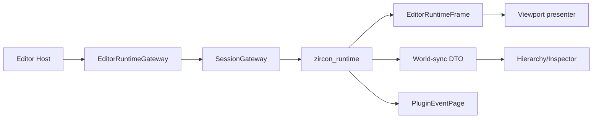
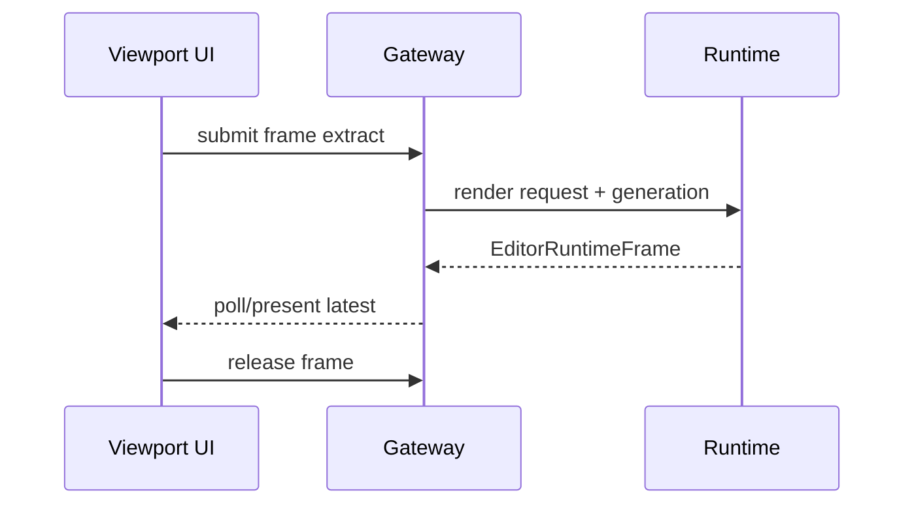
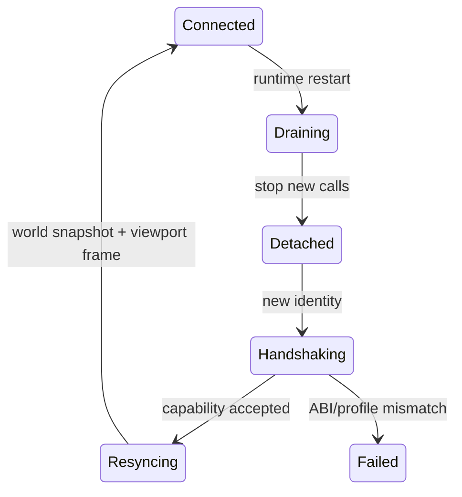

---
related_code:
  - zircon_editor/src/core/gateway/contract.rs
  - zircon_editor/src/core/gateway/mod.rs
  - zircon_editor/src/core/gateway/session/gateway.rs
  - zircon_editor/src/core/gateway/session/world_sync.rs
  - zircon_editor/src/core/gateway/session/viewport.rs
  - zircon_editor/src/core/gateway/session/plugin_events.rs
  - zircon_runtime_interface/src/lib.rs
implementation_files:
  - zircon_editor/src/core/gateway
plan_sources:
  - user: 2026-09-09 完善 ZirconEngine 公开接口、机制案例、教程与最佳实践
tests:
  - zircon_editor/src/core/gateway/session/tests.rs
  - zircon_editor/src/core/gateway/capabilities/optimization_tests.rs
doc_type: module-detail
---

# Runtime Gateway、Session、Frame 与 World Sync

## 边界

Gateway 是 editor 与 runtime 的唯一跨边界通道。Editor 发送操作、viewport 请求和 world-sync DTO；runtime 返回 frame、plugin event page、capability 和诊断。



## 顶层导出

`zircon_editor` 重导出：`EditorRuntimeGateway`、`EditorRuntimeGatewayHandle`、`SessionGateway`、`InProcessGateway`、`DetachedEditorRuntimeGateway`、`SharedEditorRuntimeGateway`、`GatewayError`、`RuntimeCapabilities`、`EditorRuntimeFrame`、`PluginSummaryEntry` 和 `PluginActivationState`。

| 类型 | 用途 |
| --- | --- |
| `EditorRuntimeGateway` | 线程安全抽象 trait |
| `SharedEditorRuntimeGateway` | `Arc<dyn EditorRuntimeGateway>` |
| `InProcessGateway` | 同进程 runtime 连接 |
| `DetachedEditorRuntimeGateway` | 无 runtime/测试占位 |
| `SessionGateway` | 带 identity、profile、viewport 绑定的 session |
| `EditorRuntimeGatewayHandle` | 可克隆调用句柄 |
| `RuntimeCapabilities` | capability 快照 |
| `EditorRuntimeFrame` | RGBA 帧及 generation |

## `EditorRuntimeFrame`

```rust
let frame = EditorRuntimeFrame::new(1, width, height, generation, rgba);
assert_eq!(frame.rgba().len(), (width * height * 4) as usize);
present(frame);
```

公开方法：`new`、`empty`、`abi_version`、`width`、`height`、`generation`、`rgba`、`release`。`release(self)` 消费 frame，释放底层资源；presenter 不应在释放后继续借用像素。

尺寸和 RGBA 长度必须匹配；错误由 gateway 返回。generation 用来丢弃过时帧，不能按到达顺序盲目呈现。

## SessionGateway 创建

`SessionGateway::new` 与 `new_with_identity` 是 `unsafe`，因为调用者必须保证 runtime identity、ABI 和生命周期约束。优先使用 Host 已构造的 gateway，而不是业务代码自行 new。

```rust
// 仅展示契约，不建议业务层直接调用 unsafe 构造。
let gateway = unsafe { SessionGateway::new(runtime, profile) };
```

builder 可附加 `with_module_composition_receipt`、`with_viewport_surface_bindings`。receipt 必须与 runtime 激活结果对应，不能伪造为空成功。

## Frame 流程



viewport 应只保留 latest frame，旧 generation 到达时丢弃并记录计数。窗口 resize 先更新 surface binding，再提交新 extract。

## World sync

`zircon_runtime_interface` 提供 `WorldQuery`、`QueryFilter`、`ComponentSelector`、`WatchRegistration` 等 DTO。它们是数据描述，不是跨边界共享 runtime world 引用。

推荐顺序：

1. editor 发送带 generation 的 query/watch。
2. runtime 返回 snapshot 或 delta。
3. editor 按 entity/component identity 应用。
4. 若 generation 不连续，重新请求 snapshot。
5. 将结果投影到 hierarchy、inspector、selection。

## Plugin event page

`EditorRuntimePluginEventPage` 暴露 `deliveries`、`into_deliveries`、`is_empty`、`encoded_bytes`、`runtime_drain_elapsed`、`decode_elapsed`、`runtime_remaining_deliveries` 和 `runtime_oldest_pending_age_millis`。

这些计数用于背压诊断：

| 指标 | 解释 |
| --- | --- |
| encoded bytes | 本页传输负载 |
| runtime remaining | runtime backlog |
| oldest pending age | 最老事件等待时间 |
| decode elapsed | editor 解码耗时 |

## 能力与 profile

Gateway capability 决定是否允许 viewport、world sync、plugin events、remote operations。`SessionProfileKind` 影响默认能力和 surface 生命周期。

```rust
let caps = gateway.capabilities();
if caps.supports_world_sync() { /* query */ }
```

不要把 profile 名称当 capability；同一 profile 在不同 runtime composition 下可能缺少可选模块。

## 错误恢复

| 错误 | 处置 |
| --- | --- |
| ABI mismatch | 停止解码，报告版本和 profile |
| disconnected | 标记 session detached，停止新请求 |
| frame rejected | 丢弃当前 frame，重新绑定 surface |
| backlog overflow | 降低事件页大小或请求 snapshot |
| world generation gap | 丢弃 delta，重新拉取 snapshot |

断线恢复不能重放未知副作用的 operation；应先重新建立 session、查询 capability，再重放可审计且幂等的请求。

## 机制案例：运行时重启



## 最佳实践

- 业务层只依赖 `EditorRuntimeGateway` trait，不依赖 `SessionGateway` 具体字段。
- 任何 frame/world DTO 都带 generation/identity。
- 处理 plugin event page 的 backlog 指标并展示到 diagnostics。
- `unsafe` session 构造集中在 Host owner。
- 断线后先重建 capability，再恢复 watch/viewport。
- 对 world-sync delta 做 gap 检测，不能静默合并。

## 与其他引擎的差异

Unreal editor 通常直接访问 PIE world；ZirconEngine 强制 gateway 隔离 authoring/runtime。Godot Remote Inspector 使用对象路径；此处使用结构化 DTO 和 generation。Fyrox editor 与 game scene 共进程；ZirconEngine 支持 detached/headless gateway。

## 来源与测试

- Gateway contract：[zircon_editor/src/core/gateway/contract.rs](https://github.com/He-Jiahui/ZirconEngine/blob/main/zircon_editor/src/core/gateway/contract.rs)
- Session：[zircon_editor/src/core/gateway/session](https://github.com/He-Jiahui/ZirconEngine/tree/main/zircon_editor/src/core/gateway/session)
- Runtime DTO：[zircon_runtime_interface/src/lib.rs](https://github.com/He-Jiahui/ZirconEngine/blob/main/zircon_runtime_interface/src/lib.rs)
- Session tests：[zircon_editor/src/core/gateway/session/tests.rs](https://github.com/He-Jiahui/ZirconEngine/blob/main/zircon_editor/src/core/gateway/session/tests.rs)

## Gateway trait 调用形状

不同 profile 的 trait 方法集合可能扩展，但调用结构保持一致：

```rust
fn render_once(
    gateway: &dyn EditorRuntimeGateway,
    extract: RenderFrameExtract,
) -> Result<EditorRuntimeFrame, GatewayError> {
    let receipt = gateway.submit_frame_extract(extract)?;
    gateway.present_frame_extract(receipt)
}
```

上例用于说明所有权和错误传播；UI 通常通过 `EditorRuntimeGatewayHandle` 异步提交并 poll，而不是同步等待。

## Frame 代际规则

| generation 比较 | 处理 |
| --- | --- |
| 新 frame > latest | 替换 latest |
| 新 frame == latest | 保留先到者，记录 duplicate |
| 新 frame < latest | 丢弃 stale |
| 跳跃多个 generation | 触发 resync/诊断 |

generation 是逻辑时钟，不等价于 GPU fence。present 成功后仍需调用 `release`。

## World-sync DTO 版本

DTO 版本变化时，editor 应：

1. 读取 ABI/protocol version。
2. 拒绝未知必需字段。
3. 允许已知版本的向后兼容字段。
4. 对无法转换的 delta 请求完整 snapshot。

不要用 `serde_json::Value` 逃避结构化 DTO 校验；这样会让 generation gap 无法检测。

## Watch 注册

`WatchRegistration` 表示订阅范围和过滤条件。注销 watch 时应保存 registration id，断线重连后重新注册；不要复用旧 session 的 id。

## Backpressure 方案

当 `runtime_remaining_deliveries()` 或 oldest pending age 超阈值时：

- 降低每页 delivery 数量。
- 暂停低优先级 preview/telemetry。
- 优先传递 error、lifecycle 和 world revision。
- 超过 hard limit 时清空 delta backlog 并请求 snapshot。

## Detached gateway

`DetachedEditorRuntimeGateway` 用于没有 runtime 的启动阶段和 headless UI 测试。它应返回明确的 detached/capability error，而不是伪造空 world 成功；只有 `empty` frame 等安全占位可以返回。

## 诊断字段

每个 gateway error 建议附加：profile、ABI version、session identity、request generation、surface id、operation path。日志中不要打印完整 asset payload。

## 测试矩阵

- in-process：正常 frame、world snapshot、plugin page。
- detached：所有 runtime-only 调用返回可识别错误。
- ABI：版本不匹配、未知 enum、payload 超限。
- generation：乱序 frame、delta gap、重连后新 identity。
- resource：frame release、surface unbind、重复 present。

## API 选择指南

| 需求 | 选择 |
| --- | --- |
| 同进程 editor/runtime | `InProcessGateway` |
| 无 runtime 启动/测试 | `DetachedEditorRuntimeGateway` |
| 跨组件共享 | `SharedEditorRuntimeGateway` |
| 带身份和 surface | `SessionGateway` |
| UI 异步调用 | `EditorRuntimeGatewayHandle` |

## 取消与超时

gateway 请求应有调用方超时和取消语义。超时不代表 runtime 已取消副作用；对于 mutation，必须查询 operation/history 状态后再决定重试。只读 frame/world query 可安全丢弃并重发。

## 内存预算

RGBA frame、event page 和 world snapshot 都受 payload budget 限制。达到上限时优先降采样/分页，不应在 editor 侧无界 clone。`into_deliveries` 只在所有权转移确实需要时调用。
