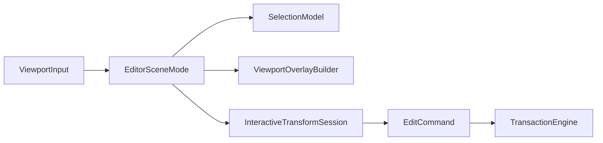
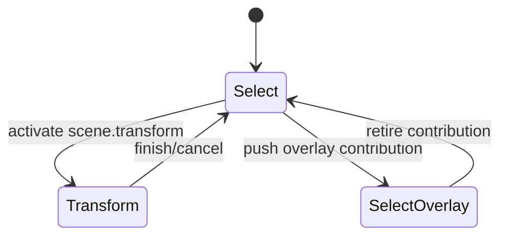

---
related_code:
  - zircon_editor/src/scene/selection/selection_model.rs
  - zircon_editor/src/scene/selection/selection_mutation.rs
  - zircon_editor/src/scene/modes/editor_scene_mode.rs
  - zircon_editor/src/scene/modes/scene_mode_stack.rs
  - zircon_editor/src/core/editing/interactive_transform/spec.rs
  - zircon_editor/src/core/editing/interactive_transform/session.rs
implementation_files:
  - zircon_editor/src/scene/selection
  - zircon_editor/src/scene/modes
  - zircon_editor/src/core/editing/interactive_transform
plan_sources:
  - user: 2026-09-09 完善 ZirconEngine 公开接口、机制案例、教程与最佳实践
tests:
  - zircon_editor/src/scene/selection
  - zircon_editor/src/core/editing/interactive_transform
doc_type: module-detail
---

# 场景选择、编辑模式与变换

## 分层

场景编辑把 selection model、mode stack 和 transaction command 分开。selection 记录用户意图，mode 解释输入，transaction 才修改 authoring world。



## `SelectionModel`

`SelectionModel` 按 `WorldDomain` 保存独立 selection。公开方法包括：

| 方法 | 语义 |
| --- | --- |
| `active_domain()` | 当前读写 domain |
| `set_active_domain(domain)` | 切换 domain，返回是否改变 |
| `activate_play_domain(instance)` | 创建 play domain |
| `retire_play_domain(instance)` | 移除 play domain |
| `items(domain)`/`active_items()` | 返回 `IndexSet<EntityId>` 借用 |
| `primary(domain)`/`active_primary()` | 主实体 |
| `generation(domain)` | domain 选择代际 |
| `revision()` | 全局 revision |
| `replace`/`replace_active` | 替换集合和 primary |
| `select_only` | 单选 |
| `extend` | 添加不清除既有项 |
| `toggle` | 切换实体 |
| `apply_active` | 应用 `SelectionMutation` |
| `clear`/`clear_active` | 清空 |

```rust
let mut selection = SelectionModel::default();
selection.select_only_active(entity);
selection.extend_active([child_a, child_b]);
let primary = selection.active_primary();
```

任何返回 bool 的 mutation 都表示“模型是否改变”。UI 应用该值决定是否重绘，不能把调用成功误判为 selection 发生变化。

## WorldDomain

编辑 domain 与 play domain 的 selection 必须隔离。进入 play mode 时 `activate_play_domain` 建立实例域；退出时 `retire_play_domain` 清理，不把运行时实体写回 authoring selection。

## EditorSceneMode trait

```rust
pub trait EditorSceneMode: Send {
    fn id(&self) -> &SceneModeId;
    fn enter(&mut self, ctx: &mut SceneModeCtx<'_>);
    fn exit(&mut self, ctx: &mut SceneModeCtx<'_>);
    fn handle_input(&mut self, input: &ViewportInput, ctx: &mut SceneModeCtx<'_>) -> InputOutcome;
    fn update(&mut self, ctx: &mut SceneModeCtx<'_>) {}
    fn build_overlay(&self, out: &mut ViewportOverlayBuilder) {}
}
```

`SceneModeCtx` 提供输入 effect、overlay invalidation 和 checkpoint/restore。mode 不应直接持有 UI widget 或 runtime gateway。

## Mode stack

`SceneModeStack` 区分 base mode 与 overlay mode。独占工具通过 `requires_exclusive_tool` 约束输入路由。



贡献模式由 `SceneModeRegistration`/`SceneModeFactory` 创建。插件撤销时 stack 会退回内置 select，不能保留悬挂 mode。

## 变换语义

公开 `PivotMode` 与 `TransformHandleKind` 定义 gizmo 行为；`TransformSpace`、`ViewOrientation`、`GridMode` 来自 viewport 设置。

| 选择 | 影响 |
| --- | --- |
| local/world | 轴向解释 |
| median/active pivot | 旋转缩放中心 |
| translate/rotate/scale | interactive command 类型 |
| snap on/off | 采样是否量化 |

交互变换的内部 session 记录 primary root、target entities、pivot world/transform，并提供 preview/finish/cancel。preview 只更新临时 world，finish 才产生 `OperationCommand`。

## 机制案例：多选平移

1. pointer-down 命中 gizmo，读取 active selection。
2. 捕获 pivot 和 world route。
3. 创建 transaction，设置 `MergeMode::Ends`。
4. 每个 pointer move 调用 preview。
5. pointer-up 调用 finish，提交一个 history record。
6. pointer-cancel 调用 cancel，恢复初始 transforms。

```rust
// 调用形状；具体 session 构造由 viewport controller 持有。
let request = ViewportTransformRequest::translate(axis, delta);
mode.handle_input(&ViewportInput::Transform(request), &mut ctx);
```

## 输入结果

`InputOutcome` 用于告诉 stack 是否消费输入、继续冒泡或请求 capture。mode 不应把未处理按键吞掉，否则菜单快捷键无法触发。

## 错误与恢复

| 错误 | 典型原因 | 恢复 |
| --- | --- | --- |
| 无 active selection | gizmo 无目标 | 回到 select mode |
| domain 不匹配 | play 实体用于 authoring | 切换 domain 或拒绝 |
| stale generation | scene reload 后旧 entity | 清除 selection 并提示 |
| preview apply 失败 | route/transform 无效 | cancel session |
| mode contribution missing | 插件撤销 | retire 到 builtin select |

## 最佳实践

- 将 selection mutation 作为纯模型操作测试，不依赖 UI。
- 每次 transform session 固定 pivot/route，避免拖动中途改变语义。
- preview 与 commit 分离，撤销只记录 finish 后的 command。
- play domain 永不写回 authoring domain，除非有显式 apply-changes 操作。
- mode overlay 退出时释放 input capture。

## 与其他引擎的差异

Unreal Transform tools 依赖 editor mode toolkit；ZirconEngine 的 mode trait 更小，overlay 构建和 transaction 提交分离。Godot selection 常以 NodePath 绑定；ZirconEngine 同时使用 EntityId、WorldDomain 和 generation 以抵御运行时替换。Fyrox 的 selection 更接近 scene graph；本模型支持多 domain。

## 来源与测试

- Selection：[zircon_editor/src/scene/selection/selection_model.rs](https://github.com/He-Jiahui/ZirconEngine/blob/main/zircon_editor/src/scene/selection/selection_model.rs)
- Modes：[zircon_editor/src/scene/modes](https://github.com/He-Jiahui/ZirconEngine/tree/main/zircon_editor/src/scene/modes)
- Transform：[zircon_editor/src/core/editing/interactive_transform](https://github.com/He-Jiahui/ZirconEngine/tree/main/zircon_editor/src/core/editing/interactive_transform)

## SelectionMutation 语义

| Mutation | 结果 |
| --- | --- |
| replace | 用新集合替换，primary 必须属于集合或为 None |
| select only | 清除其它项并设置 primary |
| extend | 保留现有项，新增项不自动改变 primary |
| toggle | 已选则移除，未选则加入 |
| clear | 清除集合和 primary |

输入集合应去重并保持 `IndexSet` 顺序。排序不应由 UI label 决定。

## Selection generation

generation 在 selection mutation、domain activation、world replacement 时前进。缓存 selection 的工具必须记录 generation；不匹配时重新解析 entity。

```rust
let before = selection.generation(WorldDomain::Edit);
selection.toggle_active(entity);
let after = selection.generation(WorldDomain::Edit);
if before != after { invalidate_inspector(); }
```

## Transform 请求矩阵

| 请求 | 依赖 | 输出 |
| --- | --- | --- |
| translate | axis/space/pivot | position delta |
| rotate | axis/angle/pivot | quaternion/angle |
| scale | axis/ratio/pivot | scale delta |
| snap | grid settings | 量化 delta |

## 输入 capture

开始 gizmo drag 后，pointer capture 必须绑定 viewport instance。窗口失焦、session 切换或 mode revoke 时强制 cancel 并释放 capture。

## 变换数值稳定性

- 使用 runtime `Real` 类型和统一 epsilon。
- snap 计算在 world/local space 明确转换一次。
- 旋转避免累计浮点误差，基于初始 transform 计算 preview。
- scale 禁止产生 NaN/无穷；非法值立即 cancel。

## 负例测试

- 空 selection 激活 transform。
- primary 不在 selection 集合。
- play domain entity 传给 authoring transaction。
- pointer-up 后重复 finish。
- mode revoke 中途拖拽。
- generation 变化后提交旧 preview。

## 可访问性与反馈

gizmo 不能只依赖颜色区分轴；`ViewportFeedback` 应提供可读轴名、capture 状态和错误。键盘微调与 pointer drag 必须复用同一 transform command builder。

## 选择与文档联动

selection 变化本身通常不 dirty document，但它会改变 inspector、palette when 和 viewport overlay。selection generation 更新后，应使这些 projection 失效；不要把 selection 临时写入 scene source。

## 变换提交前检查

- 所有 target entity 仍属于 captured world route。
- selection generation 未变化。
- transform 数值有限且满足 scale/rotation 约束。
- transaction history context 与 document 一致。
- pointer capture 仍归当前 viewport。

任一检查失败都应 cancel，并返回可读 feedback。

## 交付前验收

- authoring/play selection 永不串域。
- selection generation 在替换 world 后失效。
- mode stack 撤销 contribution 后回到 builtin mode。
- transform preview 可取消且不污染 history。
- 多选 pivot 与 local/world 结果 deterministic。
- gizmo 输入在无 viewport 时给出明确错误。

自动化还应验证同一输入序列在固定 camera、相同 generation 下产生相同 selection 和 transform 结果。

## 观测指标

- selection item count 与 revision。
- active world domain 和 play instance。
- mode stack depth 与 active mode id。
- transform preview sample count。
- commit/cancel latency。
- stale generation rejection count。

这些指标按 viewport/session 分组，避免多窗口数据混合。
