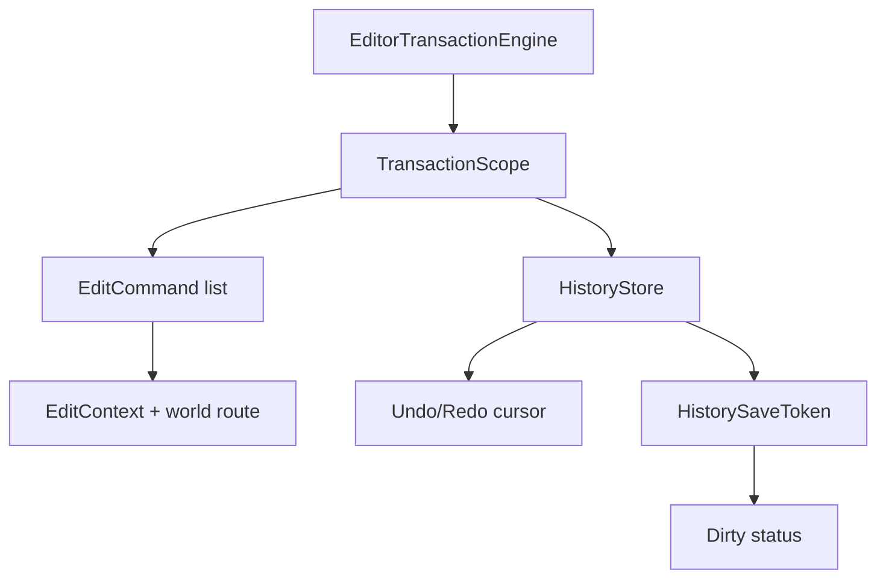
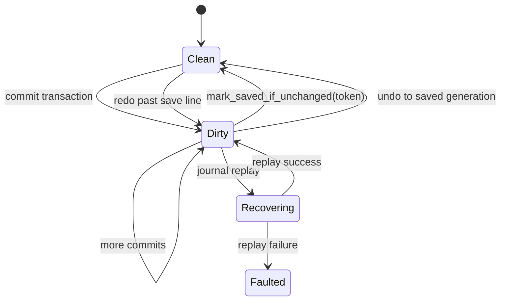
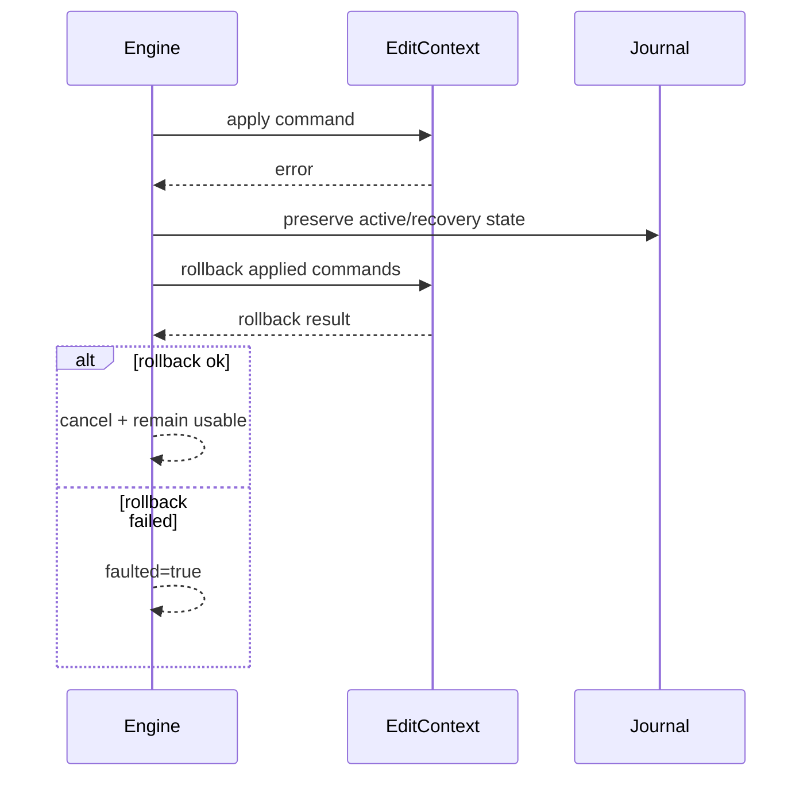

---
related_code:
  - zircon_editor/src/core/editing/engine/transaction/engine_state.rs
  - zircon_editor/src/core/editing/engine/transaction/scope.rs
  - zircon_editor/src/core/editing/engine/history.rs
  - zircon_editor/src/core/editing/engine/command.rs
  - zircon_editor/src/core/editing/engine/events.rs
implementation_files:
  - zircon_editor/src/core/editing/engine
plan_sources:
  - user: 2026-09-09 完善 ZirconEngine 公开接口、机制案例、教程与最佳实践
  - docs/plans/mvp/index.md
tests:
  - zircon_editor/src/core/editing/engine
  - zircon_editor/src/core/editing/engine/transaction
doc_type: module-detail
---

# Transaction Engine、History、Undo/Redo 与 Save Token

## 核心模型

编辑器变更必须经过 `EditorTransactionEngine`。transaction 是原子边界，history 是按 `HistoryContextId` 分区的可回放记录，document dirty 是保存线与当前 generation 的比较结果。



## 构造与 frame

```rust
let engine = EditorTransactionEngine::new(context);
// 需要自定义容量时，在另一个尚未移动的 context 上构造：
let bounded_engine = EditorTransactionEngine::with_capacity(other_context, 256)?;
engine.set_frame(frame_number)?;
```

`with_capacity` 拒绝 `0`，默认容量为源码中的 `DEFAULT_HISTORY_CAPACITY`。容量是每个 history store 的上限，超出后最旧记录会被淘汰。

## 开启 transaction

```rust
let history = HistoryContextId::Document(document_id);
let mut tx = engine.begin("Rename node", history)?;
tx.add_participant(document_id);
tx.push(RenameNode::new(node, old, new))?;
let id = tx.commit()?;
```

开启时 engine 会：

1. flush operation group。
2. 检查 engine 是否 busy/faulted。
3. 拒绝跨 history context 嵌套。
4. 捕获并激活 `EditWorldRoute`。
5. 记录 selection snapshot、frame 和 participants。
6. 发布 root transaction started event。

嵌套 transaction 只能使用相同 history context。不同 context 返回 `CrossContextNested`。

## Scope 生命周期

| 方法 | 语义 |
| --- | --- |
| `push`/`push_boxed` | 追加 command；失败时 scope 可能关闭 |
| `set_merge_mode` | 设置 `Disable`、`Ends` 或 `All` |
| `add_participant` | 将 `DocumentId` 记录到 transaction；不会注册可回滚 participant |
| `cancel` | 回滚并关闭 scope |
| `commit` | 将已由 `push` 应用的 commands 写入 history 并关闭 scope |
| `commit_after_apply` | 应用后先让 host 接受 selection，再提交 |

`TransactionScope` 带 `PhantomData<Rc<()>>`，因此不能跨线程发送。Drop 时若仍 active 会自动 cancel；若 cancel 失败，必须读取 `take_drop_error()`。

```rust
let mut tx = engine.begin("Move", history)?;
tx.push(command)?;
tx.commit_after_apply(|selection| {
    // 将宿主的 selection 校验错误显式映射为 EditCommandError。
    // 这里用 Ok(()) 表示示例宿主接受该快照；engine 没有 EditCommandError::host helper。
    let _ = selection;
    Ok(())
})?;
```

## EditCommand 契约

`EditCommand` 应提供 `apply`/`revert` 所需的完整旧值。不要在 `revert` 时重新查询易变的 runtime world；transaction 开启时捕获的 route 与 selection 是一致性基线。`apply`/`revert` 的失败必须包装为带 `CommandEffect` 的 `CommandExecutionError`，以便引擎判断是否需要补偿。

建议 command 满足：

- 可重复调用不会破坏状态，或明确由 engine 防止重复。
- apply 失败时不留下半个 mutation。
- `revert` 不依赖 UI 控件存在。
- 序列化 journal 有稳定 codec id。
- 错误包含 document/node/property 定位。

## HistoryContextId 与保存线

`HistoryContextId` 当前是 `Global`、`Document(DocumentId)` 或 `PlaySession(PlayInstanceId)`；`is_volatile()` 和 `world_domain()` 决定是否参与持久化及路由到哪个 world。

`TransactionId::raw()` 可用于日志和 UI，不应作为跨进程永久 id。`HistorySaveToken` 绑定 engine lineage、history、transaction 和 generation；保存流程应先调用 `capture_save_token(history)`，写盘完成后调用 `mark_saved_if_unchanged(history, token)`。换一个 engine 实例后 token 不再有效。



## Undo/Redo 语义

HistoryStore 内部维护 cursor。undo/redo 必须在正确 world route 下回放，不能只移动 UI 指针。

| 情况 | 结果 |
| --- | --- |
| 无可 undo | 返回 false/空操作 |
| undo 后新 commit | 清除 redo 分支 |
| 保存线前 undo | dirty 变 clean |
| redo 跨 route | 先激活记录 route，失败则 recovery |
| capacity 淘汰保存记录 | 保存 token 不再可验证，显示 dirty |

## 事件顺序

root transaction 的事件顺序是 `Started` -> `Committed` 或 `Canceled` -> dirty/history projection。commands 在 `push` 时立即 apply，但 `TransactionEventKind` 没有 `Applied` 或 `Cancelled` 变体；订阅者不能在 `Started` 时读取最终 command 数量。

## 错误与故障态

| 错误 | 处理 |
| --- | --- |
| `EngineBusy` | scope 的 commit/cancel 会等待 operation 完成 |
| `ScopeClosed` | 丢弃 scope，不能重试同一对象 |
| `InvariantViolation` | 记录上下文并停止继续 mutation |
| route activation error | rollback，保留原 history |
| recovery failure | engine 进入 faulted，禁止新 mutation |

`EditorTransactionEngine::with_context`/`with_context_mut` 只有在无 active transaction 时可调用；否则返回 invariant error。

## 机制案例：拖拽合并

拖拽每一帧产生预览，但只在 pointer-up 提交一个 history record。下面的 `TransformPreview` 和 `drag_samples` 是领域层伪代码；当前 engine 只要求它们最终实现 `EditCommand`：

```rust
let mut tx = engine.begin("Transform selection", history)?;
tx.set_merge_mode(MergeMode::Ends);
for sample in drag_samples {
    tx.push(TransformPreview::from(sample))?;
}
tx.commit()?;
```

实际 interactive transform 可能使用 operation group reservation；页面中的关键点是“预览不等于已提交 history”。

## 生产检查清单

- 所有 mutation 都有明确 history context。
- transaction label 可读且不包含用户隐私。
- 跨 document 操作按需调用 `add_participant(DocumentId)`；它只记录文档 ID，不提供独立 rollback participant。
- save token 与 project/document generation 一起持久化。
- drop cancel 错误写入 diagnostics。
- undo/redo 测试包含 route、selection 和 dirty 断言。

## 与其他引擎的差异

Unreal 的 `FScopedTransaction` 依赖 UObject Modify；ZirconEngine 的 `EditContext` + command 明确携带 route 和 codec。Godot 的 undo redo manager 以 action callable 为主；ZirconEngine 要求 command 可恢复和可审计。Fyrox 常以 message 记录编辑；此处 history store 还维护 save line 与多 document participants。

## 来源与测试

- Engine：[zircon_editor/src/core/editing/engine/transaction/engine_state.rs](https://github.com/He-Jiahui/ZirconEngine/blob/main/zircon_editor/src/core/editing/engine/transaction/engine_state.rs)
- Scope：[zircon_editor/src/core/editing/engine/transaction/scope.rs](https://github.com/He-Jiahui/ZirconEngine/blob/main/zircon_editor/src/core/editing/engine/transaction/scope.rs)
- History：[zircon_editor/src/core/editing/engine/history.rs](https://github.com/He-Jiahui/ZirconEngine/blob/main/zircon_editor/src/core/editing/engine/history.rs)
- Tests：[zircon_editor/src/core/editing/engine](https://github.com/He-Jiahui/ZirconEngine/tree/main/zircon_editor/src/core/editing/engine)

## 命令实现检查

`EditContext` 是 trait，不提供通用的 `set_property` 方法；领域命令必须把 context 向下转型为自己的具体上下文，或调用该领域 context 已公开的 typed 方法。下面是一个可放入 `zircon_editor` 依赖项目中编译的最小完整示例。它使用字符串属性和 `u64` 实体键，只为演示 trait 边界，不代表 ZirconEngine 场景实体的持久化 ID 格式。

```rust
use std::any::Any;
use std::collections::BTreeMap;

use zircon_editor::core::editing::engine::{
    CommandExecutionError, EditCommand, EditCommandError, EditContext, EditWorldRoute,
    EditorTransactionEngine, HistoryContextId, SelectionSnapshot,
};
use zircon_editor::core::play::WorldDomain;

#[derive(Default)]
struct ExampleContext {
    properties: BTreeMap<u64, String>,
}

impl ExampleContext {
    fn set_property(&mut self, entity: u64, value: String) -> Result<(), EditCommandError> {
        let Some(slot) = self.properties.get_mut(&entity) else {
            return Err(EditCommandError::TargetMissing {
                target: format!("example entity {entity}"),
            });
        };
        *slot = value;
        Ok(())
    }
}

impl EditContext for ExampleContext {
    fn capture_world_route(
        &self,
        world_domain: WorldDomain,
    ) -> Result<EditWorldRoute, EditCommandError> {
        Ok(EditWorldRoute::logical(world_domain))
    }

    fn activate_world_route(&mut self, _route: &EditWorldRoute) -> Result<(), EditCommandError> {
        Ok(())
    }

    fn retire_world_route(&mut self, _world_domain: WorldDomain) -> Result<(), EditCommandError> {
        Ok(())
    }

    fn selection_snapshot(&self) -> SelectionSnapshot {
        SelectionSnapshot::default()
    }

    fn restore_selection(
        &mut self,
        _snapshot: &SelectionSnapshot,
    ) -> Result<(), EditCommandError> {
        Ok(())
    }

    fn as_any(&self) -> &dyn Any {
        self
    }

    fn as_any_mut(&mut self) -> &mut dyn Any {
        self
    }
}

struct SetProperty {
    entity: u64,
    before: String,
    after: String,
}

impl EditCommand for SetProperty {
    fn label(&self) -> &str {
        "Set example property"
    }

    fn apply(&mut self, context: &mut dyn EditContext) -> Result<(), CommandExecutionError> {
        let context = context.as_any_mut().downcast_mut::<ExampleContext>().ok_or_else(|| {
            CommandExecutionError::unchanged(EditCommandError::ContextTypeMismatch {
                expected: "ExampleContext",
            })
        })?;
        context
            .set_property(self.entity, self.after.clone())
            .map_err(CommandExecutionError::unchanged)
    }

    fn revert(&mut self, context: &mut dyn EditContext) -> Result<(), CommandExecutionError> {
        let context = context.as_any_mut().downcast_mut::<ExampleContext>().ok_or_else(|| {
            CommandExecutionError::unchanged(EditCommandError::ContextTypeMismatch {
                expected: "ExampleContext",
            })
        })?;
        context
            .set_property(self.entity, self.before.clone())
            .map_err(CommandExecutionError::unchanged)
    }

    fn as_any(&self) -> &dyn Any {
        self
    }
}

fn main() -> Result<(), Box<dyn std::error::Error>> {
    let mut context = ExampleContext::default();
    context.properties.insert(7, "old".to_owned());

    let engine = EditorTransactionEngine::new(context);
    let mut scope = engine.begin("Set property", HistoryContextId::Global)?;
    scope.push(SetProperty {
        entity: 7,
        before: "old".to_owned(),
        after: "new".to_owned(),
    })?;
    let transaction_id = scope.commit()?;
    println!("transaction={}", transaction_id.raw());

    let value = engine
        .with_context::<ExampleContext, _>(|context| context.properties[&7].clone())?
        .expect("the engine owns ExampleContext");
    assert_eq!(value, "new");
    Ok(())
}
```

这个示例对应当前 trait 的完整必需方法：`label`、`apply`、`revert` 和 `as_any`。`EditCommand::apply`/`revert` 返回的是 `Result<(), CommandExecutionError>`，不是 `Result<(), EditCommandError>`；未发生 mutation 的错误用 `CommandExecutionError::unchanged` 包装，发生部分 mutation 后的错误应使用 `CommandExecutionError::applied`，让事务引擎决定补偿路径。引擎通过 `push` 立即调用 `apply`，撤销时调用 `revert`；不存在名为 `undo` 的 trait 方法，也不存在由 `EditContext` 统一提供的 `set_property`。

## MergeMode 选择

| 模式 | 适用 | 风险 |
| --- | --- | --- |
| `Disable` | 离散按钮、菜单 | history 记录较多 |
| `Ends` | 连续拖拽、文本输入 | 必须正确识别 cohort 结束 |
| `All` | 同一操作组批量变更 | 误合并不同资源 |

默认使用 `Disable`。只有 operation group 明确提供边界时才启用 `Ends`/`All`。

## Dirty journal 与参与者

跨文档 transaction 可以为每个 document 调用 `add_participant(DocumentId)`；该调用只把 ID 写入 `TransactionRecord.participants`，不会创建独立的 snapshot 或 rollback callback。命令自身仍必须保存 before/after 并实现 `revert`。提交后应用层可按这些 document IDs 更新 dirty journal；引擎的 history dirty 判断仍以对应 `HistoryContextId` 的 save line 为准。

| 场景 | participants |
| --- | --- |
| 单场景节点改名 | 一个 scene document |
| prefab + scene 实例化 | prefab 与 scene |
| 批量资产迁移 | 所有受影响 asset documents |
| 纯 selection 变化 | 通常无 document |

## Save token 使用

保存 token 不能跨 engine lineage 使用。应用启动恢复 journal 后，应先创建新 token，再将磁盘 source generation 与 history generation 对齐。

## Recovery 流程



faulted engine 只能被显式 recovery/重建；业务层不得捕获错误后继续 push。

## 事件订阅者规范

`TransactionEventSink` 回调不得重入同一 engine 的 mutation API。需要更新 UI 时，将 event 转成队列消息，在当前 operation 完成后处理。订阅者应保存 transaction id，而不是持有 scope。

## 并发限制

engine 内部使用 mutex/condvar 串行化 operation，但 `TransactionScope` 本身不是 `Send`。多个线程可以调用只读 engine API，但 mutation 必须通过拥有 scope 的 editor 线程完成。

## 性能建议

- history capacity 按项目规模配置，避免无界增长。
- command payload 尽量保存增量旧值，而不是整场景快照。
- 大批量操作使用 operation group 和单次 projection。
- journal codec 采用紧凑二进制，UI 只读取 `HistoryRecordDetail`。
