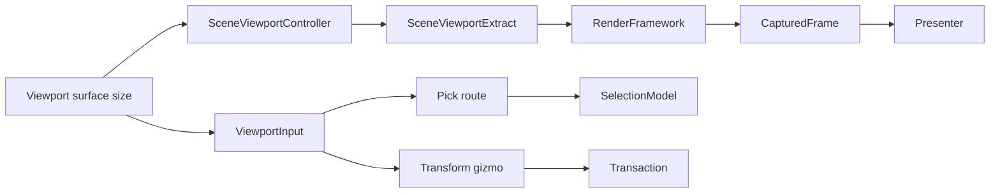
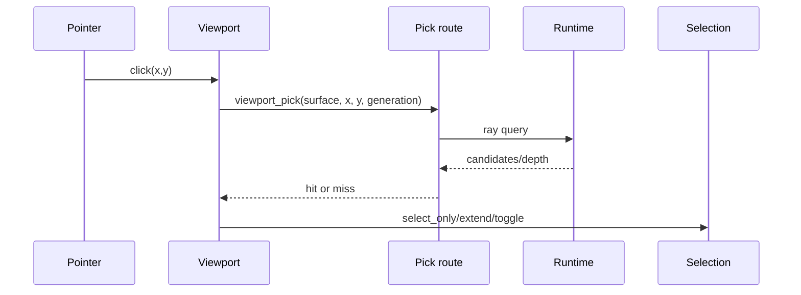
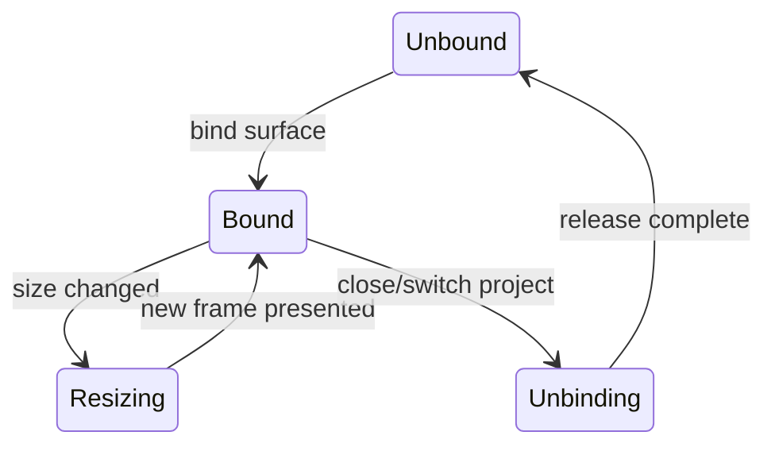

---
related_code:
  - zircon_editor/src/scene/viewport/mod.rs
  - zircon_editor/src/scene/viewport/interaction/mod.rs
  - zircon_editor/src/scene/viewport/settings.rs
  - zircon_editor/src/core/gateway/viewport_pick_route.rs
  - zircon_editor/src/core/gateway/session/viewport_pick.rs
  - zircon_editor/src/ui/retained_host/viewport
implementation_files:
  - zircon_editor/src/scene/viewport
  - zircon_editor/src/core/gateway/viewport_pick_route.rs
plan_sources:
  - user: 2026-09-09 完善 ZirconEngine 公开接口、机制案例、教程与最佳实践
tests:
  - zircon_editor/src/ui/retained_host/viewport/tests
  - zircon_editor/src/core/gateway/session/tests.rs
doc_type: module-detail
---

# Viewport、Pick、Gizmo 与呈现

## 作用范围

Viewport 子系统连接 Retained UI 尺寸、runtime render frame、场景输入和 editor overlay。它不拥有 scene document；它只消费快照并产生输入请求。



## 公开数据类型

| 类型 | 用途 |
| --- | --- |
| `ViewportInput` | pointer、wheel、keyboard、transform 输入 |
| `ViewportState` | 相机、尺寸、交互状态快照 |
| `ViewportTransformRequest` | translate/rotate/scale 请求 |
| `ViewportFeedback` | hover、capture、错误反馈 |
| `TransformHandleKind` | gizmo handle 类型 |
| `GizmoAxis` | 轴/平面约束 |
| `SceneViewportSettings` | 相机、网格、显示设置 |
| `SceneViewportChromeSettings` | 工具栏/边框展示配置 |
| `TransformSpace` | local/world |
| `ViewOrientation` | 视图方向 |
| `GridMode` | 网格显示模式 |
| `PivotMode` | gizmo pivot 规则 |

## Settings

```rust
let settings = SceneViewportSettings::default();
let render = settings.render_settings();
```

`SceneViewportSettings::render_settings()` 返回 renderer 使用的配置副本。设置修改应通过 editor state/command，不能在 render thread 直接改变 shared state。

## Pointer 到 pick

Pick route 需要 surface identity、像素坐标和 generation。坐标必须以 viewport content 区域为基准，不能包含 toolbar chrome 偏移。



命中结果若 generation 过期，必须丢弃。miss 事件通常清除 active selection，但 marquee/Alt modifier 等语义由 mode 决定。

## Gizmo 输入

```rust
let request = ViewportTransformRequest::translate(GizmoAxis::X, delta);
let outcome = controller.handle_input(ViewportInput::Transform(request));
```

调用形状取决于 controller 所属 Host；稳定契约是 transform request 进入 scene mode，再由 interactive transform session 生成 transaction command。

| 阶段 | 数据 | 可撤销 |
| --- | --- | --- |
| hover | handle + axis | 否 |
| begin | selection/pivot/route | 尚未提交 |
| preview | 临时 transforms | 取消恢复 |
| finish | command payload | 是 |
| cancel | 初始 snapshot | 不新增 history |

## Overlay

`ViewportOverlayBuilder` 构建轴线、线框、billboard 和 selection anchor。overlay 不应写入 render world；它是每帧 extract 的值对象。

```rust
fn build_overlay(&self, out: &mut ViewportOverlayBuilder) {
    out.axis_line(GizmoAxis::X, color);
}
```

具体 builder 方法以当前源码为准；插件应通过 `EditorSceneMode::build_overlay` 扩展，不修改内置 overlay packet。

## 相机与投影

内部 `ViewportProjectionContext` 负责 world-to-screen、units-per-pixel 和 spatial ray。公共层只消费 `ViewportState`/render descriptor；不要依赖 projection 私有结构。

相机 resize 规则：

1. UI 报告新 width/height。
2. 更新 aspect ratio。
3. 生成新的 `SceneViewportExtractRequest`。
4. renderer 返回匹配 generation 的 frame。
5. presenter 替换 latest frame。

## 线程与所有权

| 数据 | owner | 线程 |
| --- | --- | --- |
| pointer event | UI Host | UI thread |
| pick request | gateway | 可异步 |
| render extract | runtime/render | render scheduling |
| overlay builder | scene mode | UI/editor thread |
| captured frame | presenter | UI consumption 后 release |

禁止在 UI callback 中阻塞等待 GPU。使用 poll/receipt，并在超时时显示 stale frame 状态。

## 错误/负例

| 负例 | 后果 | 修正 |
| --- | --- | --- |
| 把 screen 坐标当 content 坐标 | pick 偏移 | 减去 chrome inset |
| 使用旧 generation 结果 | 选中错误实体 | 丢弃并重试 |
| preview 每帧 commit | history 爆炸 | 只在 finish commit |
| render thread 改 selection | 数据竞争/顺序错 | 通过 UI command |
| frame 未 release | surface/内存泄漏 | presenter ownership 结束时 release |

## 机制案例：拖拽并取消

1. pointer-down 命中 X handle。
2. 捕获 selection generation 和 pivot。
3. 启动 transform session。
4. pointer-move 只更新 preview。
5. pointer-cancel 调用 session.cancel。
6. 检查 selection、world transforms 和 history generation 均恢复。

## 最佳实践

- 将 viewport 输入转换为语义化 `ViewportInput`，不要在 renderer 中解析键盘。
- 对 pick/frames 使用 generation 丢弃 stale 数据。
- 将 gizmo 行为放入 scene mode，transaction 由 core editing owner 提交。
- resize、surface bind、frame present 保持显式顺序。
- 用反馈类型表达 capture/hover/error，不靠日志猜状态。

## 与其他引擎的差异

Unreal viewport client 往往直接持有 editor world；ZirconEngine 通过 gateway/render extract 隔离。Godot gizmo 插件可直接修改 Node；此处必须走 transaction。Fyrox viewport 与 editor scene 更紧耦合，本实现允许 detached/headless viewport。

## 来源与测试

- Viewport API：[zircon_editor/src/scene/viewport/mod.rs](https://github.com/He-Jiahui/ZirconEngine/blob/main/zircon_editor/src/scene/viewport/mod.rs)
- Interaction：[zircon_editor/src/scene/viewport/interaction/mod.rs](https://github.com/He-Jiahui/ZirconEngine/blob/main/zircon_editor/src/scene/viewport/interaction/mod.rs)
- Pick：[zircon_editor/src/core/gateway/viewport_pick_route.rs](https://github.com/He-Jiahui/ZirconEngine/blob/main/zircon_editor/src/core/gateway/viewport_pick_route.rs)
- Tests：[zircon_editor/src/ui/retained_host/viewport/tests](https://github.com/He-Jiahui/ZirconEngine/tree/main/zircon_editor/src/ui/retained_host/viewport/tests)

## Pick 结果排序

runtime 返回多个 candidate 时，pick route 应按命中深度、可见性、layer 和稳定 entity id 排序。排序规则必须 deterministic，保证相同 frame 重复点击得到相同 primary。

| 优先级 | 条件 |
| --- | --- |
| 1 | generation 匹配 |
| 2 | 可见且未过滤 |
| 3 | 深度更近 |
| 4 | layer 优先级 |
| 5 | entity id 稳定排序 |

## Marquee/框选

框选先在 UI 线程构造 screen rect，再由 gateway 查询可见实体。查询返回后按 selection mode 执行 replace/extend/toggle；不要在 pointer move 时提交 transaction。

## Surface 生命周期



unbind 前必须停止新 extract，释放 latest frame，再撤销 gateway surface binding。

## 帧预算

- extract 不应等待 asset IO。
- overlay 数量超过预算时按 priority 截断并诊断。
- pick 请求与 render frame 使用独立 budget，避免点击阻塞呈现。
- stale frame 可继续显示，但要标记状态。

## 错误回退

viewport 初始化失败时可显示 detached placeholder；pick 不可用时禁用选择工具并保留 scene hierarchy 操作。不要返回“空命中”掩盖 gateway error。

## 测试断言

- resize 后 aspect ratio 与 frame descriptor 一致。
- stale frame 不替换 latest。
- release 后重复 release 返回错误或被安全忽略。
- pick 坐标转换覆盖 DPI/toolbar inset。
- gizmo cancel 不增加 history。

## DPI 与坐标

UI logical points 转 physical pixels 时使用 surface scale；rounding 只在最终 GPU 坐标发生一次。pick 反向转换必须使用同一 scale 和 viewport origin，避免高 DPI 下点击漂移。

## 多 viewport

每个 viewport 有独立 surface id、camera snapshot、latest frame 和 input capture。切换活动 viewport 不得复用另一个 viewport 的 pick generation 或 gizmo session。

## 远程 viewport

远程/无窗口 profile 可以提供 frame 和 pick receipt，但不应假设 pointer device。自动化使用显式 pixel coordinates 与 deterministic camera，不依赖本地鼠标状态。

## 交付前验收

- surface bind/unbind 成对且可重复。
- frame generation、尺寸和 RGBA 长度一致。
- pick 结果对乱序响应 deterministic。
- DPI、resize、toolbar inset 有回归测试。
- gizmo preview/finish/cancel 与 transaction 对齐。
- detached profile 不伪造 runtime hit。

验收日志应包含 surface id、camera generation、pick latency 与丢弃 stale frame 数量，便于区分渲染延迟和输入坐标错误。

## 观测指标

- frame submit/present generation。
- capture 与 release 数量。
- pick request/response latency。
- stale result 丢弃数。
- overlay element 数和截断数。
- active gizmo handle 与 input capture owner。
