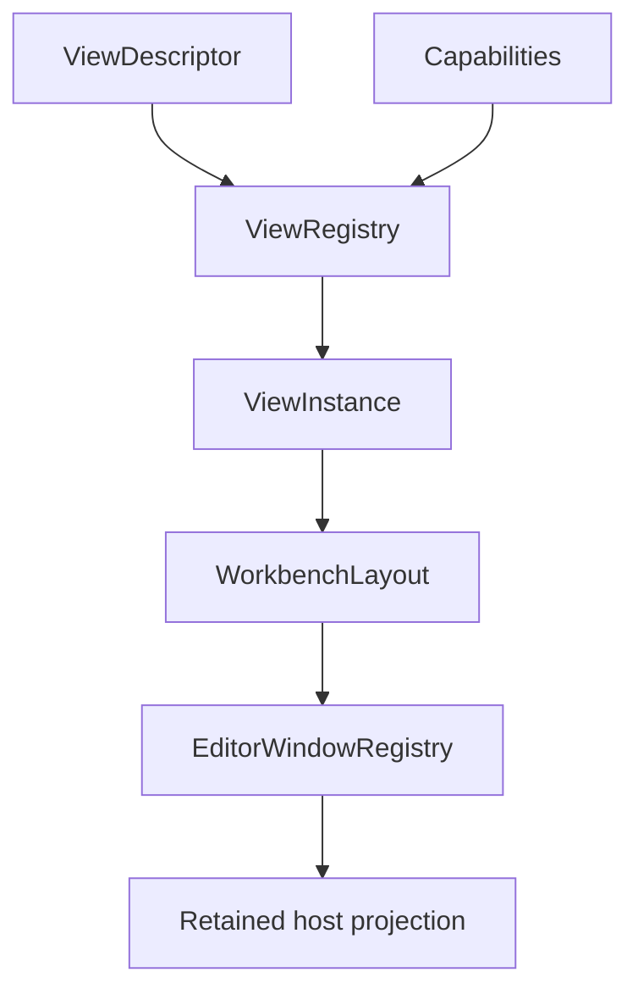
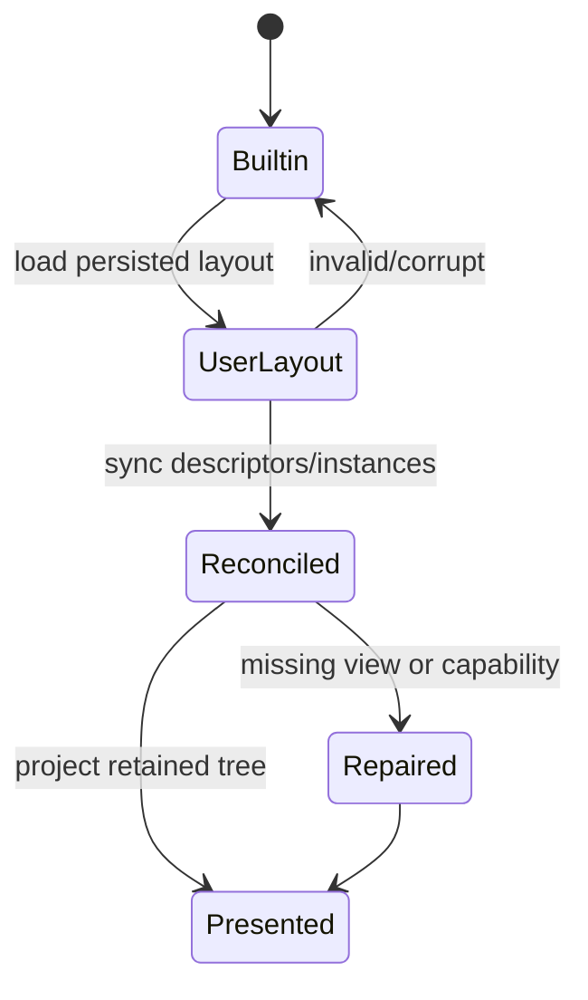
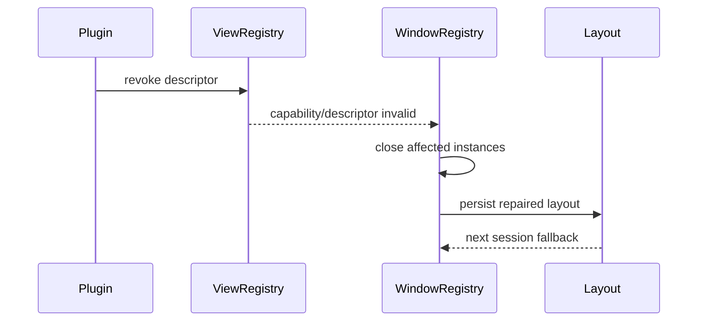
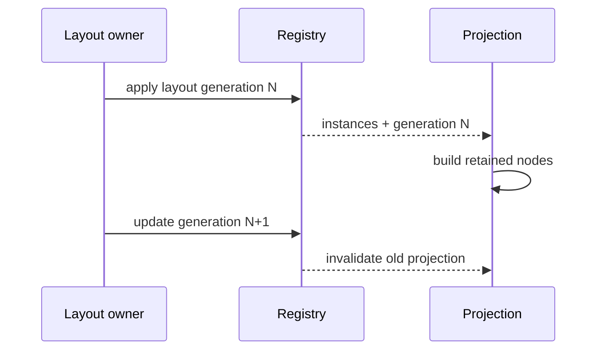

---
related_code:
  - zircon_editor/src/ui/workbench/view/view_registry.rs
  - zircon_editor/src/ui/workbench/view/view_descriptor.rs
  - zircon_editor/src/ui/workbench/window_registry/editor_window_registry.rs
  - zircon_editor/src/ui/workbench/window_registry/window_instance.rs
  - zircon_editor/src/ui/workbench/autolayout/workbench_skeleton.rs
  - zircon_editor/src/ui/host/builtin_layout
implementation_files:
  - zircon_editor/src/ui/workbench/view
  - zircon_editor/src/ui/workbench/window_registry
  - zircon_editor/src/ui/workbench/autolayout
plan_sources:
  - user: 2026-09-09 完善 ZirconEngine 公开接口、机制案例、教程与最佳实践
tests:
  - zircon_editor/src/ui/workbench
  - zircon_editor/src/ui/retained_host/ui/tests/workbench_layout_frames.rs
doc_type: module-detail
---

# Workbench、ViewRegistry、WindowRegistry 与布局

## 概念

Workbench 把“view descriptor”“view instance”“window/drawer”和“layout geometry”分层。descriptor 是可用能力声明，instance 是当前打开的实体，layout 决定它在哪里显示。



## ViewRegistry

`ViewRegistry` 公开：

| 方法 | 语义 |
| --- | --- |
| `set_available_capabilities` | 更新可用能力集合 |
| `descriptor_capability_error` | 返回 descriptor 缺少能力的原因 |

descriptor 注册/open 等更高层方法位于 `view` 子模块。调用者先检查 capability error，再创建 instance。

```rust
let mut registry = ViewRegistry::default();
registry.set_available_capabilities(["scene", "inspector"]);
if let Some(reason) = registry.descriptor_capability_error(&descriptor) {
    return Err(reason.into());
}
```

## WindowRegistry

`EditorWindowRegistry` 公开方法：

| 方法 | 用途 |
| --- | --- |
| `register_window` | 注册主窗口 |
| `register_drawer_view` | 注册 drawer view，可能失败 |
| `register_drawer_window` | 注册 drawer window |
| `bind_drawer` | 将 view 绑定到 drawer |
| `get_window`/`get_drawer_view`/`get_drawer_window` | 只读查询 |
| `active_window` | 当前活动窗口 |
| `activate_window` | 切换活动窗口 |
| `selected_drawer_for_active_window` | 查询活动 drawer |
| `sync_from_layout` | 从布局和 instances 重建 registry |

```rust
use zircon_editor::ui::workbench::layout::{
    ActivityWindowHostMode, ActivityWindowId,
};
use zircon_editor::ui::workbench::view::ViewDescriptorId;
use zircon_editor::ui::workbench::window_registry::{
    EditorWindowRegistry, WindowInstance, WindowKind,
};

let mut windows = EditorWindowRegistry::default();
let main_id = ActivityWindowId::workbench();
let main_window = WindowInstance::new(
    main_id.clone(),
    ViewDescriptorId::new("window.workbench"),
    WindowKind::DrawerCapable,
    "Workbench",
    ActivityWindowHostMode::EmbeddedMainFrame,
);
windows.register_window(main_window);
windows.activate_window(main_id);
```

`WindowInstance::new` 的五个参数依次是 window id、descriptor id、window kind、标题和 host mode；实例 id 不应由 UI label 生成。

## 布局恢复



恢复必须容忍：旧 view descriptor、插件缺失、窗口数量变化、屏幕尺寸变化。未知节点保留为可诊断数据，不应阻塞整个工作台。

## Capability gating

一个 view 可声明 required capabilities。能力变化时：

1. registry 更新集合。
2. 找出 descriptor capability error。
3. 关闭或隐藏不满足的 instance。
4. 保留 route/payload 以便能力恢复后重开。
5. 发布新的 layout generation。

## Panel 生命周期

| 阶段 | 允许操作 |
| --- | --- |
| descriptor available | 注册、查询 |
| instance created | 绑定 route、加入 layout |
| active | 接收 input、请求 projection |
| hidden | 保留状态，不接收 pointer |
| closing | flush dirty/document state |
| retired | 从 registry 移除 |

## 机制案例：插件面板撤销

插件撤销会导致 descriptor 消失。正确流程：



不得留下指向已撤销 route 的 active instance；否则点击会产生重复错误 toast。

## 线程与所有权

Workbench registry 是 editor/UI 线程对象；layout persistence 可异步读写，但 apply 必须回到 UI 线程。descriptor metadata 可以跨线程共享，instance/window 不应跨线程 mutate。

## 负例与恢复

| 负例 | 结果 | 恢复 |
| --- | --- | --- |
| 用 label 作为 instance id | 重启后冲突 | 使用稳定 `ViewInstanceId` |
| 直接修改 persisted layout | generation 不一致 | 通过 layout owner API |
| capability 缺失仍创建窗口 | 空面板/崩溃 | 先调用 capability error |
| 插件撤销不关 instance | 悬挂 route | revoke 时同步 registry |
| resize 期间重建所有 panel | 状态抖动 | 只更新 geometry |

## 最佳实践

- descriptor、instance、layout 三者分别测试。
- 使用 `sync_from_layout` 作为恢复的唯一汇聚点。
- 所有面板 route 可序列化、可诊断、可失效。
- 将 dirty document flush 放在 window close 前。
- 对缺能力面板提供可读原因和修复动作。

## 与其他引擎的差异

Unreal Slate tab manager 常以 tab id + layout config 工作；ZirconEngine 额外区分 view descriptor/instance 并做 capability gating。Godot dock layout 更偏 editor singleton；这里 registry 可在 headless 测试中独立构造。Fyrox docking 与 scene editor 强绑定；本模型支持插件撤销后的 layout repair。

## 来源与测试

- View：[zircon_editor/src/ui/workbench/view](https://github.com/He-Jiahui/ZirconEngine/tree/main/zircon_editor/src/ui/workbench/view)
- Window：[zircon_editor/src/ui/workbench/window_registry/editor_window_registry.rs](https://github.com/He-Jiahui/ZirconEngine/blob/main/zircon_editor/src/ui/workbench/window_registry/editor_window_registry.rs)
- Layout：[zircon_editor/src/ui/workbench/autolayout](https://github.com/He-Jiahui/ZirconEngine/tree/main/zircon_editor/src/ui/workbench/autolayout)
- Tests：[zircon_editor/src/ui/retained_host/ui/tests/workbench_layout_frames.rs](https://github.com/He-Jiahui/ZirconEngine/blob/main/zircon_editor/src/ui/retained_host/ui/tests/workbench_layout_frames.rs)

## Descriptor 与 instance 字段

descriptor 应至少定义：稳定 id、kind、route namespace、required capabilities、默认 dock policy 和可关闭性。instance 额外拥有 instance id、payload、active/hidden 状态和恢复 metadata。

## Layout generation

布局、registry 和 retained projection 通过 generation 对齐：



projection 发现 generation 不一致时应丢弃缓存并重新构建，不要增量拼接旧节点。

## Dock/Drawer 规则

drawer 绑定需要匹配 window kind、dock position 和 view instance。绑定失败必须返回可读字符串错误，并保持 registry 不变。

## 快捷键与面板焦点

面板获取焦点不应改变全局 command registry；keymap resolver 根据 focus/context 决定 enabled。关闭面板时释放 capture 和 pending input。

## 持久化策略

- layout 文件只保存 descriptor/instance identity 和可序列化 payload。
- 不保存 runtime pointer、frame buffer、transaction scope。
- 缺少 descriptor 时保留 tombstone 或 fallback route。
- 写入采用原子替换，失败时保留上一份有效布局。

## 诊断

布局修复应报告：缺失 descriptor、无效 payload、capability 缺失、重复 instance id、几何越界。用户可一键恢复 builtin layout，但不应静默覆盖原布局文件。

## 测试断言

- 默认布局可构造并呈现。
- 缺 plugin 时 layout repair 成功。
- 重复 instance id 被拒绝。
- resize 不改变 instance identity。
- close dirty document 时触发保存决策。
- sync_from_layout 后 active window 唯一。

## 可扩展面板模板

一个插件面板至少需要：descriptor、route namespace、capability 声明、默认 dock policy、payload schema、关闭时的 dirty policy 和 revoke handler。缺任一项都只能作为临时内部 view，不应写入用户布局。

## 面板性能

projection 应按 generation 缓存 descriptor 与静态 chrome，只重算变动 pane。大列表使用窗口化数据，避免每个 frame 克隆完整 `WindowInstance` 集合。布局测量和 runtime frame present 分开调度。

## 恢复优先级

恢复顺序推荐：主场景 viewport -> hierarchy/inspector -> activity drawers -> 插件面板。插件面板恢复失败不能阻塞主场景工作台。

## 交付前验收

- builtin layout 可在无插件 profile 中恢复。
- 缺失 descriptor 的 pane 可诊断、可关闭。
- registry generation 与 projection generation 一致。
- active window/drawer 在 sync 后唯一。
- layout 写入失败保留上一份有效文件。
- 关闭 pane 前 dirty document 得到明确决策。

验收完成后再将 layout 标记为可持久化；临时实验 pane 不得污染用户默认布局。

## 观测指标

- registry/layout/projection generation。
- descriptor 与 live instance 数量。
- layout repair 原因计数。
- active/hidden panel 数量。
- projection rebuild duration。
- capability rejection 数量。

指标按窗口与插件 owner 分组，并随 session 结束清理。
