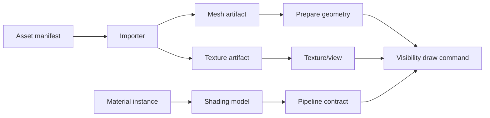
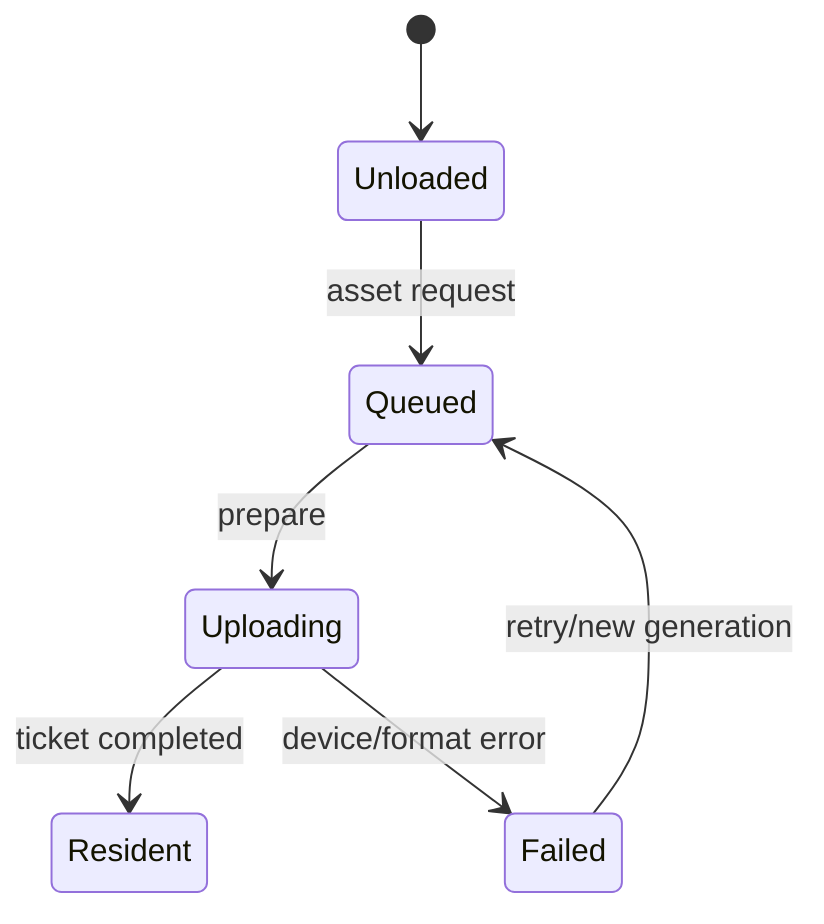
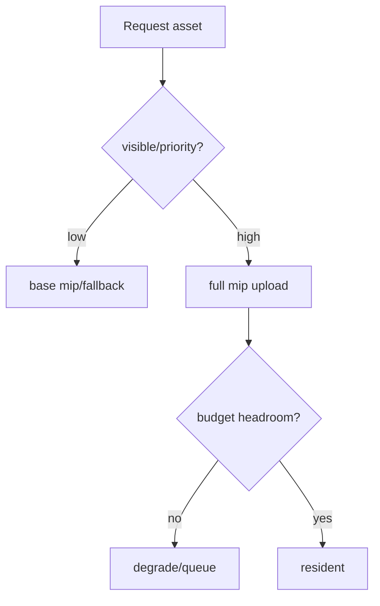

---
related_code:
  - zircon_runtime/src/graphics/material
  - zircon_runtime/src/graphics/pipeline
  - zircon_runtime/src/graphics/runtime_prepare_collector.rs
implementation_files:
  - zircon_runtime/src/graphics/material/mod.rs
  - zircon_runtime/src/graphics/pipeline/declarations/render_pipeline_asset.rs
  - zircon_runtime/src/graphics/runtime_prepare_mesh_geometry_seed.rs
plan_sources:
  - docs/wiki/graphics/mesh-material-texture.md
tests:
  - zircon_runtime/src/graphics/tests/render_product_mesh_cache
  - zircon_runtime/src/graphics/material/shading_models
doc_type: api-reference
---

# Mesh、Material 与 Texture 资源管线

图形资源由 ProjectAssetManager 负责 authority，graphics prepare 阶段把资产转换为 device-generation-local GPU backing。Mesh 提供几何与 bounds，Material 提供 shading model 与参数，Texture 提供采样/存储视图；三者通过 asset id 与版本绑定，不直接暴露 wgpu 对象。



## Mesh 数据

Mesh 资产至少包含 vertex streams、index stream、index format、submesh range、local bounds 与可选 morph/skinning 数据。prepare 阶段为每个 stream 创建 `BufferDesc`，按 usage 标记 `VERTEX`、`INDEX`、`COPY_DST`。上传完成前，visibility 只能输出 pending draw，不得绑定空 buffer。

```rust
let vertex = device.create_buffer(&BufferDesc::new(
    "mesh/vertices", bytes.len() as u64,
    BufferUsage::VERTEX | BufferUsage::COPY_DST,
))?;
let index = device.create_buffer(&BufferDesc::new(
    "mesh/indices", indices.len() as u64,
    BufferUsage::INDEX | BufferUsage::COPY_DST,
))?;
```

## Material 与 shading model

`graphics::material::shading_models` 注册内置模型与 include source；material instance 引用模型名、参数块、纹理槽与 quality flags。模型改变会使 pipeline interface generation 变化，相关 compiled pipeline 必须失效。

参数更新应使用 staging/upload batch，避免每个实体创建 bind group。纹理槽缺失时，使用模型定义的 fallback（白色、法线平面或黑色）并记录诊断，不要绑定未初始化 view。

## Texture 资源

导入器应记录尺寸、mip 数、format、color space 与 residency。sRGB 颜色贴图使用 `Rgba8UnormSrgb`，法线/数据贴图使用线性格式；HDR 使用 float 格式。`TextureUsage` 必须覆盖后续 sampled、copy 或 storage 用途。

## Residency 与异步准备

资源状态建议区分 `Unloaded`、`Queued`、`Uploading`、`Resident`、`Failed`。visibility 读取状态后可选择低质量 fallback 或跳过 draw；GPU completion 回调再把 backing 标为 resident。



## API 关系

| 层 | API/类型 | 职责 |
| --- | --- | --- |
| Asset | `AssetReference`, `ProjectAssetManager` | authority、版本、依赖 |
| Prepare | mesh geometry seed、material prepare | 生成 GPU 描述与上传任务 |
| RHI | `BufferDesc`、`TextureDesc`、`TextureViewDesc` | 创建后端资源 |
| Visibility | `VisibilityDrawCommand` | 选择可绘制 submesh |
| Pipeline | `RenderPipelineAsset` | 将模型、layout、target 组合 |

## 失败与降级

- 索引类型与 pipeline vertex contract 不一致：拒绝 draw，报告 mesh id。
- mip 链不完整：允许 base-level fallback，但标记 streaming debt。
- sampler/format capability 不支持：切换兼容 sampler 或材质变体。
- 设备 generation 改变：保留 CPU artifact，重新创建所有 backing。

## 线程与所有权

导入和 CPU 解码在 asset worker；RHI create/upload 可排入 render prepare；native handle 只在 device 服务内使用。材质实例可以 `Arc` 共享 immutable 参数，动态参数由 frame-local buffer 写入。

## 最佳实践

- 将 artifact hash 与 importer version 纳入缓存键。
- 依据屏幕尺寸和可见性优先级安排纹理 mip 上传。
- 统一 submesh/material slot 顺序，减少 bind group 重建。
- 为 fallback 资源提供永驻、预热的 generation-local backing。
- 用 mesh cache 测试验证第二次启动与热 reload。

## 验收清单

- [ ] mesh bounds 与实际顶点范围一致。
- [ ] 颜色空间与 texture format 选择有测试。
- [ ] residency 状态在上传完成后才变为 Resident。
- [ ] generation 重建可从 artifact 恢复。
- [ ] 材质模型变更会使 pipeline cache 失效。

## 公开接口与状态详解

### `AssetReference`

资产引用由 authority 创建并带 uri、artifact id 与 revision。渲染缓存应以 artifact id/revision 为键，uri 仅用于显示和重新解析。解析失败时保留失败原因，不将缺失资产伪装成空成功。

### `RenderPipelineAsset`

管线资产描述 feature 列表、资源 schema、target policy、compile options 与 fallback。它是 CPU 文档，不等于已创建的 `PipelineHandle`。资产热重载后旧 compiled result 仍可作为 last-good，直至新结果通过 admission。

### `RendererFeatureAsset`

feature asset 绑定 descriptor name、pass contract、shader source 与 capability requirement。名称必须稳定且唯一；更改资源 schema 应提升 interface generation。

### `RuntimePrepareCollector`

prepare collector 汇总 mesh/material/texture/font 的 upload requests，并按 priority、dependency 和 generation 排序。collector 不直接提交 GPU；提交服务消费冻结后的 batch。

## Mesh 导入合同

导入器必须验证：顶点 stride 与 attribute offset、索引范围、submesh first/count、bounds finite、morph target 数量和 skin joint index。验证失败返回 import diagnostic，禁止生成“可加载但不可绘制”的 artifact。

## 材质参数布局

参数块按 16-byte 对齐策略组织，纹理和 sampler 槽位由 shading model schema 分配。动态参数写入 frame buffer，静态参数写入共享 bind group；布局变化需要新 pipeline interface generation。

## Streaming 决策



## 负面用例

```rust
// 错误：把 asset uri 直接当 GPU handle。
let gpu_handle = unsafe { std::mem::transmute::<_, TextureHandle>(uri) };
// 正确：先由 ProjectAssetManager 解析，再由 prepare/device 创建 backing。
```

## 可观测字段

每个资源至少记录 asset id、artifact revision、device generation、residency state、bytes、mip level、upload ticket 与 failure reason。编辑器显示“Queued/Uploading/Resident/Failed”而不是只显示布尔 loaded。

## 验收扩展

- [ ] importer version/hash 进入 artifact key。
- [ ] mesh bounds、morph、skin index 在边界值测试。
- [ ] material schema 变化会拒绝旧 bind group。
- [ ] streaming budget 超限按 priority 退化。
- [ ] asset reload 期间场景保持 last-good 或明确 fallback。
