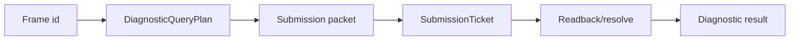
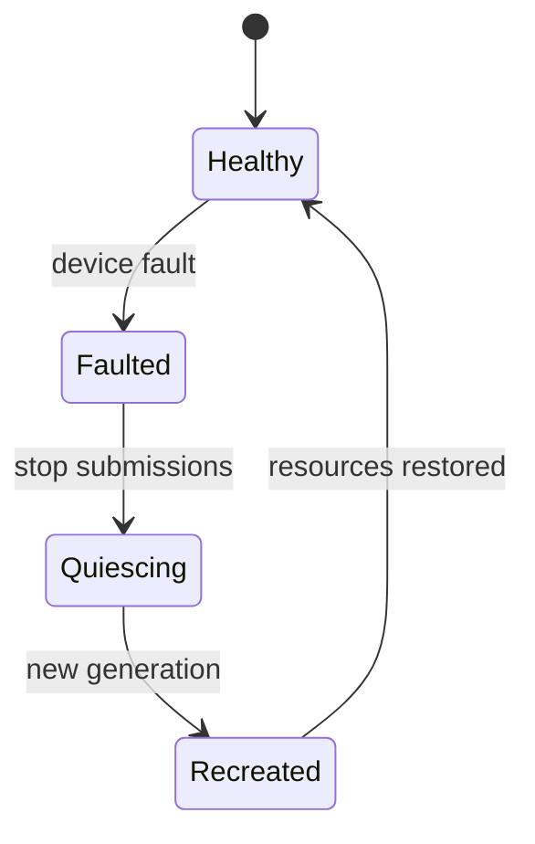

---
related_code:
  - zircon_runtime/src/graphics/backend/render_backend/graphics_debugger_capture.rs
  - zircon_runtime/crates/zr_rhi/src/diagnostic_query.rs
  - zircon_runtime/crates/zr_rhi/src/diagnostic_readback.rs
implementation_files:
  - zircon_runtime/src/graphics/runtime/render_framework/capture_frame/capture_frame.rs
  - zircon_runtime/src/graphics/runtime/render_framework/query_stats/query_stats.rs
  - zircon_runtime/crates/zr_rhi_wgpu/src/gpu_pass_timer.rs
plan_sources:
  - docs/wiki/graphics/rust-api-reference.md
tests:
  - zircon_runtime/crates/zr_rhi/src/tests/diagnostic_query.rs
  - zircon_runtime/crates/zr_rhi/src/tests/diagnostic_readback.rs
  - zircon_runtime/crates/zr_rhi_wgpu/src/tests/debug_status.rs
doc_type: api-reference
---

# Capture、统计与性能诊断 API

诊断接口分为三层：框架层的 frame capture/统计快照，RHI 层的 timestamp/pipeline query，后端层的 RenderDoc、GPU fault 与 readback。它们都必须是有界、可取消、不会阻塞主循环的服务。



## 框架统计

`RenderFramework::query_stats` 返回逻辑帧统计快照。公开字段包括 `submitted_frames`、`captured_frames`、`last_frame_profile`、`last_resolved_gpu_frame_profile`、图级 pass/dispatch/readback 计数以及 capture report；具体 GPU 结果可能滞后一帧或多帧。

```rust
// 伪代码：metrics 是应用自己的指标 facade；stats 字段来自 RenderStats。
let stats = framework.query_stats()?;
metrics.gauge("render.submitted_frames", stats.submitted_frames as f64);
metrics.gauge("render.captured_frames", stats.captured_frames as f64);
```

不要使用轮询 stats 等待 GPU；请使用 `SubmissionTicket` 的 `submission_status`。

## DiagnosticQueryPlan

RHI 导出 `DiagnosticQueryPlan`、`TimestampScope`、`PipelineStatisticsScope`、`DiagnosticPassQueryScope`。plan 描述一个 graph frame 的 query 槽位与预算，提交 packet 时绑定；一个 ticket 对应一个可解码结果集合。

```rust
// 调用上下文片段：device、frame_id、color_attachments 与 ticket 由 render loop 提供。
use zr_rhi::{
    DiagnosticReadbackBudget, DiagnosticQueryPlan, RenderDevice, RenderQueueClass,
};

let budget = DiagnosticReadbackBudget::default();
let mut plan = DiagnosticQueryPlan::for_frame(frame_id, budget);
let pass = plan.register_pass()?;
let timestamp = plan.reserve_timestamp_scope(pass)?;
let pipeline_statistics = plan.reserve_pipeline_statistics_scope(pass)?;
let diagnostic_scope = plan.pass_scope(Some(timestamp), Some(pipeline_statistics))?;

let mut list = device.create_command_list(RenderQueueClass::Graphics, "lighting")?;
list.begin_render_pass_with_diagnostics(
    "lighting",
    color_attachments,
    depth_stencil_attachment,
    diagnostic_scope,
);
list.end_render_pass();
let packet = device.create_submission_packet_with_diagnostic_query_plan(
    RenderQueueClass::Graphics,
    vec![list],
    plan,
)?;
let ticket = device.submit_packet(packet)?;
```

`DiagnosticQueryPlan::new`/`for_frame` 只创建有界计划；必须先
`register_pass`，再为该 pass 预留 timestamp/statistics scope，并通过
`pass_scope` 组合成 `DiagnosticPassQueryScope`。命令列表使用
`begin_render_pass_with_diagnostics` 或 `begin_compute_pass_with_diagnostics` 记录
scope，最后把同一个计划交给
`RenderDevice::create_submission_packet_with_diagnostic_query_plan`。计划附带
frame index 后才能构造 packet；scope 未使用、重复、跨 pass 混用或超出 budget
都会返回 `DiagnosticQueryPlanError`/`RhiError`。

## 解码与聚合

`aggregate_diagnostic_query_results(plan, timestamp_bytes, pipeline_statistics_bytes)` 要求
两段输入都严格按计划提供 little-endian `u64` 数组：每个 timestamp scope 占两个值（begin/end），
pipeline statistics 每个 scope 占五个计数器。长度不匹配才会返回
`DiagnosticQueryDecodeError`；聚合使用 `end.saturating_sub(start)`，因此反向时间戳会
得到 0 而不会产生负数。tick 到纳秒/微秒的 frequency 换算属于 backend/profile 层，
不在这个中立函数内完成。

## Readback

`DiagnosticReadbackTracker` 管理 `DiagnosticReadbackRequestId`、`DiagnosticReadbackBudget`
与 `DiagnosticReadbackReceipt`。当前 `DiagnosticReadbackKind` 只有 `Buffer`、
`Texture`、`Timestamp`、`PipelineStatistics` 四类；区域、row pitch 和实际 bytes
由 backend 的 copy/resolve 服务管理。tracker 只记录字节预算与生命周期，不保存
readback payload。

```rust
// 调用上下文片段：device、frame_id、expected_bytes 与 ticket 已由 backend service 准备。
use zr_rhi::{
    DiagnosticReadbackBudget, DiagnosticReadbackKind, DiagnosticReadbackTerminal,
    DiagnosticReadbackTracker,
};

let mut tracker = DiagnosticReadbackTracker::new(
    device.device_id(),
    device.generation(),
    DiagnosticReadbackBudget::default(),
);
tracker.begin_frame(frame_id)?;
let request = tracker.admit(DiagnosticReadbackKind::Texture, expected_bytes)?;

// packet 获得 ticket 后立即绑定；backend 随后完成 copy/map。
let frame_key = tracker.bind_active_frame(ticket)?;
// 伪代码：以下调用位于 backend copy/map 完成回调，而非提交线程。
let receipt = tracker
    .terminalize(request, DiagnosticReadbackTerminal::Succeeded)
    .expect("request is terminalized once");
assert_eq!(receipt.frame_key(), Some(frame_key));
while let Some(receipt) = tracker.take_completed_receipt() {
    tracing::debug!(request=?receipt.request(), terminal=?receipt.terminal());
}
```

上面的 `ticket` 必须来自同一 `DeviceId`/generation；跨设备或旧 generation 会被
`bind_active_frame` 拒绝。`terminalize` 只发出状态 receipt，不代表它提供了字节；
WGPU readback service 负责 map/copy，并在成功或失败后调用 `terminalize`。配额拒绝
可改用 `admit_or_reject`，它会返回 `DiagnosticReadbackAdmission::Rejected` 和
`OverBudget` receipt，而空请求或没有 active frame 仍返回 typed error。

## RenderDoc/调试标记

`CommandList::push_debug_marker`、`push_debug_group`/`pop_debug_group` 提供 pass 内标记；框架层通过 `RenderFramework::request_graphics_debugger_capture` 与 `query_graphics_debugger_status` 请求和观测 backend capture。capture 只能在 debug/diagnostic capability 开启时执行；RHI 的 operation admission 失败时应走 `UnsupportedOperation`，而不是加载未声明的调试 DLL。

## GPU fault

`DeviceFaultGate`、`DeviceFaultRecord` 记录 device removed、validation、out-of-memory 等 fault。fault 发生后，新的 submission 应快速失败；应用清空 generation-local caches，等待 runtime 重建。



## 性能预算

诊断本身有成本：timestamp query 占槽位，pipeline statistics 可能禁用某些优化，readback 会增加 copy/staging。为每帧设定 query count、readback bytes、capture frequency budget，超出预算返回 admission error。

## 失败与重试

| 错误 | 处理 |
| --- | --- |
| query unsupported | 关闭对应 scope，保留 frame render |
| budget exceeded | 丢弃低优先级请求 |
| ticket stale | 不重试旧 generation |
| readback row pitch invalid（backend diagnostic） | 按 backend alignment 重排；这不是稳定的 `zr_rhi::RhiError` 变体 |
| capture unavailable | 记录一次告警并继续 |

## 线程模型

query plan 可由 render prepare 线程构建；native query resolve 在 device service；结果解码可在 telemetry worker。UI 只能读取复制后的结果。请求取消必须是幂等的，不能在回调中再次提交 graph。

## 最佳实践

- 每个 diagnostic label 包含 frame id、pass name、viewport id。
- 只在问题窗口开启 capture/readback，并设置自动超时。
- 将 raw 结果与 engine/backend/capability fingerprint 一起保存。
- 对 GPU time 标注 query latency 与 calibration 状态。
- fault 后优先验证 memory budget，再决定是否降级质量。

## 负面测试

```rust
// 下面使用的值是同一 plan 中预留的 scope；该片段可直接用于单元测试函数体。
let mut invalid = DiagnosticQueryPlan::new(DiagnosticReadbackBudget::default());
let pass = invalid.register_pass()?;
let timestamp = invalid.reserve_timestamp_scope(pass)?;
let scope = invalid.pass_scope(Some(timestamp), None)?;
// 同一个 scope 被提交两次，计划会稳定返回 DuplicateScope。
assert!(invalid.validate_submission_scopes(&[scope, scope]).is_err());
```

## 验收清单

- [ ] diagnostic plan 与 submission ticket 一一对应。
- [ ] timestamp/statistics raw bytes 长度严格匹配计划，反向 timestamp 饱和为 0。
- [ ] readback 有区域、格式与 budget 限制。
- [ ] device fault 会阻断新提交并推进 generation。
- [ ] capture 功能在不支持 backend 上可安全降级。
