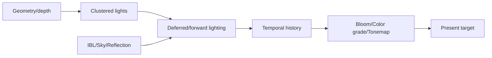

---
related_code:
  - zircon_runtime/src/graphics/feature/builtin_render_feature_descriptor/feature_descriptors
  - zircon_runtime/src/graphics/hybrid_gi_runtime_provider
  - zircon_runtime/src/graphics/runtime/history
implementation_files:
  - zircon_runtime/src/graphics/feature/builtin_render_feature_descriptor/feature_descriptors/clustered_lighting.rs
  - zircon_runtime/src/graphics/feature/builtin_render_feature_descriptor/feature_descriptors/post_process.rs
  - zircon_runtime/src/graphics/feature/builtin_render_feature_descriptor/feature_descriptors/temporal.rs
plan_sources:
  - docs/wiki/graphics/lighting-and-environment.md
  - docs/wiki/graphics/visibility-and-post-processing.md
tests:
  - zircon_runtime/src/graphics/tests/render_product_advanced_lighting
  - zircon_runtime/src/graphics/tests/render_product_post_process
doc_type: api-reference
---

# 光照、环境与后处理 Feature

光照和后处理以 `RenderFeatureDescriptor` 进入 render graph。descriptor 声明输入/输出资源、external binding/schema、attachment、capability 与 queue workload；runtime provider 负责准备数据，graph 负责编排资源状态。当前内置描述符包括 clustered lighting、deferred lighting、shadows、SSAO、bloom、color grading、temporal、post process 与 debug overlay。



## Descriptor 入口

```rust
// 调用上下文片段：descriptor 只展示构造形状；具体资源 schema 由 feature authoring 提供。
use zircon_runtime::graphics::{
    RenderFeatureDescriptor, RenderFeaturePassDescriptor, RenderPassStage,
};
use zircon_runtime::render_graph::QueueLane;

let descriptor = RenderFeatureDescriptor::new(
    "bloom",
    vec!["view".to_string(), "post_process".to_string()],
    Vec::new(),
    vec![
        RenderFeaturePassDescriptor::new(
            RenderPassStage::PostProcess,
            "bloom-extract",
            QueueLane::Graphics,
        )
        .with_executor_id("post.bloom-extract")
        .read_texture("scene_color")
        .write_texture("bloom"),
    ],
);
```

`RenderFeatureDescriptor::new(name, required_extract_sections, history_bindings,
stage_passes)` 是公开的 descriptor 构造器；每个
`RenderFeaturePassDescriptor::new(stage, pass_name, queue)` 再通过
`read_texture`/`write_texture`、`with_executor_id` 和可选的
`with_compute_workload` 声明 graph 资源。内置 descriptor 的具体工厂位于
`builtin_render_feature_descriptor`（多数工厂保持 crate-private），对外选择内置
功能可通过 `BuiltinRenderFeature::descriptor()` 取得对应 descriptor，再交给
pipeline/runtime 路径。插件 feature 必须提供唯一名称、输入资源 schema，并仅在确有
硬件前置条件时添加 capability requirement；默认不应绕过
descriptor 直接修改 compiled graph。

## Clustered lighting

clustered lighting 将视锥划分为 3D tiles，先构建 light index/cluster buffer，再在 shading pass 中读取。输入包含 camera constants、depth 或 froxel bounds、light storage；输出为 lit color。tile 数量和 max lights 应由 `RenderDeviceLimits`/quality profile 约束。

## Shadows 与 AO

shadow feature 生成 directional、spot 或 point atlas，并向 lighting 提供 sampled depth。SSAO 需要 depth/normal，通常输出半分辨率 AO，再由 lighting 合成。无 shadow caster、无 AO capability 或 atlas 分配失败时应回退到无阴影/白色 AO，而不是写未定义纹理。

## IBL 与环境捕获

environment capture scheduler 将 cubemap、BRDF LUT、irradiance/prefilter 任务排队。capture 可异步完成，并在成功时产生带 output generation 的 output identity；lighting 读取尚未完成的环境时使用 fallback sky/ambient。

```rust
// 调用上下文片段：framework 与已完成 extract 的 scene_packet 由 render runtime 提供。
use zircon_runtime::core::framework::render::{
    RenderEnvironmentCapturePhase, RenderEnvironmentCaptureRequest, RenderFramework,
};

// scene_packet 是已经完成 extract 的 SceneViewportRenderPacket。
let request = RenderEnvironmentCaptureRequest::new("atrium", [0.0, 2.0, 0.0], scene_revision)?;
let handle = framework.request_environment_capture(scene_packet, request)?;
let status = framework.poll_environment_capture(handle)?;
match status.phase() {
    RenderEnvironmentCapturePhase::Succeeded => {
        let output = status.output().expect("successful capture has output identity");
        tracing::info!(capture_id = output.capture_id(), generation = output.output_generation());
    }
    RenderEnvironmentCapturePhase::Queued
    | RenderEnvironmentCapturePhase::Capturing
    | RenderEnvironmentCapturePhase::Filtering
    | RenderEnvironmentCapturePhase::Persisting => {}
    RenderEnvironmentCapturePhase::Failed
    | RenderEnvironmentCapturePhase::Cancelled
    | RenderEnvironmentCapturePhase::Superseded => {
        tracing::warn!(diagnostic = ?status.diagnostic(), "environment capture unavailable");
    }
}
```

`RenderEnvironmentCaptureStatus` 是带 `phase()`/`output()`/`diagnostic()` 方法的
状态结构，不是 `Ready/Pending/Failed` 枚举。`request_environment_capture` 只把
任务入队并立即返回 `RenderEnvironmentCaptureHandle`；`poll_environment_capture`
不会等待 GPU。成功输出是 `RenderEnvironmentCaptureOutputIdentity`，实际环境
payload 由后续 runtime hydration/persistence 流程取得；需要搬运已完成的 source
payload 时调用 `framework.take_environment_capture_source_payload(handle)`。取消使用
`framework.cancel_environment_capture(handle)`。

## Temporal 与历史

temporal feature 依赖 previous color、motion vector、depth history。`ViewportFrameHistory` 的 compatibility key 包含 viewport extent、camera projection、pipeline generation 与 device generation。任何 key 不匹配都应清除历史并使用无历史路径，避免 ghosting。

## Bloom、色调映射与后处理

后处理按 graph pass 顺序执行：extract HDR -> downsample chain -> threshold/blur -> composite -> color grading -> tonemap -> present. 每个 pass 明确 load/store；无效的 attachment store 会触发 store lint 或额外带宽。

```rust
use zircon_runtime::graphics::{
    RenderFeatureCapabilityRequirement, RenderFeatureDescriptor,
};

let gpu_histogram = RenderFeatureDescriptor::new(
    "gpu-histogram",
    vec!["view".to_string(), "post_process".to_string()],
    Vec::new(),
    vec![],
)
.with_capability_requirement(RenderFeatureCapabilityRequirement::StorageBuffers);
```

`with_capability_requirement` 接受固定的
`RenderFeatureCapabilityRequirement` 枚举（例如 `StorageBuffers`、`AsyncCompute`、
`PipelineStatisticsQuery`），不存在 `optional("...")` 字符串构造器；不需要额外
capability 时直接保留空的 `capability_requirements`。

## Capability 与 fallback

| Feature | 可能限制 | fallback |
| --- | --- | --- |
| Clustered lighting | storage/indirect 不支持 | forward 小灯光列表 |
| HDR/bloom | float render target 不支持 | LDR tonemap/关闭 bloom |
| Temporal | 无 motion vector/history | spatial AA |
| Ray tracing | acceleration structure 不支持 | raster shadow |
| Neural compute | shader/queue 不支持 | compute/raster path |

## 错误与可观测性

feature registration、graph compile、pipeline compile、runtime provider update 均可能失败。记录 feature name、frame id、resource generation、capability receipt 和 fallback reason。将 `RenderGraphError` 与 backend/pipeline 的结构化错误摘要展示在 editor 面板；生产日志应采样，避免每像素错误刷屏。

## 线程与生命周期

feature descriptor 通常 immutable，可在启动时注册；provider state 在 render runtime 所有。环境 capture 通过 `RenderEnvironmentCaptureHandle` 与 `poll_environment_capture` 轮询，readback 则由 `SubmissionTicket` 驱动；两者都不能在 UI 线程同步等待 GPU。history 与 transient 资源分别按 viewport 和 frame 生命周期管理。

## 最佳实践

- 每个 feature 都有显式 opt-in/quality gate。
- 先验证输入 format、extent、mip，再创建 graph pass。
- 对历史资源定义 clear/invalidate 条件。
- 后处理链保持可插拔，插件只声明 contract，不硬编码 pass index。
- 用 lighting、post_process、shadow capture 测试覆盖视觉回归。

## 验收清单

- [ ] capability 不满足时输出确定性 fallback。
- [ ] history key 变化会清理 temporal 输入。
- [ ] HDR/深度/阴影资源的 usage 与 format 经过验证。
- [ ] 每个 feature 有 graph dump 节点和 compile diagnostic。
- [ ] post-process attachment store 通过 bandwidth lint。

## Feature descriptor 公开成员

`RenderFeatureDescriptor` 的 name 是诊断和 cache key 的一部分；`RenderFeatureCapabilityRequirement` 只描述必须满足的 capability；pass descriptor 描述资源读写、queue、attachment ops 和 executor id。descriptor 应在启动时完成静态验证。

`BuiltinRenderFeature` 表示内置 feature 的启用状态与依赖。`requires_explicit_opt_in` 为 true 的高成本 feature（例如 ray tracing、neural compute）必须由 profile 或插件显式开启。

## 光照输入输出契约

| Feature | 输入 | 输出 |
| --- | --- | --- |
| deferred geometry | mesh/material/camera | GBuffer/depth |
| clustered lighting | depth/light buffer/GBuffer | HDR color |
| shadows | caster transforms | shadow atlas |
| SSAO | depth/normal | AO factor |
| bloom | HDR color | bloom chain |
| color grading | HDR/LDR color | graded color |

输入缺失时 descriptor validation 应提供资源名和 pass 名。不可将缺失资源默认为任意格式的黑纹理。

## 多分辨率策略

post-process pass 可使用 half/quarter resolution schema，但 extent rounding 必须明确（floor/ceil/align）。上采样阶段需声明滤波器与 history compatibility；动态 render scale 改变时清除 temporal history。

## 性能与诊断

为每个 feature 记录 pass GPU time、dispatch count、transient bytes、attachment bandwidth、fallback count。将 feature stats 与 `CompiledRenderGraphDump` 对照，区分 shader 慢与资源 barrier 慢。

## 负面测试

```rust
// 伪代码：compile_feature_without 是测试 harness，用于表达预期的 typed error。
#[test]
fn post_process_rejects_missing_hdr_input() {
    let result = compile_feature_without("hdr_color");
    assert!(result.unwrap_err().is_missing_external_resource());
}
```

## 当前与规划边界

当前 descriptor/graph contract、内置延迟/后处理和多种 provider 已落地；自动 exposure、完整 ray tracing、neural path 和跨帧 probe streaming 可能仍为骨架。页面中的 planned 标记不得被解释为可立即调用的 Rust API。
