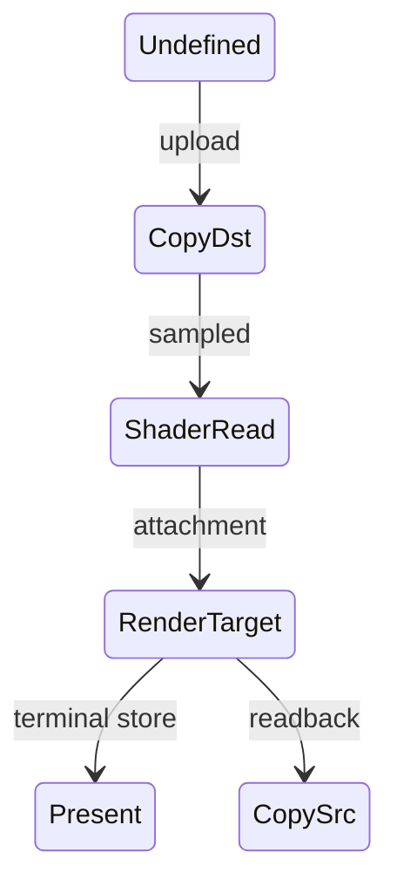

---
related_code:
  - zircon_runtime/crates/zr_rhi/src/lib.rs
  - zircon_runtime/crates/zr_rhi/src/descriptors.rs
  - zircon_runtime/src/render_graph/types.rs
  - zircon_runtime/src/graphics/types
implementation_files:
  - zircon_runtime/crates/zr_rhi/src/capabilities.rs
  - zircon_runtime/crates/zr_rhi/src/descriptors.rs
  - zircon_runtime/src/render_graph/types.rs
plan_sources:
  - docs/wiki/graphics/rust-api-reference.md
tests:
  - zircon_runtime/crates/zr_rhi/src/tests/capabilities.rs
  - zircon_runtime/crates/zr_rhi/src/tests/descriptors.rs
doc_type: api-reference
---

# 公开枚举、位标志与限制速查

本页把高频 public enum、bit flag、限制查询和错误边界集中列出，便于写 Rust 代码时快速核对。它不是 backend capability 的替代品；任何具体设备都必须以 `RenderBackendCaps` 和 `RenderDeviceLimits` 为准。

## 队列与操作

| 类型 | 变体/字段 | 语义 |
| --- | --- | --- |
| `RenderQueueClass` | Graphics/Compute/Copy | RHI 逻辑队列类别 |
| `QueueLane` | Graphics/Compute/Copy | RenderGraph pass lane |
| `RenderOperation` | resource、draw、dispatch、timestamp 等 | capability matrix 的原子操作 |
| `RenderOperationSupport` | Supported/Unsupported + reason | `require_operation` 结果 |

逻辑 queue 可以映射到同一 native queue；依赖仍必须保留。Copy queue 不应执行 render pass，Compute queue 不保证能写所有 attachment。

## BufferUsage 位标志

`BufferUsage::{VERTEX, INDEX, UNIFORM, STORAGE, STAGING_READ, STAGING_WRITE, INDIRECT, COPY_SRC, COPY_DST}` 可以通过 `|` 组合。`contains` 判断完整子集，`bits` 返回原始值，`has_unknown_bits` 用于拒绝未来/后端私有位。

```rust
let usage = BufferUsage::VERTEX | BufferUsage::COPY_DST;
assert!(usage.contains(BufferUsage::VERTEX));
assert!(!usage.has_unknown_bits());
```

## TextureUsage 与 format

`TextureUsage::{RENDER_ATTACHMENT, SAMPLED, STORAGE, COPY_SRC, COPY_DST, PRESENT}` 同样支持位运算。常用格式：

| 格式 | bpp | depth | HDR |
| --- | ---: | --- | --- |
| `R8Unorm` | 1 | 否 | 否 |
| `Rg16Float` | 4 | 否 | 是 |
| `Rgba8UnormSrgb` | 4 | 否 | 否 |
| `Rgba16Float` | 8 | 否 | 是 |
| `Depth24PlusStencil8` | 4 | 是 | 否 |

`TextureFormat::bytes_per_pixel` 是估算值，压缩/对齐由 backend 另行处理。storage、alternate view 和 depth/stencil 能力必须通过 format 方法与 caps 双重检查。

## Sampler 枚举

`AddressMode` 决定越界采样（Clamp/Repeat/Mirror），`FilterMode` 决定 mag/min，`MipmapFilterMode` 决定 mip 选择，`CompareFunction` 用于 shadow sampler。anisotropy 是上限，不保证设备实际接受该值。

## RenderGraph 资源状态

`RenderGraphResourceAccessKind` 描述 read/write/access；`RenderGraphAttachmentLoadOp::{Load,Clear,DontCare}` 和 store op 描述 attachment 生命周期。`RenderGraphResourceLifetime` 记录 first/last pass 与 persistent/readback 标记。



## 计算 workload

`RenderGraphComputeDispatchExtent` 支持 fixed、per-pixel、from-buffer、cluster/froxel/HZB/indirect 等模式。workgroup size 必须为正，dispatch 维度溢出或 buffer range 越界会在 compile 阶段失败。

## Device limits

`RenderDeviceLimits` 常见字段包括 max texture dimension、array layers、bind groups、uniform/storage bytes、workgroup size、color attachments、sample count 与 timestamp queries。不要在业务代码中硬编码 WebGPU 默认值；通过 profile 注入质量配置。

## Surface 终态

`SurfaceFrameTerminal::{Presented,Discarded,DeviceLost,Invalidated}` 记录 lease 最终原因；`SurfaceRetryReason` 区分 timeout、outdated、zero extent、throttled。retry 不等于错误，应用应按 reason 退避。

## Submission 状态

`SubmissionStatus::{Accepted,Submitted,Completed,Failed,Cancelled}` 是服务观察到的单调状态。调用方只能等待或记录，不能手动推进状态。`SubmissionTicket` 与 device/generation 绑定。

## 错误匹配模板

```rust
match device.create_texture(&desc) {
    Ok(handle) => cache.insert(handle),
    Err(RhiError::UnsupportedOperation(op)) => downgrade(op),
    Err(RhiError::WrongGeneration { .. }) => rebuild_generation(),
    Err(error) => return Err(error.into()),
}
```

不要用字符串匹配错误；typed enum 可能在未来增加变体，使用 `_` 分支记录未知错误。

## 限制驱动的质量策略

1. 读取 `RenderDeviceLimits` 与 `RenderBackendCaps`。
2. 计算目标分辨率、mip、cluster count、shadow atlas 和 query budget。
3. 生成 `QualityProfile`，把结果写入 viewport/frame。
4. 若 runtime report 发现 admission failure，选择 next-lower profile。

## 负面测试矩阵

| 测试 | 期望 |
| --- | --- |
| unknown usage bits | descriptor error |
| zero texture extent | invalid/non-renderable |
| unsupported storage format | capability error |
| stale handle | lifecycle error |
| invalid queue lane | compile error |
| query budget overflow | diagnostic admission error |

## 线程与 ABI

enum/descriptor 值对象可跨线程发送；handle 只可在同一 device generation 解析。Rust ABI 不承诺 C layout，插件边界使用明确的 `NativePluginHostFunctionTable` 或序列化 DTO。

## 验收清单

- [ ] 所有位标志都测试 unknown bits。
- [ ] 质量策略只依赖 caps/limits，不写死平台名称。
- [ ] 终态、重试态、错误态在 telemetry 中可区分。
- [ ] queue、format、usage 组合在 backend contract tests 覆盖。
