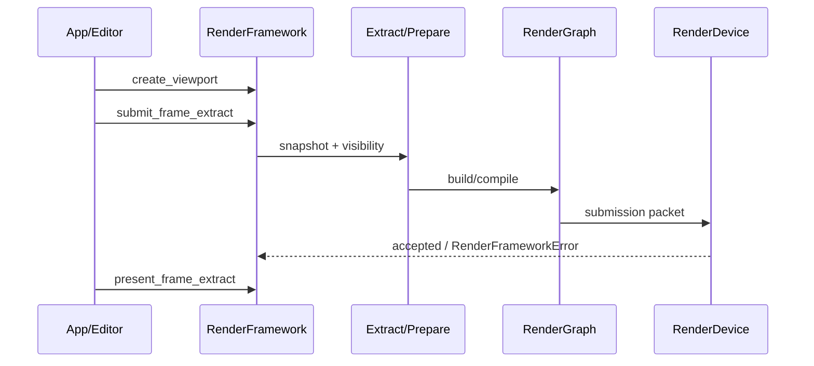
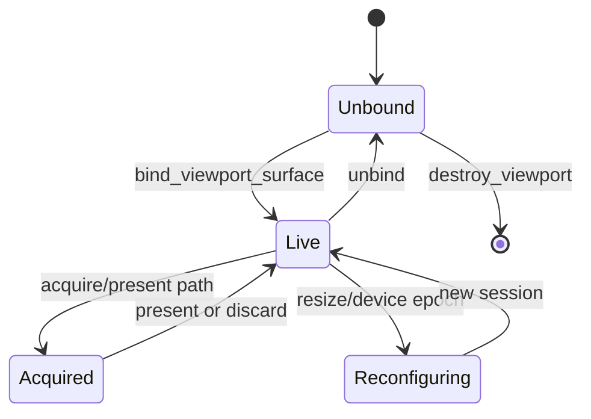
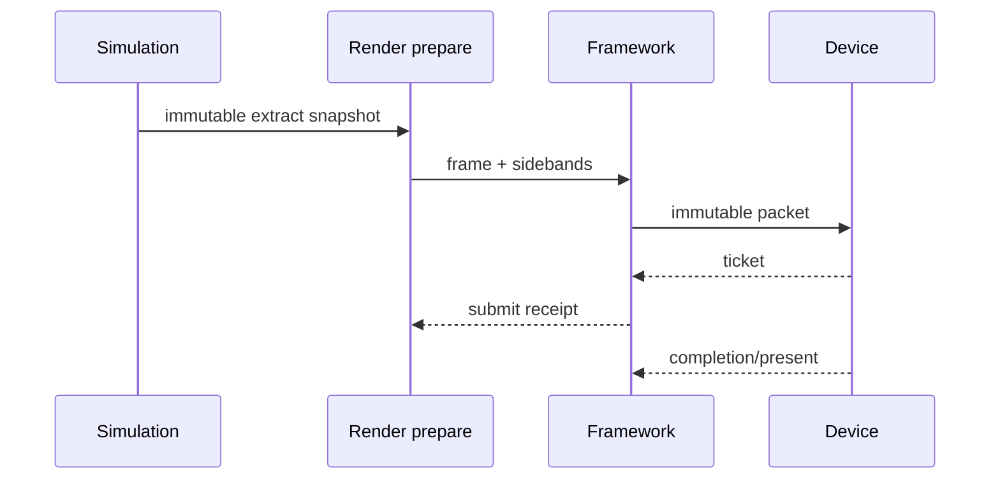

---
related_code:
  - zircon_runtime/src/graphics/runtime/render_framework
  - zircon_runtime/src/core/framework/render
implementation_files:
  - zircon_runtime/src/graphics/runtime/render_framework/wgpu_render_framework/wgpu_render_framework.rs
  - zircon_runtime/src/graphics/runtime/render_framework/create_viewport/create.rs
  - zircon_runtime/src/graphics/runtime/render_framework/submit_frame_extract/mod.rs
plan_sources:
  - docs/wiki/graphics/render-framework.md
tests:
  - zircon_runtime/src/graphics/tests/render_product_submit
  - zircon_editor/src/tests/host/render_framework_boundary
doc_type: api-reference
---

# RenderFramework 公开接口

`RenderFramework` 是应用层看到的图形门面。它把视口、抽取帧、Surface、管线资产、质量配置和统计查询收敛到同一设备世代。页面中的签名以 `core::framework::render` 的 trait 为准；`WgpuRenderFramework` 是当前实现，其他后端只能承诺 trait 中的行为。

## 调用边界



宿主线程负责调用门面；抽取数据必须在提交前完成。提交返回 `Result<(), RenderFrameworkError>`，只表示调用被接受，不表示 GPU 完成。`query_stats` 是观测快照，不能替代完成信号。

## 依赖与 feature

```toml
[dependencies]
zircon_runtime = { path = "../zircon_runtime", features = ["graphics"] }
```

高层集成通常还需要 `ui` feature 才能使用 `submit_frame_extract_with_ui`。`WgpuRenderFramework` 依赖 `zr_rhi_wgpu`，应用不应直接保存其 `wgpu::Device`。

## 视口接口

| 方法 | 形状 | 语义 |
| --- | --- | --- |
| `create_viewport` | `(RenderViewportDescriptor) -> Result<RenderViewportHandle, RenderFrameworkError>` | 分配逻辑视口身份；不自动创建原生窗口 |
| `destroy_viewport` | `(RenderViewportHandle) -> Result<(), RenderFrameworkError>` | 使后续提交和查询失败；旧 handle 不可复用 |
| `bind_viewport_surface` | `(RenderViewportHandle, RenderViewportSurfaceDescriptor) -> Result<(), RenderFrameworkError>` | 将窗口 Surface 绑定到视口 |
| `unbind_viewport_surface` | `(RenderViewportHandle) -> Result<(), RenderFrameworkError>` | 解除绑定并终止未消费 lease |
| `viewport_record` | 实现层诊断快照（trait 未公开） | 不要把后端记录当作稳定 API |

视口 handle 由框架生成，调用方只可复制和传递，不能从整数伪造。跨设备、跨 generation 或已销毁 handle 会得到 typed error。

## 抽取与呈现

```rust
let viewport = framework.create_viewport(descriptor)?;
framework.submit_frame_extract(viewport, frame_extract)?;
// 直接呈现路径消费另一个 owned extract；submit 的返回值不是 ticket。
framework.present_frame_extract(viewport, present_extract)?;
```

上面的代码是调用形状；`RenderFrameExtract` 是按值消费的帧输入。带 UI 的入口把 `Option<Arc<UiRenderSubmission>>` 作为同一帧的 sideband：

```rust
framework.submit_frame_extract_with_ui(viewport, extract, Some(ui_draw_list))?;
framework.present_frame_extract_with_ui(viewport, present_extract, Some(ui_draw_list))?;
```

提交规则：

1. 每个 viewport 每个 frame id 只能提交一次。
2. `present_*` 只能消费已经绑定 Surface 且成功 acquire 的帧。
3. 抽取被 graph cull、设备丢失或 pre-submit 错误取消时，框架必须走 discard 路径。
4. `present_*` 必须在实现支持 viewport surface present 时使用；不支持时会返回 `UnsupportedCapability`。具体的 swapchain lease 和 GPU 同步对象属于后端实现，不是该 trait 的公开数据类型。

## 管线与质量

`set_pipeline_asset` 把已取得的 `RenderPipelineHandle` 绑定到视口，`reload_pipeline` 触发重新编译，`set_quality_profile` 应用能力感知配置。`RenderFramework` trait 没有 `register_pipeline_asset`；资产注册属于上层资源/管线服务。切换失败时保留 last-good pipeline，避免在运行中把 viewport 置为空。

```rust
let pipeline: RenderPipelineHandle = pipeline_handle; // 由资产/管线服务提供
framework.set_pipeline_asset(viewport, pipeline)?;
framework.set_quality_profile(viewport, RenderQualityProfile::default())?;
framework.reload_pipeline(pipeline)?;
```

管线 reload 是异步或分阶段操作时，必须读取 compile report；`UnsupportedCapability`、shader validation、generation mismatch 都是可恢复错误。

## 统计与诊断

常用方法包括 `query_stats`、`query_environment_runtime_snapshot`、`query_visible_spatial_snapshot`、`query_virtual_geometry_debug_snapshot` 与 `capture_frame`。这些 API 返回某一观察点的值，调用方不能假设它们与下一帧一致。

```rust
let stats = framework.query_stats()?;
tracing::info!(submitted = stats.submitted_frames, captured = stats.captured_frames, "render stats");
```

统计应在 UI 或 telemetry 线程复制后读取；不要持有内部锁跨越下一次 submit。GPU timing 可能延迟若干帧，字段为空表示 backend 未启用 instrumentation，而不是零耗时。

## Surface 生命周期



窗口尺寸为零时，创建结果是 typed non-renderable session，不应偷偷夹紧为 1x1。resize 必须使旧 session 与 lease 失效，再安装新 swapchain receipt。

## 错误处理

| 错误类别 | 触发 | 建议 |
| --- | --- | --- |
| `InvalidViewport` | handle 不存在 | 丢弃请求并重新解析当前 viewport |
| `WrongDevice/WrongGeneration` | 设备重建后复用旧对象 | 清空缓存，等待新 generation |
| `SurfaceUnavailable` | 窗口最小化或 acquire 暂停 | 走 discard，不提交空帧 |
| `UnsupportedCapability` | 后端不支持可选 feature | 降级到基础管线 |
| `PipelineCompile` | shader/布局不匹配 | 保留 last-good，记录 report |

## 线程与所有权

trait 要求框架实现 `Send + Sync`，但并不意味着所有调用都无锁。Surface acquire/present 必须在宿主规定的窗口线程执行；抽取对象可在 worker 线程构建，提交顺序由框架串行化。不要把 `&mut` graph builder 或 native surface 指针跨线程发送。

## 最佳实践

- 用 viewport handle 作为业务键，使用 `viewport_record` 做诊断，不复制内部 backend 对象。
- 在 resize、device fault、插件 reload 时统一清理 generation-local 缓存。
- 将 submit、poll、present 分成可观测阶段，并记录 frame id 与 submission ticket。
- 对所有可选 trait 方法处理 `UnsupportedCapability`，不要使用 `unwrap`。
- 用固定的 last-good pipeline 做热重载回退。

## 负面案例

```rust
// 错误：present 另一个 viewport 的 frame，身份检查会失败。
framework.present_frame_extract(viewport_a, frame_from_b)?;

// 错误：把 stats 当 fence。
while framework.query_stats()?.submitted_frames < expected_frames { /* 错误：stats 不是 GPU fence */ }
```

正确做法是使用后端或宿主自己的完成同步协议；公开 `RenderFramework` trait 不暴露 `SubmissionTicket` 或 `submission_status`。同一 viewport/frame pair 的 surface lease 仍必须由呈现路径完整消费或丢弃。

## 验收清单

- [ ] 创建、绑定、提交、呈现、销毁路径都有日志字段。
- [ ] zero extent、设备重建、Surface acquire 失败都有测试。
- [ ] pipeline reload 失败时 last-good 仍可呈现。
- [ ] UI 入口与无 UI 入口使用相同 frame id。
- [ ] 统计页面标注数据延迟与 instrumentation 可用性。

## 当前状态与参考

当前 `WgpuRenderFramework` 已实现 MVP 的 viewport、Surface、graph submission、UI sideband 与统计；部分高级 capture/provider 接口依赖 feature 或 backend capability。不要把 `graphics/backend` 下的具体结构当作公共 ABI。架构比较可参阅 Unreal Render Dependency Graph、Bevy RenderApp extraction 和 Fyrox renderer，但这些是设计参考，不是 ZirconEngine 的 API 承诺。

## Public 方法逐项说明

### `create_viewport`

校验 extent、render scale、camera/output policy 与默认 pipeline，然后生成 generation-qualified handle。创建成功不意味着 Surface 已绑定，也不代表第一帧资源已预热。

### `destroy_viewport`

终止 viewport 所有 pending pick、environment capture、history、Surface lease 与 pipeline binding。调用完成后旧 handle 的所有查询和提交必须失败。

### `submit_frame_extract`

面向离屏或不立即呈现的帧。它接受 immutable extract，建立 visibility/prepare/graph，并返回提交结果或 typed error。调用方不得在提交后修改 extract 引用的数据。

### `present_frame_extract`

面向已绑定 Surface 的完整 acquire-submit-present 路径。实现必须保证失败时 discard lease；不能因为 graph cull 留下 outstanding lease。

### `*_with_ui`

把 UI draw list 作为同一 frame identity 的 sideband。UI command 不能引用下一帧才会创建的 texture；scene 与 UI 对 target color space 的理解必须一致。

### `set_pipeline_asset`

切换 viewport 的目标 pipeline。新 pipeline 未 ready 时保留 last-good；成功切换应使不兼容 history 失效，并更新 compile/runtime metadata generation。

### `reload_pipeline`

重新读取资产版本并启动 compile。reload 不允许原地修改 in-flight compiled graph；结果在安全帧边界原子安装。

### `set_quality_profile`

根据 adapter caps、memory budget 和 viewport 目标设置 shader quality、shadow/cluster/texture 等参数。profile 变化可能触发资源重分配和 history clear。

### `query_stats`

返回最近完成或最近观察帧的聚合统计。字段缺失表示未采样/不支持，不能解释为零。统计读取必须有上限，不能复制整个场景。

### `capture_frame`

请求有界 frame capture/readback。实现可返回 Pending/Unsupported/Ready；调用者需保存 request identity 并轮询，而不是阻塞渲染线程。

### viewport pick

`request_viewport_pick` 生成 ticket，`poll_*` 查询结果，`cancel_*` 终止请求。结果绑定 viewport、frame 与 generation；相机移动后返回旧帧 hit 时 UI 应标注延迟或丢弃。

### environment capture

请求通常包含场景/探针 identity、cubemap resolution 与质量预算。poll 结果可能跨多帧完成；取消后旧 handle 不得重新变为 Ready。

## 一帧的所有权时间线



Simulation 保留世界 authority，prepare 只消费 snapshot；framework 拥有 viewport/history；device 拥有 native resource 与 submission service。职责不能反向穿透。

## 设备重建恢复方案

1. fault gate 阻断新的 frame submission。
2. discard 当前 Surface lease，取消 pending capture/pick。
3. 销毁或失效旧 viewport generation-local backing。
4. 创建新 device/profile 并重新读取 caps。
5. 重新注册或重建 pipeline、mesh、texture、font backing。
6. 重建 Surface session，清理 frame history。
7. 用 fallback frame 验证 present，再恢复常规渲染。

## 参考引擎映射

Unreal 的 Game/Render/RHI thread 分离启发了 snapshot 与 command ownership；Bevy 的 Extract/Prepare/Queue 阶段启发了数据流分层；Fyrox 的 renderer/resource cache 适合对照轻量宿主。ZirconEngine 当前的契约以 `RenderFramework` + RenderGraph + neutral RHI 为准，不复制任一参考引擎的 public type 或线程保证。
